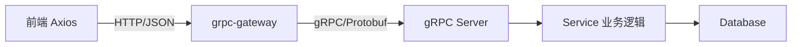

## 一、架构概述


### 1.1 请求链路



### 1.2 技术栈分工

| 层级 | 技术 | 职责 |
|------|------|------|
| 接口定义 | Protobuf 3 | 单一事实源，定义所有 API |
| 后端服务 | Go + go-micro + gRPC | 实现业务逻辑 |
| HTTP 转换 | grpc-gateway v2 | Proto → RESTful HTTP API |
| 前端请求 | Axios + TypeScript | 类型安全的 HTTP 调用 |

### 1.3 前端三层代码架构

```
（前端目录示例已移除：接口规范不规定前端树；见前端规范。）
```

---
