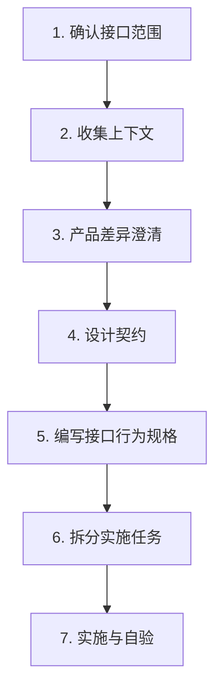

## 七、联调标准流程

### 7.1 流程概览

### 7.2 各步骤说明

| 步骤 | 目标 | 产出 |
|------|------|------|
| 1. 确认范围 | 明确涉及哪些 RPC、哪些页面 | 范围清单 |
| 2. 收集上下文 | 并行查看 Proto、SDK、旧代码、页面 | 上下文文档 |
| 3. 产品差异澄清 | 产品需求 vs 后端能力的差距 | 差异清单 |
| 4. 设计契约 | 状态映射、扩展字段、跳转参数等 | 设计文档 |
| 5. 行为规格 | 每个 RPC/流程的 Given/When/Then | Spec 文档 |
| 6. 任务拆分 | 按 types → services → pages 顺序 | 任务清单 |
| 7. 实施自验 | 编码 + 三件套验证 | 可运行代码 |

### 7.3 前置约束

| 约束 | 说明 |
|------|------|
| 零后端改动 | 前端联调不修改 Proto 和后端代码，能力缺口列入 Follow-up |
| 不改 Generated | 自动生成代码禁止手改，有问题重新生成 |
| 旧实现标 deprecated | 旧函数加 `@deprecated` 标记，不直接删除 |
| 联调验证 | 按前后端各自仓库脚本验证（本文件不规定 vitest/vue-tsc） |

### 7.4 完工标准

- [ ] 若前端有类型检查脚本则按其执行；无则跳过
- [ ] 若前端有测试脚本则按其执行；无则跳过
- [ ] 构建通过（`npm run build`）
- [ ] 所有行为规格场景手工验证通过
- [ ] 全局搜索旧符号仅剩 `@deprecated` 引用
- [ ] 差异清单和 Follow-up 事项已记录

---
