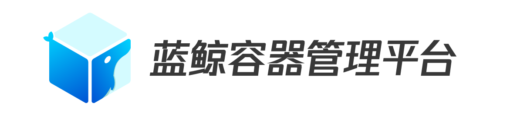

---
                

[EnglishDocs](./README_en.md)

> **重要提示**: `master` 分支在开发过程中可能处于 *不稳定或者不可用状态* 。
> 请通过[releases](https://github.com/Tencent/bk-bcs/releases) 而非 `master` 去获取稳定的二进制文件。

蓝鲸容器管理平台（Blueking Container Service，简称BCS，下同）是蓝鲸体系下，以容器技术为基础，为微服务业务提供编排管理和治理服务的基础服务平台。

BCS在腾讯内部已经稳定运行三年以上，经过几十款不同架构、不同规模的业务验证，其中规模最大的业务包含四个独立的集群，共500多物理机资源，近6000 POD，使用30多个命名空间进行隔离。

BCS作为蓝鲸体系的一部分，其整体结构按照蓝鲸PaaS体系组织，本次开源的部分为BCS后台部分，为蓝鲸PaaS体系下的原子平台，主要输出服务编排和服务治理的能力。BCS的操作页面部分通过蓝鲸SaaS轻应用的方式呈现，可以通过最新的蓝鲸社区版或者企业版获取该SaaS的版本；也可以通过[蓝鲸官方网站](https://bk.tencent.com/)获取该SaaS的后续开源信息。

## Overview

* [架构设计](./docs/overview/architecture.md)
* [代码结构](./docs/overview/code_directory.md)
* [功能说明](./docs/overview/function.md)

如果想了解BCS更详细信息，请参考蓝鲸容器管理平台[白皮书](https://docs.bk.tencent.com/bcs/)

## Features

* 支持基于k8s和Mesos双引擎编排
    * [了解k8s方案相关信息](./docs/features/k8s/info.md)
    * [了解mesos方案相关信息](./docs/features/mesos/info.md)
* 支持异构业务接入
    * [了解有状态业务解决方案](./docs/features/stateful.md)
    * [了解其他非容器友好特性的解决方案](./docs/features/nodocker.md)
* 跨云跨OS管理容器
    * [跨云容器管理方案](./docs/features/crosscloud.md)
    * [支持windows容器](./docs/features/windows.md)
* 插件化的二次开发能力
    * [了解社区CNI、CSI标准](./docs/features/cxi.md)
    * [自定义编排调度策略](./docs/features/sced.md)

## Experience

* [通过BCS解决研发环境的资源复用](./docs/experience/dev.md)
* [通过BCS完成业务的滚动升级](./docs/experience/rolling.md)
* [通过BCS完成业务的蓝绿发布](./docs/experience/bluegreen.md)

## Getting Started

> 容器管理平台是蓝鲸智云社区版V5.1以上推出的产品，后台服务可以独立部署与使用。如果需要SaaS的支持，则需要与蓝鲸社区版软件配合使用。

> 目前社区版5.1在灰度内测中，若想体验，请填写问卷留下邮箱等信息，蓝鲸将在1-2个工作日通过邮箱方式，交付软件。感谢对蓝鲸的支持与理解。
> 问卷链接：[https://wj.qq.com/s2/3830461/a8bc/](https://wj.qq.com/s2/3830461/a8bc/)

> 蓝鲸社区版5.1完全开放下载时间为2019-07-05

* [下载与编译](docs/install/source_compile.md)
* [安装部署](docs/install/deploy-guide.md)
* [API使用说明](./docs/apidoc/api.md)

## Version Plan

* [版本详情](./docs/version/README.md)

## Contributing

对于项目感兴趣，想一起贡献并完善项目请参阅[contributing](./CONTRIBUTING.md)。

[腾讯开源激励计划](https://opensource.tencent.com/contribution) 鼓励开发者的参与和贡献，期待你的加入。

## Support

* 参考bk-bcs[安装文档](docs/install/deploy-guide.md)
* 阅读 [源码](https://github.com/Tencent/bk-bcs)
* 阅读 [wiki](https://github.com/Tencent/bk-bcs/wiki) 或者寻求帮助
* 了解蓝鲸社区相关信息：蓝鲸社区版交流QQ群 495299374
* 直接反馈[issue](https://github.com/Tencent/bk-bcs/issues)，我们会定期查看与答复

## FAQ

[https://github.com/Tencent/bk-bcs/wiki/FAQ](https://github.com/Tencent/bk-bcs/wiki/FAQ)

## Blueking Community
- [BK-CI](https://github.com/Tencent/bk-ci)：蓝鲸蓝盾是一个开源的持续集成和持续交付系统，可以轻松将你的研发流程呈现到你面前。
- [CMDB](https://github.com/Tencent/bk-cmdb)：蓝鲸配置平台（蓝鲸CMDB）是一个面向资产及应用的企业级配置管理平台。
- [PaaS](https://github.com/Tencent/bk-PaaS)：蓝鲸PaaS平台是一个开放式的开发平台，让开发者可以方便快捷地创建、开发、部署和管理SaaS应用。
- [SOPS](https://github.com/Tencent/bk-sops)：标准运维（SOPS）是通过可视化的图形界面进行任务流程编排和执行的系统，是蓝鲸体系中一款轻量级的调度编排类SaaS产品。

## License

bk-bcs是基于MIT协议， 详细请参考[LICENSE](./LICENSE.TXT)。
