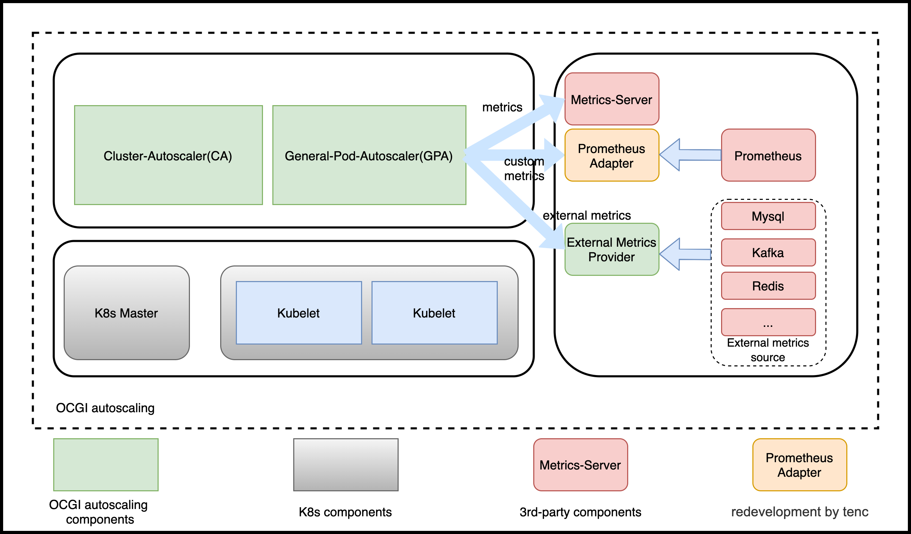

## Introduction

General Pod Autoscaler(GPA) is a extension for [K8s HPA](https://kubernetes.io/docs/tasks/run-application/horizontal-pod-autoscale/), which can be used not only for serving, also for game.

## Features

1. Compatible with all features of [K8s HPA v2beta2](https://github.com/kubernetes/api/blob/master/autoscaling/v2beta2);
2. Not dependent on a specified `kubernetes version`, 1.8, 1.9, 1.19 all work;
3. Providing more metric sources including `kafka`, `redis` and so on by GPA provider;
4. More scalable and flexible, supporting more scaling mode, such as `webhook`, `crontab`, etc.;
5. Flex upgrading GPA version with restarting kubernetes core components.

## How to use

```shell
cd manifeasts
bash deploy-all.sh #will call kubectl apply -f xxx.yaml(First crd.yaml, then gpa.yaml, and finally validatorconfig.yaml) 
```

## Designation

### Architecture




- GPA

We developed base on HPA

- External Metrics Provider

A provider for providing external metrics.


### Difference between HPA and GPA

GPA is designed based on HPA v2beta2. So, it overrides all functions of HPA.

example:

- HPA
```yaml
apiVersion: autoscaling/v2beta2
kind: HorizontalPodAutoscaler
metadata:
  name: test
spec:
  maxReplicas: 10
  minReplicas: 2
  metrics:
  - resource:
      name: cpu
      target:
        averageValue: 20
        type: AverageValue
    type: Resource
  scaleTargetRef:
    apiVersion: carrier.bkbcs.tencent.com/v1alpha1
    kind: Squad
    name: squad-example1
```

- GPA
```yaml
apiVersion: autoscaling.bkbcs.tencent.com/v1alpha1
kind: GeneralPodAutoscaler
metadata:
  name: test
spec:
  maxReplicas: 10
  minReplicas: 2
  metric:   ##difference
    metrics:
    - resource:
        name: cpu
        target:
          averageValue: 20
          type: AverageValue
      type: Resource
  scaleTargetRef:
    apiVersion: carrier.bkbcs.tencent.com/v1alpha1
    kind: Squad
    name: squad-example1
```

Difference is GPA has an additional filed name `metric`, which include the filed `metrics`.

GPA supports more scaling modes, e.g. `event`、`crontab` and `webhook`, which can support more scene
e.g. GameSevrer, Serverless and son.

#### Spec difference

- HPA
```go
// HorizontalPodAutoscalerSpec describes the desired functionality of the HorizontalPodAutoscaler.
type HorizontalPodAutoscalerSpec struct {
	// scaleTargetRef points to the target resource to scale, and is used to the pods for which metrics
	// should be collected, as well as to actually change the replica count.
	ScaleTargetRef CrossVersionObjectReference `json:"scaleTargetRef" protobuf:"bytes,1,opt,name=scaleTargetRef"`
	// minReplicas is the lower limit for the number of replicas to which the autoscaler
	// can scale down.  It defaults to 1 pod.  minReplicas is allowed to be 0 if the
	// alpha feature gate HPAScaleToZero is enabled and at least one Object or External
	// metric is configured.  Scaling is active as long as at least one metric value is
	// available.
	// +optional
	MinReplicas *int32 `json:"minReplicas,omitempty" protobuf:"varint,2,opt,name=minReplicas"`
	// maxReplicas is the upper limit for the number of replicas to which the autoscaler can scale up.
	// It cannot be less that minReplicas.
	MaxReplicas int32 `json:"maxReplicas" protobuf:"varint,3,opt,name=maxReplicas"`
	// metrics contains the specifications for which to use to calculate the
	// desired replica count (the maximum replica count across all metrics will
	// be used).  The desired replica count is calculated multiplying the
	// ratio between the target value and the current value by the current
	// number of pods.  Ergo, metrics used must decrease as the pod count is
	// increased, and vice-versa.  See the individual metric source types for
	// more information about how each type of metric must respond.
	// If not set, the default metric will be set to 80% average CPU utilization.
	// +optional
	Metrics []MetricSpec `json:"metrics,omitempty" protobuf:"bytes,4,rep,name=metrics"`

	// behavior configures the scaling behavior of the target
	// in both Up and Down directions (scaleUp and scaleDown fields respectively).
	// If not set, the default HPAScalingRules for scale up and scale down are used.
	// +optional
	Behavior *HorizontalPodAutoscalerBehavior `json:"behavior,omitempty" protobuf:"bytes,5,opt,name=behavior"`
}
```

- GPA

```go
// GeneralPodAutoscalerSpec describes the desired functionality of the GeneralPodAutoscaler.
type GeneralPodAutoscalerSpec struct {
	// DrivenMode is the mode the open autoscaling mode if we do not need scaling according to metrics.
	// including MetricMode, TimeMode, EventMode, WebhookMode
	// +optional
	AutoScalingDrivenMode `json:",inline"`

	// scaleTargetRef points to the target resource to scale, and is used to the pods for which metrics
	// should be collected, as well as to actually change the replica count.
	ScaleTargetRef CrossVersionObjectReference `json:"scaleTargetRef" protobuf:"bytes,1,opt,name=scaleTargetRef"`

	// minReplicas is the lower limit for the number of replicas to which the autoscaler
	// can scale down.  It defaults to 1 pod.  minReplicas is allowed to be 0 if the
	// alpha feature gate GPAScaleToZero is enabled and at least one Object or External
	// metric is configured.  Scaling is active as long as at least one metric value is
	// available.
	// +optional
	MinReplicas *int32 `json:"minReplicas,omitempty" protobuf:"varint,2,opt,name=minReplicas"`

	// maxReplicas is the upper limit for the number of replicas to which the autoscaler can scale up.
	// It cannot be less that minReplicas.
	MaxReplicas int32 `json:"maxReplicas" protobuf:"varint,3,opt,name=maxReplicas"`

	// behavior configures the scaling behavior of the target
	// in both Up and Down directions (scaleUp and scaleDown fields respectively).
	// If not set, the default GPAScalingRules for scale up and scale down are used.
	// +optional
	Behavior *GeneralPodAutoscalerBehavior `json:"behavior,omitempty" protobuf:"bytes,4,opt,name=behavior"`
}

// ExternalAutoScalingDrivenMode defines the mode to trigger auto scaling
type AutoScalingDrivenMode struct {
	// MetricMode is the metric driven mode.
	// +optional 
	MetricMode *MetricMode `json:"metric,omitempty" protobuf:"bytes,1,opt,name=metric"`

	// Webhook defines webhook mode the allow us to revive requests to scale.
	// +optional
	WebhookMode *WebhookMode `json:"webhook,omitempty" protobuf:"bytes,2,opt,name=webhook"`

	// Time defines the time driven mode, pod would auto scale to max if time reached
	// +optional
	TimeMode *TimeMode `json:"time,omitempty" protobuf:"bytes,3,opt,name=time"`

	// EventMode is the event driven mode
	// +optional
	EventMode *EventMode `json:"event,omitempty" protobuf:"bytes,4,opt,name=event"`
}
```

We support more modes.

- MetricMode 
  
It is same as it is defined in [HPA](https://github.com/kubernetes/community/blob/master/contributors/design-proposals/autoscaling/hpa-v2.md)

- WebhookMode

WebhookMode support user defines a webhook server they developed.

```go
// WebhookMode allow users to provider a server
type WebhookMode struct {
	*admregv1b.WebhookClientConfig `json:",inline"`
	// Parameters are the webhook parameters
	Parameters map[string]string `json:"parameters,omitempty" protobuf:"bytes,1,opt,name=parameters"`
}
```

- TimeMode 

TimeMode supports crontab mode to auto scaling.

```go
// TimeMode is a mode allows user to define a crontab regular
type TimeMode struct {
	// TimeRanges defines a array that for time driven mode
	TimeRanges []TimeRange `json:"ranges,omitempty" protobuf:"bytes,1,opt,name=ranges"`
}

// TimeTimeRange is a mode allows user to define a crontab regular
type TimeRange struct {
// Schedule should match crontab format
Schedule string `json:"schedule,omitempty" protobuf:"bytes,1,opt,name=schedule"`

// DesiredReplicas is the desired replicas required by timemode,
DesiredReplicas int32 `json:"desiredReplicas,omitempty" protobuf:"varint,2,opt,name=desiredReplicas"`
}
```

- EventMode

EventMode support more metric source including `kafka`， `redis`.

```go
// EventMode is the event driven mode
type EventMode struct {
    // Triggers are thr event triggers
    Triggers []ScaleTriggers `json:"triggers"`
}

// ScaleTriggers reference the scaler that will be used
type ScaleTriggers struct {
	// Type are the trigger type
	Type string `json:"type"`
	// Name is the trigger name
	// +optional
	Name string `json:"name,omitempty"`
	// Metadata contains the trigger config
	Metadata map[string]string `json:"metadata"`
}
```

## Use case 

### Pre-requirement

Create a squad

```shell script
# cat <<EOF | kubectl apply -f -
apiVersion: carrier.bkbcs.tencent.com/v1alpha1
kind: Squad
metadata:
  name: squad-example
  namespace: default
spec:
  replicas: 2
  strategy:
    rollingUpdate:
      maxSurge: 1
      maxUnavailable: 1
    type: RollingUpdate
  template:
    metadata:
      labels:
        foo: squad-example
    spec:
      health:
        disabled: true
      ports:
      - container: simple-udp
        containerPort: 7654
        hostPort: 7777
        name: default
        portPolicy: Static
        protocol: UDP
      sdkServer:
        grpcPort: 9020
        httpPort: 9021
        logLevel: Info
      template:
        spec:
          containers:
          - image: nginx
            imagePullPolicy: Always
            name: server
          serviceAccount: carrier-sdk
          serviceAccountName: carrier-sdk
EOF
```

### Crontab

```shell script
# cat <<EOF | kubectl apply -f -
apiVersion: autoscaling.bkbcs.tencent.com/v1alpha1
kind: GeneralPodAutoscaler
metadata:
  name: pa-test1
spec:
  maxReplicas: 8
  minReplicas: 2
  scaleTargetRef:
    apiVersion: carrier.bkbcs.tencent.com/v1alpha1
    kind: Squad
    name: squad-example
  time:
    ranges:
    - desiredReplicas: 4
      schedule: '*/1 2-3 * * *'
    - desiredReplicas: 6
      schedule: '*/1 4-5 * * *'
EOF

# kubectl get pa pa-squad
NAME       MINREPLICAS   MAXREPLICAS   DESIRED   CURRENT   TARGETKIND   TARGETNAME
pa-squad   1             8             4         4         Squad        squad-example
# date
Wed Nov 25 11:58:28 CST 2020
```


### Webhook

```shell script
# cat <<EOF | kubectl apply -f -
apiVersion: autoscaling.bkbcs.tencent.com/v1alpha1
kind: GeneralPodAutoscaler
metadata:
  name: pa-squad
  namespace: default
spec:
  maxReplicas: 8
  minReplicas: 1
  scaleTargetRef:
    apiVersion: carrier.bkbcs.tencent.com/v1alpha1
    kind: Squad
    name: squad-example
  webhook:
    parameters:
      buffer: "2"
    service:
      name: gpa-webhook
      namespace: kube-system
      path: scale
      port: 8000
EOF

# kubectl get pa pa-squad
NAME       MINREPLICAS   MAXREPLICAS   DESIRED   CURRENT   TARGETKIND   TARGETNAME
pa-squad   1             8             2         4         Squad        squad-example
```

### Mix webhook and crontab

```shell script
# cat <<EOF | kubectl apply -f -
apiVersion: autoscaling.bkbcs.tencent.com/v1alpha1
kind: GeneralPodAutoscaler
metadata:
  name: pa-squad
  namespace: default
spec:
  maxReplicas: 8
  minReplicas: 1
  scaleTargetRef:
    apiVersion: carrier.bkbcs.tencent.com/v1alpha1
    kind: Squad
    name: squad-example
  time:
    ranges:
    - desiredReplicas: 4
      schedule: '*/1 10-23 * * *'
  webhook:
    parameters:
      buffer: "2"
    service:
      name: gpa-webhook
      namespace: kube-system
      path: scale
      port: 8000
EOF

# kubectl get pa pa-squad
NAME       MINREPLICAS   MAXREPLICAS   DESIRED   CURRENT   TARGETKIND   TARGETNAME
pa-squad   1             8             2         4         Squad        squad-example
```

### Metric

#### In-tree metrics
```shell script
# cat <<EOF | kubectl apply -f -
apiVersion: autoscaling.bkbcs.tencent.com/v1alpha1
kind: GeneralPodAutoscaler
metadata:
  name: pa-squad-metric
spec:
  maxReplicas: 10
  minReplicas: 2
  metric:
    metrics:
    - resource:
        name: cpu
        target:
          averageValue: 20
          type: AverageValue
      type: Resource
    - resource:
        name: memory
        target:
          averageValue: 50m
          type: AverageValue
      type: Resource
  scaleTargetRef:
    apiVersion: carrier.bkbcs.tencent.com/v1alpha1
    kind: Squad
    name: squad-example1
EOF

# kubectl get pa pa-squad-metric
NAME              MINREPLICAS   MAXREPLICAS   DESIRED   CURRENT   TARGETKIND   TARGETNAME
pa-squad-metric   2             10            4         2         Squad        squad-example1

# kubectl get pa pa-squad-metric
NAME              MINREPLICAS   MAXREPLICAS   DESIRED   CURRENT   TARGETKIND   TARGETNAME
pa-squad-metric   2             10            4         8         Squad        squad-example1

# kubectl top pod
NAME                                     CPU(cores)   MEMORY(bytes)              
squad-example1-8665fc7ff5-bdvcj          1m           9Mi             
squad-example1-8665fc7ff5-x7znq          1m           10Mi            
squad-example1-8665fc7ff5-xrkng          5m           10Mi            
squad-example1-8665fc7ff5-xzntk          5m           10Mi            

# kubectl get pa pa-squad-metric
NAME              MINREPLICAS   MAXREPLICAS   DESIRED   CURRENT   TARGETKIND   TARGETNAME
pa-squad-metric   2             10            10        10        Squad        squad-example1

# kubectl top pod
NAME                                     CPU(cores)   MEMORY(bytes)  
squad-example1-8665fc7ff5-8h5rs          1m           10Mi            
squad-example1-8665fc7ff5-bdvcj          1m           10Mi            
squad-example1-8665fc7ff5-kf4tz          1m           10Mi            
squad-example1-8665fc7ff5-kx5px          1m           10Mi            
squad-example1-8665fc7ff5-ldcm7          1m           8Mi             
squad-example1-8665fc7ff5-mknnk          1m           9Mi             
squad-example1-8665fc7ff5-wdlrl          1m           10Mi            
squad-example1-8665fc7ff5-x7znq          1m           10Mi            
squad-example1-8665fc7ff5-xrkng          1m           10Mi            
squad-example1-8665fc7ff5-xzntk          1m           10Mi  
```

#### custom metric

```shell script
# cat <<EOF | kubectl apply -f -
apiVersion: autoscaling.bkbcs.tencent.com/v1alpha1
kind: GeneralPodAutoscaler
metadata:
  name: pa-squad-metric-custom
spec:
  maxReplicas: 10
  minReplicas: 2
  metric:
    metrics:
      - type: Pods
        pods:
          metric:
            name: memory_rss
          target:
            averageValue: 10m
            type: AverageValue
  scaleTargetRef:
    apiVersion: carrier.bkbcs.tencent.com/v1alpha1
    kind: Squad
    name: squad-example2
EOF

# kubectl get pa pa-squad-metric-custom
NAME                     MINREPLICAS   MAXREPLICAS   DESIRED   CURRENT   TARGETKIND   TARGETNAME
pa-squad-metric-custom   2             10            10        10        Squad        squad-example2
```

## Questions

### How to Scale Up GameServer

Scaling up GameServer is same as the other workloads, e.g. deployment. GPA would only change workload
replicas. Detailed scaling up progress is decided by the special controller.

### How to Scale Down GameServer

Detailed GameServer scale down progress is as follow:


### How to define the scale up/down behavior

Take a look at the spec:
```go
// GeneralPodAutoscalerBehavior configures the scaling behavior of the target
// in both Up and Down directions (scaleUp and scaleDown fields respectively).
type GeneralPodAutoscalerBehavior struct {
	// scaleUp is scaling policy for scaling Up.
	// If not set, the default value is the higher of:
	//   * increase no more than 4 pods per 60 seconds
	//   * double the number of pods per 60 seconds
	// No stabilization is used.
	// +optional
	ScaleUp *GPAScalingRules `json:"scaleUp,omitempty" protobuf:"bytes,1,opt,name=scaleUp"`
	// scaleDown is scaling policy for scaling Down.
	// If not set, the default value is to allow to scale down to minReplicas pods, with a
	// 300 second stabilization window (i.e., the highest recommendation for
	// the last 300sec is used).
	// +optional
	ScaleDown *GPAScalingRules `json:"scaleDown,omitempty" protobuf:"bytes,2,opt,name=scaleDown"`
}
```

example:

- scale down 1 replicas in first 60s.

```yaml
apiVersion: autoscaling.bkbcs.tencent.com/v1alpha1
kind: GeneralPodAutoscaler
metadata:
  name: pa-squad-metric
spec:
  maxReplicas: 10
  minReplicas: 2
  metric:
    metrics:
    - resource:
        name: cpu
        target:
          averageValue: 20
          type: AverageValue
      type: Resource
  scaleTargetRef:
    apiVersion: carrier.bkbcs.tencent.com/v1alpha1
    kind: Squad
    name: squad-example1
  behavior:
    scaleDown:
      stabilizationWindowSeconds: 300 # default 300 for scale down, 0 for scale up
      policies:
      - type: Pods
        value: 1
        periodSeconds: 60
      selectPolicy: Max # Max, or Min, used when we have multiple policies. Disabled: do not scale down
```


- scale down 10% replicas in first 60s.

```yaml
apiVersion: autoscaling.bkbcs.tencent.com/v1alpha1
kind: GeneralPodAutoscaler
metadata:
  name: pa-squad-metric
spec:
  maxReplicas: 10
  minReplicas: 2
  metric:
    metrics:
    - resource:
        name: cpu
        target:
          averageValue: 20
          type: AverageValue
      type: Resource
  scaleTargetRef:
    apiVersion: carrier.bkbcs.tencent.com/v1alpha1
    kind: Squad
    name: squad-example1
  behavior:
    scaleDown:
      policies:
      - type: Percent
        value: 10
        periodSeconds: 60
```

`scale up` is same as `scale down`.

### How to develop a webhook server for GPA webhook mode

we have developed a [demo](github.com/ocgi/demowebhook) for squad workload.

- Develop

We can refer to [api](pkg/requests/api.go), its definition is as follow:

```go

// AutoscaleRequest defines the request to webhook autoscaler endpoint
type AutoscaleRequest struct {
	// UID is used for tracing the request and response.
	UID types.UID `json:"uid"`
	// Name is the name of the workload(Squad, Statefulset...) being scaled
	Name string `json:"name"`
	// Namespace is the workload namespace
	Namespace string `json:"namespace"`
	// Parameters are the parameter that required by webhook
	Parameters map[string]string `json:"parameters"`
	// CurrentReplicas is the current replicas
	CurrentReplicas int32 `json:"currentReplicas"`
}

// AutoscaleResponse defines the response of webhook server
type AutoscaleResponse struct {
	// UID is used for tracing the request and response.
	// It should be same as it in the request.
	UID types.UID `json:"uid"`
	// Set to false if should not do scaling
	Scale bool `json:"scale"`
	// Replicas is targeted replica count from the webhookServer
	Replicas int32 `json:"replicas"`
}

// AutoscaleReview is passed to the webhook with a populated Request value,
// and then returned with a populated Response.
type AutoscaleReview struct {
	Request  *AutoscaleRequest  `json:"request"`
	Response *AutoscaleResponse `json:"response"`
}

```

1. Requests send to the webhook server would contains the message about `workload name`, `namespace`, `parameters` and `currentReplicas`.
2. Webhook should return the response contains `scale` and `replicas` based on the special policy. Set `scale` to `false` if scaling is not required.

- Deploy

1. [deploy a webhook server](manifeasts/kubernetes/demo-webhook.yaml), we can deploy it not in K8s
2. scale workload base on the [webhook server](./examples/webhook.yaml)
   
    if webhook is deployed in k8s, we can add service info in `service` field
    ```yaml
    apiVersion: autoscaling.bkbcs.tencent.com/v1alpha1
    kind: GeneralPodAutoscaler
    metadata:
      name: pa-test1
    spec:
      maxReplicas: 8
      minReplicas: 2
      scaleTargetRef:
        apiVersion: carrier.bkbcs.tencent.com/v1alpha1
        kind: GameServerSet
        name: example
      webhook:
        service:
          namespace: kube-system
          name: demowebhook
          port: 8000
          path: scale
        parameters:
          buffer: "3"   
    ```

    if webhook is deployed not in k8s, we use `url` in `service` field

    ```yaml
    apiVersion: autoscaling.bkbcs.tencent.com/v1alpha1
    kind: GeneralPodAutoscaler
    metadata:
      name: pa-test1
    spec:
      maxReplicas: 8
      minReplicas: 2
      scaleTargetRef:
        apiVersion: carrier.bkbcs.tencent.com/v1alpha1
        kind: GameServerSet
        name: example
      webhook:
        url: http://123.test.com:8080/scale
        parameters:
          buffer: "3"   
    ```
