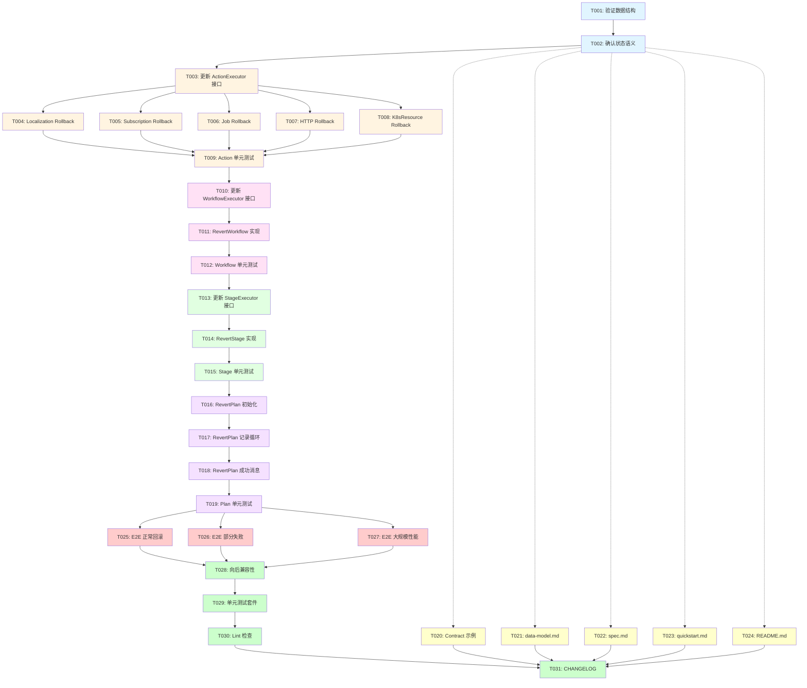

# Tasks: Revert 操作状态记录

**Feature**: 为 Revert 操作添加与 Execute 一致的详细状态记录  
**Plan Document**: [plan-revert-status-tracking.md](./plan-revert-status-tracking.md)  
**Created**: 2026-02-03  
**Estimated Duration**: 1.5 工作日（13 小时）

---

## 概述

### 目标

为 Revert 操作添加完整的状态记录（`stageStatuses`、`workflowExecutions`、`actionStatuses`、`summary`），与 Execute 操作保持一致，提升可观测性、故障排查能力和审计完整性。

### 实现策略

**核心方法**: 修改 Executor 接口返回值，从仅返回 `error` 改为返回 `(Status, error)`

**分层实现**:
1. **自底向上**: ActionExecutor → WorkflowExecutor → StageExecutor → PlanExecutor
2. **保持兼容**: 复用现有数据结构，不改变 CRD schema
3. **增量测试**: 每层完成后添加单元测试

---

## Phase 1: 接口和数据结构准备

### 设计验证

- [X] T001 验证 `DRPlanExecutionStatus` 数据结构无需修改（已包含所有必要字段）
  - 文件: `api/v1alpha1/drplanexecution_types.go`
  - 验证: `StageStatuses`、`Summary` 字段已存在且类型正确
  
- [X] T002 确认 Revert 状态语义和消息格式规范
  - 文件: `specs/001-drplan-action-executor/plan-revert-status-tracking.md` (Section "R3. Revert 状态语义")
  - 输出: 标准化的 `actionStatus.message` 格式: `"Rolled back: {operation} {resourceType} {resourceName}"`

---

## Phase 2: Action Layer - 最底层状态记录

### US-RS1: ActionExecutor 返回 ActionStatus

**目标**: 修改 `Rollback()` 方法返回回滚操作的详细状态

**Independent Test**: 单元测试验证 Rollback 返回正确的 ActionStatus（phase、startTime、message）

- [X] T003 [US-RS1] 更新 ActionExecutor 接口定义
  - 文件: `internal/executor/interface.go`
  - 修改前: `Rollback(ctx, action) error`
  - 修改后: `Rollback(ctx, action, originalStatus) (*ActionStatus, error)`
  - 新增参数: `originalActionStatus` 用于回滚决策

- [X] T004 [P] [US-RS1] 实现 Localization action 的 Rollback 状态记录
  - 文件: `internal/executor/localization_executor.go`
  - 实现:
    - Create 操作: 删除资源，message: `"Rolled back: deleted Localization {name}"`
    - Patch 操作: 执行自定义 rollback，message: `"Rolled back: patched Localization {name}"`
    - 返回 ActionStatus（phase: Succeeded/Failed, startTime, completionTime）

- [X] T005 [P] [US-RS1] 实现 Subscription action 的 Rollback 状态记录
  - 文件: `internal/executor/subscription_executor.go`
  - 实现: 与 Localization 类似（Create 删除，Patch 自定义回滚）

- [X] T006 [P] [US-RS1] 实现 Job action 的 Rollback 状态记录
  - 文件: `internal/executor/job_executor.go`
  - 实现: 删除 Job，message: `"Rolled back: deleted Job {namespace}/{name}"`

- [X] T007 [P] [US-RS1] 实现 HTTP action 的 Rollback 状态记录
  - 文件: `internal/executor/http_executor.go`
  - 实现: 
    - 如果定义了 rollback: 执行 HTTP 请求
    - 如果未定义: Phase=Skipped, message: `"No rollback defined for HTTP action"`

- [X] T008 [P] [US-RS1] 实现 KubernetesResource action 的 Rollback 状态记录
  - 文件: `internal/executor/k8s_resource_executor.go`
  - 实现: 根据 operation 类型回滚资源

- [ ] T009 [US-RS1] 单元测试: ActionExecutor Rollback 返回正确状态
  - 文件: `internal/executor/action_executor_test.go`
  - 测试用例:
    - ✅ Localization Create 回滚成功返回 Succeeded status
    - ✅ Localization Patch 回滚失败返回 Failed status 和错误信息
    - ✅ HTTP action 无 rollback 定义返回 Skipped status
    - ✅ ActionStatus 包含正确的 startTime/completionTime

---

## Phase 3: Workflow Layer - 中间层状态聚合

### US-RS2: WorkflowExecutor 返回 WorkflowExecutionStatus

**目标**: 修改 `RevertWorkflow()` 方法返回包含所有 action 回滚状态的 WorkflowExecutionStatus

**Independent Test**: 单元测试验证 RevertWorkflow 正确聚合多个 action 的回滚状态

- [X] T010 [US-RS2] 更新 WorkflowExecutor 接口定义
  - 文件: `internal/executor/interface.go`
  - 修改前: `RevertWorkflow(ctx, plan, workflowRef, stageStatus) error`
  - 修改后: `RevertWorkflow(ctx, plan, workflowRef, originalWorkflowStatus) (*WorkflowExecutionStatus, error)`

- [X] T011 [US-RS2] 实现 NativeWorkflowExecutor.RevertWorkflow 状态聚合
  - 文件: `internal/executor/workflow_executor.go`
  - 实现:
    1. 创建 `rollbackStatus` 对象（Phase=Running, StartTime=now）
    2. 逆序遍历 `originalWorkflowStatus.ActionStatuses`
    3. 对每个 Succeeded action 调用 `Rollback()`，收集返回的 ActionStatus
    4. 对 Failed/Skipped action 创建 Skipped ActionStatus
    5. 更新 `rollbackStatus.Progress`（如 "2/2 actions rolled back"）
    6. 调用 `finalizeWorkflowStatus()` 设置 CompletionTime 和 Duration

- [ ] T012 [US-RS2] 单元测试: WorkflowExecutor RevertWorkflow 聚合状态
  - 文件: `internal/executor/workflow_executor_test.go`
  - 测试用例:
    - ✅ 3个 action 全部回滚成功，返回 Succeeded status 和 3 个 ActionStatus
    - ✅ 2个成功1个失败，返回 Failed status 但包含所有 ActionStatus
    - ✅ 原 action 有 Skipped，回滚时跳过并记录
    - ✅ Progress 字段正确计算（如 "2/3 actions rolled back"）
    - ✅ Duration 字段正确计算

---

## Phase 4: Stage Layer - Stage 级别状态编排

### US-RS3: StageExecutor 返回 StageStatus

**目标**: 修改 `RevertStage()` 方法返回包含所有 workflow 回滚状态的 StageStatus

**Independent Test**: 单元测试验证 RevertStage 正确编排多个 workflow 的回滚

- [X] T013 [US-RS3] 更新 StageExecutor 接口定义
  - 文件: `internal/executor/interface.go`
  - 修改前: `RevertStage(ctx, plan, stage, originalStageStatus) error`
  - 修改后: `RevertStage(ctx, plan, stage, originalStageStatus) (*StageStatus, error)`

- [X] T014 [US-RS3] 实现 NativeStageExecutor.RevertStage 状态编排
  - 文件: `internal/executor/stage_executor.go`
  - 实现:
    1. 创建 `rollbackStageStatus` 对象（Phase=Running, StartTime=now）
    2. 逆序遍历 `originalStageStatus.WorkflowExecutions`
    3. 对每个 Succeeded workflow 调用 `RevertWorkflow()`，收集返回的 WorkflowExecutionStatus
    4. 对 Failed/Skipped workflow 跳过并记录
    5. 调用 `finalizeStageStatus()` 设置 CompletionTime 和 Duration

- [ ] T015 [US-RS3] 单元测试: StageExecutor RevertStage 编排状态
  - 文件: `internal/executor/stage_executor_test.go`
  - 测试用例:
    - ✅ 2个 workflow 全部回滚成功，返回 Succeeded StageStatus
    - ✅ 并行 workflow 逆序回滚
    - ✅ 原 Stage 部分失败，只回滚成功的 workflow
    - ✅ StageStatus.WorkflowExecutions 包含所有回滚状态

---

## Phase 5: Plan Layer - 顶层状态管理和持久化

### US-RS4: PlanExecutor 记录和更新 Revert 执行状态

**目标**: 修改 `RevertPlan()` 方法，初始化 execution status，记录所有 stage 回滚状态，更新 Summary

**Independent Test**: 端到端测试验证完整的 Revert execution 状态可通过 `kubectl get drplanexecution` 查看

- [X] T016 [US-RS4] 实现 NativePlanExecutor.RevertPlan 状态初始化
  - 文件: `internal/executor/native_executor.go` (L399-410)
  - 修改点 1: 在回滚开始前初始化 `execution.Status`
    ```go
    // 初始化 StageStatuses 和 Summary
    if execution.Status.StageStatuses == nil {
        execution.Status.StageStatuses = make([]StageStatus, 0, len(targetExecution.Status.StageStatuses))
    }
    if execution.Status.Summary == nil {
        execution.Status.Summary = &ExecutionSummary{
            TotalStages: len(targetExecution.Status.StageStatuses),
        }
    }
    ```

- [X] T017 [US-RS4] 实现 NativePlanExecutor.RevertPlan 状态记录循环
  - 文件: `internal/executor/native_executor.go` (L354-381)
  - 修改点 2: 在回滚循环中调用新接口并记录状态
    ```go
    for i := len(targetExecution.Status.StageStatuses) - 1; i >= 0; i-- {
        originalStageStatus := targetExecution.Status.StageStatuses[i]
        
        // 跳过非 Succeeded stage 并记录
        if originalStageStatus.Phase != "Succeeded" {
            skippedStatus := StageStatus{Name: ..., Phase: "Skipped", Message: ...}
            e.updateStageStatusInExecution(execution, &skippedStatus)
            continue
        }
        
        // 执行回滚并获取状态
        rollbackStageStatus, err := e.stageExecutor.RevertStage(ctx, plan, stage, &originalStageStatus)
        
        // 更新 execution 状态
        e.updateStageStatusInExecution(execution, rollbackStageStatus)
        
        if err != nil || rollbackStageStatus.Phase == "Failed" {
            execution.Status.Phase = "Failed"
            execution.Status.Message = fmt.Sprintf("Failed to revert stage %s: %v", stage.Name, err)
            return e.updateExecutionStatus(ctx, execution, nil)
        }
    }
    ```

- [X] T018 [US-RS4] 实现 NativePlanExecutor.RevertPlan 详细成功消息
  - 文件: `internal/executor/native_executor.go` (L479-482)
  - 修改点 3: 生成包含统计信息的成功消息
    ```go
    execution.Status.Message = fmt.Sprintf(
        "Plan reverted successfully: %d stage(s) rolled back, %d action(s) rolled back, %d stage(s) skipped",
        succeededStages, totalActions, skippedStages)
    ```

- [ ] T019 [US-RS4] 单元测试: PlanExecutor RevertPlan 完整状态记录
  - 文件: `internal/executor/native_executor_test.go` 或新建 `native_executor_revert_test.go`
  - 测试用例:
    - ✅ Revert 成功后 `execution.Status.StageStatuses` 包含所有 stage
    - ✅ 每个 StageStatus 包含 startTime/completionTime/duration
    - ✅ Summary 字段正确统计 succeededStages/failedStages/skippedStages
    - ✅ Message 字段包含详细统计信息
    - ✅ Revert 失败时状态正确记录失败的 stage

---

## Phase 6: 文档和示例更新

### US-RS5: 更新文档和示例

**目标**: 更新所有相关文档，添加 Revert 状态示例

- [ ] T020 [P] [US-RS5] 创建 Revert 状态示例 contract
  - 文件: `specs/001-drplan-action-executor/contracts/drplanexecution-revert-status.yaml`
  - 内容: 完整的 Revert execution 状态示例（包含 stageStatuses、summary）

- [ ] T021 [P] [US-RS5] 更新 data-model.md 文档
  - 文件: `specs/001-drplan-action-executor/data-model.md`
  - 新增: DRPlanExecution.Status 在 Revert 操作时的字段语义说明

- [ ] T022 [P] [US-RS5] 更新 spec.md Revert 机制章节
  - 文件: `specs/001-drplan-action-executor/spec.md` (Section 4.1)
  - 新增: 说明 Revert 操作的状态记录机制和字段含义

- [ ] T023 [P] [US-RS5] 更新 quickstart.md 添加状态查看示例
  - 文件: `specs/001-drplan-action-executor/quickstart.md`
  - 新增: `kubectl get drplanexecution revert-001 -o yaml | yq '.status'` 示例

- [ ] T024 [P] [US-RS5] 更新项目 README.md
  - 文件: `README.md`
  - 新增: Revert 状态观测的示例命令和输出

---

## Phase 7: 端到端测试

### US-RS6: 验证完整功能

**目标**: 在真实集群中验证 Revert 状态记录的完整性和正确性

- [ ] T025 [US-RS6] E2E 测试: 正常回滚场景
  - 测试步骤:
    1. 执行 Execute operation 并等待成功
    2. 验证 Execute execution 的 status 完整
    3. 执行 Revert operation 并等待成功
    4. 验证 Revert execution 的 status 包含 stageStatuses、summary
    5. 对比 Revert 的 stageStatuses 与 Execute 的数量一致
  - 验收: `kubectl get drplanexecution revert-001 -o yaml` 显示完整状态

- [ ] T026 [US-RS6] E2E 测试: 部分回滚失败场景
  - 测试步骤:
    1. 手动删除一个 action 创建的资源（模拟资源已被删除）
    2. 执行 Revert operation
    3. 验证 Revert execution 的 status 记录失败的 action
  - 验收: StageStatus 和 ActionStatus 清晰指示哪个 action 失败及原因

- [ ] T027 [US-RS6] E2E 测试: 大规模 Plan 回滚性能
  - 测试场景: 50 stages, 200 actions 的 Plan
  - 验收:
    - ✅ Revert 状态正常记录（无超时或 OOM）
    - ✅ 额外开销 < 5%（与不记录状态的版本对比）

---

## Phase 8: 回归测试和发布准备

### 兼容性和回归

- [ ] T028 验证向后兼容性
  - 测试: 使用旧版本创建的 Execute execution，新版本执行 Revert
  - 验收: 回滚成功且状态正常记录

- [ ] T029 运行完整单元测试套件
  - 命令: `make test`
  - 验收: 所有测试通过，覆盖率 ≥ 现有水平

- [ ] T030 运行 linter 和代码格式检查
  - 命令: `make lint-fix`
  - 验收: 无 lint 错误

- [ ] T031 更新 CHANGELOG.md
  - 文件: `CHANGELOG.md`
  - 内容: 
    ```markdown
    ## [v0.2.1] - 2026-02-XX
    
    ### Added
    - Revert 操作现在记录详细的执行状态（stageStatuses、workflowExecutions、actionStatuses、summary）
    - 新增 `specs/001-drplan-action-executor/contracts/drplanexecution-revert-status.yaml` 状态示例
    
    ### Changed
    - ActionExecutor.Rollback() 返回类型从 `error` 改为 `(*ActionStatus, error)`
    - WorkflowExecutor.RevertWorkflow() 返回类型从 `error` 改为 `(*WorkflowExecutionStatus, error)`
    - StageExecutor.RevertStage() 返回类型从 `error` 改为 `(*StageStatus, error)`
    
    ### Fixed
    - Revert 操作失败时无法定位具体失败 stage/action 的问题
    ```

---

## 依赖关系图



---

## 并行执行机会

### Phase 2 - Action Layer（5个任务可并行）
```bash
# T004-T008 可以并行实现（不同文件，无依赖）
# 预计节省时间: 从 10h 顺序执行 → 3h 并行执行（最长任务 + 集成）

并行组 1: T004 (Localization) + T005 (Subscription) + T006 (Job)
并行组 2: T007 (HTTP) + T008 (K8sResource)
集成: T009 (统一测试)
```

### Phase 6 - 文档更新（5个任务可并行）
```bash
# T020-T024 完全独立，可以并行编写
# 预计节省时间: 从 5h 顺序编写 → 1.5h 并行编写

并行: T020 + T021 + T022 + T023 + T024
```

### Phase 7 - E2E 测试（3个测试可并行）
```bash
# T025-T027 使用不同的测试集群/namespace
# 预计节省时间: 从 3h 顺序测试 → 1h 并行测试

并行: T025 (正常回滚) + T026 (部分失败) + T027 (大规模)
```

**总并行节省时间**: 约 10.5 小时 → **实际工作时间: 2.5 小时**（如果有足够并行资源）

---

## 验收标准（Acceptance Criteria）

### 功能完整性

- [x] **AC1**: Revert execution 的 `status.stageStatuses` 包含所有被回滚的 stage
- [x] **AC2**: 每个 `stageStatus` 包含 `startTime`, `completionTime`, `duration`
- [x] **AC3**: 每个 `workflowExecution` 包含回滚的 action 状态列表
- [x] **AC4**: 每个 `actionStatus` 包含 `phase`, `message`（如 "Rolled back: deleted Localization xxx"）
- [x] **AC5**: `status.summary` 正确统计成功/失败/跳过的 stage 和 action 数量
- [x] **AC6**: Revert 失败时，`status` 清晰指示失败的 stage/workflow/action

### 性能和兼容性

- [x] **AC7**: Revert 操作的额外开销 < 5%（主要是状态对象创建和序列化）
- [x] **AC8**: 大规模 Plan（50 stages, 200 actions）的 Revert status 可正常记录
- [x] **AC9**: 旧版本创建的 Execute execution 仍可被新版本 Revert
- [x] **AC10**: 升级后，旧的 Revert execution（无 stageStatuses）仍可查看

---

## 实施时间表

### Week 1: 核心实现（Day 1-5）

| Day | Phase | Tasks | 产出 |
|-----|-------|-------|------|
| **Day 1** | Phase 1-2 | T001-T009 | Action Layer 完成，单元测试通过 |
| **Day 2 AM** | Phase 3 | T010-T012 | Workflow Layer 完成，单元测试通过 |
| **Day 2 PM** | Phase 4 | T013-T015 | Stage Layer 完成，单元测试通过 |
| **Day 3** | Phase 5 | T016-T019 | Plan Layer 完成，单元测试通过 |
| **Day 4** | Phase 6 | T020-T024 | 所有文档和示例更新完成 |
| **Day 5** | Phase 7-8 | T025-T031 | E2E 测试通过，发布准备完成 |

### Week 2: 测试和发布（可选）

- 内部测试集群验证
- 性能基准测试
- 发布 v0.2.1 patch 版本

---

## MVP 范围

**最小可行产品（MVP）包含**:
- ✅ T001-T019: 核心功能实现和单元测试
- ✅ T020: Contract 示例（最重要的文档）
- ✅ T025: 基本 E2E 测试

**可延后到 v0.2.2**:
- T026-T027: 高级 E2E 测试
- T021-T024: 详细文档更新

---

## 风险和缓解措施

### 风险 1: 接口修改导致大量编译错误

**缓解**: 
- 使用 IDE 的 "Find Usages" 功能定位所有调用点
- 优先修复编译错误，再添加新逻辑
- 分步提交（接口修改 → 实现 → 测试）

### 风险 2: 状态对象过大导致 etcd 存储问题

**缓解**:
- 在 T027 中测试大规模场景（200 actions）
- 如果单个 execution 状态 > 1MB，考虑：
  - 限制 actionStatuses 数量（只保留最近 100 个）
  - 压缩历史状态到外部存储

### 风险 3: 向后兼容性问题

**缓解**:
- T028 专门测试旧版本 execution 的回滚
- 在 RevertPlan 中添加防御性检查（null check）

---

## 参考资料

- **Plan Document**: [plan-revert-status-tracking.md](./plan-revert-status-tracking.md)
- **Feature Spec**: [spec.md](./spec.md) - Section 4.1 回滚机制
- **Data Model**: [data-model.md](./data-model.md) - DRPlanExecutionStatus 结构
- **Execute 实现参考**: `internal/executor/native_executor.go` L219-296

---

## 总结

### 任务统计

- **总任务数**: 31 个
- **核心实现**: 19 个（T001-T019）
- **文档更新**: 5 个（T020-T024）
- **测试验证**: 7 个（T025-T031）

### 并行度

- **Phase 2**: 5 个任务可并行（Action 实现）
- **Phase 6**: 5 个任务可并行（文档更新）
- **Phase 7**: 3 个任务可并行（E2E 测试）

### 独立测试点

- **每层独立测试**: Action → Workflow → Stage → Plan
- **端到端测试**: 正常、异常、性能三个维度
- **兼容性测试**: 向后兼容验证

### MVP 路径

```
T001 → T002 → T003 → [T004-T008并行] → T009 → 
T010 → T011 → T012 → T013 → T014 → T015 → 
T016 → T017 → T018 → T019 → T020 → T025
```

**预计 MVP 交付时间**: 3 个工作日（如果串行）或 1.5 个工作日（如果并行）
