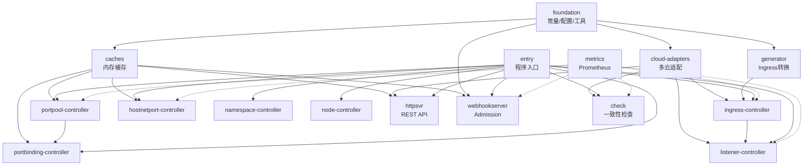

# 模块依赖索引（Module Dependencies）

> 描述模块间的依赖关系，帮助 Agent 理解改动的影响范围。

## 依赖关系图

<!-- dev-map:auto -->

<!-- /dev-map:auto -->

## 依赖关系详情

<!-- dev-map:auto -->
| 依赖方 | 被依赖方 | 依赖类型 | 接口/引用 |
|-------|---------|---------|---------|
| entry | 所有 controller 模块 | import | main.go SetupWithManager 注册 |
| entry | cloud-adapters | import | initClient → initXxxClient |
| entry | httpsvr | import | HTTP 服务启动 |
| entry | webhookserver | import | Webhook 服务启动 |
| entry | check | import | 周期性检查启动 |
| ingress-controller | generator | import | Ingress → Listener 转换 |
| ingress-controller | cloud-adapters | import | 云 LB 操作 |
| ingress-controller | caches | import | Ingress/Service 缓存 |
| listener-controller | cloud-adapters | import | Listener 云资源同步 |
| portpool-controller | caches | import | portpoolcache 端口状态 |
| portbinding-controller | caches | import | portpoolcache 端口查询 |
| portbinding-controller | portpool-controller | 逻辑依赖 | PortBinding 依赖 PortPool 分配 |
| hostnetport-controller | caches | import | hostnetportpoolcache |
| entry | check | import | CertificateChecker 条件注册 |
| entry | namespacedssl | import | NamespacedSSL 客户端初始化 |
| check | cloud-adapters (namespacedssl + sslclient) | import | DescribeCertificate 查询 |
| check | metrics | import | 证书过期指标上报 |
| namespace-controller | cloud-adapters | import | NamespacedLB 客户端重载 |
| httpsvr | caches + cloud-adapters | import | API 查询缓存与云状态 |
| webhookserver | foundation | import | constant + annotationparse |
| webhookserver | caches | import | 端口分配缓存 |
| check | cloud-adapters + caches | import | 一致性对比 |
| metrics | 各 controller | 函数调用 | ReportXxx / CleanXxx helpers |
| generator | foundation | import | constant + option（豁免命名空间） |
| cloud-adapters | foundation | import | constant + option |
<!-- /dev-map:auto -->

## 说明

**依赖类型**：
- `import`：Go 代码中的 import 语句
- `逻辑依赖`：业务流程上的先后依赖，非直接 import
- 虚线（mermaid `-.->`）：指标上报，无编译期强依赖

**变更影响速查**：
- 修改 `internal/constant/` → 影响 generator、webhookserver、所有 controller
- 修改 `internal/cloud/interface.go` → 影响所有云相关 controller 和 check
- 修改 `internal/generator/` → 影响 ingress-controller 及下游 listener
- 修改 `portpoolcache` → 影响 portpool/portbinding/httpsvr/webhookserver

---

*由 harness-generating 分析生成，最后更新：2026-06-11（gardening 增量同步证书过期特性）*
