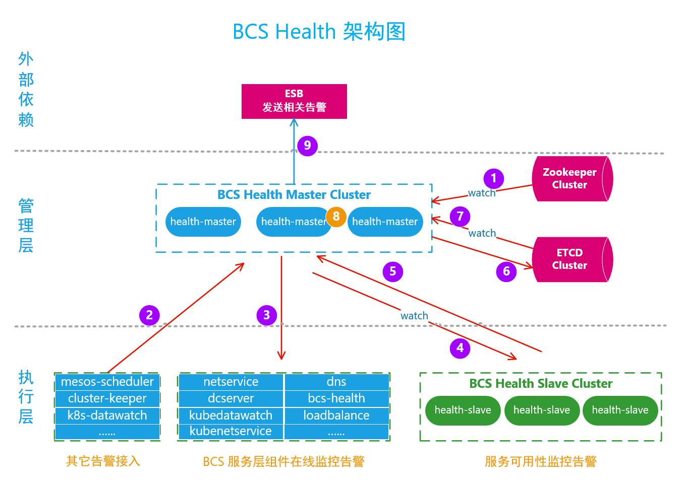

# BCS Health` 新 `架构与功能简介

## 背景
根据需求的迭代和bcs-health在现网的实际运行情况，近期完成了bcs-health的**架构调整**和**重构**工作。

架构调整的主要原因有几个方面：
* BCS服务层只有一套环境，而业务分布实际部署在不同的城市，如LOL有上海、成都、天津等地，health对服务
的检查就要跨城。这样检查的过程受网络波动的影响较大。此外，网络的分区等情况也会影响检查检查。

* 随着BCS管理集群的扩大，bcs-health承担对服务检查的工作就越多，单靠中心节点的检查负担会越来越重，当
然目前未出现在这方面的瓶颈。

* 单一的检查结果可能会出现误告警的情况。

## 架构说明

根据实际的需求，bcs-health的检查服务将拆分为两个组件进行，health-master和health-slave。

基本的架构和功能图如下：



BCS Health 整个服务分为两层：
* 管理层

    管理层主要包含health-master集群，zookeeper集群， etcd集群。
    * zookeeper集群是health-master进行监控的数据源。
    * etcd集群存储着slave集群上报的服务可用性监控数据、策略数据等。同时为master提供数据的watch功能。
    * health-master负责整个监控数据的提取、过滤、收敛、任务分发、发送告警等服务。
    
* 执行层

    执行层主要包括三大部分：
    * health-master提供了http告警接入接口，用于bcs内部的服务组件接入告警服务。这些告警服务的使用者主要
    包含有mesos-scheduler、cluster-keeper、k8s-datawatch等。
    
      此告警对应于架构图中的 ***(2) (8) (9)*** 告警途径。
      
    * health-master提供了对注册在zookeeper目录/bcs/services/endpoints下所有注册服务的在线监控告警服务。
    
      此告警对应于架构图中的***(3) (8) (9)*** 告警途径。
      
    * 提供对业务、BCS等的服务可用性监控告警功能，目前接入的有LB的服务。
    
## 服务可用性监控告警

### `设计思路`
主从架构，重主、轻从。将任务的分发、数据的处理策略、分析等放在主节点，便于管理和维护。同时支持
**http、tcp**的服务检查能力。

* health-master负责整个监控服务的源数据拉取，为health-slave提供任务分发功能。同时负责数据的分析、聚合、
处理等。
* health-slave负责：任务获取-> 执行 -> 上报执行结果。
* health-slave的部署方式灵活，可以跟随容器集群部署，也可以以地域为维度进行部署。

### `任务模型`
health对任务的具体定义如下：
```golang
// job contains all the info which is needed during the check.
type Job struct {
	// which module this job belongs to.
	Module   string      `json:"module"`
	// job actions, include: add, update, delete, handled.
	Action   ActionType  `json:"action"`
	// zone that this job belongs to.
	Zone     Zone        `json:"zone"`
	// Protocol that this job will use.
	Protocol Protocol    `json:"protocol"`
	// url of the checked point, ip:port
	Url      string      `json:"url"`
	// the result of this job.
	Status  *JobStatus   `json:"status, omitempty"`
}

type JobStatus struct {
	// slave infos that do this job
	SlaveInfo *Slave `json:"slaveInfo, omitempty"`
	// where the job is success or not.
	Success   bool   `json:"success, omitempty"`
	// record the check result when failed.
	Message   string `json:"message, omitempty"`
	// time of the job is done.
	FinishedAt int64 `json:"finishedAt, omitempty"`
}

// health slave's meta info
type Slave struct {
	// the name of the slave cluster, must be unique among all clusters.
	// can be the value of cluster-id or others.
	SlaveClusterName string `json:"slaveClusterName"`
	// containers a collection of zone. it determines the jobs that is get from master.
	Zones Zones `json:"zones"`
	// details about this slave.
	types.ServerInfo `json:",inline"`
}

```

### `数据源`
对应于架构图中的第 ***(1)*** 个环节，目前health-master针对服务可用性监控告警的数据源在BCS服务层的zookeeper
集群中，以**watch**的方式动态拉取**Loadbalance**的服务节点信息。同时也可兼容接入其它的服务数据。

health-master提供基于http的watch接口，用于health-slave动态实际的拉取其任务信息。同时提供list查询任务接口。
### `任务流`
结合架构图中的具体步骤，简化后的任务流如下：
* 第 ***(4)*** 个环节：

 health-slave通过health-master的 ***http watch*** 接口实时拉取增量数据（如: `新增、更新、删除`
任务），同时利用list接口进行全量数据同步。利用 ***watch + list***机制在保证数据实时性的前提下，也
可以保证任务数据的最终一致性。  

* 第 ***(5)*** 个环节：

 health-slave在拿到任务以后根据类型（http/tcp）开始执行任务。每3秒执行一次任务，失败后有两次backoff
动作，对于失败的任务需要17s才会上报一次状态，而检查正常的任务每3秒上报一次状态。health-slave通过
health-master提供的http任务上报接口进行上报。

* 第 ***(6)*** 个环节：

 health-master在收到health-slave上报的数据后，直接存储在etcd集群中。这是为了health-master集群中
的每个成员看到的数据是一致的。

* 第 ***(7)*** 个环节：

 health-master通过watch的方式实时获取health-slave上报的状态信息，并利用list机制进行数据全量同步。

* 第 ***(8)*** 个环节：

 health-master的processor模块会第1秒钟扫描一次当前上报的所有状态数据，并利用相应的**规则、策略**
进行决策，确定是否要对某一个任务进行告警。

* 第 ***(9)*** 个环节：

 如果确定要进行告警，再根据告警的类型是rtx,wechat,sms,voice等调用相应ESB的接口进行告警。

