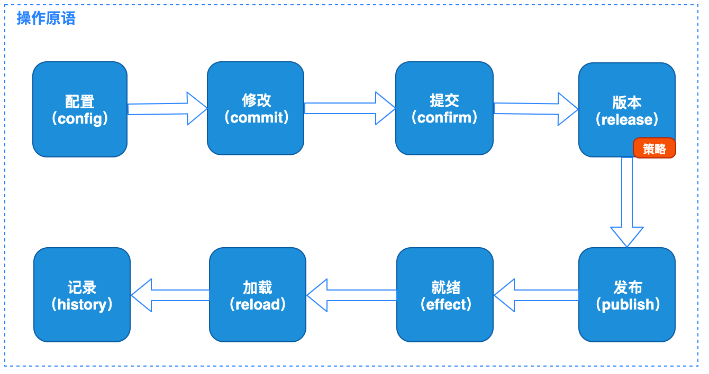

BK-BSCP 蓝鲸基础服务配置平台
============================

[TOC]

## What's It ?

蓝鲸基础服务配置平台(Basic Service Configuration Platform), 是蓝鲸体系内的针对微服务的配置原子平台。
提供配置中心场景的原子接口支持，可基于原子语义开发出定制化的SaaS产品, 为进程和容器混合环境的微服务提供配置中心支持。

## Overview

BK-BSCP 蓝鲸基础服务配置平台

* 配置热更新
* 配置版本管理
* 灰度发布策略
* 内容模板渲染
* 文本、二进制文件兼容
* 容器与非容器环境纳管

## Atomic Primitive

## Platform Arch

## Documents

* [设计文档](docs/arch.md)
* [项目规范](docs/standard.md)
* [部署安装教程](docs/install.md)
* [集成对接指南](docs/integration.md)
* [编译](docs/build.md)
