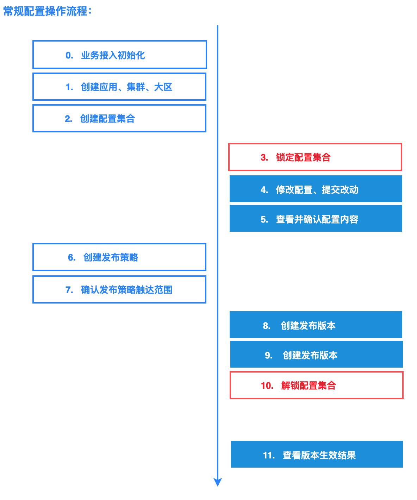
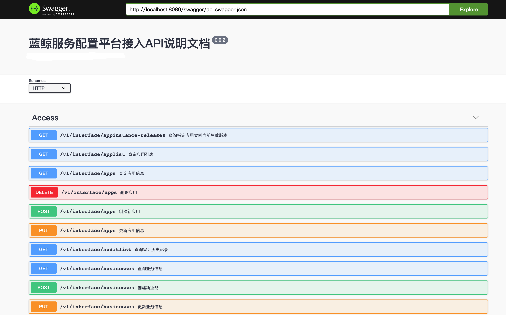

蓝鲸服务配置平台系统对接指南
============================

> 指南意在说明第三方系统与BSCP配置平台之间打通方式和流程，针对api使用和调用方式进行详细说明。

[TOC]

## 对接说明

### 基础概念

#### 概述
* 本文档意在说明整套系统中的基础概念以及操作接口用途；
* 基础对象主要有：业务(business)、应用（app）、业务集群（cluster）、业务大区（Zone）、配置集合（Config Set）、提交（Commit）、配置版本（Release）；
* 系统内接口按照功能性划分为：创建类型（Create Family）、更新类型（Update Family）、查询类型（Query Family）、删除操作类型（Delete Family）、其他类型（Others）；

*基础概念*

#### 业务(Business)
* 业务即为产品级别的业务划分，在其之下可包含多个应用（App）模块，业务是平台内最高纬度的划分层级;
* 系统内以业务维度划分租户, 数据分片存储规则也以及业务（business）纬度进行规划。
* 创建业务（business）即为业务接入业务的第一步操作，需要设定业务分片存储规则，业务初始化后即可进行应用等创建操作(一般由平台管理员操作即可);
* 创建业务后系统会为其分配业务ID（Bid），且Bid会作为系统内的路由依据、数据库存储sharding依据；

#### 应用（App）
* 应用即为业务应用，可以理解为是业务（business）之下具体的某个服务模块;
* 应用可包含不等数量的配置集合（Config Set），每个集合可以映射为实际单一独立的配置文件;
* 创建应用前需提供应用名称（Name）、部门ID（Depid）等基础信息，其中名称在业务(business)作用域下唯一；
* 创建应用后系统会为其分配应用ID（Appid），作为系统级别的唯一ID标识;

#### 业务集群（Cluster）
* 业务集群即为业务应用在系统内的逻辑划分，归属于某个应用（App）之下，该层面的划分通常可与真实物理集群划分挂钩；
* 业务集群可包含不等数量的业务大区（Zone），为业务集群内最小纬度划分；

#### 业务大区（Zone）
* 业务大区既为业务应用在系统中最小粒度逻辑划分，隶属于某个业务集群之下；

#### 配置集合（Config Set）
* 配置集合即为系统内配置内容的集合，是配置的第一级结构划分，配置集合隶属于某个应用（App）下;
* 业务按照业务集群/业务大区做更细维度的归属划分(namespace)，即配置集合可隶属于整个应用，也可隶属于某个业务集群或某个业务大区；

#### 配置内容 (configs)
* 配置内容为某个配置集合（经渲染后）的实际配置内容;
* 配置集合的渲染是指，根据不同的集群（Cluster）或大区（zone）的labels进行内容的模板渲染；

#### 提交（Commit）
* 提交即为配置改动内容的提交，意在表示某个配置集合（Config Set）中配置内容的修改操作变动历史，在对配置进行修改时，需创建指定的提交（Commit）操作，后序配置版本中也需关联相应的commit；
* Commit包含对应配置集合的基础信息，以及配置集合修改之前的内容和修改后的差异内容；
* 创建提交（Commit）时需提供业务ID（Bid）、应用ID（Appid）、隶属业务集群ID（Clusterid）、隶属业务大区ID（Zoneid）、对应的配置集合ID（Config Set ID）以及原始配置内容和差异内容；

#### 配置锁（Config Set Lock）
* 配置锁即为作用于配置集合之上的锁机制，用于防止不同人员同时操作相同配置集合造成配置内容错乱；
* 在修改配置提交Commit之前应先对指定目标配置集合进行加锁；
* 完成Commit操作之后需要放开对应的配置锁；

#### 配置版本（Release）
* 配置版本为某个配置集合的发布版本，配置内容修改后需根据提交（Commit）创建对应的配置版本（Release）后做发布；

#### 发布策略（Strategy）
* 发布策略为配置版本发布控制策略，支持黑白名单的控制机制，隶属于某个应用（App）内；
* 配置版本可附带发布策略（Strategy），用于根据用户指定的策略进行灰度发布, 即配置版本具备namespace特性；

#### 数据存储分片（Sharding Database）
* 为满足多租户以及租户之间数据隔离，系统内的数据均以分片形式存储在数据库中；
* 在系统初始化时应创建对应的分片数据库实例，创建业务（Business）时关联对应的数据库分片(一般由平台管理员操作)；

#### 数据分片规则（Sharding）
* 数据存储分片规则，按照指定关键字key（现阶段为业务ID，既Bid）进行映射管理；
* 该操作可单独设定，通常在创建业务(Business）时已根据传入的DBID自动进行设置；

 
 

### 调用流程

#### 0.业务接入初始化

* 创建业务数据存储分片(CreateShardingDB): 创建存储分片, 若已有可用分片并允许复用则无需再创建
* 创建业务 (CreateBusinessReq): 创建业务，通过DBID关联指定存储分片，并附带数据库名称，则创建Business时会自动创建分片存储规则

#### 1.创建应用、集群、大区(若新增集群、大区)

* 创建应用(CreateApp): 在指定业务(Business)下创建应用
* 创建集群(CreateCluster): 在指定应用（App）下创建业务集群
* 创建大区(CreateZone): 在指定业务集群(Cluster)下创建业务大区

#### 2.创建配置集合

* 创建配置集合(CreateConfigSet): 在指定应用(App)下创建配置集合

#### 3.Lock（修改配置前加锁)

* 锁定配置集合(LockConfigset): 针对目标配置集合加锁，准备修改配置

#### 4.修改配置

* 创建提交(CreateCommit): 修改指定配置集合内容，若有模板则附带模板信息
* 确认提交(ConfirmCommit): 确认提交修改，后台会根据提交（Commit）生成对应配置内容实体（若有模板则会渲染）

#### 5.查看实际生成后的配置内容

* 查询配置内容(QueryConfigs): 查询指定提交（Commit）确认后生成的指定作用域内的配置内容
* 查询配置内容列表(QueryConfigsList): 查询指定提交（Commit）确认后生成的全部配置内容

#### 6.创建发布策略

* 创建发布策略(CreateStrategy)：为某个应用（App）创建发布策略
* 预览触达范围(QueryReachableAppInstances): 查询策略可触达范围内的节点信息, 确认策略规则

#### 7.创建发布版本

* 创建发布版本(CreateRelease): 完成配置修改后，创建配置版本，版本会关联指定的提交（Commit）和对应的发布策略

#### 8.配置下发

* 下发(PublishRelease)：确认无误后, 发布目标配置版本

#### 9.Unlock (完成修改后解锁)

* 解锁配置集合 (UnlockConfigset): 解除目标配置集合锁定

#### 10.查询版本生效结果

* 查询生效信息(QueryEffectedAppInstances): 查询已经生效指定配置版本的全部节点

### 快速接入（逻辑集成）

#### 逻辑集成
> 只需一个yaml文件，即可完成全部逻辑操作。

* 逻辑集成, 可帮助做快速接入，只需单一接口即可完成配置发布操作。
* 以yaml形式对所需要操作逻辑进行描述，BSCP逻辑集成模块将解析并按照描述完成全部逻辑操作。

[逻辑集成yaml规则说明](../docs/integrator.md)

## 在线接口文档
> 全部接口详细描述(含逻辑集成接口)，基于swagger提供在线调试能力

[接口文档地址] <http://localhost:8080/swagger/swagger-ui/>

*输入 "http://localhost:8080/swagger/api.swagger.json"  点击Explore即可*

