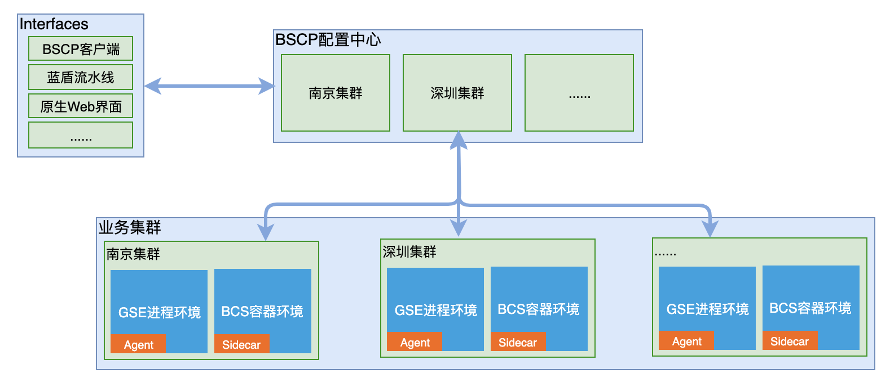
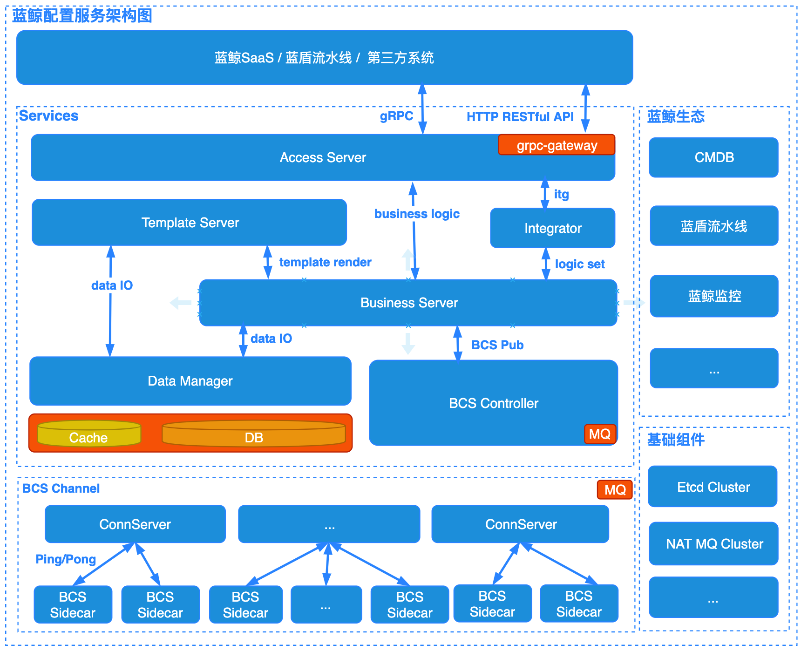

BK-BSCP 架构设计
==========================

[TOC]

# 基础概念

* Business: 业务划分
* App: 业务之下的具体应用模块
* Cluster: 业务应用模块下的集群划分
* Zone: 业务应用集群下的单元大区划分
* ConfigSet: 配置集合, 可理解为以往的单一配置文件

> Cluster往往是业务在某个地区机房的一组部署；Zone则是在某个集群下的二级划分，用来标识某个业务大区等；
> ConfigSet由N组业务方编写的配置项构成，支持多种配置类型且提供私有类型支持，提供百兆大小配置文件传输。

# 架构

# 模块

* Gateway: 提供HTTP RESTful协议服务，完成HTTP到gRPC的协议转换;
* AccessServer: 集群的入口，负责请求的接入和协议版本兼容以及相关鉴权处理;
* BusinessServer: 业务逻辑集成服务, 完成复杂的逻辑集成；
* Integrator: 逻辑集成器，基于yaml描述快速完成复杂逻辑处理;
* DataManager: 数据代理服务, 提供统一的缓存、DB分片存储能力;
* TemplateServer: 模板服务，负责配置模板的管理和内容渲染；
* BCS-Controller: BCS容器环境的控制器，负责策略控制和版本下发；
* ConnServer: BCS容器环境会话链接服务，与BCS-Sidecar配合维护下发通道，保证容器环境可触达；
* BCS-Sidecar: BCS容器环境sidecar，以sidecar模式运行，完成配置版本的拉取、生效和反馈上报；

# Q&A
