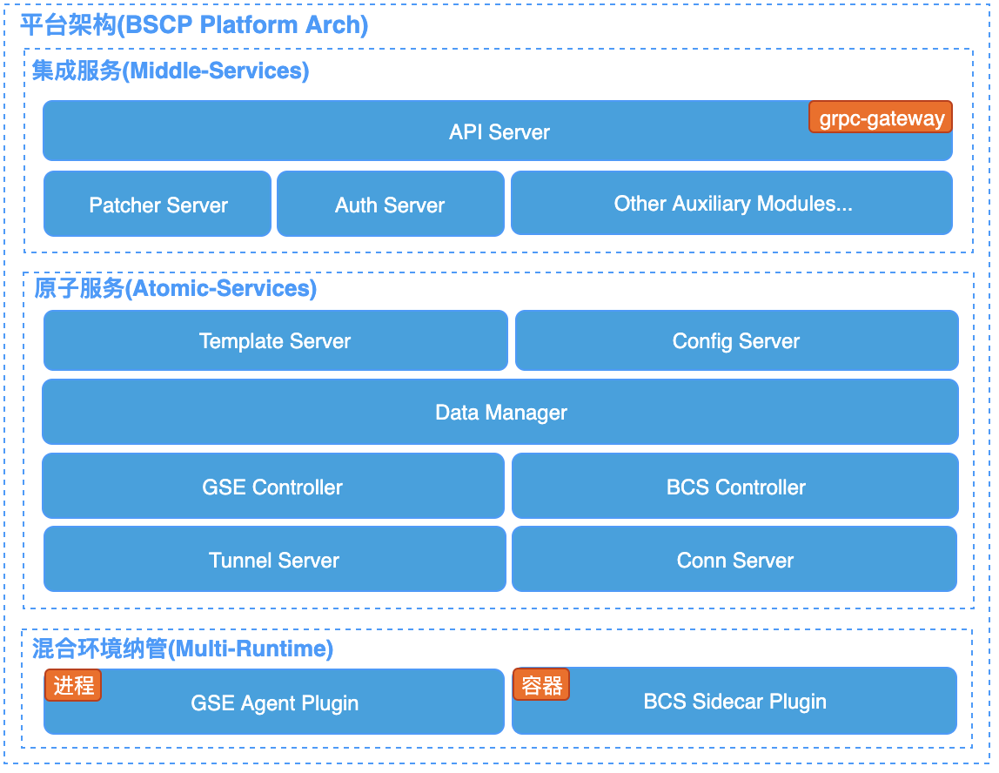
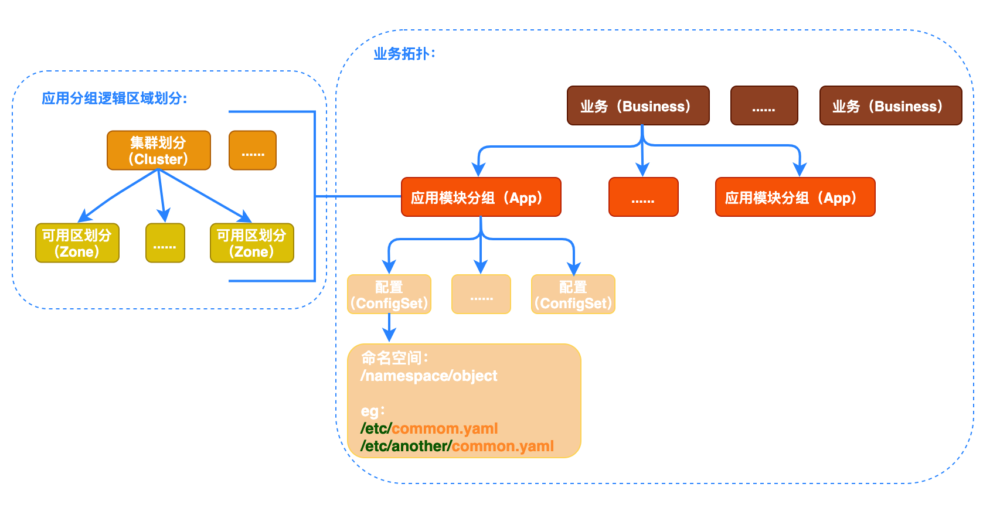
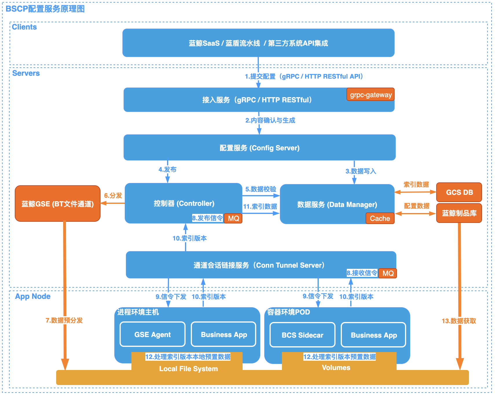

BK-BSCP 平台架构设计
==========================

[TOC]

# 平台架构

# 集成服务设计

## 模块

* APIServer: 接入服务，负责协议转换、URL路由、权限过滤、制品库服务代理；
* AuthServer: 权限服务，负责完成内部权限审核;
* Patcher: 升级补丁服务，负责升级补丁和定时数据修复任务;
* Other Auxiliary Modules: 其他扩展辅助服务;

# 原子服务设计

## 基础概念

* Business: 业务划分, 系统内部不创建业务资源，只做外部业务的关联管理;
* App: 业务之下的具体应用模块, 为系统中的最小管理单元，外部系统也是以此进行关联对接;
* Config: 配置, 可理解为以往的单一配置文件;

## 模块

* ConfigServer: 配置服务, 提供gRPC协议服务, 负责原子接口逻辑和较复杂的逻辑集成；
* TemplateServer: 模板服务，负责配置模板的管理和内容渲染；
* DataManager: 数据代理服务, 提供统一的缓存、DB分片存储能力;
* GSE-Controller: GSE侧的控制器，负责策略控制和版本下发；
* TunnelServer: GSE侧通道服务，负责GSE通道的数据下行；
* BCS-Sidecar: BCS容器环境sidecar，以sidecar模式运行，完成配置版本的拉取、生效和反馈上报；
* GSE-plugin: GSE插件，与GSE Agent配合构建进程、容器混合环境下的配置通道;

## 职责与调用关系说明

* APIServer: 集群唯一入口，主要负责请求接入，做路由处理和流量代理，严禁过重逻辑;
* Patcher: 内部补丁服务，包含升级包补丁和定时数据修正任务等，可直接操作BD, 无需基于DataManager接口进行逻辑处理（补丁的场景多为特殊场景，这种不便于下沉到DataManager中，DataManager只提供通用的接口, 便于内部模块复用）;
* AuthServer: 由APIServer接入外部请求，是内部与外部权限系统的桥梁, 负责策略的创建修改和鉴权判断，负责权限相关资源数据的检索。AuthServer管理上属于集成服务层，但本质上属于中心化的权限处理模块，原子服务层可向上调用AuthServer;
* ConfigServer、TemplateServer: 负责配置、模板等逻辑的处理，基于DataManager实现数据的读写;
* DataManager: 只提供通用的可复用的原子接口;
* GSE-Controller：负责通道的配置、版本策略控制；
* TunnelServer: 负责通道的会话管理和信令管控;

## 数据流
> 配置发布的主要逻辑, 其他复杂逻辑不做展示说明

# Q&A
