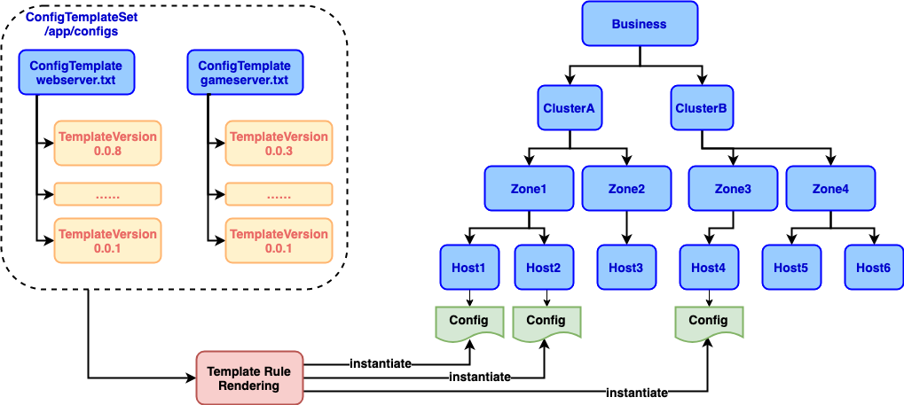

# 蓝鲸配置服务模版功能

## Background

在业务的配置文件中，某些配置项会跟随大区的不同或者模块的不同而变化，但又存在大量共性的配置项。为了简化这一类配置文件的管理，蓝鲸配置管理服务引入了配置模版的概念。在配置模版中可以定义多个变量，根据大区和模块的不同给这些变量赋予不同的值，配置模版根据这些变量的不同可以实例化成不同的配置。

## 模版服务特性

* 支持多种作用域的变量定义，业务全局变量，集群变量，zone变量以及实例变量
* 支持多种模版集语法规则
* 支持模版的版本管理

## 相关概念介绍



* ConfigTemplateSet：配置模版集合，该集合下的所有配置模版的实例属于同一个文件夹
* ConfigTemplate：配置模版，可以关联多个配置模版版本
* TemplateVersion：配置模版版本，表示配置模版的实际版本内容，可以引用变量
* GlobalVariable：业务下的全局变量，作用域为该业务下所有的配置模版
* ClusterVariable：某个业务下某个集群的变量，作用域为绑定某集群的配置模版
* ZoneVariable：某个Zone下的变量，作用域为绑定某Zone的配置模版

## 配置模版语法

蓝鲸配置服务的模版功能支持GO语言的模版语法，预计支持python mako模版语法。

> 基于GO语言模板引擎规则(<https://golang.org/pkg/text/template/>)。
>
>
> 基于mako模版引擎规则(<https://www.makotemplates.org/>)。

**备注**: 暂时不支持多个配置模版之间的引用

## 模版实例化过程

下面基于GO语言内建模版语法，说明配置模版实例化的过程。

### 1. 假设有如下业务topo

```text
business--------cluster1------zone1-----host1(127.0.0.1)
            |              |
            |              |--zone2-----host2(127.0.0.2)
            |
            |---cluster2------zone3-----host3(127.0.0.3)
```

### 2. 假设已经创建了如下变量

全局变量：

```yaml
GlobalVar: "global_var_1"
```

cluster1的集群变量：

```yaml
ClusterVar: "cluster_var_1"
```

cluster2的集群变量：

```yaml
ClusterVar: "cluster_var_2"
```

zone1的zone变量：

```yaml
ZoneVar: "zone_var_1"
```

zone2的zone变量:

```yaml
ZoneVar: "zone_var_2"
```

### 3. 创建如下配置模版

app.txt

```text
instance: {{ .Index }}
global_url = {{ .GlobalVar }}
cluster_url = {{ .ClusterVar }}
zone_url = {{ .ZoneVar }}
var1 = {{ .TmpVar1 }}
var2 = {{ .TmpVar2 }}
```

### 4. 传入渲染规则

```json
[
    {
        "cluster": "cluster1",
        "zones": [
            {
                "zone": "zone1",
                "instances": [
                    {
                        "index": "127.0.0.1",
                        "vars": {
                            "TmpVar1": "tmp_zone1_var_1",
                            "TmpVar2": "tmp_zone1_var_2"
                        }
                    }
                ]
            },
            {
                "zone": "zone2",
                "instances": [
                    {
                        "index": "127.0.0.2",
                        "vars": {
                            "TmpVar1": "tmp_zone2_var_1",
                            "TmpVar2": "tmp_zone2_var_2"
                        }
                    }
                ]
            }
        ]
    },
    {
        "cluster": "cluster2",
        "zones": [
            {
                "zone": "zone3",
                "instances": [
                    {
                        "index": "127.0.0.3",
                        "vars": {
                            "TmpVar1": "tmp_zone3_var_1",
                            "TmpVar2": "tmp_zone3_var_2"
                        }
                    }
                ]
            }
        ]
    },
]
```

### 5. 得到配置实例

```text
instance: 127.0.0.1
global_url = global_var_1
cluster_url = cluster_var_1
zone_url = zone_var_1
var1 = tmp_zone1_var_1
var2 = tmp_zone1_var_2
```

```text
instance: 127.0.0.2
global_url = global_var_1
cluster_url = cluster_var_1
zone_url = zone_var_2
var1 = tmp_zone2_var_1
var2 = tmp_zone2_var_2
```

```text
instance: 127.0.0.3
global_url = global_var_1
cluster_url = cluster_var_2
zone_url = 
var1 = tmp_zone3_var_1
var2 = tmp_zone3_var_2
```
