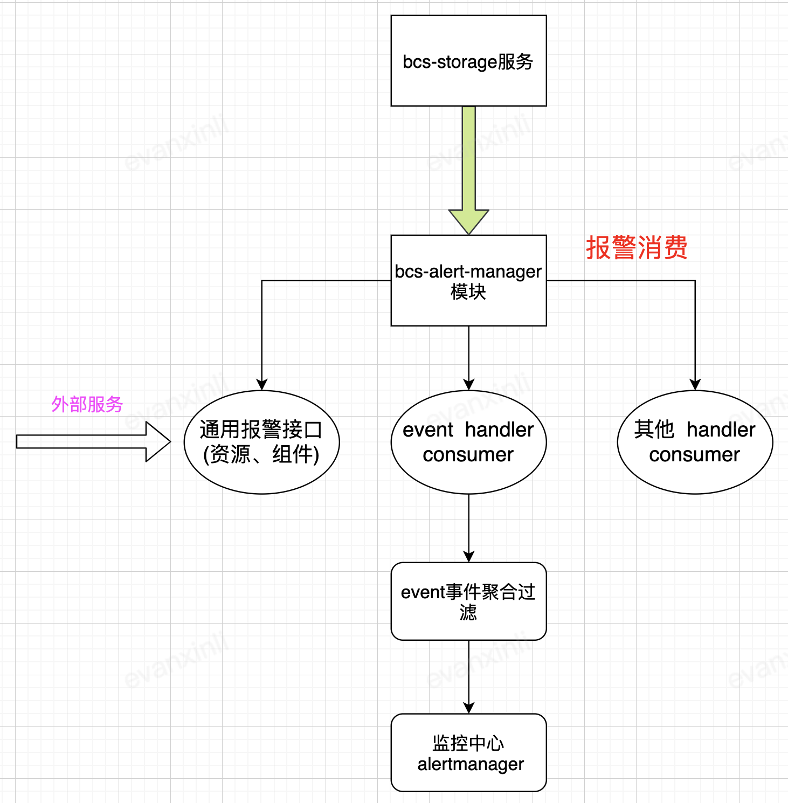
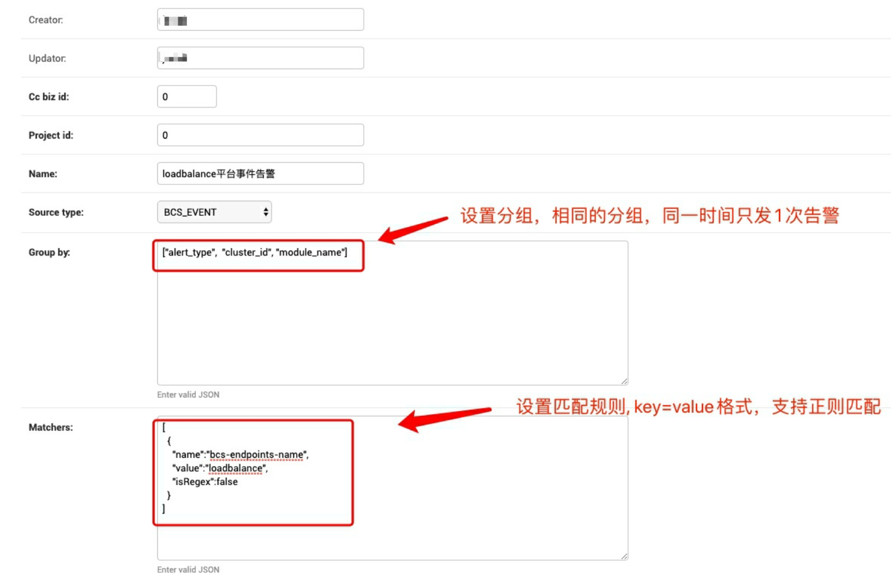
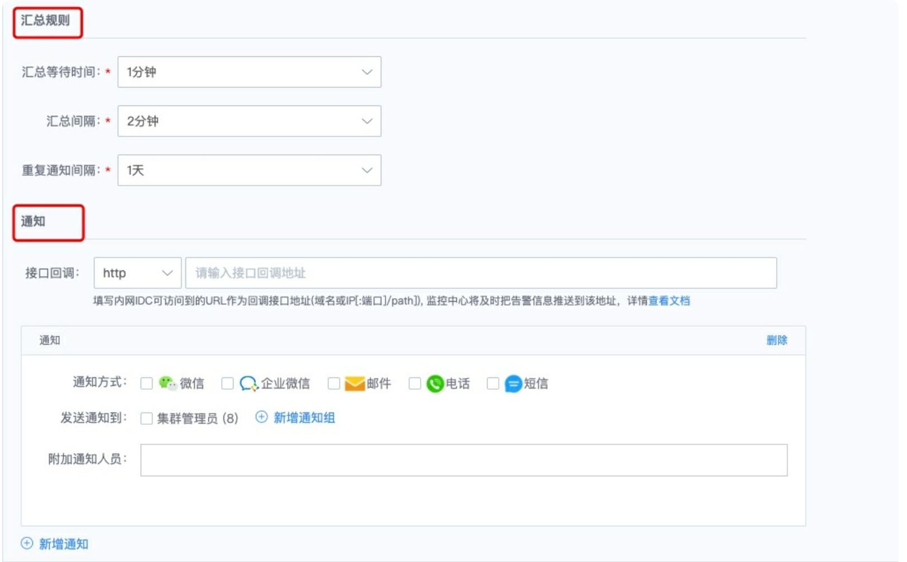

# bcs-alert-manager

## 简介
bcs-alert-manager服务是bcs集群资源、服务、事件的监控报警组件，主要的功能如下

* 提供服务、资源维度的监控报警接口
*  监听bcs-storage推送到消息队列的event事件，并对mesos和kubernetes集群的event事件进行封装，发送至alert-manager组件进行报警配置处理

## 架构


* web server对外提供通用的资源、组件维度的报警接口
* handler事件消费，主动订阅队列event消费事件，过滤聚合后创建报警事件发送至监控中心alert-manager

## 编译部署
### 编译
```
# 编译alert-manager二进制
cd ${GOPATH}/src
make alert-manager
# 构建镜像
cd ./build/bcs.${VERSION}/bcs-services/bcs-alert-manager
docker build -t alert-manager:{{tag}} .
```
### 部署
通过helm进行部署

```
安装部署
helm install -n xxx bcs-alert-manager ./deploy/bcs-alert-manager 

特定参数渲染values
helm template bcs-alert-manager ./deploy/bcs-alert-manager  -f values/xxx/bcs-alert-manager.yaml -n xxx | kubectl apply -f -
```

## 如何使用
### 资源、模块报警
通过 swagger 访问API接口，经过上述步骤部署好服务之后，即可通过访问

```
进入swagger页面
http://xxx:xxx/alertmanager/swagger/swagger-ui/ 

访问bcs-alert-manager接口，查看接口文档
http://xxx:xxx/alertmanager/swagger/alertmanager.swagger.json
```
### kubernetes集群event事件告警
* bcs-alert-manager模块自动订阅bcs管控集群的所有event事件，将event事件进行过滤聚合后，会自动发往监控中心的alert-manager模块

### 监控中心配置报警
* 监控中心配置分组和报警匹配规则

* 监控中心设置汇总时间和通知方式


配置完成后，用户可以定时收到告警通知。


		