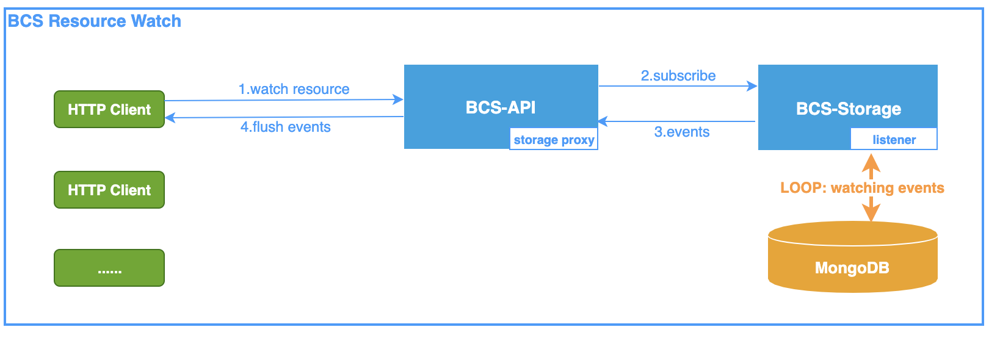

BCS Resource Watch APIs
=======================

bcs-api服务提供针对集群内资源的watch接口，用于动态发现资源变化。

# 1.接口定义

## 1.1 watch集群资源

`PATH`: /bcsapi/v4/storage/dynamic/watch/{clusterId}/{resourceType}

`METHOD`: POST

### 示例
> watch集群BCS-K8S-10000的Node资源数据

URL: "http://bcs-api.host:31443/bcsapi/v4/storage/dynamic/watch/BCS-K8S-10000/Node

Request:

```json
Headers:
    Content-Type: application/json

Body:
{
	"maxEvents": 0,
	"timeout": 0
}
```
Body中为JSON结构的watch参数，含义如下：

`"maxEvents"`: 最大事件接收数量。默认0，不限制数量；

`"timeout"`: 最长事件等待时间。默认0，不限制等待时间;


Response:

```json
Body:
{"type": 3, "value": {...}}
{"type": 3, "value": {...}}
.
.
.
{"type": 3, "value": {...}}
{"type": 3, "value": {...}}
{"type": 3, "value": {...}}
.
.
.
```

资源数据返回JSON格式:

`"type"`: 资源事件类型(0:Nop 1:新增 2:删除 3:更新 -1:watch结束)

`"value"`: 资源对象完整数据, e.g, {"id": "xxx", "name": "node"...}

## 1.2 watch集群容器

`PATH`: /dynamic/watch/containers/{clusterId}

`METHOD`: POST

### 示例

参见`1.1 watch集群资源`

# 2.资源订阅模式


* `订阅主题`：MongoDB中集群资源数据所在collection名，如 cluster_BCS-K8S-1000_node；
* `storage监听模式`：相同类型的资源在同一订阅主题下，资源数据发生变化后依据WatcherList依次进行广播；
* `客户端订阅方式`：针对某一类型资源发起watch请求，保持链接持续获取该类型下不同对象实例的变化数据;

# 3.事件通知机制



* `传输协议`：HTTP流式传输，客户端主动通过BCS-API服务发起订阅，BCS-Storage服务会建立订阅会话，当目标资源数据发生变化时主动Flush数据到客户端。在此期间客户端需保持HTTP链接，并阻塞地从stream中读取并解析出资源数据；
* `数据形式`：目标资源对象数据发生变化时，BCS-API返回的数据为该资源对象的完整数据并非只是变化部分的数据；
* `监听资源`：BCS-Storage基于MongoDB实现对指定资源的监听，并将变化的对象完整数据查询并返回;
* `代理模式`：BCS-API提供了到BCS-Storage的反向代理功能，并针对HTTP流式数据进行实时同步，保证数据即时可用；

# 4.Q&A
