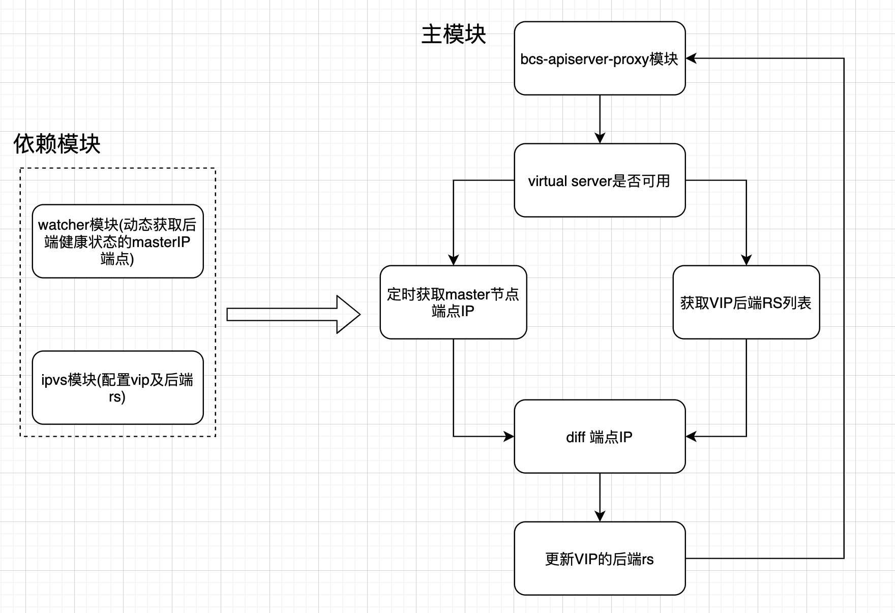

# bcs-apiserver-proxy

`bcs-apiserver-proxy`组件主要负责`kubernetes`集群内部组件连接`master`节点的高可用特性，主要是基于动态服务发现`master`节点端点IP和通过`ipvs`建立本地负载均衡守护规则实现高可用访问`master`节点。

主要功能：

* 自动监测集群`master`节点的新增、故障、删除状态，动态服务发现集群`master`节点的端点`IP`
* 建立本地负载`ipvs`规则并动态刷新规则实现高可用访问

## 架构设计

核心原理：通过本地`ipvs`代理节点解决`master`高可用问题，实现负载均衡。每个node节点上都启动一个负载均衡，上游就是master节点，负载方式有很多 ipvs nginx等，最终使用内核ipvs实现后端rs规则动态刷新，实现自动化。

bcs-apiserver-proxy架构处理流程如图示：



* endpoints watch模块，主要负责动态更新`kubernetes`集群的`master`端点IP。集群新增、删除、变更`master`节点、故障时能够动态刷新`endpointsIP`
* ipvs模块
  * 新增virtual server
  * 检测virtual server是否可用
  * 删除virtual server
  * 新增、删除LVS后端的rs
* manager模块主要负责检测当前节点virtual server是否可用、集群的master端点IP和后端的rs进行diff并进行更新virtual server	等

## 部署指南

通过`daemonSet`进行部署，负责维护本地负载均衡规则，并动态更新后端`endpointIPs`

```
cd  bk-bcs/install/conf/bcs-k8s-master/bcs-apiserver-proxy/

kubectl apply -f bcs-apiserver-proxy.yaml
```

## 使用指南

### 使用步骤
1. 下载`bk-bcs`代码，进行代码编译，生成 `bcs-apiserver-proxy`和`apiserver-proxy-tools`
    
    ```
    git clone https://github.com/Tencent/bk-bcs.git
    make  apiserver-proxy
    make  apiserver-proxy-tools
    ```
2. 生成镜像并将工具`apiserver-proxy-tools`分发至各个`node`节点

    ```
    cd  bk-bcs/build/bcs.xxxxxxx-21.06.30/bcs-k8s-master/bcs-apiserver-proxy
    docker build -t image名称 .
    docker push 上传至镜像仓库
    并将生成的 apiserver-proxy-tools分发至各个node节点
    ``` 
3. 首先通过工具`apiserver-proxy-tools`生成本地负载均衡的代理规则
    
    ```
    apiserver-proxy-tools --help 查看帮助
    生成vs本地负载均衡规则
    apiserver-proxy-tools -cmd add -vs vip:vport -rs master0:port -rs master1:port -rs master2:port
    
    删除vs本地负载均衡
    apiserver-proxy-tools -cmd delete -vs vip:vport 
    ```       
4. `kubelet`及`kube-proxy`组件启动时`kube-config`文件配置连接生成的lvs即可并通过部署的`daemonset`动态守护规则

### 注意
* `kube-proxy`组件启动时必须配置`--ipvs-exclude-cidrs strings`参数，避免清理本地`ipvs`规则
* VIP授权问题，生成证书文件时需要将上述`vip`添加至授权IP列表
* 集群VIP地址不能和集群其他地址段重复

## 参考
   [lvscare设计](https://github.com/sealyun/lvscare) 

