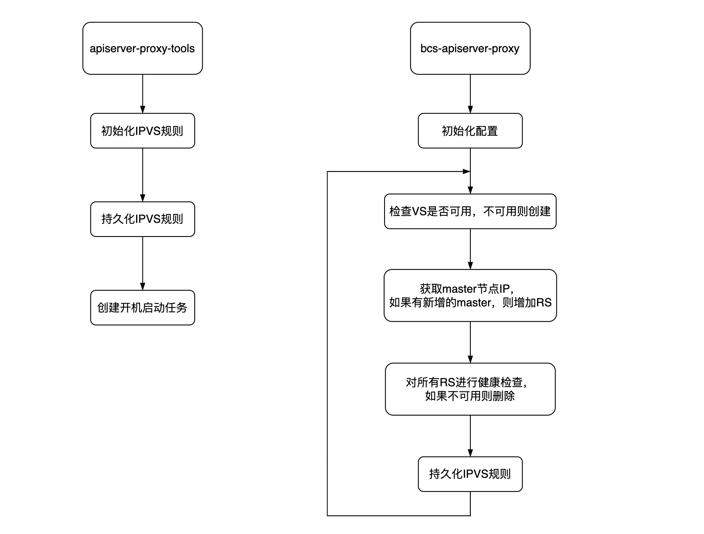

# bcs-apiserver-proxy

`bcs-apiserver-proxy`组件主要负责`kubernetes`集群内部组件连接`master`节点的高可用特性，主要是基于动态服务发现`master`节点端点IP和通过`ipvs`建立本地负载均衡守护规则实现高可用访问`master`节点。

主要功能：

* 自动监测集群`master`节点的新增、故障、删除状态，动态服务发现集群`master`节点的端点`IP`
* 建立本地负载`ipvs`规则并动态刷新规则实现高可用访问

## 架构设计

核心原理：通过本地`ipvs`代理节点解决`master`高可用问题，实现负载均衡。每个node节点上都启动一个负载均衡，上游就是master节点，负载方式有很多 ipvs nginx等，最终使用内核ipvs实现后端rs规则动态刷新，实现自动化。

bcs-apiserver-proxy架构工作流程如图示：




## 使用指南

### 使用步骤

1. 下载`bk-bcs`代码，进行代码编译，生成 `bcs-apiserver-proxy`和`apiserver-proxy-tools`

  ```
  git clone https://github.com/Tencent/bk-bcs.git
  make  apiserver-proxy
  make  apiserver-proxy-tools
  ```
   
2. 生成镜像并通过`daemonSet`进行部署，负责维护本地负载均衡规则，并动态更新后端 rs ，并将ipvs规则持久化到本地

```
cd  bk-bcs/build/bcs.xxxxxxx-21.06.30/bcs-k8s-master/bcs-apiserver-proxy
docker build -t image名称 .
docker push 上传至镜像仓库
kubectl apply -f bcs-apiserver-proxy.yaml
```

3. 将工具`apiserver-proxy-tools`分发至各个`node`节点的 `/root`目录下, 通过工具`apiserver-proxy-tools`生成本地负载均衡的代理规则
    
  ```
  apiserver-proxy-tools --help 查看帮助
  初始化vs本地负载均衡规则
  apiserver-proxy-tools -cmd init -vs vip:vport -rs master0:port -rs master1:port -rs master2:port -scheduler sh
  ```
     
4. `kubelet`及`kube-proxy`组件启动时`kube-config`文件配置连接生成的lvs即可并通过部署的`daemonset`动态守护规则

### 场景
####  新增node节点
通过`apiserver-proxy-tools`工具生成本地负载均衡的代理规则，并会自动启动`daemonset`的`pod`守护代理规则

####  重启node节点
`apiserver-proxy-tools`第一次初始化同时会创建自动启动任务，重启时从本地持久化文件中恢复负载均衡代理规则。

#### 新增master节点/master节点IP改变/master节点down/master节点恢复
`node`节点上`pod`自动守护规则，当新增master节点、master节点IP改变、master节点down、master节点恢复，均会自动增加或者剔除后端rs节点，实现内部master节点的高可用访问

### 注意
* `kube-proxy`组件启动时必须配置`--ipvs-exclude-cidrs strings`参数，避免清理本地`ipvs`规则
* VIP授权问题，生成证书文件时需要将上述`vip`添加至授权IP列表
* 集群VIP地址不能和集群其他地址段重复
* bcs-apiserver-proxy组件的参数`lvsScheduler`和`ipvsPersistDir`需要与节点上使用apiserver-proxy-tools初始化时一致,建议默认不修改

## 参考
   [lvscare设计](https://github.com/sealyun/lvscare) 
