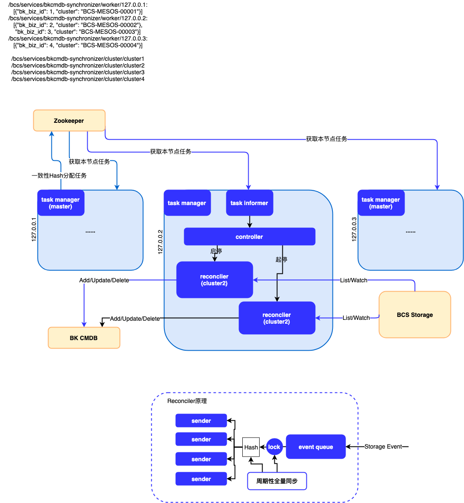

# bcs bkcmdb数据同步方案

## 背景

目前BCS容器数据未录入CMDB中，导致其它周边系统无法消费容器数据；为了开放BCS容器数据接口，需要进行以下扩展：

* 在bk cmdb 3.0框架内扩展container server，用于支持容器数据落地至cmdb内，开放容器数据接口

* 在BCS中扩展bcs-bkcmdb-synchronizer，对接bcs-storage，借助cmdb中container server的接口实现容器数据全量/差量同步

## 方案需求

* 利用bcs storage资源watch接口，实现Pod事件数据更新
* 周期性进行Pod数据全量同步
* 利用bk-paas cc接口动态获取需要同步的业务集群以及业务模块数据
* 每个实例负责部分集群数据同步任务
* 当实例扩所容的情况下，尽量少的改变各自负责的同步任务范围

## 方案结构



* 利用zk进行master选主，master节点的task manager负责从paas-cc获取所有集群的cmdb业务信息，采用一致性hash算法进行集群任务信息分发
* controller负责从task informer动态获取任务信息变化，启动和停止reconciler
* 每个reconciler负责同步单个集群的Pod数据
* reconciler原理
  * reconciler同时启动多个sender协程，根据Pod UUID的hash值将Pod事件分发到每个sender中，保证事件的顺序性
  * 采用一个互斥锁来控制storage Pod事件到Sender的过程，当reconciler进行数据全量同步时，storage Pod事件会暂存在event queue中，以保证全量同步数据与Pod事件数据的顺序

* 业务Pod通过set和module的annotations来进行cmdb模块关联
  * set.bkcmdb.bkbcs.tencent.com: 模块所属集群名
  * module.bkcmdb.bkbcs.tencent.com: 模块名
* 如果Pod中以上annotations没有同时匹配上，则默认进入Set: bkbcs, Module: bkbcs;
  * 要求业务主动在cmdb下建立名为bkbcs的Set和名为bkbcs的Module；


## 启动参数说明

示例：

```json
{
    "address": "127.0.0.1",
    "port": 8888,
    "metric_port": 9999,
    "v": 3,
    "zk": "127.0.0.1:2181",
    "storage_zk": "127.0.0.1:2181",
    "storage_ca": "./ca.cert",
    "storage_key": "./server.key",
    "storage_cert": "./server.cert",
    "cmdb_addr": "127.0.0.1",
    "cmdb_supplier_id": 0,
    "cmdb_user": "bcs",
    "paas_addr": "127.0.0.1",
    "paas_env": "test",
    "paas_cluster_env": "debug",
    "paas_app_code": "bcs",
    "paas_app_secret": "xxxxxxxxx"
}
```

* address: 服务监听的地址
* port: 服务监听的端口
* metric_port: metric服务监听端口
* v: 日志级别
* zk: 用于自身选主和服务发现的zookeeper地址
* storage_zk: 用于发现bcs-storage服务的地址
* storage_ca: bcs-storage的ca
* storage_key: bcs-storage的key
* storage_cert: bcs-storage的cert
* cmdb_addr: cmdb服务的访问地址
* cmdb_supplier_id: cmdb的supplierID
* cmdb_user: 用于cmdb访问的用户名
* paas_addr: bk-paas cc的访问地址
* paas_env: bk-paas cc服务所处的环境，可选[uat, prod]
* paas_cluster_env: bcs 集群的环境，可选[stag, debug, prod]
* paas_app_code: 用于bk-paas esb和apigateway访问的app code
* paas_app_secret: 用于bk-paas esb和apigateway访问的app secret
* cluster_pull_interval: 从paas cc获取全量信息的周期，默认为600，单位s
* full_sync_interval: reconciler进行全量同步的周期，默认为600，单位s

