# BSCP 快速上手

介绍通过在 BSCP 产品上传，管理配置；版本管理；灰度发布；并且使用init container和sidecar模拟消费数据等一整套流程

## 一. 创建服务
访问地址： https://bscp.{host}/ （默认进去无权限，可以切换业务申请)


新建服务
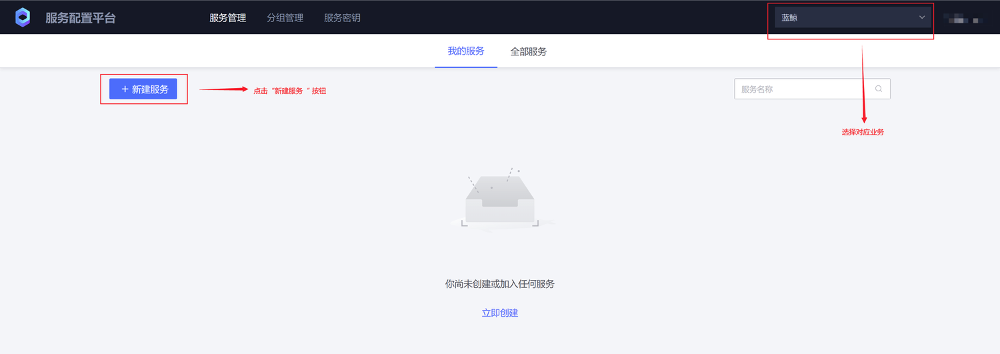

填写服务名称与描述，点击“提交”按钮


点击“新增配置项”按钮，开始创建配置文件


## 二. 生成服务配置版本
点击“新增配置项”按钮，开始创建配置文件
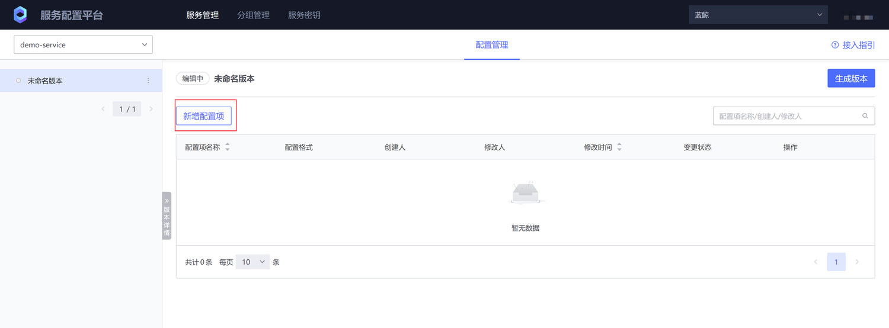

配置项名称为文件名，格式有文本文件与二进制文件可选择，指定文件权限与用户，这里的“配置路径”要填写文件路径，
在后面sidecar定义中会配置路径前缀，一起组合为文件的绝对路径，配置内容填写完就可以点击“保存”按钮


创建配置项后开始生成配置项版本
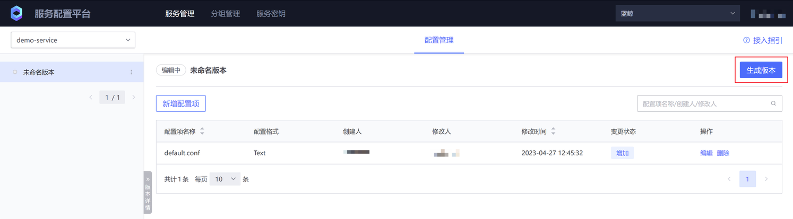

填写好版本名称与描述点击“确认”，完成版本生成
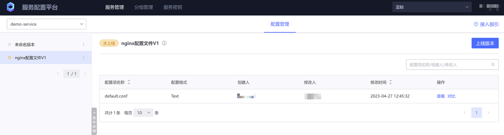

## 三. 为服务创建分组
分组一般用于配置灰度发布，要使用分组首先要在sidecar上配置标签，分组上线后，只有sidecar上的标签与分组标签匹配成功才会更新配置，分组可以配置服务可见范围，也可以设置为公共分组

如果业务没有灰度场景，本步骤可以忽略
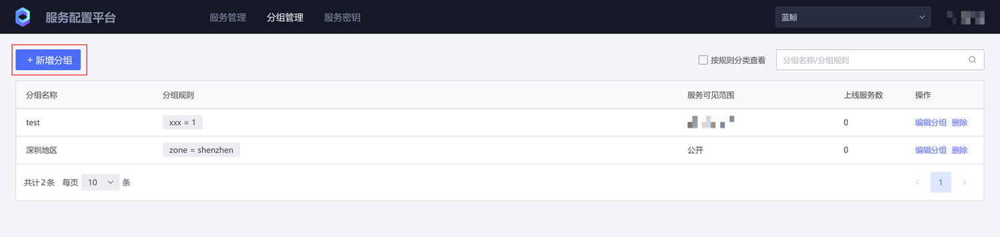

填写好分组信息后点击“提交”按钮，完成分组创建
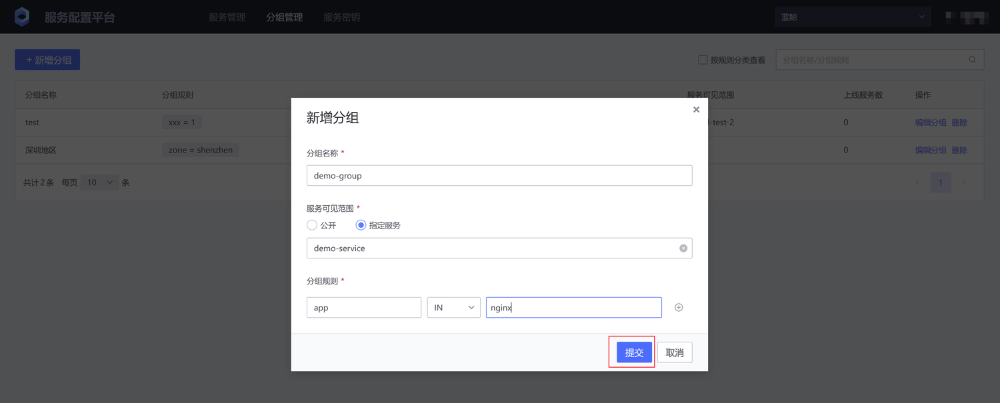

## 四. 创建服务密钥
填写好分组信息后点击“提交”按钮，完成分组创建
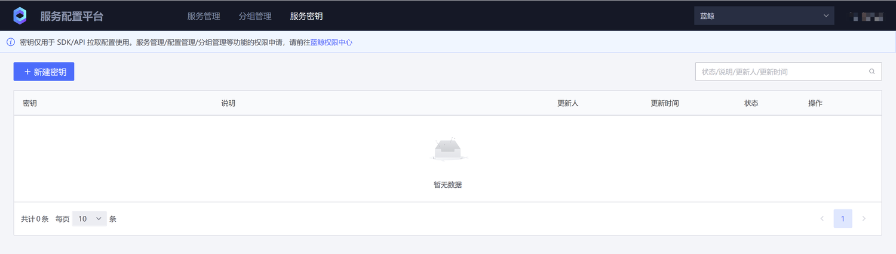

编辑密钥使用说明
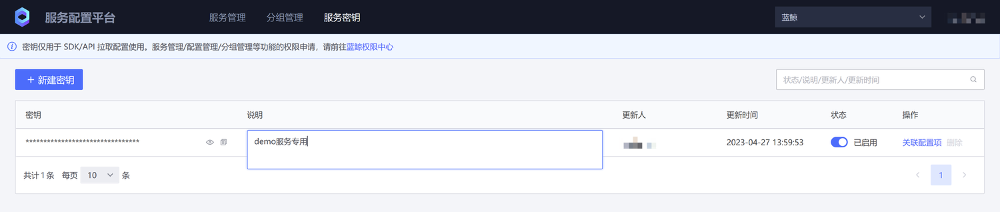

查看与复制密钥
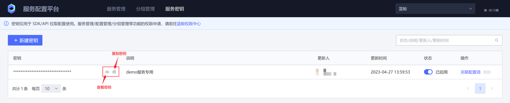

关联配置项功能可以给服务密钥绑定可拉取配置项范围，支持通配符，支持多条关联规则

例如：“\*\*” 代表可拉取业务下所有的配置项，“demo_service/\*\*“ 表可以拉取demo_service服务下的所有配置项，“demo_service/default.conf” 代表只有拉取 demo_service 服务下的 default.conf 配置项
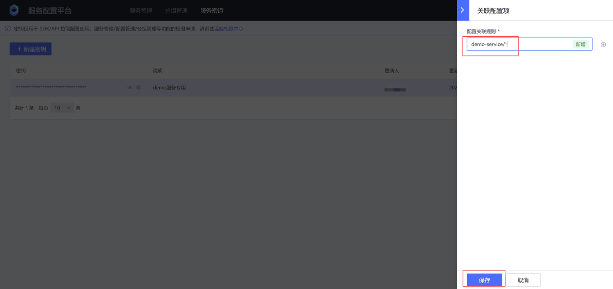

如果服务密钥被泄漏了或者不想用了，可以禁用或删除服务密钥
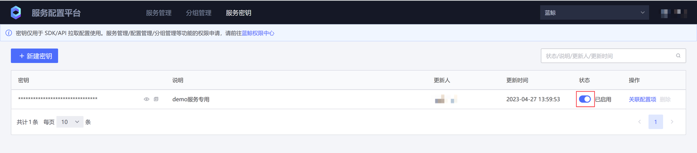


## 五. 配置sidecar
sidecar 里面的 feed_addrs 每个环境不一样，请联系当前部署的环境管理员获取

```yaml
apiVersion: apps/v1
kind: Deployment
metadata:
  name: test-listener
spec:
  selector:
    matchLabels:
      app: test-listener
  template:
    metadata:
      labels:
        app: test-listener
    spec:
      initContainers:
        # BSCP init 容器，负责第一次拉取配置文件到指定目录下
        - name: bscp-init
          image: {registry}/blueking/bscp-init:v1.0.0-alpha1
          env:
            # BSCP 业务 ID
            - name: biz
              value: "2"
            # BSCP 服务名称
            - name: app
              value: demo-service
            # BSCP 服务订阅地址
            - name: feed_addrs
              value: "{feed_addr}:31510"
            # 服务秘钥
            - name: token
              value: "{token}"
            # 实例标签
            - name: labels
              value: '{"zone":"ap-nanjing-3"}'
            # 配置文件临时目录，文件将下发到 {temp_dir}/files 目录下
            - name: temp_dir
              value: '/data/bscp'
          # 需要同时挂载文件临时目录到 init 容器，sidecar 容器，业务容器
          volumeMounts:
            - mountPath: /data/bscp
              name: bscp-temp-dir
      containers:
        # 业务容器
        - name: test-listener
          image: alpine
          command:
          - "/bin/sh"
          - "-c"
          - |
            apk add --no-cache inotify-tools
            echo "start watch ..."
            while true; do
            # 监听 /data/bscp/metadata.json 的写入事件
            inotifywait -m /data/bscp/metadata.json -e modify |
                while read path action file; do
                    # 递归遍历 /data/bscp/files 目录下的所有文件，输出其绝对路径
                    find /data/bscp/files
                done
            done
          resources:
            limits:
              memory: "128Mi"
              cpu: "500m"
          # 需要同时挂载文件临时目录到 init 容器，sidecar 容器，业务容器
          volumeMounts:
            - mountPath: /data/bscp
              name: bscp-temp-dir
        # BSCP sidecar 容器，负责监听版本变更时间，并更新临时目录下的配置文件，更新完成后向 metadata.json 写入事件
        - name: bscp-sidecar
          image: {registry}/blueking/bscp-sidecar:v1.0.0-alpha1
          env:
            # bscp-sidecar 容器的环境变量配置和 bscp-init 容器完全一致
            - name: biz
              value: "2"
            - name: app
              value: demo-service
            - name: feed_addrs
              value: "{feed_addr}:31510"
            - name: token
              value: "{token}"
            - name: labels
              value: '{"zone":"ap-nanjing-3"}'
            - name: temp_dir
              value: '/data/bscp'
          resources:
            limits:
              memory: "128Mi"
              cpu: "500m"
          volumeMounts:
            - mountPath: /data/bscp
              name: bscp-temp-dir
      volumes:
        - name: bscp-temp-dir
          emptyDir: {}

```
## 六. 上线服务配置版本

左侧选择对应的要上线的版本，点击“上线版本”


下一步选择全部分组上线即为全量发布，如果用户没有灰度需求，直接选择全部分组上线

或者选择分组上线，只有被分组选中的 sidecar 实例才会被发布

右侧为选中分组的版本预览，预览选中分组当前分处于哪个版本或者处于无版本状态


下一步点击 “对比并上线”，查看当前文件和历史版本文件之间的差异，如果是二进制文件则直接对比 sha256 值和文件大小


## 七. 检测文件是否下发成功
