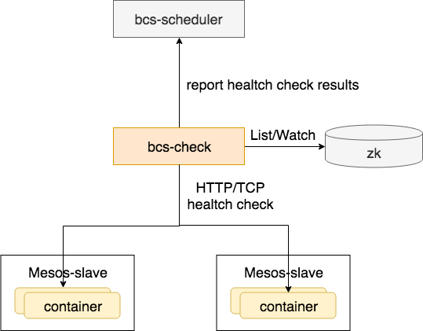

# bcs-check工作机制

bcs-check负责mesos集群容器的healtch check检查，支持：http，tcp。



## healtch check
如果在application的定义中定义了如下字段，则会触发bcs-check实现远程的http，tcp check。
```json
"healthChecks": [{
    "type": "REMOTE_HTTP|REMOTE_TCP",
    "delaySeconds": 10,
    "intervalSeconds": 60,
    "timeoutSeconds": 20,
    "consecutiveFailures": 3,
    "gracePeriodSeconds": 300,
    "command": {
        "value": ""
    },
    "http": {
        "port": 8080,
        "portName": "test-http",
        "scheme": "http|https",
        "path": "/check",
        "headers": {
            "key1": "value1",
            "key2": "value2"
        }
    },
    "tcp": {
        "port": 8090,
        "portName": "test-tcp"
    }
}]
```

### mesos scheduler根据检测机制直接远程执行检测

* 支持的类型为REMOTE_HTTP,REMOTE_TCP

### health check Type说明

* health check可以同时支持多种类型的check，目前最多为三种
* HTTP,TCP和COMMAND三种类型，最多只能同时支持一种
* REMOTE_HTTP,REMOTE_TCP两种类型可以同时支持

### **healthChecks 字段说明**

* type: 检测方式，目前支持HTTP,TCP,COMMAND,REMOTE_TCP和REMOTE_HTTP五种
* delaySeconds：容器启动之后到开始进行健康检测的等待时长(mesos协议中有,marathon协议中不支持,因为有gracePeriodSeconds,该参数好像意义不大,可能被废弃)
* intervalSeconds：前后两次执行健康监测的时间间隔.
* timeoutSeconds: 健康监测可允许的等待超时时间。在该段时间之后，不管收到什么样的响应，都被认为健康监测是失败的，**timeoutSeconds需要小于intervalSeconds**
* consecutiveFailures: 在一个不健康的任务被杀掉之前，连续的健康监测失败次数，如果值设为0，tasks如果不通过健康监测，则它不会被杀掉。进程被杀掉后scheduler根据application的restartpolicy来决定是否重新调度. marathon协议中为maxConsecutiveFailures
* gracePeriodSeconds：启动之后在该时段内健康监测失败会被忽略。或直到任务首次变成健康状态.
* command: type为COMMAND时有效
* value: 需要执行的命令,value中支持环境变量.mesos协议中区分是否shell,这里不做区分,如果为shell命令,需要包括"/bin/bash ‐c",系统不会自动添加(参考marathon)
* 后续可能需要补充其他参数如USER
* http: type为HTTP和REMOTE_HTTP时有效
* port: 检测的端口,如果配置为0,则该字段无效
* portName: 检测端口名字(替换marathon协议中的portIndex)
* portName在port配置大于0的情况下,该字段无效
* portName在port配置不大于0的情况下,检测的端口通过portName从ports配置中获取（scheduler处理）
* 根据portName获取端口的时候,需要根据不同的网络模型获取不同的端口，目前规则(和exportservice保持一致)如下：
* BRIDGE模式下如果HostPort大于零则为HostPort,否则为ContainerPort
* 其他模式为ContainerPort
* scheme： http和https(https不会做认证的处理)
* path：请求路径
* headers: http消息头，为了支持health check时，需要认证的方式，例如：Host: www.xxxx.com。NOTE:目前只支持REMOTE_HTTP。
* 检测方式:
*  Sends a GET request to scheme://<host>:port/path.
*  Note that host is not configurable and is resolved automatically, in most cases to 127.0.0.1.
*  Default executors treat return codes between 200 and 399 as success; custom executors may employ a different strategy, e.g. leveraging the `statuses` field.
*  bcs executor需要根据网络模式等情况再具体确认规则
* tcp： type为TCP和REMOTE_TCP的情况下有效：
* port: 检测的端口,如果配置为0,则该字段无效
* portName: 检测端口名字(替换marathon协议中的portIndex)
* protName在port配置大于0的情况下,该字段无效
* portName在port配置不大于0的情况下,检测的端口通过portName从ports配置中获取（scheduler处理）
* 根据portName获取端口的时候,需要根据不同的网络模型获取不同的端口，目前规则(和exportservice保持一致)如下：
* BRIDGE模式下如果HostPort大于零则为HostPort,否则为ContainerPort
* 其他模式为ContainerPort
* 检测方式： tcp连接成功即表示健康，需根据不同网络模型获取不同的地址