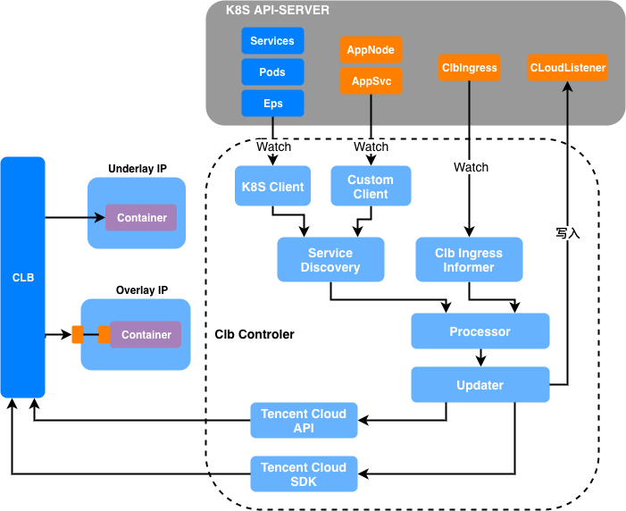
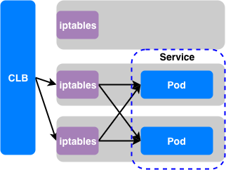
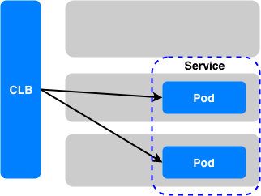
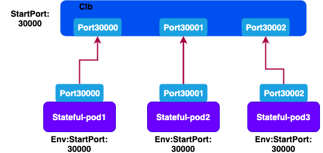

# CLB controller

## Introduction

clb controller根据服务发现结果，动态绑定clb到服务实例，从而实现集群流量的导入

* 通过自定义的clb ingress规则，可以支持腾讯云clb可设置的大部分参数
* 通过自定义的 appsvc 和 appnode crd资源，可以支持kubernetes以外的服务发现
* 支持clb直接转发到underlay IP容器，支持clb转发到服务的nodePort
* 周期性收敛后端服务信息变化，防止大面积容器漂移的时候引发的阻塞和抖动
* 支持statefulset映射端口段

## Design

clb-controller结构如下



### clb to node port



### clb to eni ip



## statefulset

实际业务可能存在如下场景：
有状态服务存在多个实例，每个实例都需要独立对外服务，在没有外网IP的情况下，只能通过不通端口来区分不同的服务实例。

为实现外网clb实例流量导入差异端口的statefulset中，BCS通过kube-apiserver监听statefulset
容器数据，自动将statefulset每个Pod独立的端口信息，一一映射到clb上，实现流量打通。



## 编译

```bash
# 编译clb-controller二进制
cd ${GOPATH}/src
make clb-controller
# 构建镜像
cd docker
docker build -t clb-controller:{{tag}} .
```

## 安装部署

### 通过helm客户端安装（不安装Tiller）

#### 1. 下载安装helm客户端

#### 2. 创建namespace，假设想安装在“clb”这个namespace

```bash
kubectl create namespace clb
```

#### 2. 安装clb-controller-init

```bash
helm template ./clb-controller-init --name clb-controlle-init --namespace clb
```

#### 3. 安装clb-controller

先编辑values.yaml中的字段值，具体字段说明见 [clb-controller helm values说明](./deploy/helm/clb-controller/values.yaml)

```bash
helm template ./clb-controller --name clb-controller --namespace clb
```

### kubernetes

#### 1. 前置安装

* 安装kubernetes1.12

#### 2. 创建crds资源

* 需要创建的crds配置文件在路径[crds路径](./config/crds)
* kubectl apply -f clb_v1_clbingress.yaml
* kubectl apply -f mesh_v1_appnode.yaml
* kubectl apply -f mesh_v1_appsvc.yaml
* kubectl apply -f network_v1_cloudlistener.yaml

#### 3. 生成部署clb-controller yaml文件

* 进入deploy目录 [deploy目录](./deploy/k8s)
* 填写generate_yaml.sh中的变量

```bash
# clb-controller的镜像地址和tag
CLB_CTRL_IMAGE=''
# clb-controller的metric端口
CLB_CTRL_METRIC_PORT=''
# clb-controller使用的服务发现的机制可选[kubernetes, custom]
# kubernetes: 从k8s核心数据进行服务发现
# custom: 从k8s的crd进行服务发现
CLB_CTRL_REGISTRY=''
# 后端容器使用的ip地址类型，可选[underlay, overlay]
# underlay表示容器使用与物理机同一层的IP地址，clb会直接转发到容器ip
# overlay表示容器使用overlay网络，clb会转发到相应service节点的nodePort上
CLB_CTRL_BACKEND_IP_TYPE=''
# 绑定的clb的名字，如果clb实例不存在，则clb-controller会使用该名字创建一个新实例
CLB_NAME=''
# clb的网络类型，可选[public, private]
CLB_NET_TYPE=''
# clb-controller的实现方式，可选[api, sdk]
# api表示使用腾讯云2017版负载均衡api接口
# sdk表示使用腾讯云sdk3.0
CLB_IMPLEMENT=''
# 在调用腾讯云api时，可以选择通过CVM实例id来绑定clb，也可以通过弹性网卡ip地址来绑定clb
# 参数可选[cvm, eni]
# 当CLB_IMPLEMENT='api'时，CLB_BACKENDMODE支持eni方式（需要开启测试白名单），以及cvm方式
# 当CLB_IMPLEMENT='sdk'时，CLB_BACKENDMODE只支持cvm方式
CLB_BACKENDMODE=''
# clb所处的 region，如[api-shanghai]
CLB_REGION=''
# 腾讯云账号对应的 secret id
CLB_SECRETID=''
# 腾讯云账号对应的 secret key
CLB_SECRETKEY=''
# 腾讯云账号对应的 project id
CLB_PROJECTID=''
# 后端cvm实例所处的 vpc id
CLB_VPCID=''
# private 型 clb 使用的 ip 地址所属的子网 id
CLB_SUBNET=''
```

* ./generate_yaml.sh > {clbc-controller文件名}.yaml

#### 4. 应用clb-controller

* kubectl apply -f {clbc-controller文件名}.yaml

## 用户操作

### 起步

下面我们用一个 http 服务的例子来说明如果使用 clbingress 将 kubernetes service 关联到clb上；

假设我们设置参数如下：
```yaml
CLB_NAME: test-clb
CLB_CTRL_BACKEND_IP_TYPE: overlay
CLB_NET_TYPE: private
CLB_IMPLEMENT: api
CLB_BACKENDMODE: cvm
```

同时k8s使用flannel构建的overlay网络，所以我们需要为接入clb的后端服务创建NodePort类型的Service

#### 创建deployment和Service

我们正常创建一个

```yaml
apiVersion: apps/v1
kind: Deployment
metadata:
  name: http-test
  namespace: test
  labels:
    app: http-test
spec:
  replicas: 3
  selector:
    matchLabels:
      app: http-test
  template:
    metadata:
      labels:
        app: http-test
    spec:
      imagePullSecrets:
      - name: docker-secret
      containers:
      - name: c1
        image: centos:latest
        command: 
        - python
        args:
        - -m
        - SimpleHTTPServer
        - "8000"
        ports:
        - containerPort: 8000
---
apiVersion: v1
kind: Service
metadata:
  name: http-test
  namespace: test
  labels:
    app: http-test
spec:
  type: NodePort
  ports:
  - protocol: TCP
    port: 18001
    targetPort: 8000
    name: http-test
  selector:
    app: http-test
```

#### 创建clbingress

clbingress.yaml

```yaml
apiVersion: clb.bmsf.tencent.com/v1
kind: ClbIngress
metadata:
  labels:
    # 通过此label来关联具体的clb-controller实例
    bmsf.tencent.com/clbname: test-clb
  name: clbingress-http-test
spec:
  http:
  - host: www.qq.com
    path: /
    serviceName: http-test
    namespace: test
    clbPort: 18001
    servicePort: 18001
```

运行如下指令后，几秒钟后，我们就可以在腾讯云控制台的clb实例中看到，新建了一个名为http18001的监听器。
该监听器转发到了http-test应用实例所在主机的IP地址上，且端口是k8s为http-test服务自动分配的NodePort端口
```bash
kubectl apply -f clbingress.yaml
```

当后端容器发生扩缩容或者时漂移时，clb-controller会自动将变化的后的IP+Port更新到clb的监听器上面

### 详细参数解释

```yaml
apiVersion: clb.bmsf.tencent.com/v1
kind: ClbIngress
metadata:
  labels:
    bmsf.tencent.com/clbname: test-clb
  name: clbingress-test
spec:
  # 设置tcp监听器
  tcp:
  - serviceName: tcp-test # k8s中定义的Service的名字
    namespace: test # k8s中定义的Service的命名空间
    clbPort: 18002 # tcp监听器在clb上监听的端口 1～65535
    servicePort: 18002 # k8s中定义的ServicePort的端口（非NodePort）
    sessionTime: 90 # 会话保持时间，单位：秒。可选值：30~3600，默认 0，表示不开启
    lbPolicy: # 设置负载均衡策略
      strategy: least_conn # 负载均衡策略，可选[wrr, least_conn]
    # 设置健康检查策略，默认开启，timeout默认2（单位：秒），intervalTime默认3（单位：秒），timeout必须小于intervalTime，healthNum默认3（单位：次），unhealthNum默认3（单位：次）
    healthCheck: 
      enabled: true # 是否开启健康检查， true（开启），false（关闭）
      timeout: 50 # 健康检查的响应超时时间，可选值：2~60，默认值：2，单位：秒。响应超时时间要小于检查间隔时间。
      intervalTime: 150 # 健康检查探测间隔时间，默认值：5，可选值：5~300，单位：秒。
      healthNum: 5 # 健康阈值，默认值：3，表示当连续探测三次健康则表示该转发正常，可选值：2~10，单位：次。
      unHealthNum: 5 # 不健康阈值，默认值：3，表示当连续探测三次不健康则表示该转发异常，可选值：2~10，单位：次。
  # 设置udp监听器，字段含义同tcp监听器
  udp:
  - serviceName: udp-test
    namespace: test
    clbPort: 18003
    servicePort: 18003
    sessionTime: 90
    lbPolicy:
      strategy: wrr
    healthCheck:
      enabled: true
      timeout: 50
      intervalTime: 150
      healthNum: 5
      unHealthNum: 5
  # 设置http监听器
  http:
  - host: www.qq.com # http监听器转发规则的域名
    path: / # http监听器转发规则的url
    serviceName: http-test # k8s中定义的Service的名字
    namespace: test # k8s中定义的Service的命名空间
    clbPort: 18004 # http监听器在clb上监听的端口 1～65535
    servicePort: 18004 # k8s中定义的ServicePort的端口（非NodePort）
    sessionTime: 90 # 会话保持时间，单位：秒。可选值：30~3600，默认 0，表示不开启
    lbPolicy:
      strategy: wrr # 负载均衡策略，可选[wrr, least_conn, ip_hash]
    healthCheck:
      enabled: true
      timeout: 50
      intervalTime: 150
      healthNum: 5
      unHealthNum: 5
      # 应用型负载均衡监听器转发规则的健康状态码。可选值：1~31，默认31。
      # 1表示探测后返回值 1xx 表示健康，2表示返回 2xx 表示健康，4表示返回 3xx 表示健康，8表示返回 4xx 表示健康，16表示返回 5xx 表示健康。
      # 若希望多种码都表示健康，则将相应的值相加。
      httpCode: 31
      #  应用型负载均衡监听器转发规则的探测路径，默认/，必须以/开头。长度限制为：1 - 80，可用的字符包括字母、数字、‘_’、‘-’、‘.’、‘=’、‘？’、‘/’。
      httpCheckPath: /list
  
  https:
  - host: clbtest.lol.qq.com
    path: /
    serviceName: https-test
    namespace: test
    clbPort: 18004
    servicePort: 18004
    healthCheck: ...
    tls:
      # HTTPS 协议的认证类型，unidirectional：单向认证，mutual：双向认证
      mode: unidirectional
      # 在腾讯云控制台创建的服务端证书的 ID，HTTPS 监听器如果不填写此项则必须上传证书，包括 certServerContent，certServerKey，certServerName。
      certId: xxxxxx
      # certId为空时，必填
      certServerName: xxxxx
      # certId为空时，必填
      certServerKey: xxxx
      # certId为空时，必填
      certServerContent: xxxx
      # 客户端证书的 ID，如果 mode=mutual，监听器如果不填写此项则必须上传客户端证书，包括 certClientCaName，certCilentCaContent
      certCaId: xxxx
      # 当mode=mutual且certId为空时，必填
      certClientCaName: xxxx
      # 当mode=mutual且certId为空时，必填
      certCilentCaContent: xxxx
  
  # Statefulset方案支持
  statefulset:
    tcp:
    - serviceName: tcp-test
      namespace: test
      # clb实际监听的端口段为 [startPort+startIndex, startPort+endIndex]
      # 端口映射的启动端口
      startPort: 3000
      # 当前clb实例管理的启动端口段起始位置
      startIndex: 0
      # 当前clb实例管理的映射端口段结束位置
      endIndex: 100
      sessionTime: 90
      lbPolicy:
        strategy: wrr
      healthCheck:
        enabled: true
        timeout: 50
        intervalTime: 150
        healthNum: 5
        unHealthNum: 5
    udp:
    - serviceName: udp-test
      namespace: test
      startPort: 40000
      startIndex: 100
      endIndex: 200
      ...
    http:
    - ...
      startPort: 40000
      startIndex: 100
      endIndex: 200
      ...
    https:
    - ...
      startPort: 40000
      startIndex: 100
      endIndex: 200
      ...
```

**PS**: 更多参数解释请查看[腾讯云官网文档中心](https://cloud.tencent.com/document/product)
