# Welcome to bcs-client handbook #

**bcs-client** is a client of Blueking Container Service.  

## Commands and usages ##

- [Welcome to bcs-client handbook](#welcome-to-bcs-client-handbook)
  - [Commands and usages](#commands-and-usages)
  - [create](#create)
    - [create application](#create-application)
    - [create deployment](#create-deployment)
    - [create-service](#create-service)
    - [create-secret](#create-secret)
    - [create-configmap](#create-configmap)
  - [update](#update)
    - [update application](#update-application)
    - [update deployment](#update-deployment)
  - [delete](#delete)
    - [delete application](#delete-application)
    - [delete deployment](#delete-deployment)
  - [scale](#scale)
    - [scale application](#scale-application)
  - [rollback](#rollback)
    - [rollback applications](#rollback-applications)
  - [list](#list)
    - [list application](#list-application)
    - [list deployment](#list-deployment)
    - [list taskgroup](#list-taskgroup)
    - [list service](#list-service)
    - [list secret](#list-secret)
    - [list configmap](#list-configmap)
  - [inspect](#inspect)
    - [inspect application](#inspect-application)
    - [inspect deployment](#inspect-deployment)
    - [inspect taskgroup](#inspect-taskgroup)
    - [inspect service](#inspect-service)
    - [inspect secret](#inspect-secret)
    - [inspect configmap](#inspect-configmap)
  - [metric](#metric)
    - [upsert/update metric](#upsertupdate-metric)
    - [list/inspect metric](#listinspect-metric)
    - [delete metric](#delete-metric)
  - [cancel](#cancel)
    - [cancel deployment](#cancel-deployment)
      - [cancel deployment update](#cancel-deployment-update)
  - [pause](#pause)
    - [pause deployment](#pause-deployment)
  - [resume](#resume)
    - [resume deployment](#resume-deployment)
  - [reschedule](#reschedule)
    - [reschedule taskgroup by name](#reschedule-taskgroup-by-name)
    - [reschedule taskgroup by ip](#reschedule-taskgroup-by-ip)
  - [export](#export)
    - [export env](#export-env)
  - [env](#env)
    - [show env](#show-env)
  - [template](#template)
    - [template configmap](#template-configmap)
  - [enable](#enable)
    - [enable agent](#enable-agent)
  - [disable](#disable)
    - [disable agent](#disable-agent)
  - [offer](#offer)
  - [as](#as)
    - [list as](#list-as)
    - [update/set as](#updateset-as)
    - [delete as](#delete-as)
  - [help](#help)
  - [apply](#apply)
  - [clean](#clean)


## create ##

DESCRIPTION: Command *create* can be used to create and run new application.

USAGE:

	bcs-client create [command options] [arguments...]

OPTIONS:

| flag        | necessary | type   | description                              |
| ----------- | --------- | ------ | ---------------------------------------- |
| --from-file | Y         | string | Create with configuration FILE           |
| --type      | Y         | string | Create type, value can be app/service/secret/configmap/deployment |

SCREENSHOT:

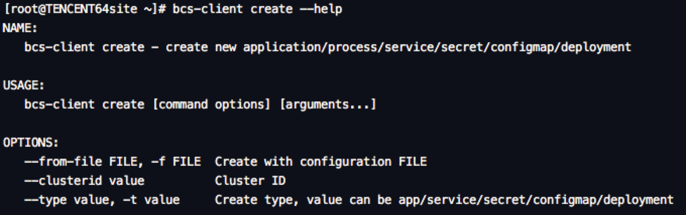

### create application ###

EXAMPLE:

	bcs-client create --from-file appCreate.json --type app

appCreate.json

``` json
{
  "apiVersion": "v4",
  "kind": "application",
  "restartPolicy": {
    "policy": "Never",
    "interval": 5,
    "backoff": 10
  },
  "killPolicy": {
    "gracePeriod": 5
  },
  "constraint": {
    "IntersectionItem": []
  },
  "metadata": {
    "annotations": {},
    "labels": {
      "podname": "app-test"
    },
    "name": "app-test",
    "namespace": "defaultGroup"
  },
  "spec": {
    "instance": 1,
    "template": {
      "spec": {
        "containers": [
          {
            "command": "/test/start.sh",
            "args": [
              "8899"
            ],
            "parameters": [],
            "type": "MESOS",
            "env": [
            ],
            "image": "centos:latest",
            "imagePullPolicy": "Always",
            "privileged": false,
            "ports": [
              {
                "containerPort": 8899,
                "name": "test-port",
                "protocol": "HTTP"
              }
            ],
            "healthChecks": [
            ],
            "resources": {
              "limits": {
                "cpu": "0.1",
                "memory": "50"
              }
            },
            "volumes": [
            ],
            "secrets": [],
            "configmaps": []
          }
        ],
        "networkMode": "BRIDGE",
        "networkType": "BRIDGE"
      }
    }
  }
}
```
json details:

| key           | necessary | type   | description                    |
| ------------- | --------- | ------ | ------------------------------ |
| apiVersion    | Y         | string | api version                    |
| kind          | Y         | string | request type                   |
| killPolicy    | N         | object | kill policy                    |
| restartPolicy | N         | object | restart policy                 |
| constraint    | N         | object | scheduling strategy constraint |
| metadata      | Y         | object | metadata                       |
| spec          | Y         | object | pod specification              |

metadata

| key         | necessary | type   | description              |
| ----------- | --------- | ------ | ------------------------ |
| annotations | N         | object | annotation               |
| labels      | Y         | string | labels, defined by users |
| name        | Y         | string | application name         |
| namespace   | Y         | string | namespace                |

spec

| key      | necessary | type   | description         |
| -------- | --------- | ------ | ------------------- |
| instance | Y         | int    | instances to be run |
| template | Y         | object | template details    |

spec.template

| key      | necessary | type   | description             |
| -------- | --------- | ------ | ----------------------- |
| metadata | Y         | object | metadata                |
| spec     | Y         | object | container specification |


spec.template.metadata

| key    | necessary | type   | description      |
| ------ | --------- | ------ | ---------------- |
| labels | N         | object | pod labels       |
| name   | Y         | string | application name |

spec.template.spec

| key         | necessary | type   | description                  |
| ----------- | --------- | ------ | ---------------------------- |
| containers  | Y         | array  | containers details           |
| networkMode | N         | string | "flannel", "srv" or "calico" |
| volumes     | N         | array  | volumes                      |

spec.template.spec.containers

| key          | necessary | type   | description                              |
| ------------ | --------- | ------ | ---------------------------------------- |
| command      | N         | string | container start command                  |
| arguments    | N         | array  | arguments for start command              |
| parameters   | N         | array  | parameters for docker cli                |
| type         | Y         | string | mesos container type, "MESOS" or "DOCKER" |
| env          | N         | array  | container environmental variables        |
| image        | Y         | string | image to be run                          |
| name         | Y         | string | container name                           |
| network      | N         | string | network, "NONE", "HOST", "BRIDGE" or "USER" |
| ports        | N         | array  | ports                                    |
| resources    | Y         | object | resource limits of container             |
| volumeMounts | N         | array  | volume to mount                          |

spec.template.spec.env

| key   | necessary | type   | description                     |
| ----- | --------- | ------ | ------------------------------- |
| name  | N         | string | name of environmental variable  |
| value | N         | string | value of environmental variable |

spec.template.spec.ports

| key           | necessary | type   | description                          |
| ------------- | --------- | ------ | ------------------------------------ |
| containerPort | N         | int    | container port                       |
| name          | N         | string | port name                            |
| protocol      | N         | string | net protocol, "TCP", "UDP" or "HTTP" |

spec.template.spec.resources

| key                     | necessary | type   | description     |
| ----------------------- | --------- | ------ | --------------- |
| limits                  | Y         | object | resource limits |
| cpu (within limits)     | Y         | string | cpu limit       |
| memory (within limits)  | Y         | string | mem limit       |
| storage (within limits) | Y         | string | disk limit      |

spec.template.spec.volumes

| key    | necessary | type   | description          |
| ------ | --------- | ------ | -------------------- |
| name   | N         | string | volume name          |
| secret | N         | object | secret specification |

spec.template.spec.secret

| key                 | necessary | type   | description      |
| ------------------- | --------- | ------ | ---------------- |
| secretName          | N         | string | secret name      |
| items               | N         | array  | secret items     |
| type (within items) | N         | int    | secret type      |
| name (within items) | N         | string | secret item name |
| path (within items) | N         | string | secret item path |

spec.template.spec.healthChecks

| key                 | necessary | type   | description |
| ------------------- | --------- | ------ | ----------- |
| protocol            | Y         | string |             |
| path                | Y         | string |             |
| delaySeconds        | Y         | string |             |
| gracePeriodSeconds  | Y         | string |             |
| intervalSeconds     | Y         | string |             |
| timeoutSeconds      | Y         | string |             |
| consecutiveFailures | Y         | string |             |

SCREENSHOT:

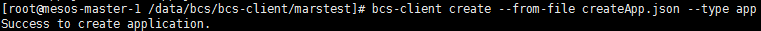

### create deployment ###

EXAMPLE:

	bcs-client create --from-file deploymentcreate.json --type deployment

deploymentcreate.json

``` json
{
  "apiVersion": "v4",
  "kind": "deployment",
  "metadata": {
    "labels": {
      "podname": "deployment-test"
    },
    "name": "deployment-test",
    "namespace": "defaultGroup"
  },
  "restartPolicy": {
    "policy": "Always",
    "interval": 5,
    "backoff": 10
  },
  "constraint": {
    "IntersectionItem": [
    ]
  },
  "spec": {
    "instance": 2,
    "selector": {
      "podname": "app-test"
    },
    "template": {
      "metadata": {
        "labels": {
        },
        "name": "deployment-test",
        "namespace": "defaultGroup"
      },
      "spec": {
        "containers": [
          {
            "command": "/test/start.sh",
            "args": [
              "8899"
            ],
            "parameters": [],
            "type": "MESOS",
            "env": [
            ],
            "image": "centos:latest",
            "imagePullPolicy": "Always",
            "privileged": false,
            "ports": [
              {
                "containerPort": 8899,
                "name": "test-port",
                "protocol": "HTTP"
              }
            ],
            "healthChecks": [
            ],
            "resources": {
              "limits": {
                "cpu": "0.1",
                "memory": "50"
              }
            },
            "volumes": [],
            "secrets": [],
            "configmaps": []
          }
        ],
        "networkMode": "BRIDGE",
        "networkType": "BRIDGE"
      }
    },
    "strategy": {
      "type": "RollingUpdate",
      "rollingupdate": {
        "maxUnavilable": 1,
        "maxSurge": 1,
        "upgradeDuration": 60,
        "rollingOrder": "CreateFirst"
      }
    }
  }
}
```

json details:

kindkey为deploeyment，其余key同create application，且在其基础上添加strategykey

spec.strategy

| key           | necessary | type   | description              |
| ------------- | --------- | ------ | ------------------------ |
| type          | Y         | string | deploy strategy          |
| rollingupdate | Y         | object | rollingupdate parameters |

spec.strategy.rollingupdate

| key             | necessary | type   | description |
| --------------- | --------- | ------ | ----------- |
| maxUnavilable   | Y         | int    |             |
| maxSurge        | Y         | int    |             |
| upgradeDuration | Y         | int    |             |
| autoUpgrade     | Y         | bool   |             |
| rollingOrder    | Y         | string |             |
| pause           | Y         | bool   |             |


SCREENSHOT:

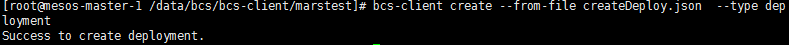


### create-service ###
EXAMPLE:

	bcs-client create --type service --from-file createService.json

createService.json

```json
{
  "apiVersion": "v4",
  "kind": "service",
  "metadata": {
    "name": "service-test",
    "namespace": "defaultGroup",
    "labels": {
      "BCSGROUP": "external"
    }
  },
  "spec": {
    "selector": {
      "podname": "app-test"
    },
    "ports": [
      {
        "name": "test-port",
        "protocol": "tcp",
        "servicePort": 8889
      }
    ]
  }
}
```

json

| key        | necessary | type   | description                              |
| ---------- | --------- | ------ | ---------------------------------------- |
| apiVersion | Y         | string | api version                              |
| kind       | Y         | string | request kind (here is service)           |
| metadata   | Y         | object | the metadata of service                  |
| spec       | Y         | oject  | the specified information about the service |

metadata

| key       | necessary | type      | description                            |
| --------- | --------- | --------- | -------------------------------------- |
| name      | Y         | string    | application name                       |
| namespace | Y         | string    | the namespace that application belongs |
| labels    | Y         | key-value | service labels                         |

spec

| key       | necessary | type     | description      |
| --------- | --------- | -------- | ---------------- |
| selector  | Y         | string   | service selector |
| type      | Y         | string   | service type     |
| clusterIP | Y         | string   | point to proxyIP |
| ports     | Y         | object[] | service ports    |


spec.ports[i]

| key         | necessary | type   | description                              |
| ----------- | --------- | ------ | ---------------------------------------- |
| name        | Y         | string | name of taskgroup portskey               |
| domainName  | Y         | string | for trans via http                       |
| servicePort | Y         | int    | for loadbalance and service              |
| targetPort  | Y         | int    | port of taskgroup portskey, point to containerPort or hostPort |
| nodePort    | Y         | int    |                                          |


SCREENSHOT:


### create-secret ###
EXAMPLE:

	bcs-client create --type secret --from-file createSecret.json

createService.json

```json
{
  "apiVersion": "v4",
  "kind": "secret",
  "metadata": {
    "name": "secret-test",
    "namespace": "defaultGroup",
    "labels": {}
  },
  "type": "",
  "datas": {
    "secret-subkey": {
      "path": "ECRET_ENV_TEST",
      "content": "Y29uZmlnIGNvbnRleHQ="
    }
  }
}
```
json

| key        | necessary | type   | description                              |
| ---------- | --------- | ------ | ---------------------------------------- |
| apiVersion | Y         | string | api version                              |
| kind       | Y         | string | request kind (here is secret)            |
| metadata   | Y         | object | the metadata of secret                   |
| datas      | Y         | oject  | the specified information about the secret |

metadata

| key       | necessary | type      | description                            |
| --------- | --------- | --------- | -------------------------------------- |
| name      | Y         | string    | application name                       |
| namespace | Y         | string    | the namespace that application belongs |
| labels    | Y         | key-value | service labels                         |

SCREENSHOT:

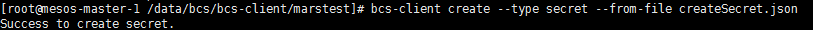


### create-configmap ###
EXAMPLE:

	bcs-client create --type configmap --from-file createConfigmap.json

createConfigmap.json

```json
{
  "apiVersion": "v4",
  "kind": "configmap",
  "metadata": {
    "name": "configmap-test",
    "namespace": "defaultGroup",
    "labels": {
    }
  },
  "datas": {
    "item-one": {
      "type": "file",
      "content": "Y29uZmlnIGNvbnRleHQ="
    },
    "item-two": {
      "type": "file",
      "content": "Y29uZmlnIGNvbnRleHQ="
    }
  }
}

```

SCREENSHOT:


<span id="update"></span>

## update ##

DESCRIPTION: Command *update* can be used to update application/service/secret/configmap/deployment.

USAGE:

	bcs-client update [command options] [arguments...]

OPTIONS:

| key         | necessary | type key | description                      |
| ----------- | --------- | -------- | -------------------------------- |
| --from-file | Y         | string   | update with configuration FILE   |
| --type      | Y         | string   | update type                      |
| --instance  | Y         | int      | Instances to update (default: 1) |

SCREENSHOT:

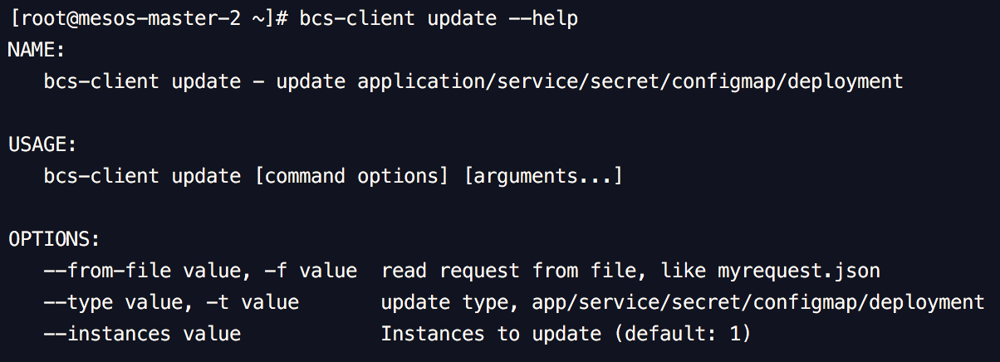


### update application ###

EXAMPLE:

	bcs-client update --type app --instances 3 --from-file updateApp.json

updateApp.json

jsonkey与create application相同

SCREENSHOT:

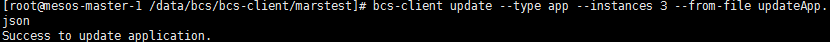


### update deployment ###

EXAMPLE:
​
	bcs-client update --type deployment --instances 3 --from-file updateDeployment.json

updateDeployment.json

jsonkey与create deployment相同

SCREENSHOT:

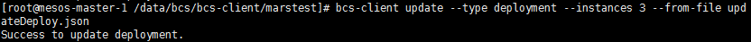


## delete ##

DESCRIPTION: Command *delete* can be used to delete applications or deployment.

USAGE:

	bcs-client delete [command options]

OPTIONS:

| key         | necessary | type   | description                         |
| ----------- | --------- | ------ | ----------------------------------- |
| --type      | Y         | string | Delete type, app/deployment         |
| --name      | Y         | string | Application name                    |
| --enforce   | N         | int    | force to delete (default: 0)        |
| --namespace | N         | string | Namespace (default: "defaultGroup") |

SCREENSHOT:
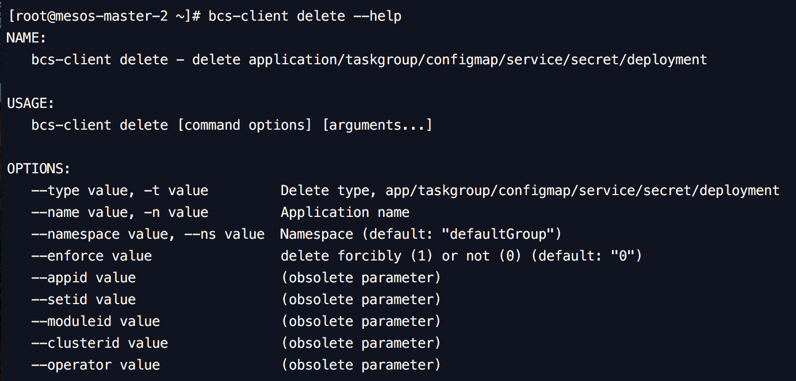

### delete application ###

EXAMPLE:

	bcs-client delete --type app --name test --namespace testns --enforce 1

SCREENSHOT:

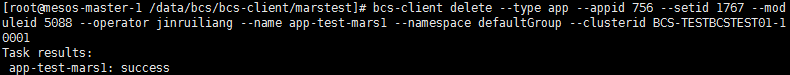


### delete deployment ###

EXAMPLE:

	bcs-client delete --type deployment --name deployment-test-007 --namespace defaultGroup --clusterid BCS-TESTBCSTEST01-10001

SCREENSHOT:

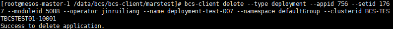


<span id="scale"></span>

## scale ##

DESCRIPTION: Command *scale* can be used to scale down or scale up applications.

USAGE:

	bcs-client scale [command options]

OPTIONS:

| key         | necessary | type   | description                         |
| ----------- | --------- | ------ | ----------------------------------- |
| --name      | Y         | string | Application name                    |
| --namespace | N         | string | Namespace (default: "defaultGroup") |
| --instance  | Y         | int    | Instances to be run                 |

SCREENSHOT:

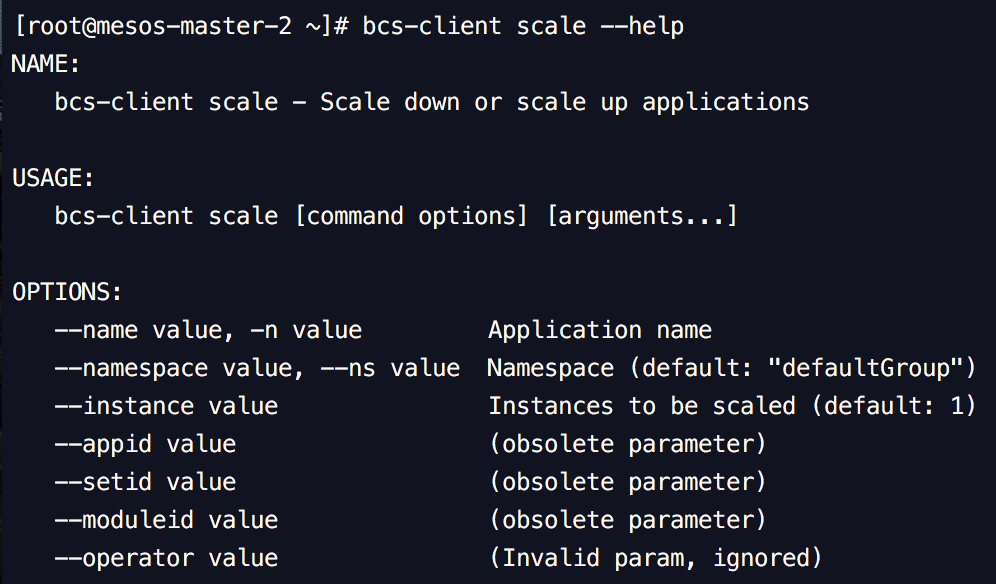

### scale application ###

EXAMPLE:

	bcs-client scale --name ccapi --namespace bcs --instance 2

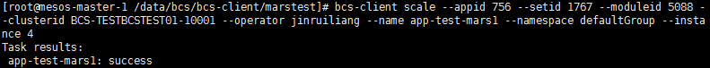


## rollback ##

DESCRIPTION: Command *rollback* can make applications rollback to last version.

USAGE:

	bcs-client rollback [command options]

OPTIONS:

| key         | necessary | type   | description                            |
| ----------- | --------- | ------ | -------------------------------------- |
| --from-file | N         | string | Rollback with configuration FILE       |
| --appid     | Y         | string | application ID                         |
| --setid     | N         | string | zone ID defined by CC (default: "0")   |
| --moduleid  | N         | string | module ID defined by CC (default: "0") |
| --operator  | N         | string | operator (default: "default")          |
| --name      | Y         | string | Application name                       |
| --namespace | N         | string | Namespace (default: "defaultGroup")    |

- rollback applications with configuration file

SCREENSHOT:

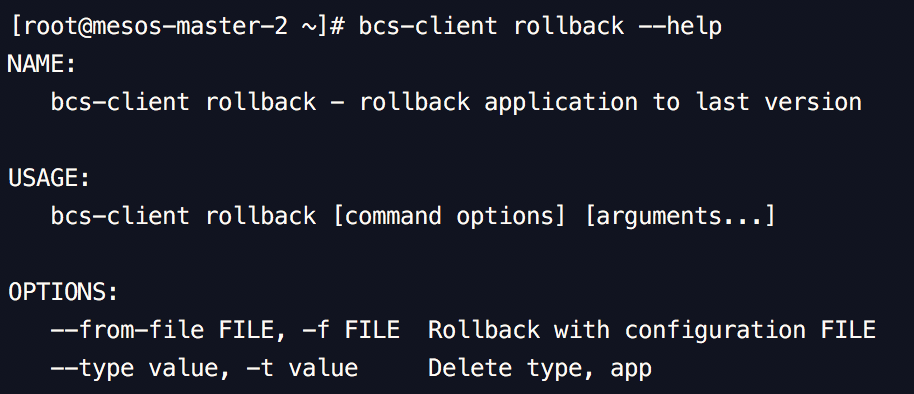


### rollback applications ###

EXAMPLE:

	bcs-client rollback --type app --from-file test-app.json

myrollback.json

``` json
{
  "appid":"312",
  "user":"jinrui",
  "item":[
    {
      "name":"ccapi",
      "namespace":"bcs",
      "setid":"1764",
      "moduleid":"5082",
    }
  ]
}
```

SCREENSHOT:

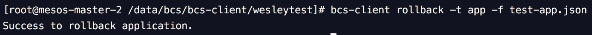

## list ##

DESCRIPTION: Command *list* can show information of applications, tasks, taskgroups , versions.or deployment

USAGE:

	bcs-client list [command options]

OPTIONS:

| key         | necessary | type   | description                              |
| ----------- | --------- | ------ | ---------------------------------------- |
| --type      | Y         | string | List type, app/task/taskgroup/version/deployment |
| --clusterid | Y         | string | Cluster ID                               |
| —namespace  | Y         | string | Namespace                                |

SCREENSHOT:

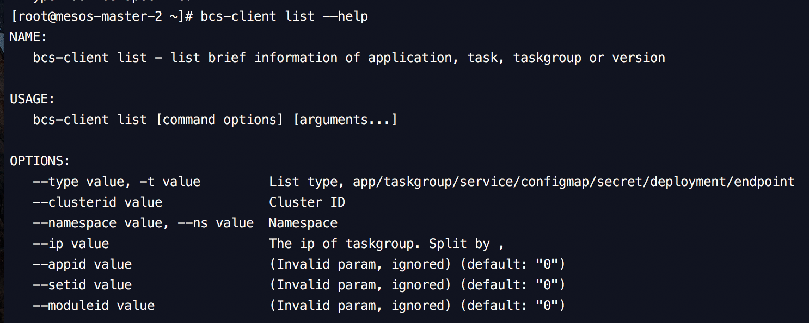


### list application ###

EXAMPLE:

	bcs-client list --type app --namespace wesley-test --clusterid BCS-TESTBCSTEST01-10001

SCREENSHOT:

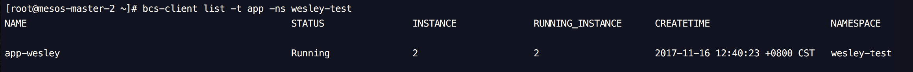

### list deployment ###
EXAMPLE:

	bcs-client list --type deployment -ns uri_group --clusterid BCS-TESTBCSTEST01-10001

SCREENSHOT:

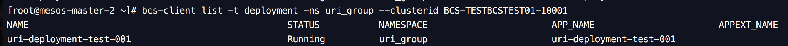

### list taskgroup ###
EXAMPLE:

	bcs-client list --type taskgroup -ns wesley-test --clusterid BCS-TESTBCSTEST01-10001

SCREENSHOT:

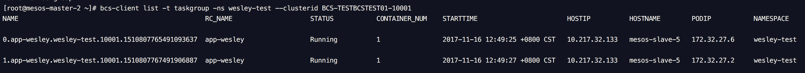

### list service ###
EXAMPLE:

	bcs-client list --type service -ns bergtest --clusterid BCS-TESTBCSTEST01-10001
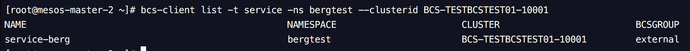


### list secret ###
EXAMPLE:

	bcs-client list --type secret -ns defaultGroup --clusterid BCS-TESTBCSTEST01-10001

SCREENSHOT:

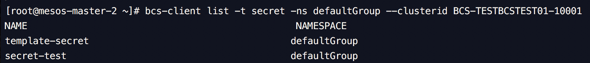

### list configmap ###
EXAMPLE:

	bcs-client list --type configmap -ns defaultGroup --clusterid BCS-TESTBCSTEST01-10001

SCREENSHOT:

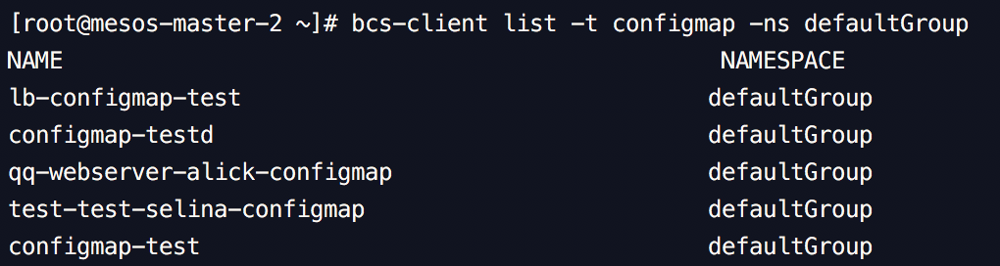


## inspect ##

DESCRIPTION: Command *inspect* can show detailed information of application, taskgroup, service, loadbalance, configmap or secret

USAGE:

	bcs-client inspect [command options] [arguments...]

OPTIONS:

| key         | necessary | type   | description                              |
| ----------- | --------- | ------ | ---------------------------------------- |
| --type      | Y         | string | Inspect type, app/taskgroup/service/configmap/secret/deployment |
| --clusterid | Y         | string | Cluster ID                               |
| --namespace | Y         | string | Namespace                                |
| --name      | Y         | string | Application name                         |

SCREENSHOT:

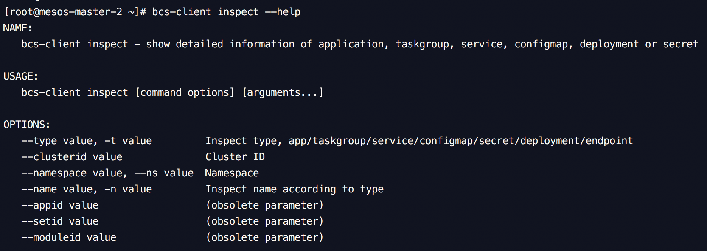

### inspect application ###
EXAMPLE:

	bcs-client inspect -t app -ns wesley-test -n app-wesley

SCREENSHOT:

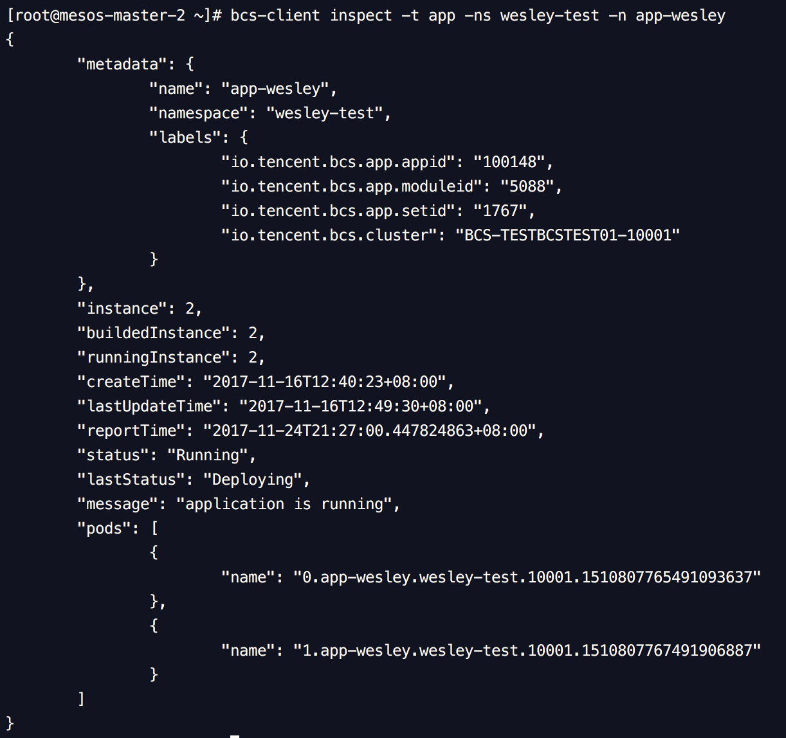


### inspect deployment ###
EXAMPLE:

	bcs-client inspect -t deployment -ns uri_group -n uri-deployment-test-001

SCREENSHOT:

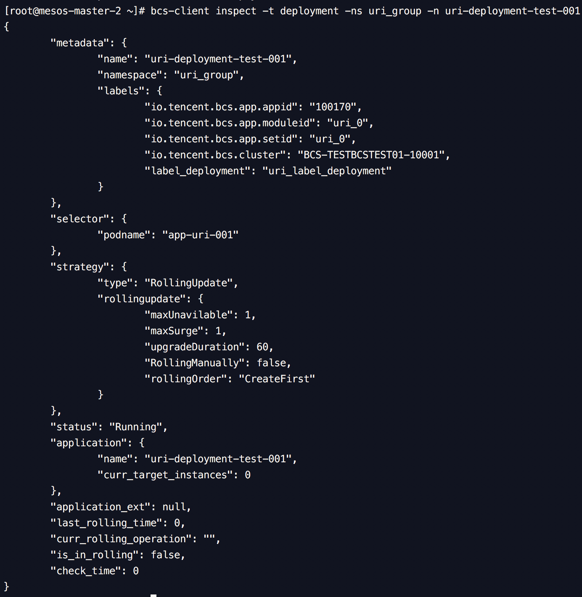


### inspect taskgroup ###
EXAMPLE:

	bcs-client inspect -t taskgroup -ns wesley-test -n 0.app-wesley.wesley-test.10001.1510807765491093637

SCREENSHOT:

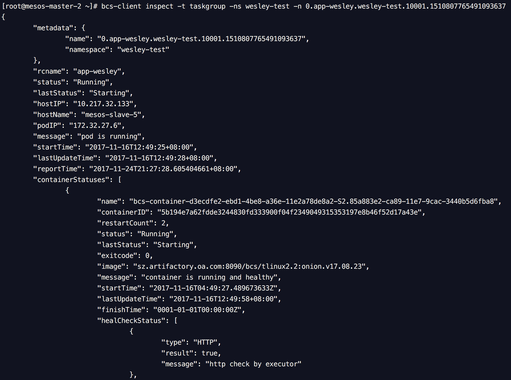


### inspect service ###
EXAMPLE:
	bcs-client inspect -t service -ns defaultGroup -n service-test

SCREENSHOT:

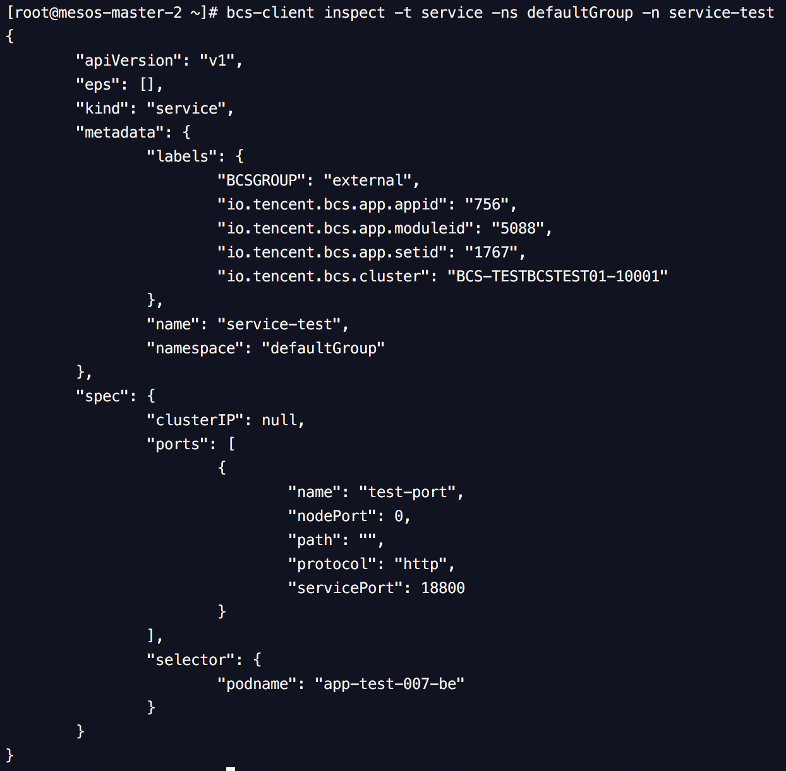

### inspect secret

EXAMPLE:

	bcs-client inspect -t secret -ns defaultGroup -n secret-test
SCREENSHOT:

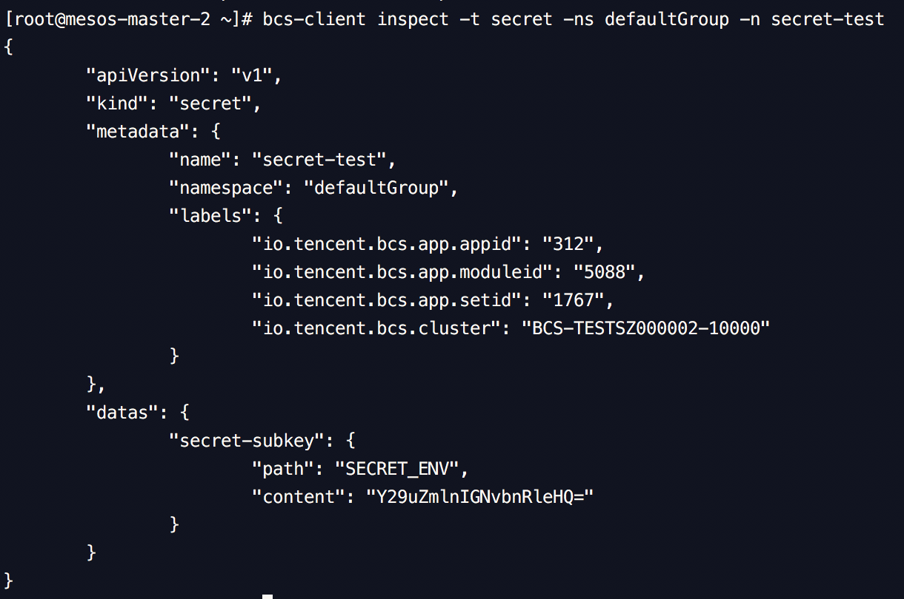


### inspect configmap ###

EXAMPLE:
	bcs-client inspect -t configmap -ns defaultGroup -n configmap-test

SCREENSHOT:

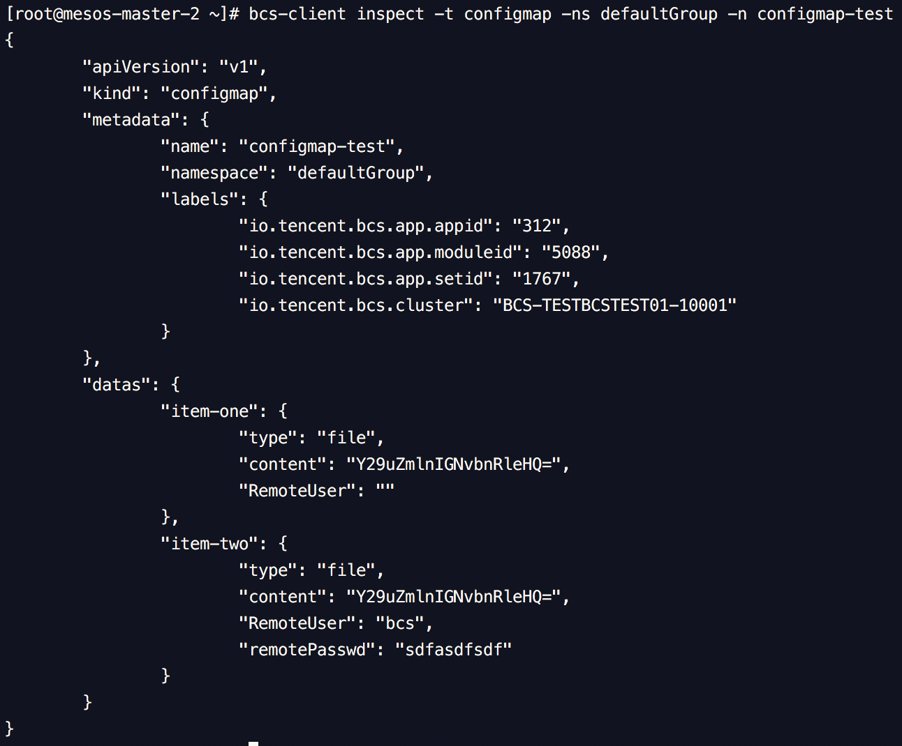


## metric

DESCRIPTION: Command *cancel* can be used to cancel deployment update.

USAGE:

```
bcs-client metric [command options] [arguments...]
```

OPTIONS:

| key          | necessary | type   | description                              |
| ------------ | --------- | ------ | ---------------------------------------- |
| —from-file   | N         | string | upsert with configuration FILE           |
| —type        | N         | string | metric type, metric/task (default: "metric") |
| —list        | N         | string | For get operation                        |
| —inspect     | N         | string | For inspect operation                    |
| —upsert      | N         | string | For insert or update operation           |
| —delete      | N         | string | For delete operation, it will delete all agentsettings of specific ips |
| —clusterid   | N         | string | Cluster ID                               |
| —namespace   | N         | string | Namespace                                |
| —name        | N         | string | Name                                     |
| —clustertype | N         | string | cluster type, mesos/k8s (default: "mesos") |

SCREENSHOT:

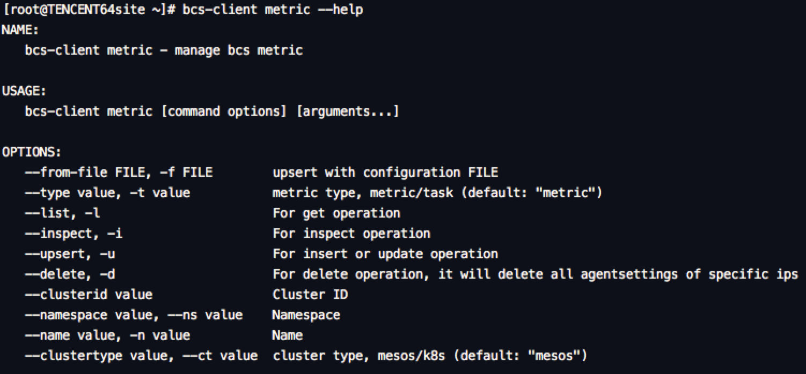


### upsert/update metric

EXAMPLE:

```
bcs-client metric -u -f metric.json
```

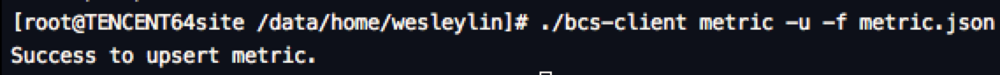


### list/inspect metric

EXAMPLE:

```bash
bcs-client metric -l
```

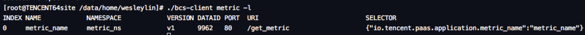

P.S.：update a metric，version will be auto increased by client


```bash
bcs-client metric -i -ns metric_ns -n metric_name
```

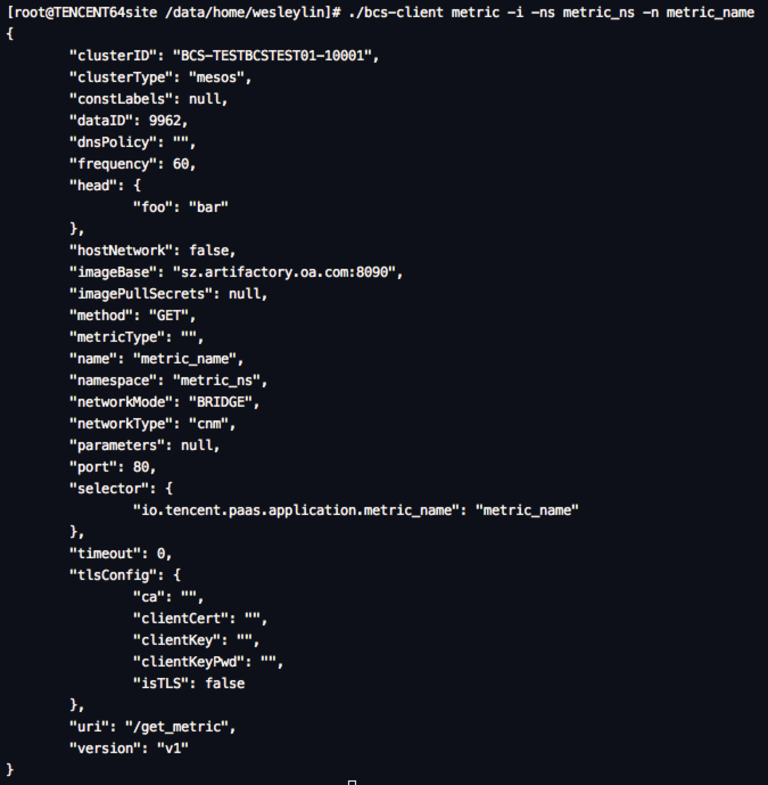


### delete metric

```bash
bcs-client metric -d -ns metric_ns -n metric_name
```

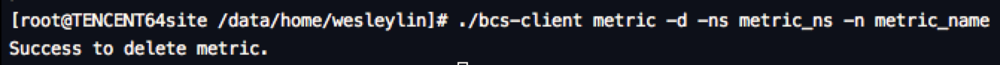


## cancel ##

DESCRIPTION: Command *cancel* can be used to cancel deployment update.

USAGE:

```
bcs-client cancel [command options]
```

OPTIONS:

| key         | necessary | type   | description                         |
| ----------- | --------- | ------ | ----------------------------------- |
| --name      | Y         | string | Deployment name                     |
| --namespace | N         | string | Namespace (default: "defaultGroup") |
| —type       | Y         | string | Cancel type, deployment             |

SCREENSHOT:


### cancel deployment

#### cancel deployment update

EXAMPLE:

```
bcs-client cancel -t deployment --name berg-deployment --namespace bergtest
```


## pause ##

DESCRIPTION: Command *pause* can pause deployment update.

USAGE:

```
bcs-client pause [command options]
```

OPTIONS:

| key         | necessary | type   | description                         |
| ----------- | --------- | ------ | ----------------------------------- |
| --name      | Y         | string | Deployment name                     |
| --namespace | N         | string | Namespace (default: "defaultGroup") |
| —type       | Y         | string | Pause type, deployment              |

SCREENSHOT:

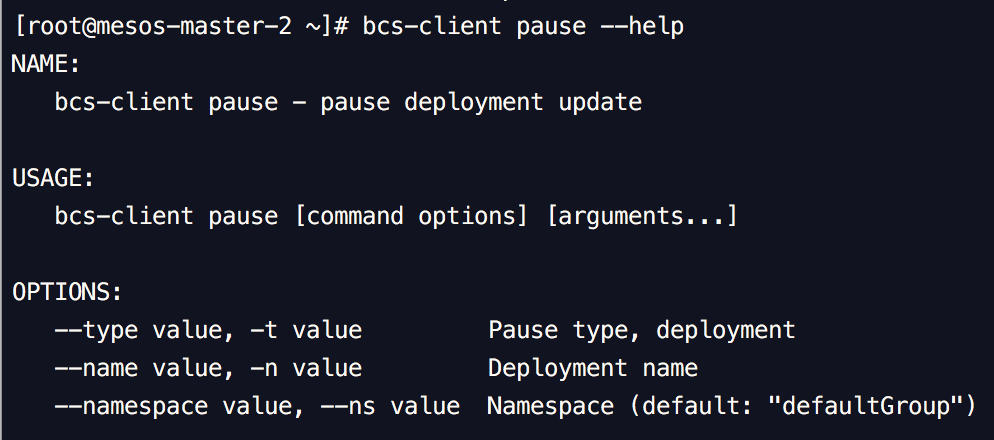

### pause deployment

EXAMPLE:

```
bcs-client pause -t deployment --name berg-deployment --namespace bergtest
```

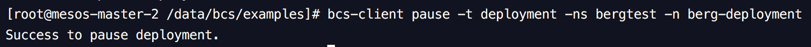


## resume ##

DESCRIPTION: Command *resume* can resume deployment update.

USAGE:

```
bcs-client resume [command options]
```

OPTIONS:

| key         | necessary | type   | description                         |
| ----------- | --------- | ------ | ----------------------------------- |
| --name      | Y         | string | Deployment name                     |
| --namespace | N         | string | Namespace (default: "defaultGroup") |
| —type       | Y         | string | Resume type, deployment             |

SCREENSHOT:

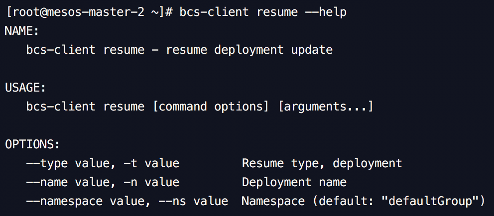

### resume deployment

EXAMPLE:

```
bcs-client resume -t deployment --name berg-deployment --namespace bergtest
```

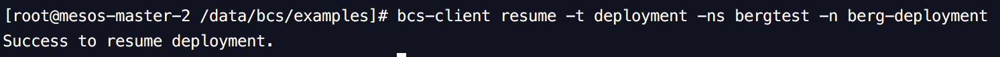


## reschedule ##

DESCRIPTION: Command *reschedule* can reschedule taskgroup.

USAGE:

```
bcs-client reschedule [command options]
```

OPTIONS:

| key         | necessary | type   | description                         |
| ----------- | --------- | ------ | ----------------------------------- |
| --name      | Y         | string | Application name                    |
| --namespace | N         | string | Namespace (default: "defaultGroup") |
| --type      | Y         | string | reschedule type, taskgroup          |
| --tgname    | Y         | string | Taskgroup name                      |
| --clusterid | N         | string | Cluster ID                          |
| —ip         | N         | string | the ip of taskgroup. Split by ,     |

SCREENSHOT:

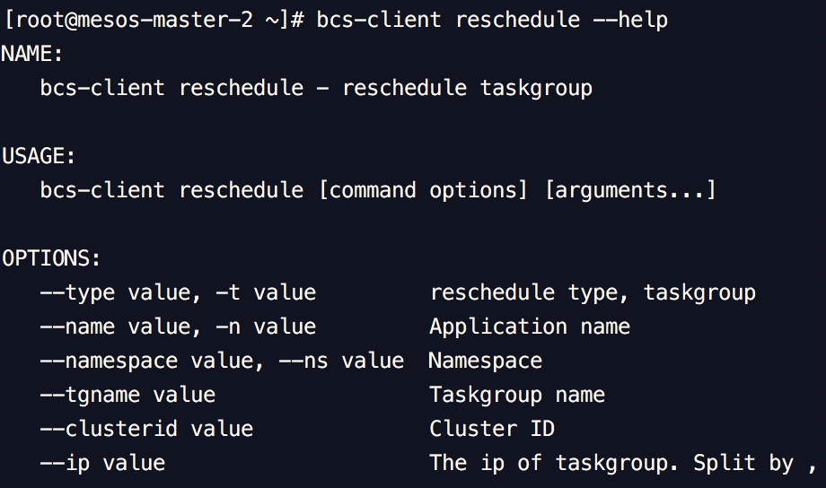

### reschedule taskgroup by name

EXAMPLE:

```
bcs-client reschedule -t taskgroup -n berg-deployment-v1512093431 -ns bergtest -tgname 0.berg-deployment-v1512093431.bergtest.10001.1512093432325509714
```

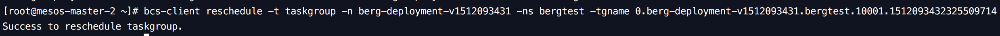

### reschedule taskgroup by ip

EXAMPLE:

```
bcs-client reschedule -t taskgroup -n berg-deployment-v1512093431 -ns bergtest -tgname 0.berg-deployment-v1512093431.bergtest.10001.1512093432325509714
```

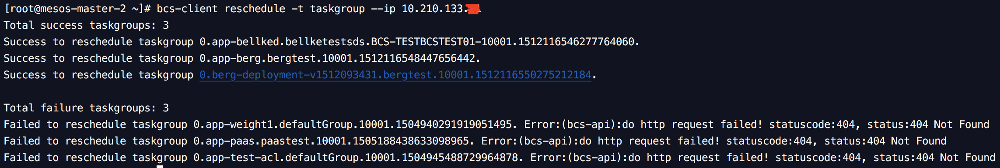


## export ##

### export env

DESCRIPTION: Command *export* can set default value of clusterid, namespace

USAGE:

```
bcs-client export [command options] [arguments...]
```

OPTIONS:

| key         | necessary | type   | description    |
| ----------- | --------- | ------ | -------------- |
| --clusterid | N         | string | set cluster ID |
| --namespace | N         | string | set namespace  |

SCREENSHOT:

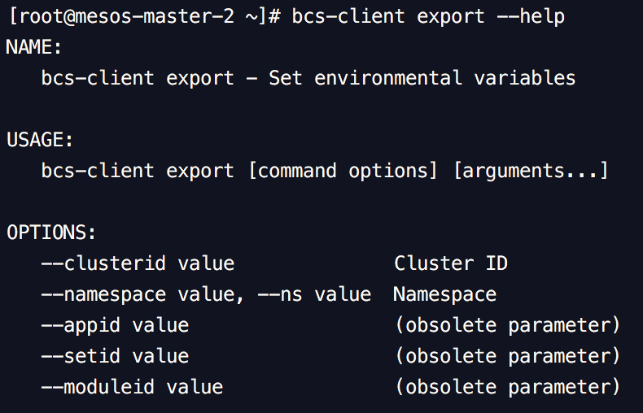

EXAMPLE:

```
bcs-client export --clusterid BCS-TESTBCSTEST01-10001 -ns uri_group
```


## env ##

### show env ###

EXAMPLE:

	bcs-client env

SCREENSHOT:

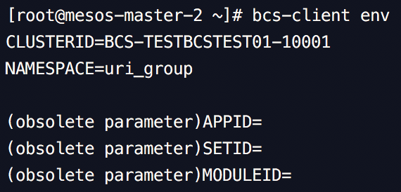


## template ##

DESCRIPTION: Command *template* can get json templates of application, service and so on

USAGE:

```
bcs-client template [command options] [arguments...]
```

OPTIONS:

| key   | necessary | type   | description                              |
| ----- | --------- | ------ | ---------------------------------------- |
| —type | Y         | string | Template type, app/service/configmap/secret/deployment |

SCREENSHOT:

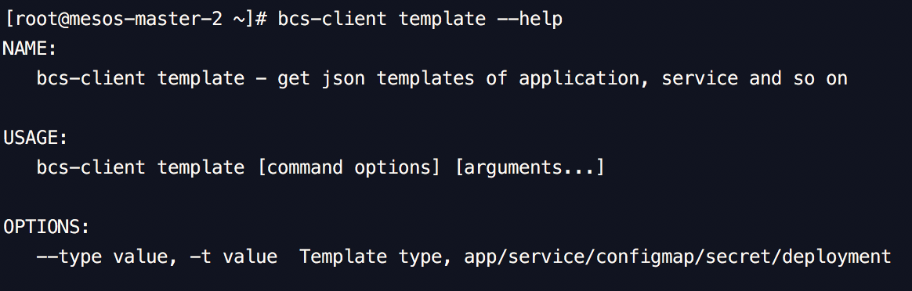

### template configmap

EXAMPLE:

```
bcs-client template -t configmap
```

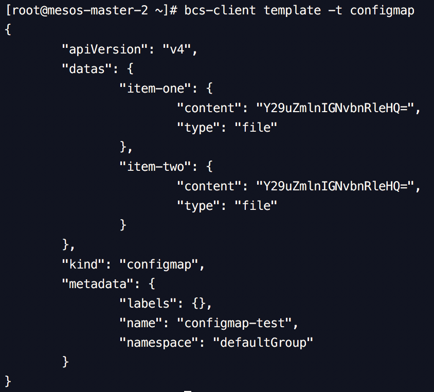


## enable ##

DESCRIPTION: Command *enable* can enable agent by ip

USAGE:

```
bcs-client enable [command options] [arguments...]
```

OPTIONS:

| key   | necessary | type   | description                            |
| ----- | --------- | ------ | -------------------------------------- |
| —type | Y         | string | Enable type, agent                     |
| —ip   | Y         | string | The ip of agent to enabled. Split by , |

SCREENSHOT:

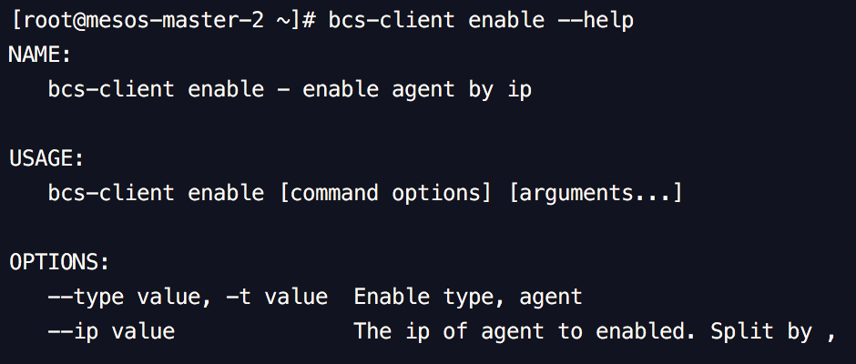

### enable agent

EXAMPLE:

```
bcs-client enable -t agent --ip 127.0.0.1
```

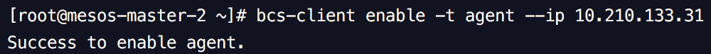


## disable ##

DESCRIPTION: Command *disable* can disable agent by ip

USAGE:

```
bcs-client disable [command options] [arguments...]
```

OPTIONS:

| key   | necessary | type   | description                             |
| ----- | --------- | ------ | --------------------------------------- |
| —type | Y         | string | Disable type, agent                     |
| —ip   | Y         | string | The ip of agent to disabled. Split by , |

SCREENSHOT:

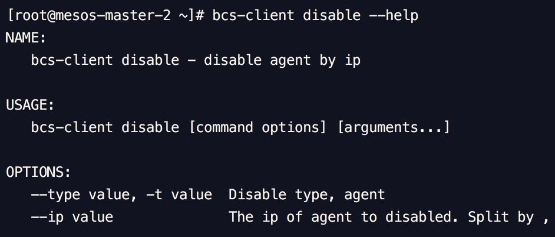

### disable agent

EXAMPLE:

```
bcs-client disable -t agent --ip 127.0.0.1
```

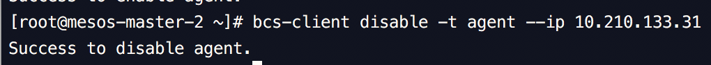


## offer

DESCRIPTION: list offers of clusters

USAGE:

```
bcs-client offer [command options] [arguments...]
```

OPTIONS:

| key        | necessary | type   | description                  |
| ---------- | --------- | ------ | ---------------------------- |
| —clusterid | N         | string | Cluster ID                   |
| —ip        | N         | string | IP of slaves                 |
| --all      | N         | string | get all agent raw offer data |

EXAMPLE:

```
bcs-client offer
```

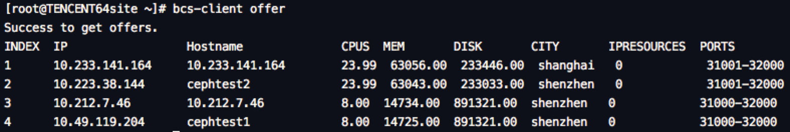


## as

DESCRIPTION: manage the agentsettings of nodes

USAGE:

```
bcs-client as [command options] [arguments...]
```

OPTIONS:

| key         | necessary | type   | description                              |
| ----------- | --------- | ------ | ---------------------------------------- |
| --list      | N         | string | For get operation                        |
| --update    | N         | string | For update operation                     |
| --set       | N         | string | For set operation                        |
| --delete    | N         | string | For delete operation, it will delete all agentsettings of specific ips |
| --key       | N         | string | attribute key                            |
| --string    | N         | string | attribute string value                   |
| --from-file | N         | string | set attribute file                       |
| --scalar    | N         | string | attribute float value (default: 0)       |
| --clusterid | N         | string | Cluster ID                               |
| --ip        | N         | string | The ip of slaves. In list/update it support multi ips, split by comma |


### list as

EXAMPLE:

```
bcs-client as -l
```

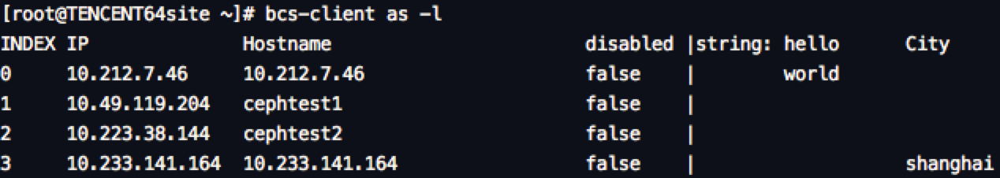


### update/set as

EXAMPLE:

```
bcs-client as -u --ip 127.0.0.1,127.0.0.2 -k Key --string string_value
bcs-client as -u --ip 127.0.0.1 -k Key --scalar scalar_value
```

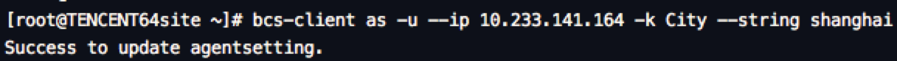


### delete as

EXAMPLE:

```
bcs-client as -d --ip 127.0.0.1
```

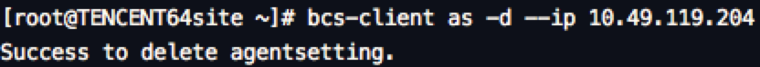


## help ##
EXAMPLE:

	bcs-client --help

SCREENSHOT:

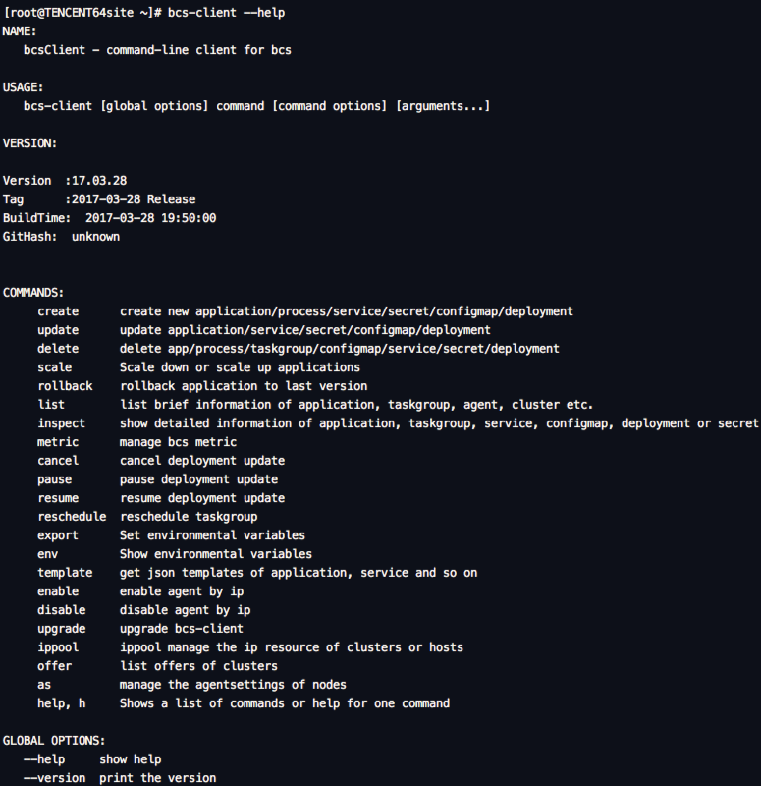

## apply

apply multiple Mesos resources from file or stdin

example:

```
# mesos-resources.json contains multiple json structures
$ bcs-client apply -f mesos-resources.json
resource v4/service bkbcs-client-test create successfully
resource v4/secret bkbcs-client-test-secret create successfully
resource v4/deployment bkbcs-client-test create successfully

# reading 
helm template test $mychart -n mynamespace | xargs bcs-client apply 
```

## clean

delete multiple Mesos resources from file or stdint

example:

```
$ bcs-client clean -f mesos-resources.json
resource v4/service bkbcs-client-test clean successfully
resource v4/secret bkbcs-client-test-secret clean successfully
resource v4/deployment bkbcs-client-test clean successfully

$ helm template test $mychart -n mynamespace | xargs bcs-client clean
resource v4/service bkbcs-client-test clean successfully
resource v4/secret bkbcs-client-test-secret clean successfully
resource v4/deployment bkbcs-client-test clean successfully
```