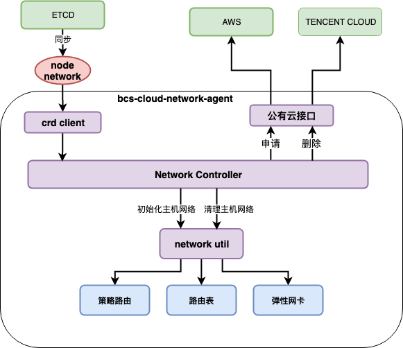

# bcs cloud network agent

## 简介

bcs cloud network agent作为进程或者daemonSet方式常驻于slave节点上，主要作用有：

* 向公有云申请弹性和释放弹性网卡
* 设置虚拟机上的弹性网卡IP地址、创建默认路由以及策略路由
* 设置网卡的IP_FORWARD参数以及RP_FILTER参数
* 对主机网卡设置进行周期性轮训

## 整体架构



## 参数说明

### aws环境变量参数

```shell
export AWS_REGION=sa-xxx-1
export AWS_VPC=vpc-xxx
export AWS_ACCESS_KEY_ID=xxxxxxxxxxxxxxxx
export AWS_SECRET_ACCESS_KEY=xxxxxxxxxxxxxxxx
export AWS_SUBNETS=subnetid-1,subnetid-2
export AWS_SECURITY_GROUPS=sg-xxxx1,sg-xxxx2
export EXTRA_ENI_LIMITATION="{\"c5a.8xlarge\":{\"maxEniNum\":8,\"maxIPNum\":8}}"
```

* AWS_REGION: aws云区域
* AWS_VPC: aws vpc id
* AWS_ACCESS_KEY_ID: aws api访问id
* AWS_SECRET_ACCESS_KEY: aws api访问key
* AWS_SUBNETS: 弹性网卡IP所属子网id
* AWS_SECURITY_GROUPS: 弹性网卡绑定的安全组
* EXTRA_ENI_LIMITATION: 额外机型的弹性网卡限制，如果配置了该环境变量，则会先从该环境变量中匹配机型

### 通用参数

```json
{
    "address": "${bcsCloudNetworkAgentAddress}",
    "metric_port": ${bcsCloudNetworkAgentMetricPort},
    "cluster": "${bcsCloudNetworkAgentClusterid}",
    "cloud": "bcsCloudNetworkAgentCloud",
    "kubeconfig": "${bcsCloudNetworkAgentKubeconfig}",
    "netserviceZookeeper": "${bcsCloudNetworkAgentNetserviceZookeeper}",
    "netserviceCa": "${bcsCloudNetworkAgentNetserviceCaFile}",
    "netserviceKey": "${bcsCloudNetworkAgentNetserviceClientKeyFile}",
    "netserviceCert": "${bcsCloudNetworkAgentNetserviceClentCertFile}",
    "eniNum": ${bcsCloudNetworkAgentEniNum},
    "ipNumPerEni": ${bcsCloudNetworkAgentIpNumPerEni},
    "eniMTU": ${bcsCloudNetworkAgentEniMTU},
    "ifaces": "${bcsCloudNetworkAgentIfaces}",
    "v": "${bcsCloudNetworkAgentLogLevel}"
}
```

* bcsCloudNetworkAgentAddress: agent地址
* bcsCloudNetworkAgentMetricPort: metric端口
* bcsCloudNetworkAgentClusterid: BCS集群ID
* bcsCloudNetworkAgentCloud: 公有云类型
* bcsCloudNetworkAgentKubeconfig: kubeconfig位置
* bcsCloudNetworkAgentNetserviceZookeeper: bcs-netservice zk地址
* bcsCloudNetworkAgentNetserviceCaFile: bcs-netservice tls ca证书
* bcsCloudNetworkAgentNetserviceClientKeyFile: bcs-netservice 客户端私钥
* bcsCloudNetworkAgentNetserviceClentCertFile: bcs-netservice 客户端证书
* bcsCloudNetworkAgentEniNum: 申请的弹性网卡数量, "0"表示申请尽可能多的网卡
* bcsCloudNetworkAgentIpNumPerEni: 每张弹性网卡IP数量: "0"表示尽可能多的申请IP
* bcsCloudNetworkAgentEniMTU: 弹性的网卡MTU，默认为1500，(AWS上推荐使用9001)
* bcsCloudNetworkAgentIfaces: 虚拟机的网卡，用来获取表示主机身份的IP地址，逗号分割
* bcsCloudNetworkAgentLogLevel: 日志级别

