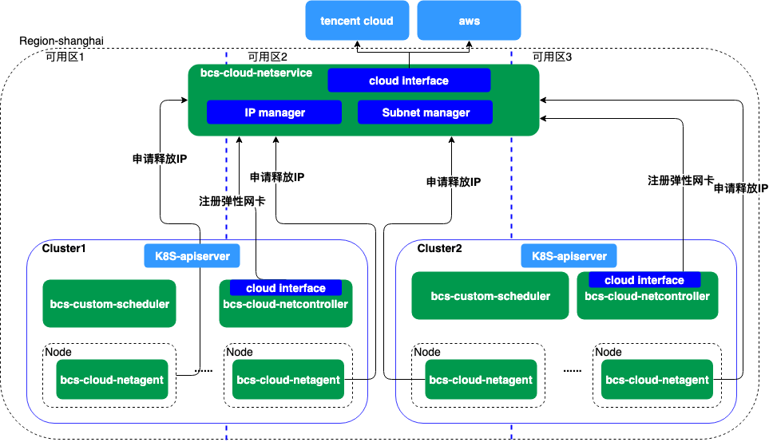
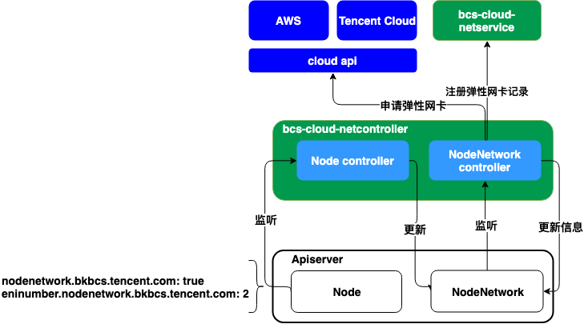
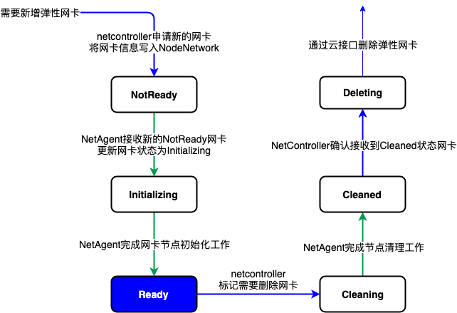
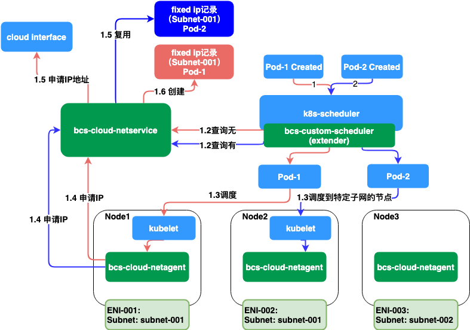

# 云IP资源管理方案

## 背景

* 业务为了追求更好的性能和网络访问的便利性（如容器服务对接传统服务的DB授权访问和IP白名单机制），需要容器网络能够与传统服务节点网络直接互通。
* 诸多云厂商都提供了实现容器underlay方案的云基础设施。
* Underlay IP网络资源在VPC内有限，有较高资源利用率需求，需要有一个统一的模块来管理这些云资源。

## 需求

* 能够保证容器集群在多地多区域的可扩展性
* 需要同时兼容K8s和Mesos集群
* 能够同时兼容不同的云厂商
* 能够尽量减少对云API的调用，提高系统的可靠性

## 云API调研

### tencent cloud

### aws



架构图如上

* bcs-cloud-netservice负责子网资源和ip资源的管理和分配
* bcs-cloud-netcontroller负责node弹性网卡的申请、绑定和释放
* bcs-cloud-netagent负责响应对应节点CNI ipam插件的请求，执行容器ip的申请和释放
* bcs-custom-scheduler负责根据集群中弹性网卡和固定ip的自定义资源调度容器

## 关键设计点

### 节点资源的申请和释放

* 可以只针对部分节点申请弹性网卡
* 可以通过节点的annotations对节点网卡进行动态增删
  * **nodenetwork.bkbcs.tencent.com: true** --- 标记节点需要弹性网卡
  * **eninumber.nodenetwork.bkbcs.tencent.com: 2** --- 标记节点需要几张弹性网卡，可用于动态增删



* 弹性网卡的状态转换由bcs-cloud-netcontroller与bcs-cloud-netagent共同维护
* 只有处于Ready状态的网卡才能够响应CNI请求



### 固定IP的实现

* 云厂商提供弹性网卡动态申请和释放IP地址的能力，这为IP漂移提供了技术基础
* 因为容器IP地址属于某个特定子网，所以在跨地域多子网集群中，需要配合kubernetes的调度能力,将申请固定IP的容器调度到可用的节点上

```yaml
keeptime.fixedip.cloud.tencent.com: ""
```


