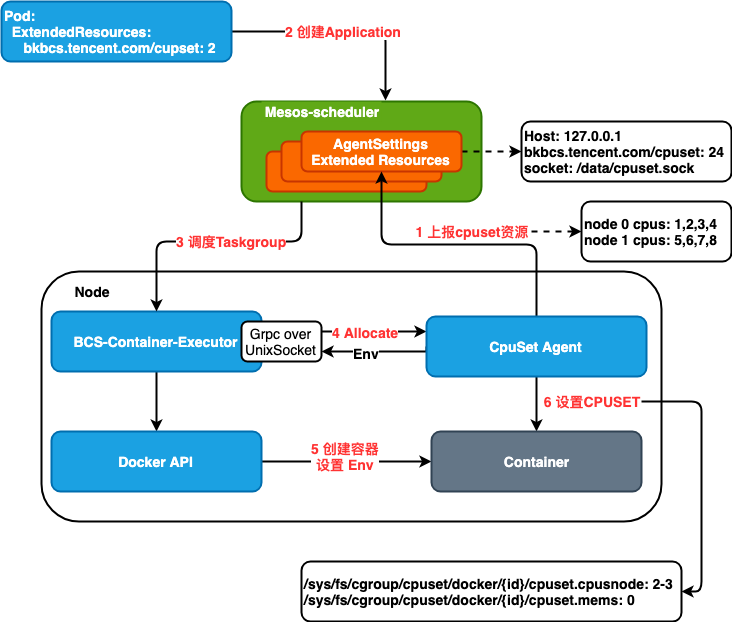

# Bcs CpuSet Device

## 背景

将进程绑定在特定的CPU核心上，能够减少CPU调度带来的性能损失。同时，对于NUMA架构的CPU来说，进程绑定特定的CPU核心，相对于不绑定CPU核心的情况能够提升CPU高速缓存的命中率，从而使程序运行更加高效。

## 需求

* 特定负载希望能够绑定CPU核心，提高运行效率
* Mesos方案能够将可以绑定的CPU核心作为资源进行调度

## 方案设计

### 整体架构

* bcs-cpuset-device通过cgo，调用numa C语言函数，获取本机cpuset资源，通过bcs-mesos-driver写入bcs-scheduler的AgentSetting的ExtendedResources数据中
* 当mesos-scheduler将特定容器调度到特定Node上时，BCS-Container-Executor会采用类似与kubelet device plugin的方式，在容器启动之前，获取需要绑定的CPU核心，并写入环境变量
* 当容器启动后，bcs-cpuset-device会监听container的事件，当有container创建时，判断是否有环境变量需要进行cpuset绑定，如果有，则信息写入container的对应的cgroup的cpuset信息中，从而达到绑定CPU核心的目的
* 数据恢复：当bcs-cupset-device进程重启时，bcs-cpuset-device会遍历所有容器信息，重新构造cpuset的分配数据

## 部署

### 启动参数说明

* docker_sock: docker daemon进程监听的unix socket文件
* plugin_socket_dir: 指定bcs-cpuset-device产生的socket文件的目录，bcs-cpuset-device启动后会在次目录生成socket文件
* clusterid: bcs-cpuset-device所属的集群
* engine: 集群编排引擎类型，可选mesos, k8s
* bcs_zookeeper: 集群层zookeeper地址
* log_dir: bcs-cpuset-device日志目录
* alsologtostderr: 同时打印日志到标准输出
* v: 日志级别
* ca_file: bcs-cpuset-device用来访问bcs-mesos-driver的ca文件
* client_cert_file: bcs-cpuset-device用来访问bcs-mesos-driver的客户端cert文件
* client_key_file: bcs-cpuset-device用来访问bcs-mesos-driver的客户端key文件

### 部署方式

采用mesos DaemonSet部署

## 风险点

* 目前mesos DaemonSet在节点扩缩容的时候不友好
* 普通的cpu request和limit与Extended Resource目前无法协同工作

