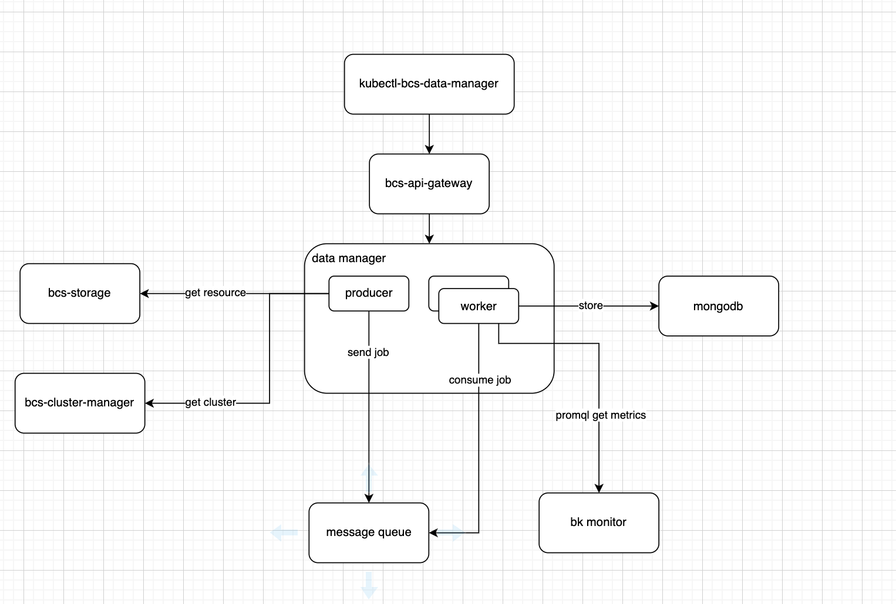
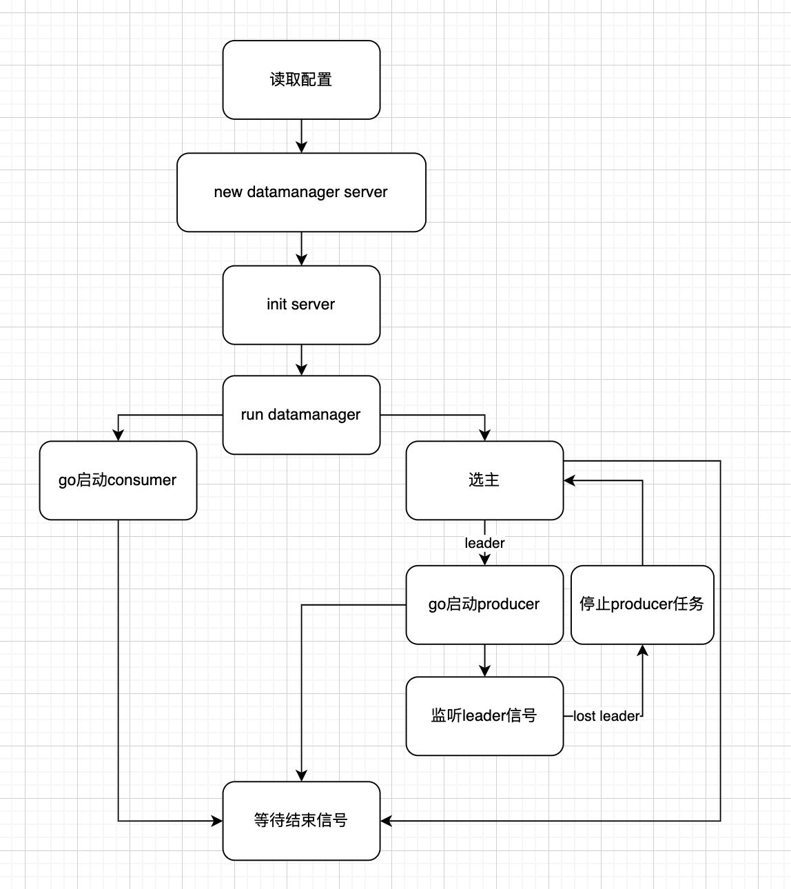

# bcs-data-manager

## 1. 需求

### 1.1 背景

尽管kubernetes在自动化运维方面给我们带来了极大的便利，但在生产环境中由于资源碎片、负载资源使用率展示不直观等问题，业务大多数会预留较多的冗余资源（节点、负载）以保证pod的调度及业务的正常运行。这种使用方式显然跟容器技术出现的初衷（轻量、混部、节约计算资源）是背道而驰的。

为此，我们设计data-manager模块，以采集集群、命名空间及业务模块粒度的资源使用数据，多维度展示实时和历史的资源使用率。通过data
manage模块，用户可以直观地了解集群当前的资源使用率、业务在不同时段的真实负载，以及cluster-autoscaler和gpa模块弹性伸缩功能对资源调整的作用。这对用户调整集群及模块资源能起指导作用。

另外，基于全集群不同维度统计业务资源使用数据，可以为资源用量计费提供数据基础。

### 1.2 内容

data manage模块需具备以下几个基本能力：

1. 数据采集：资源最小粒度为workload，时间最小粒度为分钟。
2. api建设：kubectl命令行展示集群不同维度的资源使用率，在bcs-apigateway暴露服务

data manage展示的指标：

1. project：项目集群数，总容量（cpu,memory），总负载（cpu,memory），平均负载，平均资源使用率，总节点数，可用节点数，节点数量区间。--- 1天1条
2. cluster：总负载，平均负载，总节点数，可用节点数，节点分位数，节点数量区间，最低负载节点（百分比），资源请求量（cpu,memory），资源使用量，资源利用率，模块数，当前实例数，实例数区间，实例数最小时间段，实例数最大时间段。
   – 10分钟
3. namespace：资源限制，资源请求量，资源使用量，资源利用率，资源利用率最高时间段，资源利用率最低时间段，模块数，当前实例数，实例数区间，实例数最小时间段，实例数最大时间段，模块使用率最高最低，建议资源值。–10分钟
4. workload：资源请求量，资源使用量，资源利用率，资源利用率最高时间段，资源利用率最低时间段，当前实例数，实例数区间，实例数最小时间段，实例数最大时间段，建议资源值。 – 1分钟

## 2. 概要设计

data-manager依赖几个周边模块：

1. 调用bcs-cluster-manager接口获取集群列表
2. 调用bcs-storage接口获取所有集群内资源信息：namespace，workload(deployment, statefulset, daemonset, gameworkload, mesos application)
3. datamanager主实例将计算任务发送到消息队列，worker实例消费消息，做真正的计算
4. 调用bk monitor接口通过promql查询指标结果
5. 将数据存储到mongodb
6. 服务注册到bcs api gateway，通过gateway暴露服务
7. 提供kubectl-bcs-data-manager命令行工具，通过gateway https访问data manager查询数据



## 3. 详细设计

### 3.1 主流程



### 3.2 producer

producer 主要工作是启动定时器，定时获取集群列表、集群内资源，生成计算任务发送到消息队列。

其中添加定时任务的方法提取到init server阶段完成，避免一个实例从主→备→主之后，cronjob里有重复任务。

需要关注的点：workload数据一分钟生成一次，全量数据较大，需要注意并发量、内存

job携带的信息：

根据类型填充需要的信息，consumer会根据objectType做相应的处理
```go
// JobCommonOpts data job common opts 
type JobCommonOpts struct { 
	ObjectType string 
	ProjectID string 
	ClusterID string
	ClusterType string 
	Namespace string 
	WorkloadType string 
	Name string
	Dimension string 
	CurrentTime time.Time 
}
```

### 3.3 consumer 
consumer从message queue里获取job，根据job的类型构造dataJob，执行相应的policy。
```go
// IDataJob dataJob interface
type IDataJob interface {
	DoPolicy(ctx context.Context)
	SetPolicy(Policy)
}

// Policy interface
type Policy interface {
	ImplementPolicy(ctx context.Context, opts *common.JobCommonOpts, clients *common.Clients)
}

// DataJob dataJob struct
type DataJob struct {
	Opts      common.JobCommonOpts
	jobPolicy Policy
	clients   *common.Clients
}

// DoPolicy do dataJob policy
func (j *DataJob) DoPolicy(ctx context.Context) {
	j.jobPolicy.ImplementPolicy(ctx, &j.Opts, j.clients)
}

// SetPolicy set dataJob policy
func (j *DataJob) SetPolicy(policy Policy) {
	j.jobPolicy = policy
}

// SetClient set dataJob clients
func (j *DataJob) SetClient(clients *common.Clients) {
	j.clients = clients
}
```

由于每一种类型的job根据其时间维度所要做的计算都有区别，在这里给每一种资源不同的时间维度都定义成一种policy。比如以下的cluster
policy，minute、hour、day各一个policy，如果新增时间维度，新增一个policy即可。

```go
// ClusterDayPolicy day policy
type ClusterDayPolicy struct {
	MetricGetter metric.Server
	store        store.Server
}

// ClusterHourPolicy hour policy
type ClusterHourPolicy struct {
	MetricGetter metric.Server
	store        store.Server
}

// ClusterMinutePolicy minute policy
type ClusterMinutePolicy struct {
	MetricGetter metric.Server
	store        store.Server
}

// NewClusterDayPolicy init day policy
func NewClusterDayPolicy(getter metric.Server, store store.Server) *ClusterDayPolicy {
	return &ClusterDayPolicy{
		MetricGetter: getter,
		store:        store,
	}
}

// NewClusterHourPolicy init hour policy
func NewClusterHourPolicy(getter metric.Server, store store.Server) *ClusterHourPolicy {
	return &ClusterHourPolicy{
		MetricGetter: getter,
		store:        store,
	}
}

// NewClusterMinutePolicy init minute policy
func NewClusterMinutePolicy(getter metric.Server, store store.Server) *ClusterMinutePolicy {
	return &ClusterMinutePolicy{
		MetricGetter: getter,
		store:        store,
	}
}

// ImplementPolicy day policy implement
func (p *ClusterDayPolicy) ImplementPolicy(ctx context.Context, opts *common.JobCommonOpts, clients *common.Clients) {}

// ImplementPolicy hour policy implement
func (p *ClusterHourPolicy) ImplementPolicy(ctx context.Context, opts *common.JobCommonOpts, clients *common.Clients) {}

// ImplementPolicy minute policy implement
func (p *ClusterMinutePolicy) ImplementPolicy(ctx context.Context, opts *common.JobCommonOpts,clients *common.Clients){}
```

为了让consumer将消息转化为dataJob的过程更加简洁，提供一个工厂接口 PolicyFactoryInterface，根据objectType和dimension获取对应的policy
```go
// PolicyFactoryInterface PolicyMap interface
type PolicyFactoryInterface interface {
	GetPolicy(objectType, dimension string) Policy
	Init()
}
```

在真正执行dataJob的阶段，将job转成dataJob，再设置好policy和client就可以执行。

```go
func (h *DataJobHandler) handleOneJob(job msgqueue.HandlerData) {
	dataJob := &datajob.DataJob{}
	err := json.Unmarshal(job.Body, dataJob)
	...
	policy := h.policyFactory.GetPolicy(dataJob.Opts.ObjectType, dataJob.Opts.Dimension)
	dataJob.SetPolicy(policy)
	...
	dataJob.SetClient(client)
	dataJob.DoPolicy(h.stopCtx)
}
```

### 3.4 api proto定义
参考bcs-services/bcs-data-manager/proto

### 3.5 周边模块依赖 
#### 3.5.1 bcs-storage 使用bcs-common/pkg/bcsapi包即可，client构造方式：
```go
	storageConfig := &bcsapi.Config{
		Hosts:     []string{s.opt.BcsAPIConf.BcsAPIGwURL},
		TLSConfig: s.clientTLSConfig,
		AuthToken: string(realAuthToken),
		Gateway:   true,
	}
	storageClient := bcsapi.NewClient(storageConfig)
	storageCli := storageClient.Storage()
```

要注意的细节：

config中的Hosts只需要填bcs-apigateway的域名，无需加schema，common中的包会根据TLSConfig是否为nil来自动拼接schema，不为空即https。

#### 3.5.2 bcs-cluster-manager 
对接cluster manager可以使用bcs-common/pkg/bcsapi，grpc访问，data manager兼容两种访问方式，当启动参数GrpcGWAddress不为空时，通过网关访问，不启动discovery服务发现模块。

#### 3.5.3 bk-monitor
monitor没有公共的包，封装以下client接口，主要用到Query/QueryByPost
```go
// ClientInterface the interface of bcs monitor client 
type ClientInterface interface { 
	LabelValues(labelName string, selectors []string, startTime, endTime time.Time) (*LabelResponse, error)
	Labels(selectors []string, startTime, endTime time.Time) (*LabelResponse, error)
	Query(promql string, time time.Time) (*QueryResponse, error)
	QueryByPost(promql string, time time.Time) (*QueryResponse, error)
	QueryRange(promql string, startTime, endTime time.Time, step time.Duration) (*QueryRangeResponse, error)
	QueryRangeByPost(promql string, startTime, endTime time.Time, step time.Duration) (*QueryRangeResponse, error)
	Series(selectors []string, startTime, endTime time.Time) (*SeriesResponse, error)
	SeriesByPost(selectors []string, startTime, endTime time.Time) (*SeriesResponse, error)
}
```

为了方便测试注入，抽象一个requester，可以mock requester的返回
```go
// BcsMonitorClient is the client for bcs monitor request 
type BcsMonitorClient struct { 
	opts BcsMonitorClientOpt
	defaultHeader http.Header 
	completeEndpoint string 
	requestClient Requester 
}

// Requester is the interface to do request 
type Requester interface { 
	DoRequest(url, method string, header http.Header, data []byte) ([]byte, error)
}

type requester struct { httpCli *httpclient.HttpClient }
```

#### 3.5.4 rabbitmq 
消息队列选用rabbitmq，原因是当前bcs有模块也在使用，使用公共的mq可以简化上线步骤，同时也有公共包可以用：bcs-common/pkg/msgqueue

使用rabbitmq的work queue工作模式，producer-consumer 一对多。

消息发送，msgQueue.Publish()：
```go
// SendJob is the function to send data job to msg queue
func (p *Producer) SendJob(opts common.JobCommonOpts) error {
	dataJob := datajob.DataJob{Opts: opts}
	msg := &broker.Message{Header: map[string]string{
		"resourceType": common.DataJobQueue,
		"clusterId":    "dataManager",
	}}
	err := codec.EncJson(dataJob, &msg.Body)
	if err != nil {
		blog.Errorf("transfer dataJob to msg body error, dataJob: %v, error: %v", dataJob, err)
		return err
	}
	err = p.msgQueue.Publish(msg)
	if err != nil {
		blog.Errorf("send message error: %v", err)
		return err
	}
	return nil
}
```
消息消费，主要用到subscribe，自定义一个handler对象，实现HandleQueue，subscribe之后会根据filter将消息用实现的HandleQueue处理

一般可以用channel接收消息，再起goroutine从channel里拿消息做处理：
```go
// DataJobHandler handler for dataJob
type DataJobHandler struct {
	unSub         func()
	stopCtx       context.Context
	stopCancel    context.CancelFunc
	jobListCh     chan msgqueue.HandlerData
	filters       []msgqueue.Filter
	clients       HandleClients
	policyFactory datajob.PolicyFactoryInterface
	concurrency   int64
}


// Consume consume data
func (h *DataJobHandler) Consume(sub msgqueue.MessageQueue) error {
	unSub, err := sub.Subscribe(msgqueue.HandlerWrap("data-job-handler", h.HandleQueue), h.filters, common.DataJobQueue)
	if err != nil {
		blog.Errorf("subscribe err :%v", err)
		return fmt.Errorf("subscribe err :%v", err)
	}
	blog.Infof("subscribe success")
	h.unSub = func() {
		unSub.Unsubscribe()
	}
	go h.handleJob()
	return nil
}

// HandleQueue register queue for job callback
func (h *DataJobHandler) HandleQueue(ctx context.Context, data []byte) error {
	defer func() {
		if r := recover(); r != nil {
			blog.Errorf("data job handle panic: %v\n", r)
		}
	}()

	select {
	case <-ctx.Done():
		blog.Errorf("queue handler timeout ctx done.")
	case <-h.stopCtx.Done():
		blog.Errorf("data job handler has been closed.")
		return nil
	default:
	}
	dataJobHandlerData := &msgqueue.HandlerData{}
	err := json.Unmarshal(data, dataJobHandlerData)
	if err != nil {
		blog.Errorf("Unmarshal handler data failed: %v", err)
		return err
	}
	h.jobListCh <- *dataJobHandlerData
	return nil
}
```

#### 3.5.5 mongodb 
mongodb 5.0新特性：支持时序数据

https://www.mongodb.com/developer/how-to/new-time-series-collections/

mongodb 5.0推出了time-series-collection，操作简单，优化了时序数据的存储空间以及查询时间，可以设置时间粒度和过期时间，自动清理历史数据。

分桶设计

对时间做一个分桶设计，比如以小时为一个桶，一个小时内60分钟的数据都存在同一个桶里，可以大大降低文档数，见指标分析

但是分桶设计对应用程序要求较高，需要设计好分桶原则，同时，如果需要查询跨小时的数据，比如3点30到4点30，就需要对两个桶进行查询。

由于mongodb 5.0短时间不能引入，datamanager采用分桶存储。

设计原则：

1. index 
* 对于每一类资源每个时间维度只能有一个桶，因此需要建一个唯一的联合索引 
* 除此以外，对必要的筛选字段都建单独的索引，避免慢查询（一般来说索引不建议建太多，会影响写速度，目前索引最多的workload表有10个）
* 对createTime建索引，便于清理数据 
2. 预聚合 
* 对于最大/最小的数据，在每次update的时候做一次预聚合，比每次查询的时候再排序花销要小得多。因此在每次update时，将新增的数据与现在记录中的min max数据做对比并更新。
3. 查询的时候，需要做跨桶并根据metric时间筛查，对子文档的筛选要用aggregate 

基于以上3点，数据结构设计如下（其他类型类比cluster） 如：

记录cluster 2022年4月26日11点内分钟级别的数据，bucketTime为2022-04-26 11:00:
00（忽略分钟），dimension为minute，Metrics切片里为真正的分钟数据，每次update时相当于往Metrics里append。
```go
// ClusterData for cluster table
type ClusterData struct {
	CreateTime  primitive.DateTime             `json:"createTime" bson:"create_time"`
	UpdateTime  primitive.DateTime             `json:"updateTime" bson:"update_time"`
	BucketTime  string                         `json:"bucketTime" bson:"bucket_time"`
	Dimension   string                         `json:"dimension" bson:"dimension"`
	ProjectID   string                         `json:"projectID" bson:"project_id"`
	ClusterID   string                         `json:"clusterID" bson:"cluster_id"`
	ClusterType string                         `json:"clusterType" bson:"cluster_type"`
	MinNode     *bcsdatamanager.ExtremumRecord `json:"minNode,omitempty" bson:"min_node"`
	MaxNode     *bcsdatamanager.ExtremumRecord `json:"maxNode,omitempty" bson:"max_node"`
	MinInstance *bcsdatamanager.ExtremumRecord `json:"minInstance,omitempty" bson:"min_instance"`
	MaxInstance *bcsdatamanager.ExtremumRecord `json:"maxInstance,omitempty" bson:"max_instance"`
	Metrics     []*ClusterMetrics              `json:"metrics" bson:"metrics"`
}

// ClusterMetrics cluster metric
type ClusterMetrics struct {
	Index              int                            `json:"index"`
	Time               primitive.DateTime             `json:"time,omitempty"`
	NodeCount          int64                          `json:"nodeCount,omitempty"`
	AvailableNodeCount int64                          `json:"availableNodeCount,omitempty"`
	MinNode            *bcsdatamanager.ExtremumRecord `json:"minNode,omitempty"`
	MaxNode            *bcsdatamanager.ExtremumRecord `json:"maxNode,omitempty"`
	NodeQuantile       []*bcsdatamanager.NodeQuantile `json:"nodeQuantile,omitempty"`
	MinUsageNode       string                         `json:"minUsageNode,omitempty"`
	TotalCPU           float64                        `json:"totalCPU,omitempty"`
	TotalMemory        int64                          `json:"totalMemory,omitempty"`
	TotalLoadCPU       float64                        `json:"totalLoadCPU,omitempty"`
	TotalLoadMemory    int64                          `json:"totalLoadMemory,omitempty"`
	AvgLoadCPU         float64                        `json:"avgLoadCPU,omitempty"`
	AvgLoadMemory      int64                          `json:"avgLoadMemory,omitempty"`
	CPUUsage           float64                        `json:"CPUUsage,omitempty"`
	MemoryUsage        float64                        `json:"MemoryUsage,omitempty"`
	WorkloadCount      int64                          `json:"workloadCount,omitempty"`
	InstanceCount      int64                          `json:"instanceCount,omitempty"`
	MinInstance        *bcsdatamanager.ExtremumRecord `json:"minInstance,omitempty"`
	MaxInstance        *bcsdatamanager.ExtremumRecord `json:"maxInstance,omitempty"`
	CpuRequest         float64                        `json:"cpuRequest,omitempty"`
	MemoryRequest      int64                          `json:"memoryRequest,omitempty"`
}
```

## 4. metrics设计 
data manager是否健康运行，从大方向看主要关注两点：producer生产消息是否及时和完整，consumer处理消息的速度以及成功率是否够高

### 4.1 整体 
1. api 成功率、RT、调用次数 
2. cpu、memory、goroutine数量

### 4.2 producer 
1. 消息生产延时（如NamespaceProducer从开始到全部任务发送完成的时间） 
2. 消息生产成功率 
3. 消息生产数量
### 4.3 consumer 
1. 处理一个作业的时间
2. 处理1000个作业的时间
3. 处理作业成功率 
4. handler的接收消息的channel内消息量 
5. consumer并发量 
6. 作业执行延时（作业执行完的时间-作业中标定的时间）

### 4.4 周边依赖 
1. message queue消息堆积量（消息wait in queue的时间） 
2. storage、cluster manager、monitor、mongodb 接口RT、成功率

## 5. 性能测试设计 
### 5.1 测试指标 
1.计算 
* 每分钟处理作业数量 
* 固定并发下，单个作业计算最大最小时间 
* 作业执行成功率 
* 作业延时 

2.查询 
* 最大qps 
* 各个api调用的MinRT MaxRT 
* 成功率

5.3 测试方法 

5.3.1 api性能测试

5.3.2 计算任务性能测试

## 6. 服务降级设计
### 6.1 缓存
不经常更新的资源放到缓存：cluster, namespace。 原来的实现中，每次获取workload列表都需要先全量查一遍集群列表，再查集群的命名空间列表，也就是每分钟调用1次cluster manager接口，每分钟调用集群数量次bcs-storage接口查ns，然后再根据cluster id 和ns调用n次（根据workload type来定）bcs-storage接口查对应的workload 列表

无论是出于减轻下游服务的压力还是服务降级的设计考虑，对于不经常更新的资源应该放到缓存里
资源列表的获取都在resourceGetter里，因此在ResourceGetter加上cache，get list前先从cache拿，如果成功返回，不成功去调接口，再set到cache里。

缓存时间设置：
1. cache初始化参数：
```go
// cache里的item默认过期时间为10min
// cache里过期的item默认60分钟清除
cache:      cache.New(time.Minute*10, time.Minute*60),

// Return a new cache with a given default expiration duration and cleanup
// interval. If the expiration duration is less than one (or NoExpiration),
// the items in the cache never expire (by default), and must be deleted
// manually. If the cleanup interval is less than one, expired items are not
// deleted from the cache before calling c.DeleteExpired().
func New(defaultExpiration, cleanupInterval time.Duration) *Cache {
	items := make(map[string]Item)
	return newCacheWithJanitor(defaultExpiration, cleanupInterval, items)
}
```
2. 考虑到cluster和namespace的统计为每10分钟一次，cluster和namespace缓存设置过期时间为15分钟，可以覆盖15次workload的定时任务和1次的cluster namespace定时任务，避免资源更新延时过高的同时，如果storage发生故障，可以留适当buffer
### 6.2 服务分级
分级策略：

<table class="relative-table wrapped confluenceTable"><colgroup><col style="width: 16.7139%;" /><col style="width: 19.6884%;" /><col style="width: 29.1785%;" /><col style="width: 34.4193%;" /></colgroup><tbody><tr><th class="confluenceTh">资源</th><th class="confluenceTh">时间</th><th class="confluenceTh"><p>降级级别</p><p>级别越低，越优先降级</p></th><th class="confluenceTh" colspan="1">备注</th></tr><tr><td class="confluenceTd">project</td><td class="confluenceTd">day</td><td class="confluenceTd">3</td><td class="confluenceTd" colspan="1"><br /></td></tr><tr><td class="confluenceTd">cluster</td><td class="confluenceTd">day</td><td class="confluenceTd">3</td><td class="confluenceTd" colspan="1"><br /></td></tr><tr><td class="confluenceTd"><br /></td><td class="confluenceTd">hour</td><td class="confluenceTd">3</td><td class="confluenceTd" colspan="1"><br /></td></tr><tr><td class="confluenceTd" colspan="1"><br /></td><td class="confluenceTd" colspan="1">minute(10)</td><td class="confluenceTd" colspan="1">2</td><td class="confluenceTd" colspan="1"><br /></td></tr><tr><td class="confluenceTd" colspan="1">namespace</td><td class="confluenceTd" colspan="1">day</td><td class="confluenceTd" colspan="1">3</td><td class="confluenceTd" colspan="1"><br /></td></tr><tr><td class="confluenceTd" colspan="1"><br /></td><td class="confluenceTd" colspan="1">hour</td><td class="confluenceTd" colspan="1">3</td><td class="confluenceTd" colspan="1"><br /></td></tr><tr><td class="confluenceTd" colspan="1"><br /></td><td class="confluenceTd" colspan="1"><p>minute(10)</p></td><td class="confluenceTd" colspan="1">2</td><td class="confluenceTd" colspan="1"><br /></td></tr><tr><td class="confluenceTd" colspan="1">workload</td><td class="confluenceTd" colspan="1">day</td><td class="confluenceTd" colspan="1">3</td><td class="confluenceTd" colspan="1"><br /></td></tr><tr><td class="confluenceTd" colspan="1"><br /></td><td class="confluenceTd" colspan="1">hour</td><td class="confluenceTd" colspan="1">3</td><td class="confluenceTd" colspan="1"><br /></td></tr><tr><td class="confluenceTd" colspan="1"><br /></td><td class="confluenceTd" colspan="1">minute</td><td class="confluenceTd" colspan="1">1</td><td class="confluenceTd" colspan="1"><br /></td></tr></tbody></table>

1. 配置
* 统计的资源配置：可以设置不统计哪一类资源
* 时间维度可配置：可以设置哪一类资源只统计哪个时间维度的数据，以及每个时间维度的时间间隔是多少，比如workload的间隔默认为1分钟，降级时可以改为5分钟或更长。
* project、cluster筛选：可以指定project id或cluster id，也可以用正则匹配
```yaml
# unscheduled:指定不统计的资源，如果填了，schedule里对应资源的配置不会生效
unschedule:
  resources: []
# scheduled: 统计规则
schedule:
  # 如果project不填，默认统计的时间维度为1天1次，如果配置了project，但里面的dimension为空，那就是project资源的day统计不执行
  project:
    day: 1
  # 如果cluster不填，默认统计的时间维度为day,hour,10minute
  # 如果配置了cluster，但里面的dimension有缺失，比如只填了day和hour，表示不执行minute
  # 如果都填了，根据所写的时间间隔来执行policy。namespace和workload规则同cluster
  cluster:
    day: 1
    hour: 1
    minute: 10
  namespace:
    day: 1
    hour: 1
    minute: 10
  workload:
    day: 1
    hour: 1
    minute: 1
# filters: 支持通过project和cluster做筛选，match填具体的id，regex填正则表达式，regex填多个时，处理逻辑为或
# 如果needfilter为false，规则不生效。
# 如果needfilter为true，读取规则，既填了match又填了regex，以match为准；
# 如果project和cluster都填，那cluster需要同时满足project和cluster的规则才会被统计
# 如果project和cluster都不填，那就是不启动任务，data manager空转
filters:
  needfilter: true
  project:
    match: []
    regex: []
  cluster:
    match: []
    regex: []
```
### 6.3 限流（待补充）
#### 6.3.1 服务端限流
datamanager作为服务端，在处理request时，如果自身出现overload，应主动限流。

http：

grpc：

#### 6.3.2 客户端自适应限流
datamanager作为客户端访问下游服务，当接口返回错误概率达到一定值时，datamanger将请求在本地拦截，直到接口返回成功率提升至正常值。

## 7. 重算补算机制设计（待补充）