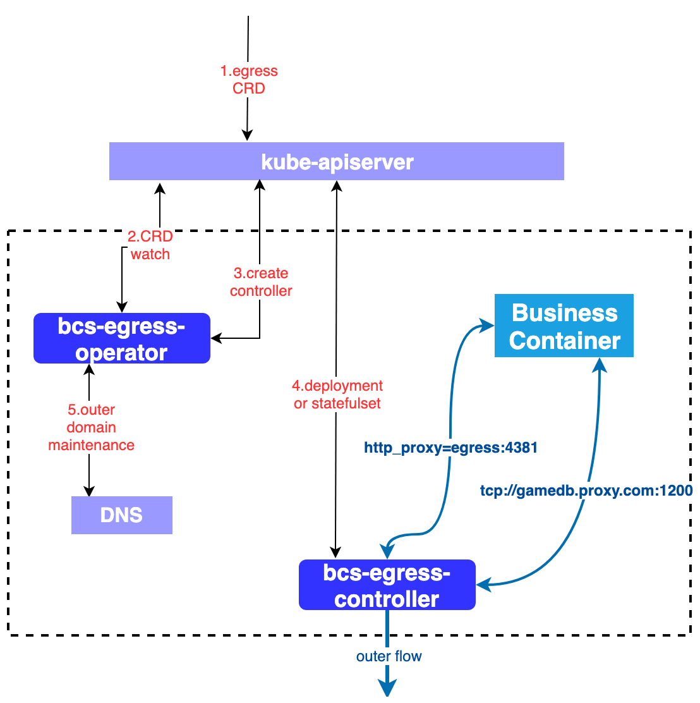

# 容器Egress流量代理方案

主要目标是为业务容器提供4层与7层流量代理方案，方便：
* 提供外网7层流量http proxy，统一管理外网流量
* 对接需要IP加白相关系统，屏蔽容器Pod IP漂移问题

## 方案架构



详细说明
* bcs-egress-operator功能
  * CRD端口冲突校验、egress状态校验
  * bcs-egress-controller启动、监控与状态管理、更新等
  * 4层转发域名管理
* bcs-egress-controller功能
  * 监听对应CRD数据变化，用于同步数据规则
  * 通过Nginx设置4层tcp转发规则
  * 通过Nginx设置7层http_proxy转发规则
  * controller需要使用容器集群外部DNS服务

相关流程说明，以域名gamedb.proxy.com tcp流量转发为例，其中egress-operator部分：
1. 创建egress CRD资源
2. operator确认当前CRD资源有效性
   * 域名gamedb.proxy.com是否与当前已注册域名冲突
   * 使用端口是否与已注册端口冲突
3. 确认CRD映射的controller有效性
   * 如果不存在则创建，使用Deployment实例化controller实例
   * 实例已存在，忽略当前CRD中对controller定义
4. 刷新controller在CRD中引用状态，一对多关系
5. 针对CRD中域名信息gamedb.proxy.com映射至controller IP列表，更新至K8S域名体系

其中egress-controller部分：
1. 监听所有BCSEgress CRD资源，并过滤指向本controller CRD资源
2. 如果是新建CRD资源事件，明确设定finalizer，用于CRD删除时规则清理
3. 确认BCSEgress规则与本地缓存规则映射状态，如果不同步，进行规则同步
4. 同步刷新Nginx代理规则
5. 更新BCSEgress.State与SyncedAt时间

业务容器访问gamedb.proxy.com tcp流量时，解析至controller服务的Service IP，转入controller实现流量转发至集群外部目标。

针对http流量，在不拦截7层域名的状态下，通过配置HTTP_PROXY参数实现7层代理，流量通过controller容器对外访问。

## CRD设计

egress规则设计，单个资源CRD资源允许填写多个http、tcp规则。

```yaml
apiVersion: bkbcs.tencent.com/v1alpha1
kind: BCSEgress
metadata:
  name: hn1-egress
  namespace: hn1
spec:
  controller:
    #以下为默认配置
    namespace: bcs-system
    name: egress-controller
  rules:
    tcp:
      - sourceport: 8080
        destport: 8080
        ips: gamedb.proxy.tencent.com
    http:
      - tls: true
        host: wechatpay.api.com
status:
  state: /Pending/Synced/Unknown/Error
  httpActives: 10
  tcpActives: 3
  reason: "controller is error"
  syncedAt: "2020-05-20 20:15:35"
```

相关配置与字段说明：
* controller: 用于映射controller实例，为了实现规则和多租户隔离，集群内允许多个egress-controller存在
  * namespace：egress-controller所在namespace，默认地使用bcs-system
  * name：controller实例化名称，默认为egress-controller
* rules：代理映射规则
  * tcp.ips：可以是ip地址列表，逗号分隔；也可以是域名，如果是域名要求controller使用外部DNS服务
  * tcp.destport: 所有后端使用的服务端口
  * tcp.sourceport: 容器网络环境内使用的代理端口，需要避免与其他代理服务冲突（operator会进行数据校验）
  * http.host: 针对7层代理设置对应Host
  * http.tls: 是否是https
* status: Egress规则状态
  * state
    * Pending: 规则同步状态，controller需要使用该状态确认已经经过operator校验
    * Synced: 规则已完成同步，httpActive和tcpActive已同步更新
    * Unknown: operator确认controller容器失联，标注为unknown
    * Error: 规则异常或者controller规则刷新异常，具体信息在reason中
  * syncedAt: 规则正常同步时间(必须产生变化才会更新该字段)

自定义BCSEgress-controller配置，用于扩展定制controller部署。主要由operator来统一维护，在维护BCSEgress规则数据
的基础上，继续管理controller状态信息，用于简化对controller使用。内容需要包含以下信息：
* controller使用的资源信息，调度信息等
* controller autoscaler信息，方便设定autoscaler

```yaml
apiVersion: bkbcs.tencent.com/v1
kind: BCSEgressController
metadata:
  name: hn1-egress
  namespace: bcs-system
spec:
    #以下为默认配置
    selector: 
      node: some-nodes
    image: bk-gz.tencentcloudcr.com/public/bcs-egress-controller:1.18.1-alpha
    minReplicas: 2
    maxReplicas: 10
    CPUPercentage: 60
    MemPercentage: 60
    resource: 
      cpu: 4096
      mem: 4096
```

相关字段信息：
* selector: 用于影响controller部署的节点，后续用于扩展相关调度亲和信息
* image: 创建controller使用的镜像
* resource: 单个Pod资源需求
* minReplicas: controller默认最小实例个数
* maxReplicas: controller最大实例个数
* CPUPercentage、MEMPercentage: CPU和内存扩容基线，用于autoscaler

## 开发计划

operator与controller是管理与被管理关系，两者优先开发controller，再支持operator模式

1. 基于BCSEgress开发bcs-egress-controller
  * Nginx基础镜像构建，支持4层、7层正向代理
  * bcs-egress-controller开发，用于映射BCSEgress规则至Nginx配置模板
2. 基于BCSEgress/BCSEgressContreoller开发bcs-egress-operator
  * 校验BCSEgress 域名端口信息
  * 校验与管理egresscontroller状态

