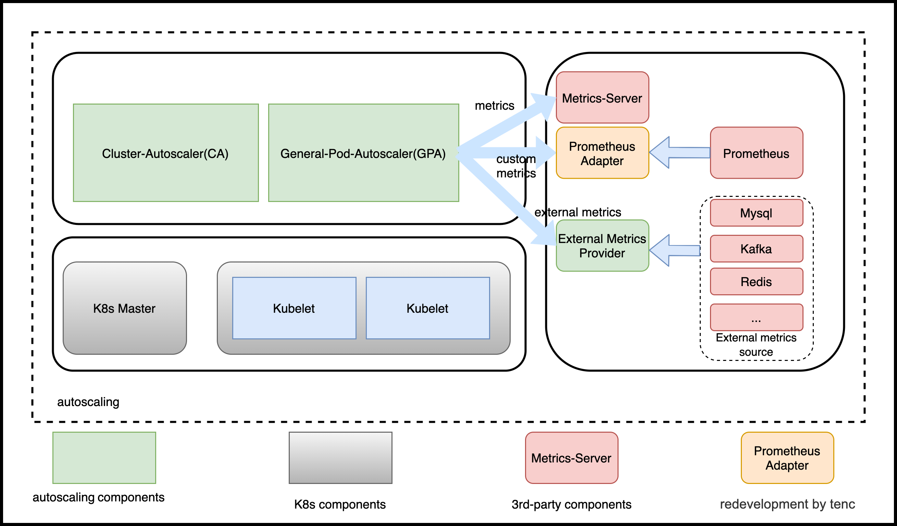
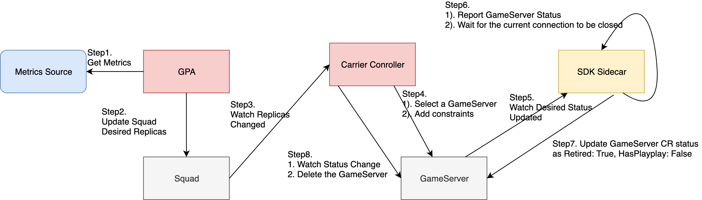

## 介绍

General Pod Autoscaler(GPA)是 [K8s HPA](https://kubernetes.io/zh/docs/tasks/run-application/horizontal-pod-autoscale/) 的扩展，即可以用于服务，也可以用于游戏。

## GPA 特点

1. 不依赖于 `K8s` 版本，可以运行于 `K8s 1.8、1.9、1.19` 等版本，只需要集群支持  `CRD`  ;
2. 通过GPA的 `Provider`  ， 可以支持更多外部数据源，包括 `kafka`  , `redis`  等；
3. 支持更多伸缩模式，灵活性、扩展性更强，如  `webhook`  、  `crontab`  等;
4. `GPA` 升级灵活，升级时不需要重启 `K8s` 核心组件。

## 部署

安装 GPA，helm chart信息位于bk-bcs/install/helm/bcs-general-pod-autoscaler

```shell
helm upgrade bcs-general-pod-autoscaler helm/bcs-general-pod-autoscaler -n bcs-system --install
```

## Designation

### 架构




- GPA

基于HPA开发的通用Pod扩缩容组件，覆盖了HPA的所有功能。

- External Metrics Provider

实现了外部资源的Provider, 可以支持自定义外部资源。


### HPA和GPA的区别 

GPA 是基于 [HPA v2beta2](https://github.com/kubernetes/api/blob/master/autoscaling/v2beta2) 设计的。 因此，它涵盖了 [HPA](https://kubernetes.io/zh/docs/tasks/run-application/horizontal-pod-autoscale/) 的所有功能。 

以下内容为例： 一个workload使用HPA和GPA的yaml差异

- HPA
```yaml
apiVersion: autoscaling/v2beta2
kind: HorizontalPodAutoscaler
metadata:
  name: test
spec:
  maxReplicas: 10
  minReplicas: 2
  metrics:
  - resource:
      name: cpu
      target:
        averageValue: 20
        type: AverageValue
    type: Resource
  scaleTargetRef:
    apiVersion: carrier.bkbcs.tencent.com/v1alpha1
    kind: Squad
    name: squad-example1
```

- GPA
```yaml
apiVersion: autoscaling.bkbcs.tencent.com/v1alpha1
kind: GeneralPodAutoscaler
metadata:
  name: test
spec:
  maxReplicas: 10
  minReplicas: 2
  metric:   ##difference
    metrics:
    - resource:
        name: cpu
        target:
          averageValue: 20
          type: AverageValue
      type: Resource
  scaleTargetRef:
    apiVersion: carrier.bkbcs.tencent.com/v1alpha1
    kind: Squad
    name: squad-example1
```

可以看到
- GPA的yaml中spec里包含了metric，通过metric内嵌了metrics字段
- HPA的yaml中spec直接包含了metrics字段

此外GPA支持更多的伸缩模式，包含：event, crontab, webhook。

#### Spec的区别

- HPA
```go
// HorizontalPodAutoscalerSpec describes the desired functionality of the HorizontalPodAutoscaler.
type HorizontalPodAutoscalerSpec struct {
	// scaleTargetRef points to the target resource to scale, and is used to the pods for which metrics
	// should be collected, as well as to actually change the replica count.
	ScaleTargetRef CrossVersionObjectReference `json:"scaleTargetRef" protobuf:"bytes,1,opt,name=scaleTargetRef"`
	// minReplicas is the lower limit for the number of replicas to which the autoscaler
	// can scale down.  It defaults to 1 pod.  minReplicas is allowed to be 0 if the
	// alpha feature gate HPAScaleToZero is enabled and at least one Object or External
	// metric is configured.  Scaling is active as long as at least one metric value is
	// available.
	// +optional
	MinReplicas *int32 `json:"minReplicas,omitempty" protobuf:"varint,2,opt,name=minReplicas"`
	// maxReplicas is the upper limit for the number of replicas to which the autoscaler can scale up.
	// It cannot be less that minReplicas.
	MaxReplicas int32 `json:"maxReplicas" protobuf:"varint,3,opt,name=maxReplicas"`
	// metrics contains the specifications for which to use to calculate the
	// desired replica count (the maximum replica count across all metrics will
	// be used).  The desired replica count is calculated multiplying the
	// ratio between the target value and the current value by the current
	// number of pods.  Ergo, metrics used must decrease as the pod count is
	// increased, and vice-versa.  See the individual metric source types for
	// more information about how each type of metric must respond.
	// If not set, the default metric will be set to 80% average CPU utilization.
	// +optional
	Metrics []MetricSpec `json:"metrics,omitempty" protobuf:"bytes,4,rep,name=metrics"`

	// behavior configures the scaling behavior of the target
	// in both Up and Down directions (scaleUp and scaleDown fields respectively).
	// If not set, the default HPAScalingRules for scale up and scale down are used.
	// +optional
	Behavior *HorizontalPodAutoscalerBehavior `json:"behavior,omitempty" protobuf:"bytes,5,opt,name=behavior"`
}
```

- GPA

```go
// GeneralPodAutoscalerSpec describes the desired functionality of the GeneralPodAutoscaler.
type GeneralPodAutoscalerSpec struct {
	// DrivenMode is the mode the open autoscaling mode if we do not need scaling according to metrics.
	// including MetricMode, TimeMode, EventMode, WebhookMode
	// +optional
	AutoScalingDrivenMode `json:",inline"`

	// scaleTargetRef points to the target resource to scale, and is used to the pods for which metrics
	// should be collected, as well as to actually change the replica count.
	ScaleTargetRef CrossVersionObjectReference `json:"scaleTargetRef" protobuf:"bytes,1,opt,name=scaleTargetRef"`

	// minReplicas is the lower limit for the number of replicas to which the autoscaler
	// can scale down.  It defaults to 1 pod.  minReplicas is allowed to be 0 if the
	// alpha feature gate GPAScaleToZero is enabled and at least one Object or External
	// metric is configured.  Scaling is active as long as at least one metric value is
	// available.
	// +optional
	MinReplicas *int32 `json:"minReplicas,omitempty" protobuf:"varint,2,opt,name=minReplicas"`

	// maxReplicas is the upper limit for the number of replicas to which the autoscaler can scale up.
	// It cannot be less that minReplicas.
	MaxReplicas int32 `json:"maxReplicas" protobuf:"varint,3,opt,name=maxReplicas"`

	// behavior configures the scaling behavior of the target
	// in both Up and Down directions (scaleUp and scaleDown fields respectively).
	// If not set, the default GPAScalingRules for scale up and scale down are used.
	// +optional
	Behavior *GeneralPodAutoscalerBehavior `json:"behavior,omitempty" protobuf:"bytes,4,opt,name=behavior"`
}

// ExternalAutoScalingDrivenMode defines the mode to trigger auto scaling
type AutoScalingDrivenMode struct {
	// MetricMode is the metric driven mode.
	// +optional 
	MetricMode *MetricMode `json:"metric,omitempty" protobuf:"bytes,1,opt,name=metric"`

	// Webhook defines webhook mode the allow us to revive requests to scale.
	// +optional
	WebhookMode *WebhookMode `json:"webhook,omitempty" protobuf:"bytes,2,opt,name=webhook"`

	// Time defines the time driven mode, pod would auto scale to max if time reached
	// +optional
	TimeMode *TimeMode `json:"time,omitempty" protobuf:"bytes,3,opt,name=time"`

	// EventMode is the event driven mode
	// +optional
	EventMode *EventMode `json:"event,omitempty" protobuf:"bytes,4,opt,name=event"`
}
```

GPA支持更多的模式。

- MetricMode 
  
该模式和原生 [HPA](https://github.com/kubernetes/community/blob/master/contributors/design-proposals/autoscaling/hpa-v2.md) 使用metric的方式一致。

- WebhookMode

Webhook模式支持用户提供一个webhook server、相关的接口，由GPA进行调用。其定义如下：

```go
// WebhookMode allow users to provider a server
type WebhookMode struct {
	*admregv1b.WebhookClientConfig `json:",inline"`
	// Parameters are the webhook parameters
	Parameters map[string]string `json:"parameters,omitempty" protobuf:"bytes,1,opt,name=parameters"`
}
```

- TimeMode 

TimeMode支持Crontab的模式，可以配置多个时间段，扩容到指定数量。

```go
// TimeMode is a mode allows user to define a crontab regular
type TimeMode struct {
	// TimeRanges defines a array that for time driven mode
	TimeRanges []TimeRange `json:"ranges,omitempty" protobuf:"bytes,1,opt,name=ranges"`
}

// TimeTimeRange is a mode allows user to define a crontab regular
type TimeRange struct {
// Schedule should match crontab format
Schedule string `json:"schedule,omitempty" protobuf:"bytes,1,opt,name=schedule"`

// DesiredReplicas is the desired replicas required by timemode,
DesiredReplicas int32 `json:"desiredReplicas,omitempty" protobuf:"varint,2,opt,name=desiredReplicas"`
}
```

- EventMode

EventMode支持使用外部数据源包括 `kafka` 、`redis` 等。

```go
// EventMode is the event driven mode
type EventMode struct {
    // Triggers are thr event triggers
    Triggers []ScaleTriggers `json:"triggers"`
}

// ScaleTriggers reference the scaler that will be used
type ScaleTriggers struct {
	// Type are the trigger type
	Type string `json:"type"`
	// Name is the trigger name
	// +optional
	Name string `json:"name,omitempty"`
	// Metadata contains the trigger config
	Metadata map[string]string `json:"metadata"`
}
```

## 创建GeneralPodAutoscaler

GeneralPodAutoscaler(GPA) 完全兼容 [K8s HPA](https://kubernetes.io/zh/docs/tasks/run-application/horizontal-pod-autoscale/) 的功能。同时，GPA 支持 Crontab 、Webhook 等方式。


### 前置条件

创建一个如下的squad

```shell script
# cat <<EOF | kubectl apply -f -
apiVersion: carrier.bkbcs.tencent.com/v1alpha1
kind: Squad
metadata:
  name: squad-example
  namespace: default
spec:
  replicas: 2
  strategy:
    rollingUpdate:
      maxSurge: 1
      maxUnavailable: 1
    type: RollingUpdate
  template:
    metadata:
      labels:
        foo: squad-example
    spec:
      health:
        disabled: true
      ports:
      - container: simple-udp
        containerPort: 7654
        hostPort: 7777
        name: default
        portPolicy: Static
        protocol: UDP
      sdkServer:
        grpcPort: 9020
        httpPort: 9021
        logLevel: Info
      template:
        spec:
          containers:
          - image: nginx
            imagePullPolicy: Always
            name: server
          serviceAccount: carrier-sdk
          serviceAccountName: carrier-sdk
EOF
```

### Crontab (定时扩缩模式)
基于Crontab语法，支持多时间段

```shell script
# cat <<EOF | kubectl apply -f -
apiVersion: autoscaling.bkbcs.tencent.com/v1alpha1
kind: GeneralPodAutoscaler
metadata:
  name: pa-test1
spec:
  maxReplicas: 8
  minReplicas: 2
  scaleTargetRef:
    apiVersion: carrier.bkbcs.tencent.com/v1alpha1
    kind: Squad
    name: squad-example
  time:
    ranges:
    - desiredReplicas: 4
      schedule: '*/1 2-3 * * *'
    - desiredReplicas: 6
      schedule: '*/1 4-5 * * *'
EOF

# kubectl get pa pa-squad
NAME       MINREPLICAS   MAXREPLICAS   DESIRED   CURRENT   TARGETKIND   TARGETNAME
pa-squad   1             8             4         4         Squad        squad-example
# date
Wed Nov 25 11:58:28 CST 2020
```


### Webhook

webhook模式，支持业务自定义开发一个webhook，来定义何时伸缩，以下是一个例子：

保证有2个可用的空闲GameServer

```shell script
# cat <<EOF | kubectl apply -f -
apiVersion: autoscaling.bkbcs.tencent.com/v1alpha1
kind: GeneralPodAutoscaler
metadata:
  name: pa-squad
  namespace: default
spec:
  maxReplicas: 8
  minReplicas: 1
  scaleTargetRef:
    apiVersion: carrier.bkbcs.tencent.com/v1alpha1
    kind: Squad
    name: squad-example
  webhook:
    parameters:
      buffer: "2"
    service:
      name: gpa-webhook
      namespace: kube-system
      path: scale
      port: 8000
EOF

# kubectl get pa pa-squad
NAME       MINREPLICAS   MAXREPLICAS   DESIRED   CURRENT   TARGETKIND   TARGETNAME
pa-squad   1             8             2         4         Squad        squad-example
```

### Mix webhook and crontab
混合多种模式进行自动伸缩

```shell script
# cat <<EOF | kubectl apply -f -
apiVersion: autoscaling.bkbcs.tencent.com/v1alpha1
kind: GeneralPodAutoscaler
metadata:
  name: pa-squad
  namespace: default
spec:
  maxReplicas: 8
  minReplicas: 1
  scaleTargetRef:
    apiVersion: carrier.bkbcs.tencent.com/v1alpha1
    kind: Squad
    name: squad-example
  time:
    ranges:
    - desiredReplicas: 4
      schedule: '*/1 10-23 * * *'
  webhook:
    parameters:
      buffer: "2"
    service:
      name: gpa-webhook
      namespace: kube-system
      path: scale
      port: 8000
EOF

# kubectl get pa pa-squad
NAME       MINREPLICAS   MAXREPLICAS   DESIRED   CURRENT   TARGETKIND   TARGETNAME
pa-squad   1             8             2         4         Squad        squad-example
```

### Metric
通过metric的方式弹性伸缩


#### In-tree metrics
内置的指标包括： cpu、memory                   

```shell script
# cat <<EOF | kubectl apply -f -
apiVersion: autoscaling.bkbcs.tencent.com/v1alpha1
kind: GeneralPodAutoscaler
metadata:
  name: pa-squad-metric
spec:
  maxReplicas: 10
  minReplicas: 2
  metric:
    metrics:
    - resource:
        name: cpu
        target:
          averageValue: 20
          type: AverageValue
      type: Resource
    - resource:
        name: memory
        target:
          averageValue: 50m
          type: AverageValue
      type: Resource
  scaleTargetRef:
    apiVersion: carrier.bkbcs.tencent.com/v1alpha1
    kind: Squad
    name: squad-example1
EOF

# kubectl get pa pa-squad-metric
NAME              MINREPLICAS   MAXREPLICAS   DESIRED   CURRENT   TARGETKIND   TARGETNAME
pa-squad-metric   2             10            4         2         Squad        squad-example1

# kubectl get pa pa-squad-metric
NAME              MINREPLICAS   MAXREPLICAS   DESIRED   CURRENT   TARGETKIND   TARGETNAME
pa-squad-metric   2             10            4         8         Squad        squad-example1

# kubectl top pod
NAME                                     CPU(cores)   MEMORY(bytes)              
squad-example1-8665fc7ff5-bdvcj          1m           9Mi             
squad-example1-8665fc7ff5-x7znq          1m           10Mi            
squad-example1-8665fc7ff5-xrkng          5m           10Mi            
squad-example1-8665fc7ff5-xzntk          5m           10Mi            

# kubectl get pa pa-squad-metric
NAME              MINREPLICAS   MAXREPLICAS   DESIRED   CURRENT   TARGETKIND   TARGETNAME
pa-squad-metric   2             10            10        10        Squad        squad-example1

# kubectl top pod
NAME                                     CPU(cores)   MEMORY(bytes)  
squad-example1-8665fc7ff5-8h5rs          1m           10Mi            
squad-example1-8665fc7ff5-bdvcj          1m           10Mi            
squad-example1-8665fc7ff5-kf4tz          1m           10Mi            
squad-example1-8665fc7ff5-kx5px          1m           10Mi            
squad-example1-8665fc7ff5-ldcm7          1m           8Mi             
squad-example1-8665fc7ff5-mknnk          1m           9Mi             
squad-example1-8665fc7ff5-wdlrl          1m           10Mi            
squad-example1-8665fc7ff5-x7znq          1m           10Mi            
squad-example1-8665fc7ff5-xrkng          1m           10Mi            
squad-example1-8665fc7ff5-xzntk          1m           10Mi  
```

#### custom metric
自定义指标：我们提供了出cpu 内存之外的指标，可以使用网卡流量等，或者业务自定的一些指标

```shell script
# cat <<EOF | kubectl apply -f -
apiVersion: autoscaling.bkbcs.tencent.com/v1alpha1
kind: GeneralPodAutoscaler
metadata:
  name: pa-squad-metric-custom
spec:
  maxReplicas: 10
  minReplicas: 2
  metric:
    metrics:
      - type: Pods
        pods:
          metric:
            name: memory_rss
          target:
            averageValue: 10m
            type: AverageValue
  scaleTargetRef:
    apiVersion: carrier.bkbcs.tencent.com/v1alpha1
    kind: Squad
    name: squad-example2
EOF

# kubectl get pa pa-squad-metric-custom
NAME                     MINREPLICAS   MAXREPLICAS   DESIRED   CURRENT   TARGETKIND   TARGETNAME
pa-squad-metric-custom   2             10            10        10        Squad        squad-example2
```

## 常见问题

### 如何实现 `扩容` GameServer

扩容GameServer和其余workload, 如:deployment等行为一致，GPA只会修改workload的replicas字段，具体的行为用对应controller控制。

### 如何实现 `缩容` GameServer

详细的 GameServer 缩容过程如下：



### 怎么控制 `扩/缩容` 的具体 `行为`

`spec` 中定义:
```go
// GeneralPodAutoscalerBehavior configures the scaling behavior of the target
// in both Up and Down directions (scaleUp and scaleDown fields respectively).
type GeneralPodAutoscalerBehavior struct {
	// scaleUp is scaling policy for scaling Up.
	// If not set, the default value is the higher of:
	//   * increase no more than 4 pods per 60 seconds
	//   * double the number of pods per 60 seconds
	// No stabilization is used.
	// +optional
	ScaleUp *GPAScalingRules `json:"scaleUp,omitempty" protobuf:"bytes,1,opt,name=scaleUp"`
	// scaleDown is scaling policy for scaling Down.
	// If not set, the default value is to allow to scale down to minReplicas pods, with a
	// 300 second stabilization window (i.e., the highest recommendation for
	// the last 300sec is used).
	// +optional
	ScaleDown *GPAScalingRules `json:"scaleDown,omitempty" protobuf:"bytes,2,opt,name=scaleDown"`
}
```

例子:

- 60秒内缩容只缩容1个副本

```yaml
apiVersion: autoscaling.bkbcs.tencent.com/v1alpha1
kind: GeneralPodAutoscaler
metadata:
  name: pa-squad-metric
spec:
  maxReplicas: 10
  minReplicas: 2
  metric:
    metrics:
    - resource:
        name: cpu
        target:
          averageValue: 20
          type: AverageValue
      type: Resource
  scaleTargetRef:
    apiVersion: carrier.bkbcs.tencent.com/v1alpha1
    kind: Squad
    name: squad-example1
  behavior:
    scaleDown:
      stabilizationWindowSeconds: 300 # default 300 for scale down, 0 for scale up
      policies:
      - type: Pods
        value: 1
        periodSeconds: 60
      selectPolicy: Max # Max, or Min, used when we have multiple policies. Disabled: do not scale down
```


- 60秒内只缩容10%的副本

```yaml
apiVersion: autoscaling.bkbcs.tencent.com/v1alpha1
kind: GeneralPodAutoscaler
metadata:
  name: pa-squad-metric
spec:
  maxReplicas: 10
  minReplicas: 2
  metric:
    metrics:
    - resource:
        name: cpu
        target:
          averageValue: 20
          type: AverageValue
      type: Resource
  scaleTargetRef:
    apiVersion: carrier.bkbcs.tencent.com/v1alpha1
    kind: Squad
    name: squad-example1
  behavior:
    scaleDown:
      policies:
      - type: Percent
        value: 10
        periodSeconds: 60
```

`扩容` 的相关配置和 `缩容` 一致。
GPA的 `Scaling behavior` 配置与[K8s HPA Scaling behavior](https://kubernetes.io/zh/docs/tasks/run-application/horizontal-pod-autoscale/#support-for-configurable-scaling-behaviour)保持一致。

### 如何为 GPA webhook 模式开发一个 webhook server 

我们为 workload 开发了一个[demo](https://github.com/ocgi/carrier-webhook)。

- 开发

我们可以参考 [api](../../../bcs-k8s/bcs-general-pod-autoscaler/pkg/requests/api.go) ，它的定义如下：

```go

// AutoscaleRequest defines the request to webhook autoscaler endpoint
type AutoscaleRequest struct {
	// UID is used for tracing the request and response.
	UID types.UID `json:"uid"`
	// Name is the name of the workload(Squad, Statefulset...) being scaled
	Name string `json:"name"`
	// Namespace is the workload namespace
	Namespace string `json:"namespace"`
	// Parameters are the parameter that required by webhook
	Parameters map[string]string `json:"parameters"`
	// CurrentReplicas is the current replicas
	CurrentReplicas int32 `json:"currentReplicas"`
}

// AutoscaleResponse defines the response of webhook server
type AutoscaleResponse struct {
	// UID is used for tracing the request and response.
	// It should be same as it in the request.
	UID types.UID `json:"uid"`
	// Set to false if should not do scaling
	Scale bool `json:"scale"`
	// Replicas is targeted replica count from the webhookServer
	Replicas int32 `json:"replicas"`
}

// AutoscaleReview is passed to the webhook with a populated Request value,
// and then returned with a populated Response.
type AutoscaleReview struct {
	Request  *AutoscaleRequest  `json:"request"`
	Response *AutoscaleResponse `json:"response"`
}

```

1. 发送到 webhook 服务器的请求，将包含 `workload name`、`namespace`、`parameters` 和 `currentReplicas` 的信息。
2. Webhook 应根据特殊策略返回包含 `scale` 和 `replicas` 的响应。 如果不需要缩容，请将 `scale` 设置为 `false`。

- 部署

1. 部署一个 [webhook server](examples/kubernetes/demo-webhook.yaml) ，我们可以不在 K8s 中部署它
2. 基于 [webhook server](examples/webhook.yaml) 扩展 workload  
   
    如果是在 k8s 中部署 webhook, 我们可以在服务信息中添加 `service` 字段
    ```yaml
    apiVersion: autoscaling.bkbcs.tencent.com/v1alpha1
    kind: GeneralPodAutoscaler
    metadata:
      name: pa-test1
    spec:
      maxReplicas: 8
      minReplicas: 2
      scaleTargetRef:
        apiVersion: carrier.bkbcs.tencent.com/v1alpha1
        kind: GameServerSet
        name: example
      webhook:
        service:
          namespace: kube-system
          name: demowebhook
          port: 8000
          path: scale
        parameters:
          buffer: "3"   
    ```

    如果不是在k8s中部署, 我们在 `service` 字段中使用 `url` 

    ```yaml
    apiVersion: autoscaling.bkbcs.tencent.com/v1alpha1
    kind: GeneralPodAutoscaler
    metadata:
      name: pa-test1
    spec:
      maxReplicas: 8
      minReplicas: 2
      scaleTargetRef:
        apiVersion: carrier.bkbcs.tencent.com/v1alpha1
        kind: GameServerSet
        name: example
      webhook:
        url: http://123.test.com:8080/scale
        parameters:
          buffer: "3"   
    ```
