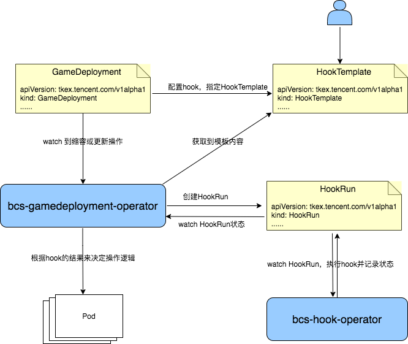

# hook-operator

bcs-hook-operator是蓝鲸自定义workload扩展的一部分，它的主要功能用来处理应用扩缩容和发布更新过程中的
各种 hook操作。主要包含两个 crd：HookTemplate 和 HookRun。  

* HookTemplate: 用来定义一个 hook 的模板，在 provider 中定义 hook 的类型。目前支持两种类型的 hook：webhook 和 prometheus。  
* HookRun: HookRun 是一个实际运行的 hook，由 hookrun-controller 控制和维护其状态和生命周期。

## 原理简介

我们在深刻挖掘业务需求和调研解决方案后，在 kubernetes 层面抽象出了一个通用的 operator: bcs-hook-operator。
bcs-hook-operator 主要职责是根据 hook 模板执行 hook 操作并记录 hook 的状态，GameDeployment 或 GameStatefulSet watch hook 的最终状态，根据 hook 结果来决定下一步执行何种操作。

GameDeployment/GameStatefulSet 与 bcs-hook-operator 在应用发布过程中使用 hook 时的交互架构图：



## 安装

helm chart信息位于bk-bcs/install/helm/bcs-hook-operator

```shell
helm upgrade bcs-hook-operator helm/bcs-hook-operator -n bcs-system --install
```

## HookTemplate 模板

下面是一个 HookTemplate 的定义：  
```yaml
apiVersion: tkex.tencent.com/v1alpha1
kind: HookTemplate
metadata:
  name: test
spec:
  args:  
    - name: service-name
      value: test-gamedeployment-svc.default.svc.cluster.local
    - name: PodName
  metrics:
  - name: webtest
    count: 2
    interval: 60s
    failureLimit: 0
    successCondition: "asInt(result) < 30"
    provider:
      web:
        url: http://1.1.1.1:9091
        jsonPath: "{$.age}"
```

* args  
配置 hook 需要的参数。可以只配置 key， value 由创建 HookRun 时传入。  
* metrics    
在模板的 metrics 中可以定义多个 metric，每个 metric 可以配置一个 hook 调用，metric 中的 provider 定义了该 hook 的类型。  
* count  
count 表示该 metric 需要完成的 hook 调用的次数。如果 count 和 interval 都没配置，将只进行一次 hook 调用。如果只配置了 interval, 将会无限制
地一直进行 hook 调用。如果 count 大于 1，必须配置 interval。  
* interval  
interval 表示两次 hook 调用间的时间间隔，如果没有定义，将只会进行一次 hook 调用。  
* successCondition  
successCondition 表示 hook 的成功条件。  
* failureCondition  
failureCondition 表示 hook 的失败条件。  
* failureLimit  
failureLimit 定义了允许的失败次数，默认为 0，即只要有一次返回是失败的，那这个 metric 就是失败的。  
* consecutiveErrorLimit  
允许的 hook 连续产生 error 的次数。  
* provider  
hook 的类型，目前仅支持 webhook 和 prometheus。  
以 webhook 类型为例，url 定义了 webhook 调用的地址，jsonPath 表示提取返回 json 中的某个字段。  
url 中可以通过模板的形式配置，比如 http://{{ args.PodIP }}:9091，hookrun-controller 在进行 hook 调用时会通过 args 渲染出真实值。  
当前 webhook 类型只支持 GET 方式，后续考虑增加 POST 方式。  

以上面这个HookTemplate为例，定义了一个Webhook类型的metric，url地址为 http://1.1.1.1:9091，web调用的结果返回示例如下：

```shell
$ curl http://1.1.1.1:9091
{"name":"bryan","male":"yes","age":45}
```

jsonPath 定义为 "{$.age}"，表示 result 的值取返回 json 中的 age 字段，successCondition 为 "asInt(result) < 30"，
表示如果返回的 age小于 30，那么这次 hook 调用的结果就是符合预期的。  

## HookRun

hookrun-controller 通过 HookRun crd 的定义来实际维护和控制一个 HookRun 的状态和生命周期。  
下面是 HookRun controller 创建和维护的一个 HookRun 的示例：  

```yaml
apiVersion: tkex.tencent.com/v1alpha1
kind: HookRun
metadata:
  creationTimestamp: "2020-11-09T10:08:49Z"
  generation: 2
  labels:
    gamedeployment-revision: test-gamedeployment-67864c6f65
    gamedeployment-type: Step
    step-index: "4"
  name: test-gamedeployment-67864c6f65-4-test
  namespace: default
  ownerReferences:
  - apiVersion: tkex.tencent.com/v1alpha1
    blockOwnerDeletion: true
    controller: true
    kind: GameDeployment
    name: test-gamedeployment
    uid: 08db1c6b-4b0a-4fda-86c4-04327f9a788f
  resourceVersion: "40202398"
  selfLink: /apis/tkex.tencent.com/v1alpha1/namespaces/default/hookruns/test-gamedeployment-67864c6f65-4-test
  uid: b3334c79-1d93-4b60-bf88-6583ee3dbfe4
spec:
  metrics:
  - name: webtest
    provider:
      web:
        jsonPath: '{$.age}'
        url: http://1.1.1.1:9091
    successCondition: asInt(result) < 30
  terminate: true
status:
  metricResults:
  - count: 1
    failed: 1
    measurements:
    - finishedAt: "2020-11-09T10:08:49Z"
      phase: Failed
      startedAt: "2020-11-09T10:08:49Z"
      value: "32"
    name: webtest
    phase: Failed
  phase: Failed
  startedAt: "2020-11-09T10:08:49Z"
```

status.phase 定义了该 HookRun 最后的运行状态。

HookRun 是根据模板 HookTemplate 创建的一个实际运行的 hook CRD，bcs-hook-operator 监测并控制 HookRun 
的运行状态和生命周期，根据其 metrics 中的定义来执行 hook 操作，并实时记录 hook 调用的结果。
