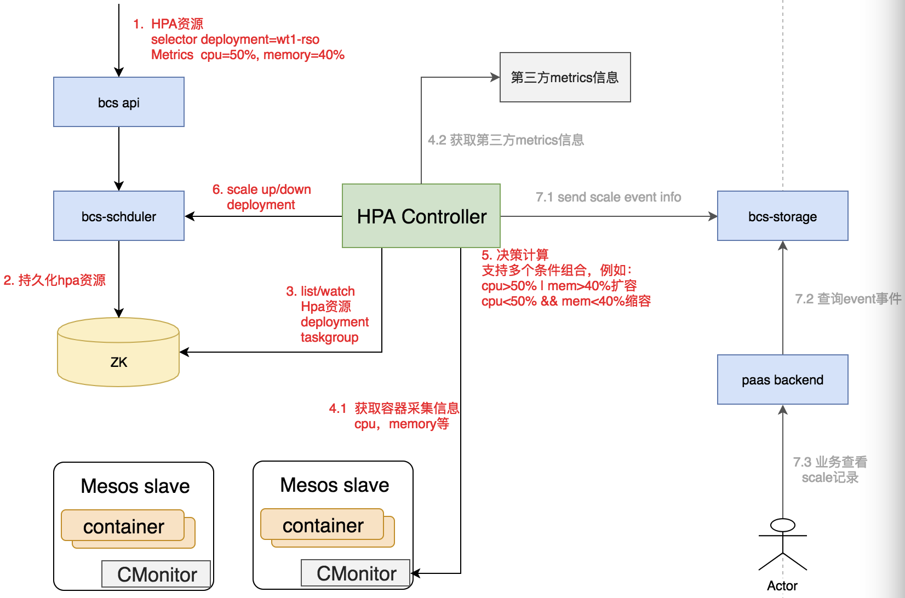
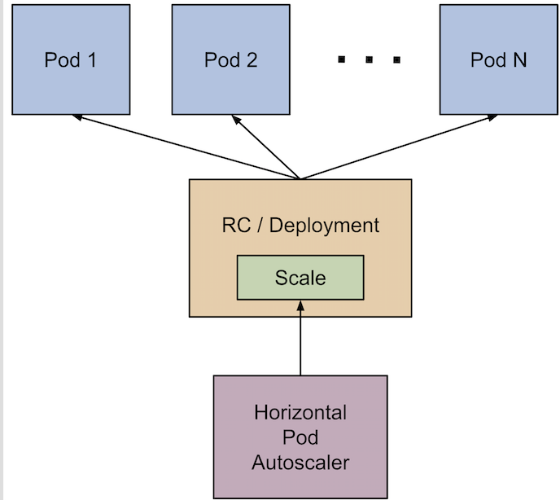

# 背景
有些业务服务，经常根据业务的负载情况（上升，下降）做一些扩容，缩容操作，人力成本较高；并且有时候流量突发，业务负载过高，导致服务不可用，此时人为扩容可能以及会影响到服务。
bcs支持基于业务容器的cpu，memory使用率以及业务自定义的metrics数据，自动的，快速的实现扩容，缩容操作，提高了业务的服务承载能力，并提升了机器的使用率。

## mesos方案
mesos方案新增加了Autoscaler资源用来描述业务容器自动伸缩的服务，整体架构如下图所示：


- 业务根据容器特点，定义了Autoscaler资源，并存储到mesos集群
- hpa-controller监听到autoscaler资源，开始对应用metrics进行监控
- CMonitor部署在每台物理机上面，负责对容器进行cpu，memory进行采集
- hpa-controller根据采集的容器metrics信息以及autoscaler定义，通过调用bcs-scheduler的scale up/down接口，实现自动伸缩
- 将扩缩容的操作存储到bcs-storage，用于告警以及查询

### Autoscaler定义
```
{
    "apiVersion": "v4",
    "kind": "autoscaler",
    "metadata": {
        "labels": {
            "auto-test": "auto-test"
        },
        "name": "auto-test",
        "namespace": "hpa-test"
    },
    "spec": {
        "scaleTargetRef": {
          "kind": "Deployment",
          "name": "deployment-test"
        },
        "minInstance": 2,
        "maxInstance": 10,
        "metrics":[
          {
            "type": "Resource",
            "name": "cpu",
            "described": "cpu utilization",
            "target": {
              "type": "AverageUtilization",
              "averageUtilization": 50
            }
          },
          {
            "type": "Resource",
            "name": "memory",
            "described": "memory utilization",
            "target": {
              "type": "AverageUtilization",
              "averageUtilization": 50
            }
          }
        ]
    }
}
```
**autoscaler字段信息**

- scaleTargetRef：自动扩缩容所绑定的应用，需要在同一个namespcae下面
  - kind：应用类型，例如：deployment，application
  - name：应用名称
- minInstance: 应用最小的实例个数
- maxInstance：应用最大的实例个数
- metrics：自动扩缩容策略，该字段为数组结构。
  - 扩容：扩容时，多个数组的条件为“或”的关系，其中一个满足即扩容
  - 缩容：缩容时，多个数组的条件为“与”的关系，需要全部满足再缩容
  - type: Resource表示cpu，memory资源；Taskgroup表示自定义metrics(暂时未支持)
  - name：metric name，例如：cpu,memory
  - described: metric描述
  - target.type:
    - AverageUtilization: value值的百分比计算，例如: cpu value=50，表示50%
    - AverageValue: value值的绝对值，例如：packets-per-second value=1000，表示平均每秒的收包数为1000

**相关机制**
- HPA的检查周期为为60s，可以通过设置bcs-hpacontroller的--collect_metrics_window参数调整
- 默认的HPA相对指标公差为10%，可以通过设置--autoscaler_tolerance参数调整
- HPA在最后一次扩容事件后等待3分钟，以使指标稳定下来，可以通过--upscale_stabilization参数调整
- HPA从最后一次缩容事件开始等待5分钟，以避免自动调节器抖动,可以通过--downscale_stabilization参数调整

### 自定义metric
**此特性暂时预留了接口，是下一个阶段需要实现的方案**

mesos方案默认提供容器cpu，memory的metrics采集，为了增加自动扩缩容的纬度，满足业务个性化的需求，mesos支持自定义metrics信息的采集，并且能够依赖自定义metrics实现自动扩缩容。
```
{
  "taskgroup-id-0": {
		"metricName": "packets-per-second",
		"timestamp": "1552297442",
		"window": 10,
		"value": 996
	},
	"taskgroup-id-1": {
		"metricName": "packets-per-second",
		"timestamp": "1552297442",
		"window": 10,
		"value": 1098
	}
}
```

- key: taskgroupId, 例如：taskgroup-id-0
- metricName：metric name
- timestamp：时间戳
- window：metric采集的窗口期，单位second，采集的窗口为[timestamp, timestamp+window]
- value: metric的value值

### 实践


## k8s方案
k8s方案是使用原生的hpa方案实现的，Horizontal-Pod-Autoscaler模块通过scale up/down RC/Deployment实现应用的自动伸缩功能，架构图如下：


当使用HPA的时候需要注意的地方
- HPA检查周期为30s可以通过设置controller manager的horizontal-pod-autoscaler-sync-period参数来改变
- 默认的HPA相对指标公差为10%
- HPA在最后一次扩容事件后等待3分钟，以使指标稳定下来。可通过horizontal-pod-autoscaler-upscale-delay参数来配置
- HPA从最后一次缩容事件开始等待5分钟，以避免自动调节器抖动。可通过horizontal-pod-autoscaler-downscale-delay参数来配置

详情请参照：
https://kubernetes.io/docs/tasks/run-application/horizontal-pod-autoscale/
https://kubernetes.io/docs/tasks/run-application/horizontal-pod-autoscale-walkthrough/