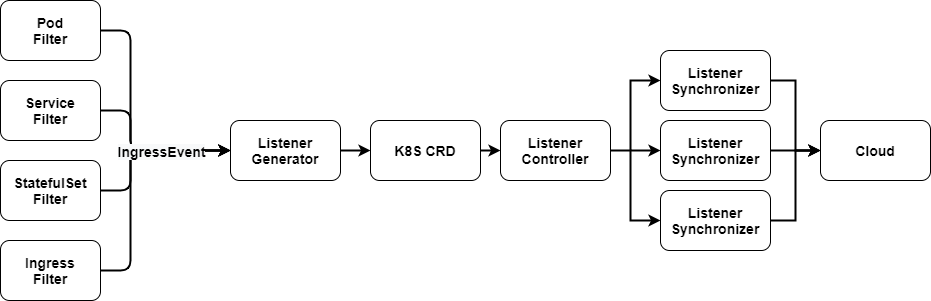
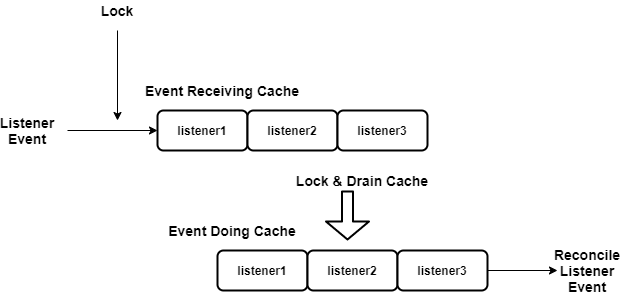

# bcs-ingress-controller design

## features

老版clb-controller存在一些局限性，比如事件管理比较混乱，单实例只能控制一个云负载均衡器实例，对于云接口抽象不够灵活等。
在clb-controller的基础上，重新设计了bcs-ingress-controller，具有如下特性

* 支持HTTPS，HTTP，TCP，UDP协议，支持clb多种详细参数设置
* 支持单个ingress控制多个可用去clb实例，方便接入层容灾
* 支持转发到NodePort模式和转发到直通Pod模式
* 支持单端口多Service流量转发，WRR负载均衡方法下权重配比，方便进行流量灰度和蓝绿更新
* 直通Pod模式下，支持Service内部通过Label选择Pod，WRR负载均衡方法下权重配比
* 支持StatefulSet和GameStatefulSet端口段映射（借助clb端口段特性，实现规则合并）
* 良好的观测性（Metrics和Event机制）
* 云接口的限流与重试
* 合并短期事件，防止抖动
* 多云服务商支持（coming soon）

## design

### architecture

* bcs-ingress-controller由两个controller组成。
  * ingress-controller：监听pod，service，eps和ingress等事件，经过计算得到对应listener，然后进行listener的差量更新
  * listener-controller：监听listener的事件，将listener事件同步至云上的负载均衡器中
* 对于每个云负载均衡器实例，bcs-ingress-controller会生成一个synchronizer协程
* 使用kuberbuilder生成ingress和listener的client，informer，lister
* 基于社区controller-runtime的事件驱动模型
* 当pod，service，endpoints，statefulset等对象发生变化时，相应的filter会反向查找关联的ingress，同时过滤掉不相关的对象

### worker cache

* 在容器运行过程中，可能在短时间内产生多次事件，导致产生多次listener事件，而listener事件的消费是比较耗时的事情，可能导致事件堆积
* 对于每一个synchronizer维护者两个cache，receiving cache用来缓存某个时间段内接受的事件，同时合并对于同一个listener事件；doing cache用来缓存正在被处理的任务，当任务失败时，不会从doing cache中删除，等待下一个周期重试。
