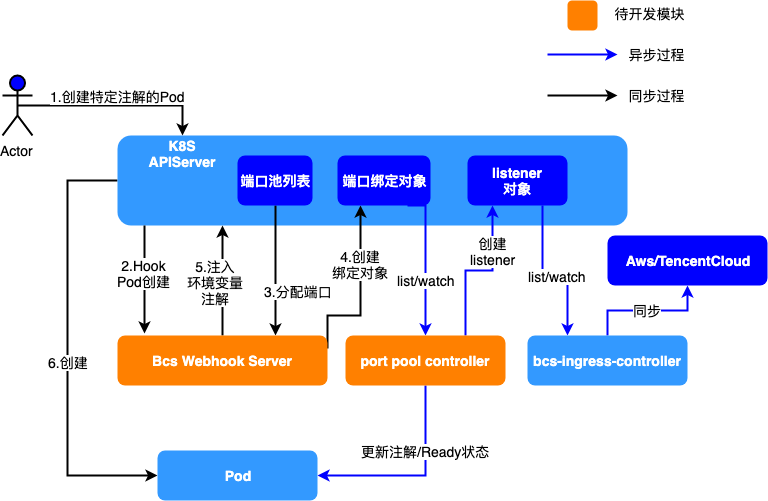

# 云负载均衡器端口池方案

## 动机

在某些业务场景下，某些服务为了减少延迟，通常直接对客户端对外提供公网IP和端口，例如游戏的[Dedicated Server](https://en.wikipedia.org/wiki/Game_server#Dedicated_server)。
然而，服务器直接配置公网IP地址会存在一定安全风险，同时也面临公网IP消耗量大，无法保证高可用等问题。所以各大云厂商都提供了高可用的云负载均衡器，通过介入云负载均衡器能实现防护网络攻击，收敛IP地址，消除单点故障的效果。  
在云原生架构下，各大云厂商的都提供了Kuberentes原生LoadBalancer和Ingress对接云负载均衡器的实现，但是并没有提供为单个服务实例暴露公网端口的能力。基于BCS提供的bcs-ingress-controller，用户可以实现为单个Pod分配一个或者一段端口，但是需要提前设计映射规则，在多环境多版本场景下，管理不够便捷直观。期望有一种更加直观的方案，在不需要提前设定映射规则的情况下，使得单个pod能够绑定云负载均衡器端口资源。该方案需要具有以下功能：

* 维护云负载均衡器端口资源池，能够动态地向资源池中增加和删除云负载均衡器
* Pod通过简单的annotation进行端口资源绑定
* Pod中程序需要读取到绑定的负载均衡器信息和端口信息，需要某种机制通知Pod绑定过程是否已完成
* 能够为Pod的同一端口分配多个云负载均衡器，实现多运营商接入
* 为端口分配增加时间窗口，使得同名Pod在重新调度之后能够复用原来的VIP和端口
* 为集群中可用端口资源提供可观测手段

## 方案架构



整体方案架构如上图所示

* 采取webhook的方式拦截Pod的创建过程，对存在特定annotation的Pod进行端口的提前分配和注入
* 复用原始bcs-ingress-controller同步能力

## 3. API定义

### 3.1 端口池PortPool定义

```golang
// PortPoolItem item of port pool
type PortPoolItem struct {
    ItemName        string   `json:"itemName"`
    LoadBalancerIDs []string `json:"loadBalancerIDs"`
    StartPort       uint32   `json:"startPort"`
    EndPort         uint32   `json:"endPort"`
    SegmentLength   uint32   `json:"segmentLength,omitempty"`
}

// PortPoolSpec defines the desired state of PortPool
type PortPoolSpec struct {  
    PoolItems         []*PortPoolItem           `json:"poolItems"`
    ListenerAttribute *IngressListenerAttribute `json:"listenerAttribute,omitempty"`
}

// PortPoolItemStatus status of a port pool item
type PortPoolItemStatus struct {
    ItemName              string                 `json:"itemName"`
    LoadBalancerIDs       []string               `json:"loadBalancerIDs,omitempty"`
    StartPort             uint32                 `json:"startPort"`
    EndPort               uint32                 `json:"endPort"`
    SegmentLength         uint32                 `json:"segmentLength"`
    PoolItemLoadBalancers []*IngressLoadBalancer `json:"poolItemLoadBalancers,omitempty"`
    Status                string                 `json:"status"`
    Message               string                 `json:"message"`
}

// PortPoolStatus defines the observed state of PortPool
type PortPoolStatus struct {
    PoolItemStatuses []*PortPoolItemStatus `json:"poolItems,omitempty"`
}

// PortPool is the Schema for the portpools API
type PortPool struct {
    metav1.TypeMeta   `json:",inline"`
    metav1.ObjectMeta `json:"metadata,omitempty"`

    Spec   PortPoolSpec   `json:"spec,omitempty"`
    Status PortPoolStatus `json:"status,omitempty"`
}
```

用户操作的yaml样例

```yaml
apiVersion: networkextension.bkbcs.tencent.com/v1
kind: PortPool
metadata:
  name: portpool-example1
  namespace: default
spec:
  # 在一个资源池中可以动态增删clb资源
  poolItems:
  - name: item1
    loadBalancerIDs: ["ap-shanghai:lb-test1", "lb-test11"]
    startPort: 30000
    endPort: 65000
  - name: item2
    loadBalancerID: ["ap-shenzhen:lb-test2"]
    startPort: 30000
    endPort: 65000
# status部分由BCS自动生成
status:
  poolItems:
  - name: item1
    poolItemLoadBalancers:
    - loadbalancerName: lb-test1-name
      loadBalancerID: lb-test1
      region: ap-shanghai
      type: public
      IPs: ["127.0.0.1"]
    - loadbalancerName: lb-test11-name
      loadBalancerID: lb-test11
      region: ap-shanghai
      type: public
      IPs: ["127.0.0.3"]
    status: Active
  - name: item2
    loadbalancerName: lb-test2-name
      loadBalancerID: lb-test2
      region: ap-shenzhen
      type: public
      IPs: ["127.0.0.2"]
    status: Active
```

### 3.2 PortBinding定义

PortBinding对象用来记录一个Pod绑定的端口资源，以及资源的绑定状态

```golang
// PortBindingItem defines the port binding item
type PortBindingItem struct {
    PoolName              string                    `json:"poolName"`
    PoolNamespace         string                    `json:"poolNamespace"`
    LoadBalancerIDs       []string                  `json:"loadBalancerIDs,omitempty"`
    ListenerAttribute     *IngressListenerAttribute `json:"listenerAttribute,omitempty"`
    PoolItemLoadBalancers []*IngressLoadBalancer    `json:"poolItemLoadBalancers,omitempty"`
    PoolItemName          string                    `json:"poolItemName"`
    Protocol              string                    `json:"protocol"`
    StartPort             int                       `json:"startPort"`
    EndPort               int                       `json:"endPort"`
    RsStartPort           int                       `json:"rsStartPort"`
}

// PortBindingSpec defines the desired state of PortBinding
type PortBindingSpec struct {
    PortBindingList []*PortBindingItem `json:"portBindingList,omitempty"`
}

// PortBindingStatusItem port binding item status
type PortBindingStatusItem struct {
    PoolName      string `json:"portPoolName"`
    PoolNamespace string `json:"portPoolNamespace"`
    PoolItemName  string `json:"poolItemName"`
    StartPort     int    `json:"startPort"`
    EndPort       int    `json:"endPort"`
    Status        string `json:"status"`
}

// PortBindingStatus defines the observed state of PortBinding
type PortBindingStatus struct {
    // 整体Pod绑定的状态, NotReady, PartialReady, Ready
    Status                string                   `json:"status"`
    UpdateTime            string                   `json:"updateTime"`
    PortBindingStatusList []*PortBindingStatusItem `json:"portPoolBindStatusList,omitempty"`
}

// PortBinding is the Schema for the portbindings API
type PortBinding struct {
    metav1.TypeMeta   `json:",inline"`
    metav1.ObjectMeta `json:"metadata,omitempty"`

    Spec   PortBindingSpec   `json:"spec,omitempty"`
    Status PortBindingStatus `json:"status,omitempty"`
}
```

### 3.3 用户使用方式

用户只需要在pod template中为pod指定具体的annotations，即可为pod申请对应的端口资源

* **portpools.networkextension.bkbcs.tencent.com: "true"**：该annotation表示pod需要进行端口注入
* **ports.portpools.networkextension.bkbcs.tencent.com: "portpool-sample TCP 8000"**：该annotation指定pod需要的端口池，协议和后段容器的端口

```yaml
# 如果只指定端口池的名字，则默认查找pod所在命名空间的端口池
ports.portpools.networkextension.bkbcs.tencent.com: |-
  portpool-sample TCP 8000

# 可以指定端口池的命名空间
ports.portpools.networkextension.bkbcs.tencent.com: |-
  portpool1.ns1 TCP 8000

# 可以使用端口名称来索引
ports.portpools.networkextension.bkbcs.tencent.com: |-
  portpool1.ns1 TCP httpport

# 不指定协议，则默认以container的协议分配端口
ports.portpools.networkextension.bkbcs.tencent.com: |-
  portpool1.ns1 httpport

# 多个端口
ports.portpools.networkextension.bkbcs.tencent.com: |-
  portpool1.ns1 TCP 8000
  portpool1.ns1 UDP 8000
  portpool2.ns1 TCP 8080

# 多个端口
ports.portpools.networkextension.bkbcs.tencent.com: "portpool1.ns1 TCP 8000;portpool1.ns1 UDP 8000;portpool2.ns1 TCP 8080"
```

用户下发的yaml文件如下

```yaml
---
apiVersion: apps/v1
kind: Deployment
metadata:
  name: test-portpool
  labels:
    app: test-portpool
spec:
  replicas: 1
  selector:
    matchLabels:
      app: test-portpool
  template:
    metadata:
      labels:
        app: test-portpool
      annotations:
        portpools.networkextension.bkbcs.tencent.com: "true"
        ports.portpools.networkextension.bkbcs.tencent.com: |-
          portpool-sample TCP 8000
    spec:
      containers:
      - name: httpserver
        image: simplehttpserver:v1.1.7:lastest
        command:
        - python
        args:
        - -m
        - SimpleHTTPServer
        ports:
        - containerPort: 8000
```

## 3.4 应用程序如何读取端口信息以及端口绑定状态

**端口信息注入在什么地方？**

在进行端口注入之后，启动的容器会被注入带有VIP和端口信息的annotations和环境变量

```yaml
apiVersion: v1
kind: Pod
metadata:
  annotations:
    portpools.networkextension.bkbcs.tencent.com: "true"
    ports.portpools.networkextension.bkbcs.tencent.com: |-
      portpool-sample TCP 8000
    # 具体绑定的云负载均衡器和端口的信息
    poolbindings.portpool.networkextension.bkbcs.tencent.com: '[{"poolName":"portpool-sample","poolNamespace":"default","loadBalancerIDs":["lb-xxxxxxx1"],"poolItemLoadBalancers":[{"loadbalancerName":"lb-name1","loadbalancerID":"lb-xxxxxxx2","region":"ap-shenzhen","type":"INTERNAL","ips":["192.168.0.1"]}],"poolItemName":"item1","protocol":"TCP","startPort":31000,"endPort":0,"rsStartPort":8000}]'
    # 绑定状态，如果是未绑定状态，则为NotReady
    status.portpools.networkextension.bkbcs.tencent.com: Ready
  creationTimestamp: "2021-07-22T08:03:20Z"
  generateName: test-portpool-bf4c786b5-
  labels:
    app: test-portpool
  name: test-portpool-bf4c786b5-vvrhc
  namespace: default
spec:
  containers:
  - args:
    - -m
    - SimpleHTTPServer
    command:
    - python
    env:
    # 具体绑定的云负载均衡器和端口的信息
    - name: BCS_PORTPOOL_PORT_VIPLIST_TCP_8000
      value: 192.168.0.1:31000
    image: image: simplehttpserver:v1.1.7:lastest
    imagePullPolicy: IfNotPresent
    name: httpserver
    ports:
    - containerPort: 8000
      protocol: TCP
```

**应用程序如何获取端口信息？**

容器的annotations可以通过Kubernetes的[downwardAPI](https://kubernetes.io/zh/docs/tasks/inject-data-application/downward-api-volume-expose-pod-information/)将annotations以卷的方式挂载到容器中，用户的应用程序需要读取挂载卷文件的变化来感知端口绑定状态的变化。

下面是downwardAPI配置示例，采用以下配置之后，用户程序可以在容器中读取文件“/etc/podinfo/annotations”来获取绑定状态和详细信息

```yaml
...
     spec:
      containers:
      - name: nginx
        image: nginx:1.7.9
        volumeMounts:
        - mountPath: /etc/podinfo
          name: podinfo
      ...
      volumes:
      - name: podinfo
        downwardAPI:
          items:
          - fieldRef:
              apiVersion: v1
              fieldPath: metadata.annotations
            path: annotations
...
```
