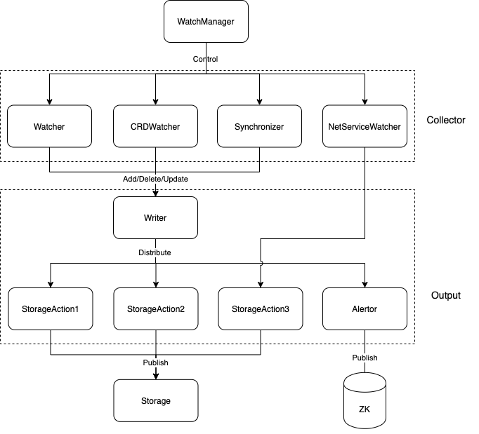

bcs-k8s-watch
===========================

bcs-k8s-watch 模块负责监控、采集基于 k8s 的 bcs 集群中的资源数据，包括 k8s 基础资源、kubefed 资源、网络设备资源并将该数据发送至 bcs-storage 模块进行转储，供外部服务获取。

## 架构设计

- WatchManager 负责管控 Collector 与 Output 模块
- Colletor 分为 k8s 资源的 Watcher、kubefed 资源的 CRDWatcher、网络资源的 NetServiceWatcher 以及定时同步模块 Synchronizer
- Output 纵向上分两层，Writer 模块负责接收 Collector 的资源数据并将其分配到对应的发送处理模块上；横向上分为一般资源的发送处理模块 Action 与告警模块 Alertor
- bcs-storage 模块是外部进程，负责上述一般资源的存储与查询

## 组件

| 组件名称          | 所在路径                     | 功能                                                         |
| ----------------- | ---------------------------- | ------------------------------------------------------------ |
| WatchManager      | app/k8s/manager.go           | 管控其他组件                                                 |
| Watcher           | app/k8s/watcher.go           | 监控、获取、上报 k8s 资源                                    |
| CRDWatcher        | app/k8s/manager.go           | 监控、获取、上报 kubefed 资源                                |
| NetServiceWatcher | app/k8s/watcher.go           | 监控、获取、上报网络资源                                     |
| Synchronizer      | app/k8s/synchronizer         | 定时同步 k8s 与 kubefed 资源                                 |
| Writer            | app/output/writer.go         | 给不同类别的 k8s、kubefed 资源分配不同的输出模块 (StorageAction) |
| Handler           | app/output/handler.go        | Action 的父类                                                |
| StorageAction     | app/output/action/storage.go | 负责与 bcs-storage 模块交互                                  |
| Alertor           | app/output/action/alertor.go | 负责将告警信息发送到 ZK                                      |

## dependency

- Makefile
- mock api: https://github.com/typicode/json-server

- Godep https://github.com/tools/godep / https://devcenter.heroku.com/articles/go-dependencies-via-godep
        add vendor to git too: https://stackoverflow.com/questions/26334220/should-i-commit-godeps-workspace-or-is-godeps-json-enough
- json-iterator https://github.com/json-iterator/go
- gorequest https://github.com/parnurzeal/gorequest https://github.com/parnurzeal/gorequest

- zookeeper https://github.com/paulbrown/docker-zookeeper/blob/master/kube/zookeeper.yaml https://kubernetes.io/docs/tutorials/stateful-application/zookeeper/

## test

https://github.com/astaxie/build-web-application-with-golang/blob/master/zh/11.3.md

