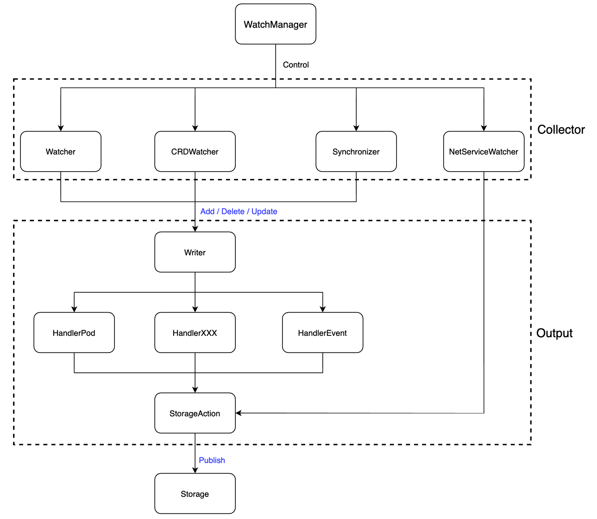

bcs-k8s-watch
===========================

bcs-k8s-watch 模块负责监控、采集基于 k8s 的 bcs 集群中的资源数据，包括 k8s 基础资源、kubefed 资源、网络设备资源并将该数据发送至 bcs-storage 模块进行转储，供外部服务获取。

## 架构设计

- WatchManager 负责管控 Collector 与 Output 模块
- Colletor 分为 k8s 资源的 Watcher、kubefed 资源的 CRDWatcher、网络资源的 NetServiceWatcher 以及定时同步模块 Synchronizer
- Output 纵向上分两层，Writer 模块负责接收 Collector 的资源数据并将其分配到对应的资源 Handler 处理模块上；横向上分为一般资源的发送处理模块 Action 
- bcs-storage 模块是外部进程，负责上述一般资源的存储与查询

## 组件

| 组件名称          | 所在路径                     | 功能                                                         |
| ----------------- | ---------------------------- | ------------------------------------------------------------ |
| WatchManager      | app/k8s/manager.go           | 管控其他组件                                                 |
| Watcher           | app/k8s/watcher.go           | 监控、获取、上报 k8s 资源                                    |
| CRDWatcher        | app/k8s/manager.go           | 监控、获取、上报 kubefed 资源                                |
| NetServiceWatcher | app/k8s/watcher.go           | 监控、获取、上报网络资源                                     |
| Synchronizer      | app/k8s/synchronizer         | 定时同步 k8s 与 kubefed 资源                                 |
| Writer            | app/output/writer.go         | 给不同类别的 k8s、kubefed 资源分配不同的输出模块 (StorageAction) |
| Handler           | app/output/handler.go        | Action 的父类                                                |
| StorageAction     | app/output/action/storage.go | 负责与 bcs-storage 模块交互                                  |

## 性能优化
k8s集群中大量事件的触发是由 Pod 产生，因此本次优化和压测数据的目标是 Pod资源。其他的资源的优化方法类似，可参考Pod的优化。
### 优化前压测数据
* 环境：单kubernetes集群、单实例watch服务容器化部署、bcs-storage服务3实例
* Writer 模块队列长度`10240`，Pod Handler 队列长度`1024`且单队列处理

| apiserver qps           | 持续时间(s)        | 线程数    |   writer队列满负荷处理(s)  |  PodHandler队列数据处理(s)  | bcs-storage接口时延(ms)  | bcs-storage服务接口qps(次/s) | bcs-watch cpu资源(core) | bcs-watch mem资源(MiB) | bcs-watch 网络IO(KiB) |
| ----- | ----- | ----- | ----- | ----- | ----- | ----- | -----  | ----- | ----- |
| 117     | 10    | 10 | 0 | 128 | 89.7 | 8.97 | 0.085 | 83.5 | 101 | 
| 298     | 10    | 20 | 0 | 360 | 89.75 | 21.2 | 0.142 | 100.6 | 227.4 | 
| 513     | 10    | 30 | 0 | 540 | 89.76 | 29.39 | 0.149 | 125 | 409 | 
| 577     | 10    | 50 | 0 | 720 | 89.8 | 30.17 | 0.186 | 132.9 | 259 | 
| 973.7     | 10    | 100 | 15 | 1080 | 90 | 33.29 | 0.158 | 139.2 | 492 | 
| 1699.2     | 10    | 200 | 390 | 1380 | 89.63 | 35 | 0.118 | 173 | 638 | 

通过上述压测数据可以得出一下结论

* `kubernetes watch`性能是没有问题的，产生大量的`pod`事件时，数据同步的瓶颈在`watch`的数据同步队列。
* `writer`队列满负荷运行时，导致大量事件阻塞在`writer`队列，数据同步超时时间`1s`，在`1s`时间内`handler`处理数据后再进行同步。当前版本为了保证数据一致性(增、删顺序性)，`Pod Handler`单队列串行处理吞吐量低，导致处理耗时长
* `bcs-storage`服务的时延保持在`85`ms左右，且`qps`完全没有触达`bcs-storage`服务的性能
* `bcs-k8s-watch`服务的资源消耗平稳，无触发性能问题

那么，针对上述的压测情况，如何处理并提升单集群大量`Pod`事件的处理性能？核心是在并发处理队列数据，发挥`bcs-storage`服务的数据处理能力。

* 方法一，单队列并发执行`bcs-storage`服务接口，不能保证消费队列数据的顺序性，可能会产生数据更新顺序错乱。
* 方法二，根据`kubernetes controller`队列处理思路，产生事件的时候入队key值并进行去重处理，并在处理时获取最新的缓存数据进行更新，缓存数据和storage服务数据保持一致，可以使得`pod`事件更新进行聚合提高数据处理能力。
* 方法三，多队列并行，思想类似于消息队列的`partition`设计。同一个`Pod`实例对象根据相同的哈希算法，入队相同的队列，进行并发处理。

以上三种方法进行对比后，最终选取方法三进行功能优化实现。

### 优化后压测数据
* 环境：单kubernetes集群、单实例watch服务容器化部署、bcs-storage服务3实例
* Writer 模块队列长度`102400`，Pod Handler 队列长度`1024`且多队列处理，队列数`30`个；功能设计中，Writer队列和handler队列的长度可根据配置文件灵活设置

| apiserver qps           | 持续时间(s)        | 线程数    |   writer队列满负荷处理(s)  |  PodHandler队列数据处理(s)  | bcs-storage接口时延(ms)  | bcs-storage服务接口qps(次/s) | bcs-watch cpu资源(core) | bcs-watch mem资源(MiB) | bcs-watch 网络IO(KiB) |
| ----- | ----- | ----- | ----- | ----- | ----- | ----- | -----  | ----- | ----- |
| 351.8     | 10    | 20 | 0 | 20 | 86 | 118 | 0.785 | 99.2 | 629 | 
| 585.4     | 10    | 40 | 0 | 30 | 86.68 | 127 | 0.763 | 113 | 716 | 
| 735.8     | 10    | 60 | 0 | 34 | 86.79 | 173 | 0.980 | 130.5 | 859 | 
| 1048.8     | 10    | 80 | 0 | 45 | 86.8 | 219 | 1.597 | 141 | 1017 | 
| 1164.4     | 10    | 120 | 0 | 45 | 87.10 | 225 | 1.536 | 172 | 1428 | 
| 818.2     | 10    | 200 | 0 | 28 | 87.26 | 216 | 1.354 | 123 | 1317 | 
| 962.6     | 10    | 400 | 0 | 40 | 87.58 | 164 | 1.290 | 135 | 1.170 | 
 
通过上述压测数据可以得出一下结论

* 压测过程中由于`kube-apiserver`的处理延时升高，导致在压测时长相同、并发数增大一倍的场景下，`qps`并无明显升高
* Writer队列容量设置 `102400`，事件量未触发到 `Writer`队列的容量上线，同步队列数据时不会进行阻塞等待
* `Pod handler`多队列运行，很大程度上提升了`bcs-strage`服务的数据处理能力。`30s`左右能够全部处理完数据同步至 `bcs-storage`
* `bcs-storage`服务接口延时保持稳定，qps 压至`220`多，此时还未达到`bcs-storage`瓶颈。 随着并发量提升，介于`apiserver`的`API`延迟增大，反而`apiserver`处理的`qps`下降
* `bcs-k8s-watch`服务资源占用，随着并发的增大，`watch`服务的 `cpu/mem/IO` 也是在逐步增大

经过上述压测优化，目前针对单集群`bcs-k8s-watch`可以轻松处理万级别`pod`事件，也可根据集群的实际情况调整参数应对大规模的资源事件。

## dependency

- Makefile
- mock api: https://github.com/typicode/json-server

- Godep https://github.com/tools/godep / https://devcenter.heroku.com/articles/go-dependencies-via-godep
        add vendor to git too: https://stackoverflow.com/questions/26334220/should-i-commit-godeps-workspace-or-is-godeps-json-enough
- json-iterator https://github.com/json-iterator/go
- gorequest https://github.com/parnurzeal/gorequest https://github.com/parnurzeal/gorequest

- zookeeper https://github.com/paulbrown/docker-zookeeper/blob/master/kube/zookeeper.yaml https://kubernetes.io/docs/tutorials/stateful-application/zookeeper/

## test

https://github.com/astaxie/build-web-application-with-golang/blob/master/zh/11.3.md
