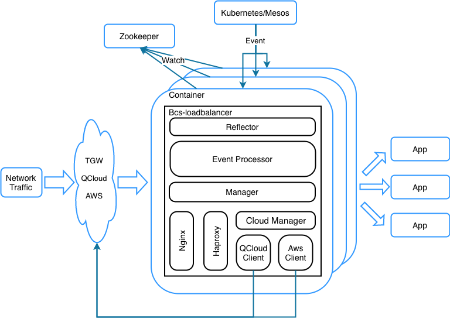

# BCS Loadbalance 设计文档

## 简介

bcs-loadbalance业务提供统一的接入层，负责导入集群外部流量，并提供负载均衡的能力。  
bcs-loadbalance以容器的方式存在，可以灵活地扩缩容。本身包含两部分：

* HAProxy/Nginx模块：实现端口映射功能
* bcs-loadbalance主控模块：对接BCS服务数据，动态刷新HAProxy/Nginx

功能：

* TCP流量转发
* HTTP流量转发
* UDP流量转发（仅Nginx）
* 一集群对多服务模块转发
* 多集群对一服务模块转发
* 支持高可用

## 整体结构

BCS Loadbalance整体结构图


## 模块与职能

* Haproxy/Nginx Manager：Haproxy/Nginx配置文件刷新与管理
  * 根据service信息生成新的haproxy.cfg或者nginx.cfg
  * 使用MD5对比新老配置差异
  * 使用Haproxy命令进行配置校验
  * 备份/切换Haproxy配置
  * 针对Haproxy进行reload

* Reflector：管理本地与ZooKeeper之间的数据同步
  * 维护本地缓存，30秒前置ZooKeeper同步数据
  * Watch Zookeeper Service子节点数据变化
  * Watch Service节点数据变化

* EventProcessor：管理Reflector和Manager
  * 防抖机制：间隔固定时间进行配置刷新

## 启动方式及转发原理

* 通过application或者deployment方式启动
* 在flannel的网络方案下，代理外部流量时，需要采用Host模式启动（通过nodePort进行流量转发），建议固定IP地址。在代理

## 启动参数说明

### command flag

* --zk 数据源zookeeper地址，如"127.0.0.1:2381"，默认值为127.0.0.1:2381。多个zookeeper地址可以以分号或者逗号分隔。
* --zkpath 数据源zookeeper需要监控的路径，如"/etc/cluster/mesos/BCS-MESOSSELFTEST-10000/exportservice"，默认值为空。
* --group bcs-loadbalance所属group，用于bcs-loadbalance逻辑分组，默认值为external。
* --proxy bcs-loadbalance运行的负债均衡转发方式，目前有haproxy，nginx，qcloudclb，awselb可选，默认为haproxy转发。
* --bcszkaddr bcs service层zookeeper地址，默认值为"127.0.0.1:2181"。多个zookeeper地址可以以分号或者逗号分隔。
* --clusterid bcs-loadbalance所属集群ID，默认值为空。
* --metric_port bcs-loadbalance的metric端口，用于向外展示metric信息以及status信息
* --address 用来在zk上进行服务注册的地址

### 环境变量

* LB_NETWORKCARD  bcs-loadbalance阻塞等待网卡名称，默认为eth1。腾讯云或者aws等环境常常填为eth0。（默认为eth1，用户可以编辑，但是要校验编辑的最终结果不能为空）
* LB_IPFORWARD bcs-loadbalance是否开启ipforward转发特性，当值为ipforward或者不为空时表示开启，默认不开启。（勾选）
* LB_HAPROXYMONITORPORT bcs-loadbalance haproxy监控数据端口，默认为8080。（用户可以编辑，但是要校验编辑的最终结果不能为空）
* LB_SESSION_TIMEOUT bcs-loadbalance 配置haproxy/nginx转发时会话超时时间，haproxy默认为65秒，nginx默认为60秒。（用户可以编辑，但是要校验编辑的最终结果不能为空）
* LB_HAPROXYTHREADNUM 表示haproxy启动的线程数,默认是4

## bcs-loadbalance容器启动配置示例（MESOS环境）

```json
{
    "apiVersion": "v4",
    "kind": "deployment",
    "restartPolicy": {
        "policy": "Always",
        "interval": 10
    },
    "constraint": {
        "intersectionItem": [
            {
                "unionData": [
                    {
                        "name": "InnerIP",
                        "operate": "UNIQUE"
                    }
                ],
                "unionData": [
                    {
                        "name": "InnerIP",
                        "operate": "CLUSTER",
                        "type": 4,
                        "set": {
                            "item": ["127.0.0.1", "127.0.0.1", "127.0.0.1", "127.0.0.1"]
                        }
                    }
                ]
            }
        ]
    },
    "metadata": {
        "labels": {
            "io.tencent.bcs.cluster": "example-cluster",
            "loadbalance": "example-lb"
        },
        "name": "example-lb",
        "namespace": "example-lb"
    },
    "spec": {
        "instance": 4,
        "strategy": {
            "type": "RollingUpdate",
            "rollingupdate": {
                "maxUnavilable": 1,
                "maxSurge": 1,
                "upgradeDuration": 20,
                "rollingOrder": "DeleteFirst",
                "rollingManually": false
            }
        },
        "template": {
            "metadata": {
                "labels": {
                    "io.tencent.bcs.cluster": "example-cluster",
                    "name": "example-lb"
                }
            },
            "spec": {
                "containers": [{
                    "command": "/bcs-lb/start.sh",
                    "args": [
                        "haproxy", 
                        "--group", 
                        "exmaple-lb-label",
                        "--zk",
                        "127.0.0.1:2183,127.0.0.1:2183,127.0.0.1:2183",
                        "--zkpath",
                        "/etc/cluster/mesos/example-cluster/exportservice",
                        "--bcszkaddr",
                        "127.0.0.1:2181,127.0.0.1:2181,127.0.0.1:2181",
                        "--clusterid",
                        "example-cluster"
                    ],
                    "type": "MESOS",
                    "image": "{repository-addrs}/bcs-loadbalance:vx.x.x",
                    "imagePullPolicy": "Always",
                    "privileged": true,
                    "resources": {
                        "limits": {
                            "cpu": "4",
                            "memory": "8192"
                        }
                    }
                }],
                "networkMode": "HOST"
            }
        }
    }
}
```

## bcs-loadbalance容器启动配置示例（Kubernetes环境）

```yaml
---
apiVersion: extensions/v1beta1
kind: Deployment
metadata:
  name: example-lb
  namespace: "kube-system"
  labels:
    k8s-app: example-lb
    kubernetes.io/cluster-service: "true"
spec:
  replicas: 3
  hostNetwork: true
  strategy:
    rollingUpdate:
      maxSurge: 10%
      maxUnavailable: 0
  selector:
    matchLabels:
      k8s-app: example-lb
  template:
    metadata:
      labels:
        k8s-app: example-lb
    spec:
      containers:
      - name: example-lb
        image: "{repository-addrs}/bcs-loadbalance:vx.x.x"
        imagePullPolicy: IfNotPresent
        resources:
          limits:
            cpu: 800m
            memory: 8192M
          requests:
            cpu: 400m
            memory: 4096M
        command:
        - /bcs-lb/start.sh
        args:
        - haproxy
        - --group
        - exmaple-lb-label
        - --zk
        - 127.0.0.1:2183,127.0.0.1:2183,127.0.0.1:2183
        - --zkpath
        - /etc/cluster/mesos/example-cluster/exportservice
        - --bcszkaddr
        - 127.0.0.1:2181,127.0.0.1:2181,127.0.0.1:2181
        - --clusterid
        - example-cluster
```

## service数据结构依赖

数据结构同时支持kubernetes以及bcs-scheduler结构

### kubernetes数据结构支持

kubernetes service

```json
{
  "apiVersion":"v1",
  "kind":"Service",
  "metadata":{
    "labels":{
      "bcs_appid": 1,
      "bcs_clusterid":"example-cluster"
    },
    "annotation":{
      "bcs-loadbalance.bk": "{\"BCSVHost\": \"www.redis.com\",\"BCSGROUP\": [\"external\", \"exporter\"]}"
    },
    "name":"example-redis",
    "namespace":"example-namespace"
  },
  "spec":{
    "ports":[{
      "name": "port-redis",
      "port":6666,
      "protocol":"TCP",
      "targetPort": 6666
    },{
      "name": "www.example.com",
      "port":80,
      "protocol":"http",
      "targetPort":80
    }],
    "selector":{
      "role":"redis-backend"
    },
    "type":"ClusterIP"
  }
}
```

### 结构转换为bcs-loadbalance结构注意点

* 80端口默认为HTTP协议
* 443端口默认为HTTPS协议
* 当只有一个端口映射时，ports[x].name字段不一定有。BCSVHost默认使用Service的name
* 如果协议没http协议，BCSVHost不是必须的
* service中只能有一个http服务（有多个需要额外支持）
* BCSGROUP字段为列表，可以填写多个

### mesos结构支持

mesos service

```json
{
  "apiVersion": "v4",
  "kind": "service",
  "metadata": {
    "annotations": {
      "xxxx": "xxxxxx"
    },
    "labels": {
      "BCSGROUP": "loadbalance-selector",
    },
    "name": "service-name",
    "namespace": "ns"
  },
  "spec": {
    "clusterIP": null,
    "ports": [
      {
        "name": "http-port",
        "nodePort": 0,
        "path": "/",
        "protocol": "HTTP",
       "servicePort": 8181
      }
    ],
    "selector": {
      "appname": "app-name"
    },
    "type": "None"
  }
}
```

## bcs-loadbalance需求统一结构

loadbalance 所需要Service数据结构如下

```json
{
  "serviceName": "example-service",
  "namespace": "example-ns",
  "ports":[
    {
      "protocol": "https",
      "BCSVHost": "example.ns.com",
      "servicePort": 443,
      "backends": [
        {"targetIP": "127.0.0.1", "targetPort": 443},
        {"targetIP": "127.0.0.1", "targetPort": 443}
      ]
    },
    {
      "protocol": "http",
      "BCSVHost": "example.ns.com",
      "servicePort": 80,
      "backends": [
        {"targetIP": "127.0.0.1", "targetPort": 443},
        {"targetIP": "127.0.0.1", "targetPort": 443}
      ]
    },
    {
      "protocol": "tcp",
      "BCSVHost": "example-redis",
      "servicePort": 6379,
      "backends": [
        {"targetIP": "127.0.0.1", "targetPort": 443},
        {"targetIP": "127.0.0.1", "targetPort": 443}
      ]
    }
  ],
  "BCSGroup": ["external", "exporter"],
  "balance": "source",
  "maxconn": 20000,
  "sslcert": false
}
```
