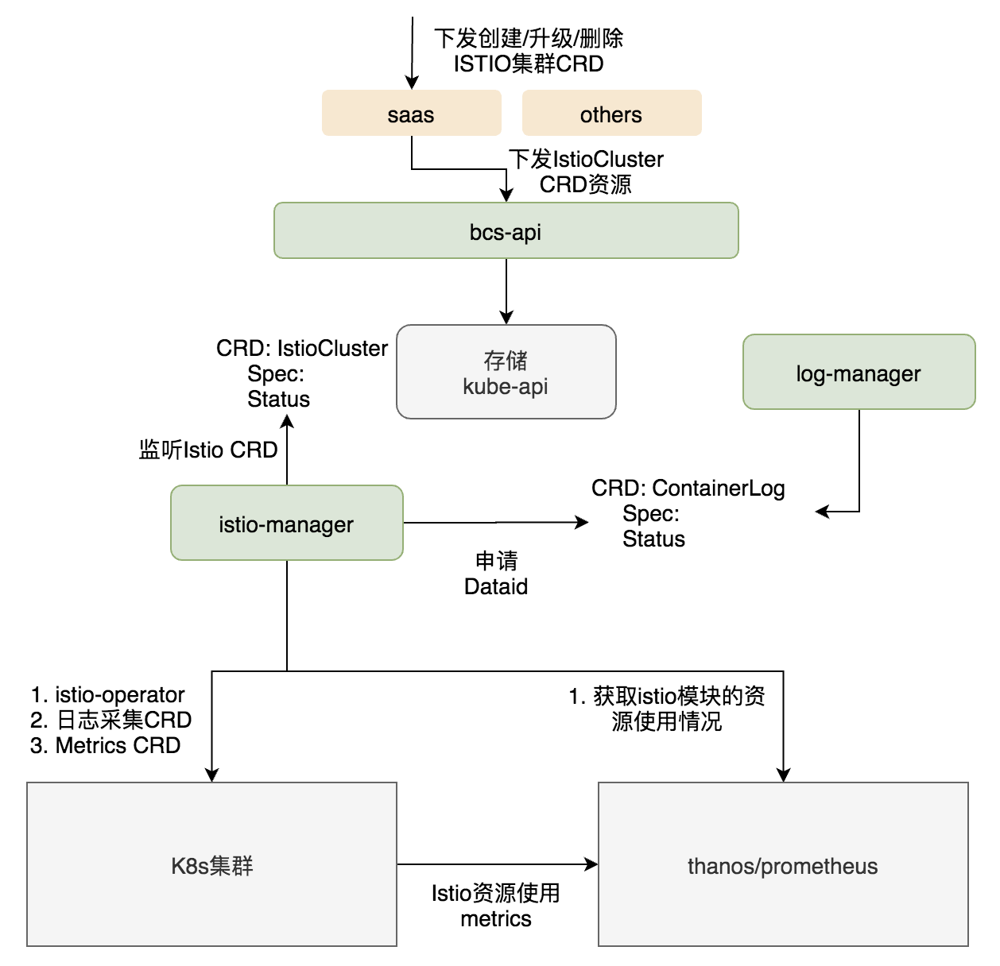

# bcs-mesh-manager工作机制

bcs-mesh-manager部署在bcs service层，负责管控所有k8s集群的mesh服务：

- 通过MeshCluster CRD支持k8s集群istio服务的创建、升级、删除
- Istio集群的状态管理：根据集群k8s接口获取istio组件的状态、根据prometheus获取istio组件的资源使用情况
- 下发istio的日志采集、metrics采集CRD配置
- bcs-client支持管控通过MeshCluster



## 部署安装

1. bcs-mesh-manager因为使用了helm命令行工作来完成istio-operator的部署，所以需要在机器的PATH下安装helm二进制
2. 第一次部署到services层时，需要在service层的kube-apiserver中注册meshcluster crd，文件路径为bk-bcs/bcs-services/bcs-mesh-manager/deploy/MeshCluster-crds.yaml
3. bcs-mesh-manager的启动参数如下(也可以通过-f配置文件方式)：

```shell
./bcs-mesh-manager \
  #服务监听地址，同时支持grpc、https两种协议
  --address 127.0.0.1 \
  #grpc端口，https端口为port-1
  --port 8888 \
  # metrics端口
  --metric-port 8899 \
  #service层kube-apiserver对应的kubeconfig配置
  --kubeconfig kubeconfig \
  #service层bcs-apigateway地址
  --apigateway-addr https://127.0.0.1:8443/tunnels/clusters \
  #bcs-apigateway user token
  --user-token xxxxxxx \
  #istiooperator charts文件,对应目录在bk-bcs/bcs-services/bcs-mesh-manager/deploy/charts下面
  --istiooperator-charts ./istio-operator \
  #etcd ca file
  --etcd-cafile etcd-ca.pem \
  #etcd cert file
  --etcd-certfile etcd.pem \
  #etcd key file
  --etcd-keyfile etcd-key.pem \
  #服务grpc、http ca证书
  --client-ca-file xxx  \
  #服务grpc、http cert证书
  --tls-cert-file xxx  \
  #服务grpc、http key证书
  --tls-private-key-file xxx  &
```

## bcs-client操作实例

1. create meshcluster

```shell
bcs-client create -t meshcluster -f meshcluster.json

# meshcluster.json
{
  "clusterid": "BCS-K8S-xxxxxxxx"
}
```

2. list meshcluster

```shell
# bcs-client list -t meshcluster
  CLUSTERID       VERSION    STATUS     MESSAGE
  BCS-K8S-xxxxxxxx              RUNNING    istio is running now
```

3. inspect meshcluster

```shell
# bcs-client inspect -t meshcluster --clusterid=BCS-K8S-xxxxxxxx
  {
    "clusterid": "BCS-K8S-xxxxxxxx",
    "components": {
      "istio-ingressgateway": {
        "name": "istio-ingressgateway",
        "namespace": "istio-system",
        "status": "RUNNING"
      },
      "istio-operator": {
        "name": "istio-operator",
        "namespace": "istio-operator",
        "status": "RUNNING"
      },
      "istio-tracing": {
        "name": "istio-tracing",
        "namespace": "istio-system",
        "status": "RUNNING"
      },
      "istiod": {
        "name": "istiod",
        "namespace": "istio-system",
        "status": "RUNNING"
      },
      "kiali": {
        "name": "kiali",
        "namespace": "istio-system",
        "status": "RUNNING"
      },
      "istio-egressgateway": {
        "name": "istio-egressgateway",
        "namespace": "istio-system",
        "status": "RUNNING"
      }
    }
  }
```

4. delete meshcluster

```shell
# bcs-client delete -t meshcluster --clusterid=BCS-K8S-xxxxxxxx
success to delete meshcluster
```

## meshcluster高级配置说明
通过meshcluster的configurations字段可以细粒度的调整istio的配置
1. 调整proxy(envoy)的resources
```
{
  "clusterid": "BCS-K8S-xxxxxx",
  "configurations": ["{\"spec\":{\"values\":{\"global\":{\"proxy\":{\"resources\":{\"limits\":{\"cpu\":\"4000m\",\"memory\":\"1024Mi\"},\"requests\":{\"cpu\":\"200m\",\"memory\":\"128Mi\"}}}}}}}"]
}
```
2. 开启tracing链路追踪
```
{
  "clusterid": "BCS-K8S-xxxxxx",
  "configurations": ["{\"spec\":{\"addonComponents\":{\"tracing\":{\"enabled\":{\"value\":true}}}}}"]
}
```
