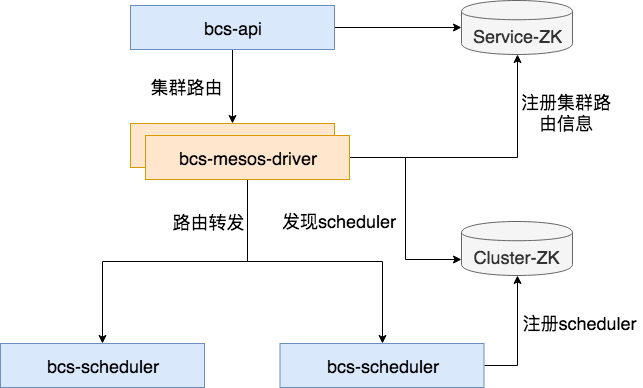
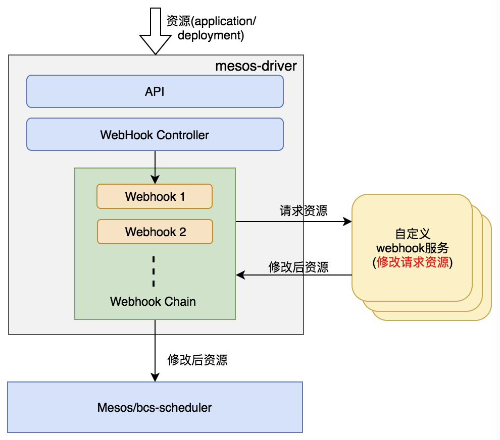

# bcs-mesos-driver工作机制

bcs-mesos-driver是mesos容器集群的唯一入口，拥有集群路由，负载均衡，协议转换等功能



## 集群路由
driver注册集群相关信息到bcs service层的zk，用于bcs-api的集群路由功能。

## 负载均衡
driver通过cluster层的zk，发现集群的scheduler，并将协议转换为内部协议，并实现了负载均衡的功能

## Admission Webhook
mesos-driver本身支持拦截器的功能，能够拦截发送给bcs-scheduler的请求，通过注册的webhook回调给自定义服务。
自定义服务对请求进行修改，最后将修改后的请求数据存储到mesos集群。
**使用场景**
系统管理员希望对某些资源(appliaction,deployment等)进行修改，例如：插入sidercar容器，并且这些修改对用户来讲是不可见的。



1. 系统管理员实现自定义webhook server
2. 基于bcs资源deployment,service，将webhook服务拉起来
3. 基于系统定义的资源AdmissionWebhook注册webhook服务
4. 创建资源(application/deployment)时，根据AdmissionWebhook定义，web controller链式的回调webhook服务
5. 将webhook服务修改后的资源，发送给mesos/bcs-scheduler服务

AdmissionWebhook定义
```json
{
  "apiVersion":"v4",
  "kind":"admissionwebhook",
  "metadata":{
    "name":"webhook-test"
  },
  "resourcesRef": {
    "operation": "Create | Update",
    "kind": "Application | Deployment"
  },
  "admissionWebhooks":[
    {
      "name": "container-sidecar",
      "failurePolicy": "Ignore | Fail",
      "clientConfig": {
        "caBundle": "xxxxxxxxx",
        "namespace": "sidecar-webhook-namespace",
        "name": "sidecar-webhook-service",
        "path": "/sidecar",
        "port": 443
      },
      "namespaceSelector": {
        "operator": "NotIn",
        "values": ["defaultgroup","bcs-system"]
      }
    },
    {
      "name": "container-images",
      "failurePolicy": "Fail",
      "clientConfig": {
        "caBundle": "xxxxxxxxx",
        "namespace": "image-webhook-namespace",
        "name": "image-webhook-service",
        "path": "/sidecar",
        "port": 443
      },
      "namespaceSelector": {
        "operator": "In",
        "values": ["defaultgroup","bcs-system"]
      }
    }
  ]
}
```
resourcesRef
- operations: 匹配规则，"Create"表示创建资源时；"Update"表示更新资源时
- kind: 匹配规则，webhook生效的资源类型，Application | Deployment
AdmissionWebhook
- name: webhook name
- failurePolicy: 如果和webhook通信出现问题导致调用失败，则根据failurePolicy进行抉择，是忽略失败(Ignore)，还是失败返回(Fail)
- clientConfig //与自定义webhook相关的配置信息
  - namespace: 拉起webhook服务的namespace
  - name: webhook服务的service name
  - caBundle: webhook服务的ca.cert证书的base64编码
  - path: url path, default: '/'
  - port: service port, default: 443
- namespaceSelector //namespace选择器，webhook只对选择器通过的资源生效
  - operator: selector操作，"In"表示在values的namespace中；"NotIn"表示不在values的namespace中。
  - values: namespace

**注意事项**
1. 对于同一类资源(operations&kind)，只允许创建一个AdmissionWebhook定义，一个定义里面允许有多个webhook服务
2. webhook controller对于资源匹配的所有webhook是串行执行的，多个webhook之间，下一个的输入是上一个的输出
3. webhook controller调用webhook时一定是通过TLS认证的，所以AdmissionWebhook中一定要配置caBundle

**相关操作**
支持针对webhook的创建，获取，更新，删除操作。
详情请参考[api文档](../../apidoc/api-scheduler.md)中的admission部分。

**tls证书**
admissionwebhook必须需要生成自签名证书，用于mesos-driver对自定义webhoook server的验证，相关命令如下：
1. openssl genrsa -out ca.key 1024
2. openssl req -new -x509 -key ca.key -out ca.crt -days 1095
3. openssl genrsa -out server.key 2048
4. openssl req -new -key server.key -subj "/CN={servicename}.{namespace}" -out server.csr
5. openssl x509 -req -in server.csr -CA ca.crt -CAkey ca.key -CAcreateserial -out server.crt -days 5000

共生成一些私钥和证书文件：
CA:
私钥文件 ca.key
数字证书 ca.crt

Server:
私钥文件 server.key
数字证书 server.crt

其中server用于webhook做https监听，ca.crt base64编码后用于admissionwebhook的caBundle字段，进行webhook的合法性验证。