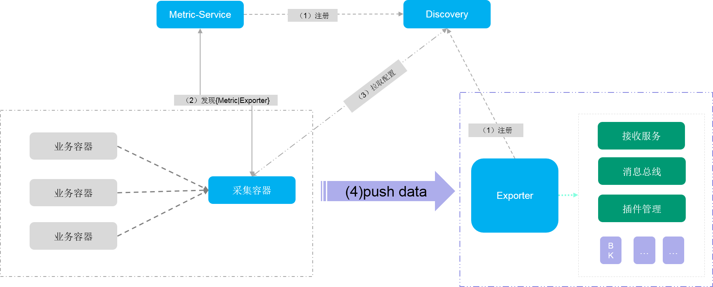

# Metric采集推送方案详细设计
	本文旨在详细讲些采集容器生命周期的管理细节，以及采集配置同步的方式。
## 工作原理图解
 

## 原理文字讲解
数据采集主要由采集容器承担，在这过程中采集容器需要通过服务发现其依赖的服务：

* 负责配置管理的Metric-Service服务的地址
* 负责数据统一导出的Exporter数据导出服务的地址

### 服务发现
我们的服务发现的方案采用BCS自自己的服务发现功能，工作流程如下：

* Metric-Service启动后将自己注册到服务发现模块
* Exporter 启动后将自己注册到服务发现模块
* 采集容器通过访问BCS周知的服务发现模块的地址，并通过API获取依赖的服务的地址。
* 当采集容器依赖的服务不可用的时候需要重新从发现服务重新同步所依赖服务的地址。

### 数据导出

* 采集容器通过服务发现获取到Metric-Service服务地址后，定期从Metric-Service同步采集配置，采集配置包含完整的采集地址URL。
* 采集容器定期从与其所处相同的Namespace下的业务容器出采集Metric数据，并将数据主动发送给Exporter
* Exporter采用插件化设计，数据统一接收，但是数据导出的工作由不同的扩展插件来实现，对于我们内部使用需要内置蓝鲸推送插件，用于将数据主动写入数据平台。

### 采集程序与Exporter通信方案

* 采用TCP通信
* 自定义协议，协议头仅包含{type,length}+{data}的形式。
