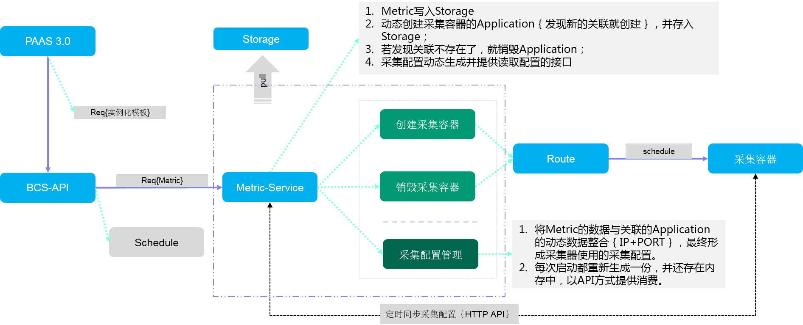

# 采集容器的管理
	本文旨在详细讲些采集容器生命周期的管理细节，以及采集配置同步的方式。
## 工作原理图解
 
## 原理文字讲解

* BCS-API需要增加Metric 相关的API，在PAAS实例化模板集的时候除了需要将正常业务的Application等模板传输BCS，还需要将与Application或Deployment有关联的Metric传入BCS。
* BCS-API会将Metric数据路由给Metric-Service模块，Metric-Service模块的职责如下：
	* 提供Metric数据的管理接口，Metric数据的存储放在Storage；
	* 管理采集容器的生命周期，管理的规则如下：
		* 1）采集容器由事先制作好的采集镜像生成
		* 2）Metric-Service需要轮询本地存储的所有Metric，并对Metric关联的Application进行探测：
			* 当发现有新的关联产生的时候就需要根据关联的Application生成采集容器的Application并存储到Storage，并通过Route的接口创建采集容器；
			* 当发现Metric与曾经有关联的Application失去关联的时候需要将已经创建的采集容器的Application删除且同时删除线上相关的采集容器；
			* 某个Metric被删除的时候需要将其对应的采集容器及采集容器的Application删除，并清空其关联的采集配置；
			* 当发现Metric版本与创建采集容器时用的Metric版本发生变化的时候需要更新采集配置，如有必要还要对与其关联的采集容器及采集容器的Application进行清理。
	* 采集配置的生命周期，管理规则如下：
		* 1）Metric-Service会定期轮询Storage存储的所有Metric数据，当有新的Metric创建或Metric有版本变化的时候就需要查询器关联的Application相关的动态数据。
		* 2）当Metric-Service通过1）操作获取到动态数据后，就可以将动态数据中容器的IP获取到并与Metric中的采集配置数据整合，生成完整采集信息。
		* 3）上述2）的输出将在Metric-Service内存中存储，并通过API的方式提供外部查询服务。
		* 4）在Metric被删除的时候需要将其关联的采集配置删除。
	* Metric-Service在第一次启动的时候需要执行上述，采集容器声明周期管理的步骤，以及采集配置生命周期管理的步骤。