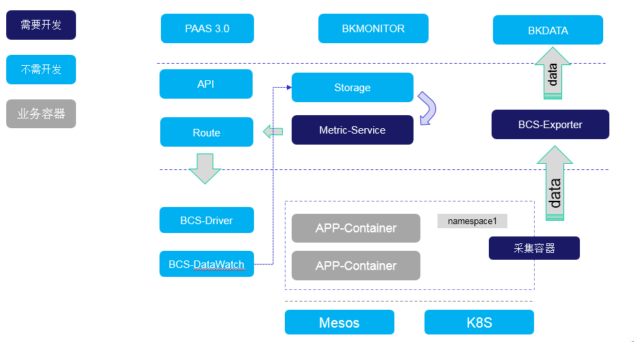
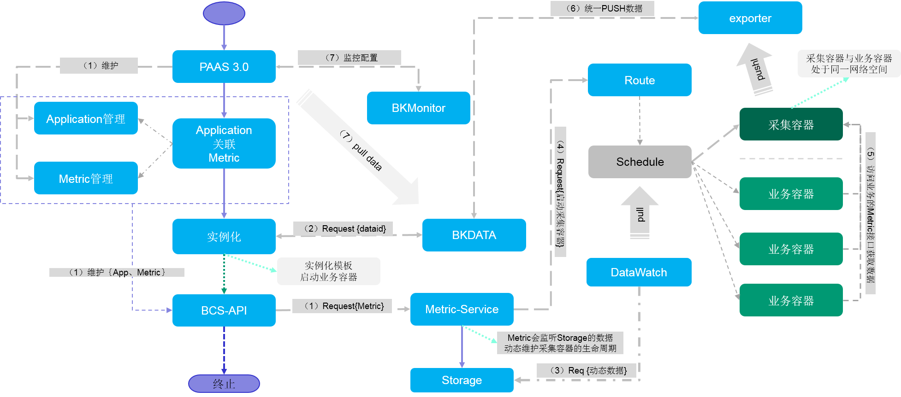

# bcs-metric

# 背景

## 需求
    业务进程有自己导出的Metric信息需要被收集并在监控平台，PASS 3.0上展示。
    
## 问题
    业务容器化运行之后对外导出Metric的接口并不总是能在容器网络外部被访问到，因此容器管理平台需要给出一个统一的数据导出方案。
    
# 方案

## Metric采集架构
 

* Metric-Service：负责管理采集容器的生命周期，采集配置生成，Metric维护API；
* BCS-Exporter：负责对BCS向外导出的数据进行汇聚，统一数据流出出口，在Metric采集中负责与数据平台对接；
* 采集容器：负责真正的数据采集工作

## Metric采集工作原理图解
 

## 采集接入方式

* 用户的采集配置在Pass3.0上实现（在此不做论述)；

## Metric-Service 实现方案

* Metric管理的API [详细设计](./bcs-metric-api.md "Metric API")
* 支持水平扩展的方案
	* Metric-Service无状态实现
	* 采集容器通过服务发现获取可用的Metric-Service服务地址列表，按照随机选择的方式选取随机选择一个服务进行交互。
		
### Metric 管理
* Metric 配置信息由外部传入
* Metric 配置参数分为核心参数与其他参数，核心参数为必填参数，其他参数需要视具体应用场景进行设置。
	* Metric 核心必填配置如下：
		* Namespace: Metric Namespace 与被采集的Application 的Namespace相同
	   * Name：Metric name，Namespace下唯一
		* version：Metric 版本号，在Metric的任何配置发生变化的时候都需要更新版本号。
		* URI：导出Metric信息的请求路径。
		* Method：HTTP 请求Method，POST或GET。
   		* Port：导出Metric的服务端口。
	* Metric 其他辅助配置如下：
   		* frequency：采集频率，默认60秒请求一次，最小请求频率为60秒。
   		* dataid：数据如果需要上报至蓝鲸数据平台，那么就必须配置此参数。
   		* parameters：在发送请求的时候如果需要携带特殊的参数就需要在此配置
   		* head：HTTP HEAD参数，在发送请求的时候需要携带特殊的head参数就需要在此配置

* Metric 数据维护策略
	* Metric 信息在BCS系统内最多仅保留一份
	* 只要传入的Metric与本地已经存在的Metric版本不一致，系统就会用新传入替换本地已有的
	* Metric的生命周期由外部客户系统进行管理
	
### Metric采集配置管理

* 采集配置由Metric-Service自动管理
* 创建采集配置的时候依赖动态数据，对于动态数据的读取需要通过Watch的方式订阅（目前不支持：暂时采用轮询的方式获取）。
* 采集配置创建规则
	* 新的Metric采集规则被创建
	* 如果目标采集Namespace下有多个采集容器，需要为每个采集容器按照每个采集容器负责的采集范围进行创建。
	* 每个采集配置都有一个唯一的Name，通过Name可以索引到采集配置。
	* 每个采集容器负责的采集目标的个数：目标被采集容器的数量/采集容器的数量。
* 采集配置更新规则
	* 已经存在的Metric内容发生变化的时候，需要更新基于被更新的Metric构建的所有采集配置。
	* 当需要对采集容器进行扩容或者缩容的时候，需要对已有的目标Namespace下的所有采集配置重新生成。
* 采集配置删除规则
	* 需要采集的Application 被删除的时候，需要删除其关联的Metric采集配置。
	* Metric被删除的时候，需要删除基于其构建的Metric采集配置
* 在对采集容器进行扩容后需要更新采集配置
	* 重新计算每个采集容器负责的采集目标的个数
	* 缩减现有的采集配置包含的采集目标的数量
* 在对采集容器进行缩容后需要更新采集配置
	* 重新计算每个采集容器负责的采集目标的个数
	* 将缩减掉的采集容器关联的采集配置，均等的分配到现有的采集配置包含的采集目标的数量
	
### Application管理（采集容器）

* 采集容器工作原理图如下
 
* 采集容器水平扩展的方案
	* 无状态服务
	* 自动在采集容器资源不足的时候需要自动扩容，容器当前的资源使用情况需要从数据平台获取。（自动扩容需要在执行前经过确认{微信}{RTX}等）
* 不限制采集容器的Application的创建者
	* 可以由BCS系统外部创建（如:Pass3.0)，在Application流入Metric-Service后会补充部分配置信息，如Env、Label，如果对应的Key已经存在会被替换为新的。
	* 也可以由外部传入必要的参数，由Metric-Service自行自行创建采集容器的Application，在创建Application需要知道目标集群的类型{K8S/MESOS}。
* 创建采集容器的Application的核心配置如下：
	* Namespace，需要跟目标业务的Namespace保持一致
	* Name，需要在Namespace下确保唯一性
	* label：io.tencent.bcs.metriccfg  采集配置的名字
	* env: Metric采集配置的名字
	* 网络配置
		* mesos: networkMode, networkType
		* k8s: （还没找到参数名）
	* 采集容器镜像及版本
	* 启动采集容器的数量
* 以下情况会触发对采集容器的调度动作
	* 采集容器的Application被删除
	* 采集容器的Application被更新
	* 新采集容器的Application被创建
	
## 采集推送方案原理图解
 
* 发现Exporter
	* Exporter 将自己注入服务发现系统，附带自己的负载信息。
	* 采集器与服务发现进程通信获取到可用的Exporter列表，根据负载情况进行选择建链。

* 数据推送方案
	* 采集器与Exporter建立链接
	* 选择 TCP 长链与Exporter通信
	* 通信协议的格式：{type,length,timestamp,id}+{data}

* 采集配置同步：
	* 通讯方式采用HTTP长链的方式与Metric-Service进行通讯并订阅最新的Metric采集配置；
	* 订阅的维度通过采集器所负责的Namespace及其负责的Application列表确定。

## 依赖
* Storage 需要开发Metric相关数据存储的逻辑。【需要开发】
* 数据存储的格式：{$clusterId,$type,$namespace,$name}+{$data}

