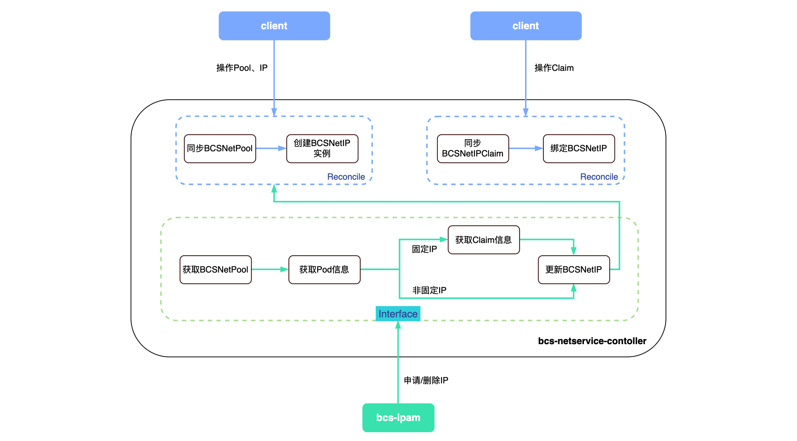

# bcs-netservice-controller

## 背景

原bcs-netservice部署复杂，多用于Mesos集群，且需要使用ZK作为后端存储。

## 功能

- 维护BCSNetPool和BCSNetIP，在K8S集群中部署和管理相应资源
- 提供接口供cni插件申请和删除IP

## 架构设计



## 数据结构

如前面所述，我们定义了BCSNetPool和BCSNetIP两种资源。bcs-netservice-controller会根据用户创建的BCSNetPool实例，自动创建BCSNetIP实例，用户不会直接创建BCSNetIP资源。

### BCSNetPool

表明网络池的基本信息和状态。用户使用kubectl创建具体的BCSNetPool实例，实例创建以后BCSNetPool的AvailableIPs不会再随BCSNetIP的改变而发生变动，而是只保存其被创建时的初始信息。

bcs-netservice-controller会监听BCSNetPools的变动（如增加Host或AvailableIP），更新Pool或IP资源。在删除Pool的时候，如果该Pool中有处于Active状态的IP，则不会进行删除Pool。

```
// BCSNetPoolSpec defines the desired state of BCSNetPool
type BCSNetPoolSpec struct {
	// 网段
	Net string `json:"net"`
	// 网段掩码
	Mask int `json:"mask"`
	// 网段网关
	Gateway string `json:"gateway"`
	// 对应主机列表
	Hosts []string `json:"hosts,omitempty"`
	// 可用的IP
	AvailableIPs []string `json:"availableIPs,omitempty"`
}

// BCSNetPoolStatus defines the observed state of BCSNetPool
type BCSNetPoolStatus struct {
	// Initializing --初始化中，Normal --正常
	Status     string `json:"status,omitempty"`
	UpdateTime string `json:"updateTime,omitempty"`
}
```

```
apiVersion: networkextension.bkbcs.tencent.com/v1
kind: BCSNetPool
metadata:
  name: 10.xx.xx.0
spec:
  net: 10.xx.xx.0
  mask: 24
  gateway: 10.xx.xx.1
  hosts:
  - 10.xx.xx.11
  - 10.xx.xx.12
  availableIPs:
  - 10.xx.xx.20
  - 10.xx.xx.21
  - 10.xx.xx.22
```

### BCSNetIP

表明某个IP的基本信息和状态。cni插件通过bcs-netservice-controller暴露的接口进行IP的申请和删除。

bcs-netservice-controller会根据cni插件请求中传递的podNamespace、podName获取集群Pod的详细信息，从而可以知道Pod是否使用了固定IP，最后会更新BCSNetIPStatus中的Fixed、PodPrimaryKey、PodNamespace、PodName等字段。

```
// BCSNetIPSpec defines the desired state of BCSNetIP
type BCSNetIPSpec struct {
	// 所属Pool
	Pool string `json:"pool"`
	// 网段掩码
	Mask int `json:"mask"`
	// 网段网关
	Gateway string `json:"gateway"`
}

// BCSNetIPStatus defines the observed state of BCSNetIP
type BCSNetIPStatus struct {
	// Active --已使用，Available --可用, Reserved --保留
	Status string `json:"status,omitempty"`
	// 对应主机信息
	Host string `json:"host,omitempty"`
	// 是否被用作固定IP
	Fixed bool `json:"fixed,omitempty"`
	// 容器ID
	ContainerID        string `json:"containerID,omitempty"`
	PodPrimaryKey      string `json:"podPrimaryKey,omitempty"`
	PodName            string `json:"podName,omitempty"`
	PodNamespace       string `json:"podNamespace,omitempty"`
	UpdateTime         string `json:"updateTime,omitempty"`
	FixedIPExpiredTime string `json:"fixedIPExpiredTime,omitempty"`
}
```

```
apiVersion: networkextension.bkbcs.tencent.com/v1
kind: BCSNetIP
metadata:
  name: 10.xx.xx.20
spec:
  pool: 10.xx.xx.0
  mask: 24
  gateway: 10.xx.xx.1
```

## 接口

### 申请IP地址

Method：POST

URL： http://localhost:8090/netservicecontroller/v1/allocator

Body：

```
{
	"host":"10.xx.xx.11",
	"containerID":"xxx",
	"ipAddr":"10.xx.xx.21",
	"podName":"xxx",
	"podNamespace":"xxx"
}
```

请求说明:

**host**: 在哪台主机上申请IP地址

**containerID**: 容器id

**ipAddr**: 指定申请IP的地址（可选）

**podName**：容器所属pod名称

**podNamespace**：容器所属pod命名空间

Response:

```
{
    "code": 0,
    "message": "xxx",
    "result": true,
    "data": [],
    "request_id": "xxx"
}
```

### 释放IP地址

Method：DELETE

URL： http://localhost:8090/netservicecontroller/v1/allocator

Body：

```
{
    "host":"10.xx.xx.11",
    "containerID":"xxx",
    "podName":"xxx",
    "podNamespace":"xxx"
}
```

Response:

```
{
    "code": 0,
    "message": "xxx",
    "result": true,
    "data": [],
    "request_id": "xxx"
}
```

### 释放主机所有IP地址

Method：DELETE

URL： http://localhost:8090/netservicecontroller/v1/allocator/host/{hostip}

**hostip**: 需要释放IP地址的物理主机

Response:

```
{
    "code": 0,
    "message": "xxx",
    "result": true,
    "data": [],
    "request_id": "xxx"
}
```

### 