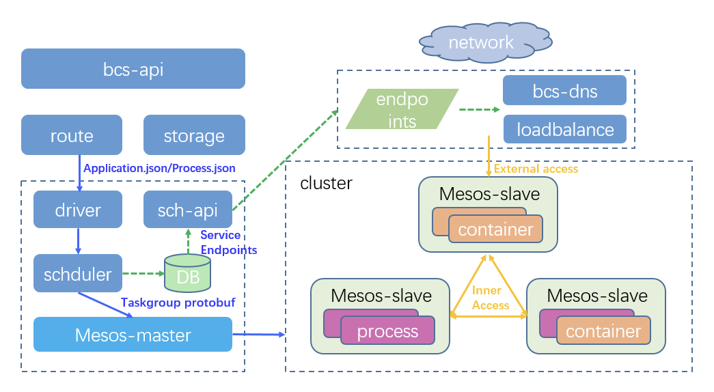
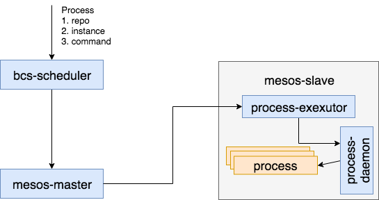

# bcs-mesos进程编排调度实现机制

mesos是分布式数据中心的内核，基于两层调度框架，mesos本身只负责集群资源的调度，对于任务的调度则由具体的framework实现。
bcs基于mesos框架，不仅实现了容器编排调度，并且实现了进程的编排调度方案。详情请参考：[process.md](../../templates/mesos-artifact/process.md)



## bcs-process架构


### process-executor
procss-exexutor是基于mesos http api实现的进程调度相关的exeutor，负责接收framework下发的进程任务，并通过调度process-daemon(可以类比为
docker-daemon，负责进程的启动，停止，重启，检查等功能)的api接口，实现进程方式的编排调度。

与mesos间交互的协议请参考：http://mesos.apache.org/documentation/latest/executor-http-api/

实现的相关接口：
```
type Executor interface {
	//*mesos.TaskGroupInfo是framework定义的进程相关的info，executor解析该数据结构，并通过调度process-daemon实现进程的启动。
	LaunchTaskgroup(*mesos.TaskGroupInfo)

	//实现的mesos定义的协议，此接口会shutdown掉此executor进程，以及所关联的process进程。默认情况下会有1m的期限，如果1m之后executor没有自动退出
	//则mesos-slave会强制杀死executor进程
	//可以通过配置mesos-slave的--executor_shutdown_grace_period参数配置
	Shutdown()

	//reload tasks, exec reloadCmd
	ReloadTasks() error

	//restart tasks, exec restartCmd
	RestartTasks() error

	AckTaskStatusMessage(taskId string, uuid []byte)
}

```

### process-daemon
proces-daemon是运行在mesos-slave机器上面的常驻进程，负责进程相关的操作，例如：启动，停止，重启，检测等

实现的相关接口：
```
type Manager interface {
	//与process-executor实现心跳机制
	HeartBeat(heartbeat *types.HeartBeat)

	//启动process，支持如下参数：
    //WorkDir          string //进程工作目录
    //ProcessName      string //进程名，pid文件所对应的名称
    //Uris             []*Uri //process packages uris
    //PidFile          string //process pid file path
    //StartCmd         string //process start command
    //StartGracePeriod int64  //start process grace period seconds
    //StopCmd          string //process stop command
    //StopTimeout      int
    //KillCmd          string //kill -9
    //Resource         *bcstype.Resource，cpu，memory限制
    //Envs             []string // in the form "key=value".
    //Argv             []string
    //User             string
	CreateProcess(processInfo *types.ProcessInfo) error

	//inspect process status info
	//processId = types.ProcessInfo.Id
	InspectProcessStatus(processId string) (*types.ProcessStatusInfo, error)

	//Stop process
	//processId = types.ProcessInfo.Id
	//process will be killed when timeout seconds
	StopProcess(processId string, timeout int) error

	//delete process
	//processId = types.ProcessInfo.Id
	DeleteProcess(processId string) error
}
```