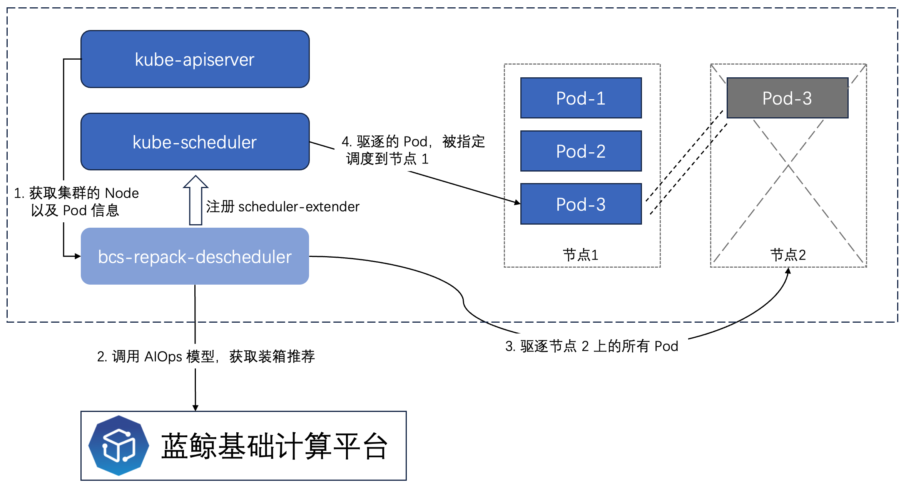

# bcs-repack-descheduler 重装箱调度

重装箱调度采用 AIOps 的算法，根据当前集群中的 Pod 分布，计算出最优的装箱率。通过计算结果，将某些机器上的 Pod 进行驱逐迁移到目标机器，以此
来空出机器，实现资源裁剪。

**装箱的概念**

在 AIOps 的算法计算上，我们把 Kubernetes 集群的节点叫做”容器（Container）“，把每一个 Pod 叫做”箱子（Box）“

每一个容器里边可以放很多箱子，每个箱子有自己的体积（资源Requests）。通过计算来获取将哪些箱子装到哪些容器，通过腾挪空出容器。

**AIOps 算法**

算法依托蓝鲸基础计算平台，descheduler 通过 OpenAPI 调用算法模型，输入集群的装箱数据，获取对应的装箱结果

## 原理

descheduler 将集群内的 Node/Pod （容器和箱子）的信息获取到，将信息通过 OpenAPI 传递给 AIOps 模型。模型返回计算到的重装箱计划，descheduler 通过重装箱计划
对 Pod 进行驱逐（Eviction）。

在驱逐 Pod 之前，根据 Pod 对应的 Owner Workload 将 Pod 进行分类（无 Owner 的 Pod 不可驱逐，驱逐后将不会再被调度起来，后续可以考虑驱逐 -> 重建）

驱逐发生时，按照节点的维度进行驱逐。根据最大并行节点数（默认 1）逐台驱逐，驱逐 Pod 后，Scheduler Extender 将迁移计划的 Pod 目标节点返回给 Scheduler，以此
达到重调度的作用。




## 使用

使用上主要分为两个部分：
1. 命令行：无需部署，仅需要 kubeconfig 即可。输出给用户的推荐迁移计划
2. 自动/手动重装箱：需要部署 Chart 到集群内部。按照用户给定的时间戳，自动重装箱

### 使用前准备

由于通过 OpenAPI 调用了 AIOps 模型，所以使用前需要准备几项配置：
```bash
{
        "bkDataUrl": "蓝鲸数据模型地址",
        "bkDataAppCode": "蓝鲸数据模型调用账户",
        "bkDataAppSecret": "蓝鲸数据模型调用 Secret",
        "bkDataToken": "蓝鲸数据模型调用 Token"
}
```

### 命令行使用

编译命令行：
```bash 
make cli
```

使用：
```bash 
# config.json 定义基础计算平台配置
# ~/.kube/bcs 定义目标集群 kubeconfig 配置
# 使用命令行，输入迁移计划的结果
$ bcs-repack-descheduler-cli calc remote -f ./config.json -k ~/.kube/bcs 
```

### 集群内部署

如果要集群内部署的话，需要按照下述步骤进行准备

#### 编译镜像

```bash 
# 进行编译
make build

# 镜像打包
cd build/bcs.304da8f0d-24.03.20/bcs-repack-descheduler
docker build -t bcs-repack-descheduler .
```

#### 部署 Chart

修改 values.yaml 中的内容，部署 Helm 应用
```bash
helm install bcs-repack-descheduler . -f ./values.yaml --namespace bcs-system 
```

#### 修改 Scheduler Extender 配置

```bash
# 创建 scheduler extender 配置文件
$ vim /etc/kubernetes/scheduler-policy-config.json
{
  "kind": "Policy",
  "apiVersion": "v1",
  "extenders": [
    {
      "urlPrefix": "http://bcs-repack-descheduler.bcs-system.svc.cluster.local:8088",
      "filterVerb": "filter",
      "prioritizeVerb": "prioritize",
      "weight": 1,
      "ignorable": true
    }
  ],
  "alwaysCheckAllPredicates": false
}

# 修改 kube-scheduler 增加 scheduler extender 配置文件
$ vim /etc/kubernetes/manifests/kube-scheduler.yaml
apiVersion: v1
kind: Pod
......
......
spec:
  containers:
    - args:
        - --kubeconfig=/etc/kubernetes/kube-scheduler/kubeconfig
        # 此处增加配置
        - --policy-config-file=/etc/kubernetes/scheduler-policy-config.json
......
......
```

#### 部署示例

```bash 
kind: DeschedulePolicy
metadata:
  name: bcs-descheduler-policy
spec:
  type: Converge
  converge:
    disabled: true
    # 十分钟执行一次
    timeRange: "*/10 * * * *"
    minPods: 2
    maxPods: 100
    # 低水位：20%
    lowWaterLevel: 0.2
    # 高水位: 80%
    highWaterLevel: 0.8
```

## For Future
