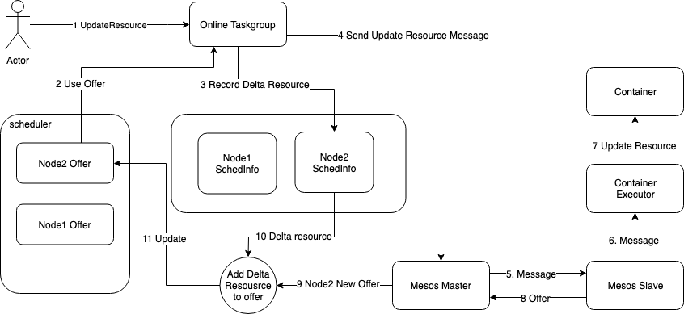

# 原地资源调整

## 背景

在通常的容器编排引擎中，调整服务实例资源限制的时候，往往需要重建服务实例，而这样做可能会影响在线业务。运维在部署服务实例时，很难准确预估服务使用的资源和应该限制的资源，往往需要多次调整。
同时，应对服务突增的情况，通常采取扩容实例的方法来应对，但是由于负载均衡等方式的差异，已经在服务的实例可能依然会达到资源瓶颈，导致服务质量受损。需要提供一种方式，在不影响线上服务实例运行的情况下，对服务实例进行资源扩容。

## 原理



在Mesos调度方案中，已下发的Task资源无法更改。为了能够实现对已经在运行的单个Taskgroup的资源动态调整，需要增加SchedInfo结构来记录和原始资源的差值。
当Mesos-Slave在上报新的Offer时，Scheduler将Offer和每个节点对应的SchedInfo中资源差值经过计算后得到最终的Offer，加入到Scheduler的Offer池中。

## 使用方式

### 接口

#### update resource for application

```shell
curl -H "BCS-ClusterID: {ClusterID}" -X PUT -d "{application.json}" http://{Bcs-Domain}/v4/scheduler/mesos/namespaces/defaultGroup/applications?args=resource
```

#### update resource for deployment

```shell
curl -H "BCS-ClusterID: {ClusterID}" -X PUT -d "{application.json}" http://{Bcs-Domain}/v4/scheduler/mesos/namespaces/defaultGroup/deployments?args=resource
```

## 注意事项

* bcs-scheduler会检测更新的数据是否只有resource，如果除resource外，还有其它字段更新，则会报错
* update resource是异步操作，提交更新请求成功之后，app或者deployment会进入更新状态，在更新结束后，在app或者deployment的Message字段会显示此处更新的汇总结果
* update resource操作在更新一个taskgroup失败之后，会继续更新下一个taskgroup
* update resource操作只能对现有容器进行扩容资源扩容操作，update resource成功后，app或者deployment后续新增的taskgroup将按照更新后的资源需求启动
* update reousrce操作也可以进行资源的减少，但是不会对正在运行的容器生效，只对新增容器生效
