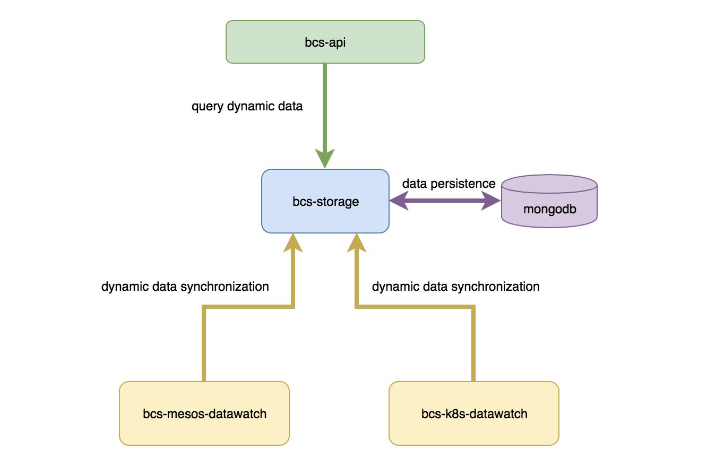

# bcs-storage

### 简介
bcs-storage作为bcs的动态数据管理，负责存储来自mesos和k8s集群上报的资源动态数据，并提供相应的查询API接口。

### 依赖
bcs-storage依赖mongodb作为持久化存储，当mongodb以副本集模式运行时，storage能够提供基于oplog的数据订阅功能。

### 服务
storage负责以下服务功能：

* 提供给mesos-watch/k8s-watch管理动态数据的服务，包括上报、更新、删除
* 提供给metricservice管理metric数据的服务，包括动态数据的订阅
* 提供给health存储告警和事件数据的服务
* 提供给api层定制化的查询动态数据的服务，查询metric数据的服务，查询告警/事件数据的服务