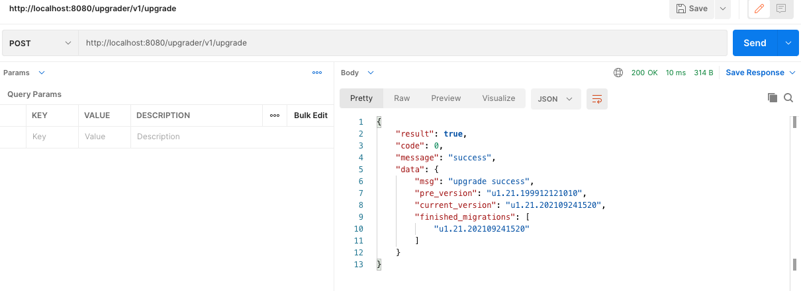
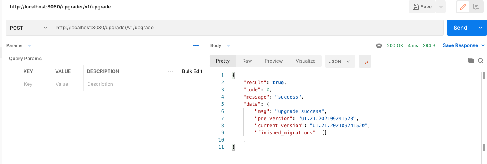

## bcs版本升级过程演示

### 1. 启动bcs升级模块服务
```bash
bcs-upgrader: tester$ ./bcs-upgrader --logtostderr=true --mongo_address=localhost:27777 --mongo_username=$
{bcs_mongo_username} --mongo_password=${bcs_mongo_password}
I0927 17:48:58.445492   49817 main.go:37] bcs-upgrader starting...
I0927 17:48:58.464630   49817 upgrader.go:136] init mongo client successfully
I0927 17:48:58.464771   49817 server.go:118] register post api, url(/upgrade)
I0927 17:48:58.464796   49817 server.go:160] Start http service on(127.0.0.1:8080)
```

### 2.使用postman调用版本升级接口
- 接口调用截图 
  


- bcs-ugrader后台日志输出
```bash
I0927 17:51:02.576296   49817 logics.go:52] upgrade version u1.21.202109241520
I0927 17:51:02.576302   49817 pkg.go:28] start execute u1.21.202109241520
I0927 17:51:02.576984   49817 logics.go:66] upgrade to version u1.21.202109241520 success
```

- 升级后的db数据
```bash
rs0:PRIMARY> db
bcs
rs0:PRIMARY> db.bcs_upgrader.find().pretty()
{
	"_id" : ObjectId("61519406709acf7b868f4355"),
	"type" : "version",
	"pre_version" : "u1.21.202109241520",
	"current_version" : "u1.21.202109241520",
	"edition" : "inner_edition",
	"last_time" : ISODate("2021-09-27T09:51:02.576Z")
}
```


### 3.重复调用版本升级接口
重复调用会忽略已经升级过的版本，从未升级过的版本开始升级
- 接口调用截图
  
  
- bcs-ugrader后台日志输出
```bash
I0927 17:59:05.631069   49817 logics.go:49] current version is "u1.21.202109241520", skip upgrade "u1.21.202109241520"
```
