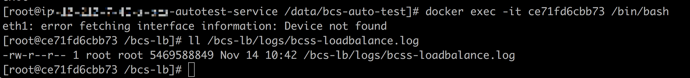
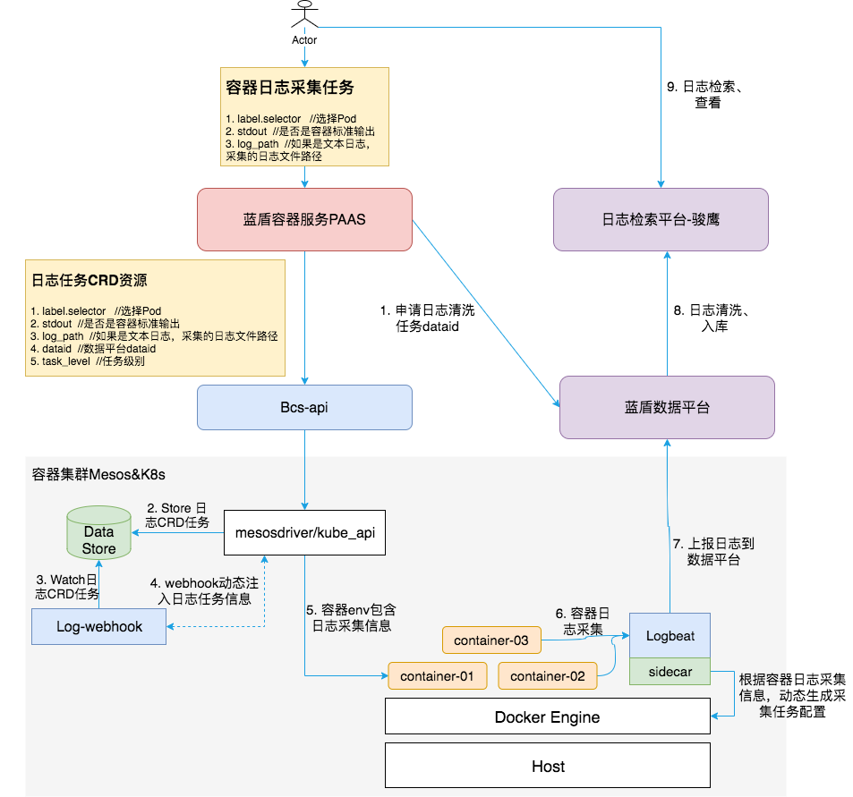

# bcs容器日志解决方案
## 背景
容器技术在部署、交付阶段给人们带来了非常大的便利，但是在日志处理阶段带来了一些新的挑战，包括：
1. 容器日志默认是打到容器里面的，容器的生命周期较短，创建、销毁是非常常见的事情，当容器被销毁后容器日志随之被销毁，因此需要一种技术来持久化的保存日志
2. 容器的到来让微服务更加容易落地，它为系统带来松耦合的同时引入了更多的组件。因此我们需要能够快速的定位问题以及还原日志上下文关系。

## 容器日志分类
容器产生的日志大部分可以归结为两类：标准输出和文本文件

### 标准输出
容器内的进程默认将日志打到stdout、stderr，容器技术默认使用json-file logging driver将此种类型的日志以json的格式写入宿主机文件中，目录格式如下：
/var/lib/docker/containers/<container-id>/<container-id>-json.log，此种方式的日志可以通过docker logs <container_id>查看。

针对这种方式的日志文件，可以在宿主机上面收集、上报。

### 文本日志
默写进程会将进程日志打印到特定的目录下，而并没有将日志重定向到容器的标准输出中。例如：tomcat将日志打印到catalina.log、access.log、manager.log、host-manager.log中。
此种类型的文件日志同样可以基于一些特定的规则，在宿主机上面找到相应的目录，进而能够在宿主机上面完成采集、上报。

如下lb的容器将日志打到了容器内的/bcs-lb/logs/bcss-loadbalance.log文件。


此日志文件会以规则/proc/<container pid>/root/bcs-lb/logs/bcss-loadbalance.log打到宿主机上面。


## bcs容器日志方案
通过上面对于容器日志的分类以及容器日志能在宿主机上面索引到的特性，bcs将在每台物理机上面通过daemonset的方式部署日志采集插件-logbeat，进而能够较为友好的方式采集容器日志。
基于bcs对于CRD资源的支持，用户可以自定义日志采集任务，并通过将bcs容器日志采集与蓝鲸数据平台打通，实现日志采集、日志清洗、日志查询完整的容器日志方案。



### 功能特点
bcs容器日志方案包含如下功能：
1. 支持通过CRD(CustomResourceDefinition)方式进行日志采集配置的管理（包括：标准输出、文本日志）
2. 与蓝鲸数据平台打通，自动创建日志清洗任务、清洗规则
3. 对业务容器零入侵，通过webhook特性自动注入容器日志采集信息
4. 采集数据自动打标，即对收集上来的日志自动加上pod id、container id、文件路径等用于标识数据源的信息
5. 通过DaemonSet方式，自动完成日志采集器logbeat部署
6. 同时支持mesos、kubernetes两种容器方案

### 日志采集任务CRD资源定义
日志采集的信息通过 crd 的形式创建并存储在 k8s 或 mesos 集群中，需要注入到容器当中的日志采集信息主要包括 stdout, logPaths, dataId, appId, clusterId, namespace, logTags。
bcs-webhook-server 在拦截到容器的创建请求时，会从集群中查询 BcsLogConfig 类型的 crd ，如果查询到了匹配的 BcsLogConfig ，会把这个 BcsLogConfig 中的日志采集信息以环境变量的形式注入到容器当中。
对于一个业务集群，在配置日志采集时，主要要考虑到三方面的情况：

- 系统组件的日志采集配置
系统组件一般都运行在 kube-system, kube-public, bcs-system 这几个命名空间下。对于这些命名空间下的系统组件，bcs-webhook-server 默认不会注入任何日志采集配置。
如果要对系统组件的容器也进行日志采集，需要在这些系统组件的 pod 中加入指定的 annotation : webhook.inject.bkbcs.tencent.com。当 pod 中这个指定的 annotation 的值为 "y", "yes", "true", "on" 时，bcs-webhook-server 才会对这些 pod 中的容器进行环境变量的注入。
目前，针对系统组件的日志采集，不支持针对不同容器使用不同的采集配置，统一使用一个固定的配置。
系统组件的日志采集配置需要在应用所在的 namespace 下创建一个 configType 类型为 bcs-system 的 BcsLogConfig。  

```
apiVersion: bkbcs.tencent.com/v1
kind: BcsLogConfig
metadata:
  name: default-log-conf
  namespace: default
spec:
  configType: bcs-system
  appId: "20000"
  clusterId: bcs-k8s-15049
  stdDataId: "20001"
  nonStdDataId: "20002"
  stdout: true
  logPaths:
    - /data/home/logs
    - /data/logs/default
  logTags:
    platform: bcs
    app: kubelet
```
当 stdout 为 true 时，采集标准日志；当 logPaths 不为空时，采集非标准日志。  

- 默认的日志采集配置  
对于大多数业务集群，所有业务容器的日志输出是同样的格式，只需配置一种固定的日志清洗规则即可。对于这种需求，为了减少用户的负担，bk-bcs-saas 层可以在每个 namespace 下默认创建一个 configType 类型为 default 的 BcsLogConfig 资源，bcs-webhook-server 默认会对该 namespace 所有容器注入这个标准的日志采集配置：    
```
apiVersion: bkbcs.tencent.com/v1
kind: BcsLogConfig
metadata:
  name: default-log-conf
  namespace: default
spec:
  configType: default
  appId: "20000"
  clusterId: bcs-k8s-15049
  stdDataId: "20001"
  nonStdDataId: "20002"
  stdout: true
  logPaths:
    - /data/home/logs
    - /data/logs/default
  logTags:
    platform: bcs
```
当 stdout 为 true 时，采集标准日志；当 logPaths 不为空时，采集非标准日志。

- 自定义的日志采集配置
如果一个业务集群中除了标准的日志采集配置外，还有某些容器需要配置特殊的日志采集规则，此时，可由用户从 bk-bcs-saas 层在该 namespace 下创建特定的类型为 custom 的日志采集配置 BcsLogConfig , 在 BcsLogConfig 中指定需要使用这种规则的 workloads 类型(如 Deployment, Statefulset)、workloads 名、容器名。创建完后，bcs-webhook-server 会对这些容器使用指定的 BcsLogConfig 配置来进行注入，以满足特定的需求：    
```
apiVersion: bkbcs.tencent.com/v1
kind: BcsLogConfig
metadata:
  name: deploy-bcs-log-conf
  namespace: default
spec:
  configType: custom
  clusterId: bcs-k8s-15049
  appId: "20000"
  workloadType: Deployment
  workloadName: python-webhook
  containerConfs:
    - containerName: python
      stdDataId: "2001"
      nonStdDataId: "2002"
      stdout: true
      logPaths:
        - /data/home/logs1
        - /data/home/logs2
      logTags:
        app: python
        platform: bcs
    - containerName: sidecar
      stdDataId: "1001"
      nonStdDataId: "1002"
      stdout: false
      logPaths:
        - /var/log
        - /data/home/logs
      logTags:
        app: sidecar
        platform: bcs
```
例如，在创建这个名为 deploy-bcs-log-conf 的 BcsLogConfig 后，在集群的 default 命名空间中已经有 default 类型的 BcsLogConfig 的情况下，
针对 default 命名空间下名为 python-webhook 的 deployment，bcs-webhook-server 为匹配到 deploy-bcs-log-conf ，对其 pod 中容器名为 python 的容器会使用 containerConfs 中第一组配置来注入，
名为 sidecar 的容器会使用 containerConfs 中第二组配置来注入。如果该 pod 中还有其它名字的容器，因为没有匹配到 containerConfs 信息，
仍然会使用 default 类型的 BcsLogConfig 来注入。  
**注意： 每个 workload 只会对一个自定义的 crd 生效**


### 采集器logbeat&sidercar
logbeat是蓝鲸内部通用的采集物理机日志的采集器，拥有非常高的稳定性以及性能。但是由于容器随时创建、随时销毁等特性，logbeat不能直接采集容器日志。
sidecar通过动态生成logbeat日志采集配置，能够实现容器日志的采集。
sidecar包含如下功能：
1. 支持容器自动发现，通过docker api接口实时发现容器的创建、销毁情况
2. 根据容器日志类型，自动生成日志文件在宿主机的文件目录
3. 通过容器env中包含的日志采集信息，动态生成logbeat日志采集配置

容器env中包含日志采集信息


logbeat日志采集配置
```json
{
    "tlogcfg": [
      {
        "file": "/data/bcs/docker/lib/docker/containers/ba2d22b78d677d028ba705b4f199b820cfa993ac8bb29d1d29ed84d2cc69bc57/ba2d22b78d677d028ba705b4f199b820cfa993ac8bb29d1d29ed84d2cc69bc57-json.log",
        "dataid": "20001",
        "private": [
          {
            "container_id": "ba2d22b78d677d028ba705b4f199b820cfa993ac8bb29d1d29ed84d2cc69bc57",
            "io_tencent_bcs_app_appid": "10001",
            "io_tencent_bcs_app_cluster": "bcs-k8s-10001",
            "io_tencent_bcs_app_namespace": "defaultgroup"
          }
        ],
        "field_sep": "|",
        "fileds": [],
        "beJson": 1
      }
    ]
}
```

### 自动注入容器日志采集信息
采集器sidecar需要容器的env中包含上述所说的一些日志采集信息，为了尽量减少对业务yaml的侵入型，基于bcs的webhook机制实现容器env信息的自动注入。
容器env注入信息如下：
- io_tencent_bcs_app_std_dataid_v2  //标准输出的采集规则dataid
- io_tencent_bcs_app_non_std_dataid_v2 //非标准输出的采集规则dataid
- io_tencent_bcs_app_appid_v2   //业务appid
- io_tencent_bcs_app_stdout_v2 //是否是标准输出
- io_tencent_bcs_app_logpath_v2 //文本日志时的日志目录,支持多个目录，以逗号分隔
- io_tencent_bcs_app_cluster_v2 //集群id
- io_tencent_bcs_app_namespace_v2 //namespcae
- io_tencent_bcs_app_label_v2 // 日志标签，支持多个，以逗号分隔。例如： app:nginx,container:sidecar,platform:bcs

具体实现可参考 [bcs-webhook-server 文档](./bcs-webhook-server.md)