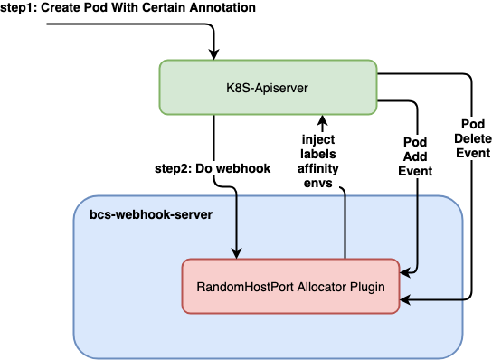
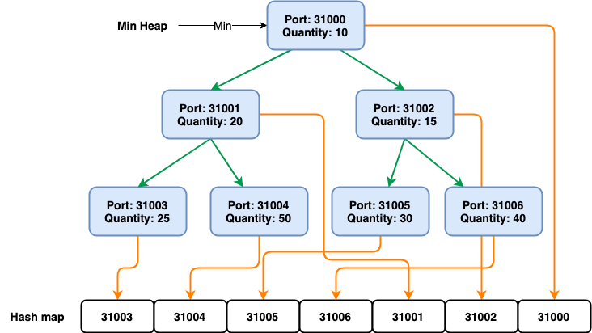

# Random host port插件

## 背景

Kubernetes技术已经成为潮流，但是Kubernetes的集群流量导入方案并不能够完美适应场景：

* 一般情况下通过Ingress进入集群的流量，必定经过一层service转发，存在一层性能损失；而且k8s service对tcp长连接的负载均衡不太理想（连接数较少的情况下，比如30个连接），会导致业务中长连接服务的负载不均衡，进而导致资源浪费以及故障时影响面可能较大。
* 很多云提供商借助云网络，能够实现负载均衡器直联Pod，但是Pod需要消耗VPC内underlay的IP资源。如果在裸金属机器上，则就不能实现Pod的直接访问。
* 在无云基础设施的情况下，Pod之间无法进行跨集群的服务发现。
* 有状态服务之间需要互访、同时供外部访问。

如果能够利用Kubernetes hostport特性，实现hostport的随机分配，在无云网络特别支持的情况下，也能够提供Pod之间的跨集群访问，同时避免service层转发带来的性能开销。将pod的监听端口映射到其所在node的某个随机可用的端口，从而集群内外都可以通过node上的这个端口来访问这个pod

具体流程如下：

* pod启动的时候，把pod想要监听的端口随机映射到该pod所在node上的某个随机可用的端口
* 通过环境变量，在pod内进程启动之前，把node的ip和port告诉pod里的业务进程
* pod内的业务进程启动时，可以把该node的ip和port通过服务发现等机制告诉k8s集群内部或外部的其他业务进程
* k8s集群内部或外部的其他业务进程访问该node的ip和port，node会把流量转发给pod，从而达到了与pod通信的目的

## 业界方案调研

* 该Issue集中讨论了随机hostPort的问题[Enable generating random ports with host port mapping](https://github.com/kubernetes/kubernetes/issues/49792)，但是最终官方没有结论。
* [Maestro: Kubernetes Game Room Scheduler](https://github.com/topfreegames/maestro)
* [https://github.com/googleforgames/agones/blob/master/pkg/gameservers/portallocator.go](https://github.com/googleforgames/agones/blob/main/pkg/gameservers/portallocator.go)
  * 上面两个实现方式与其游戏场景的解决方案融合实现，无法单独使用。
* [Dynamic hostports for Kubernetes](https://github.com/0blu/dynamic-hostports-k8s)
  * 为每个pod创建一个NodePort Service和一个Endpoint，存在一层service转发的性能开销

## 需求整理

* 能够对container port进行host port的随机生成
* 后期能够与服务发现联动，比如service、bcs-ingress-controller
* 实现跨集群的服务发现
* 尽量简单，且复用K8S本身的调度能力，尽量减少干预K8S的调度过程

## 实现方式讨论

### 思路1: 通过device plugin检测母机端口资源

设计要点：

* 通过device-plugin上报端口资源
* 通过资源定义消耗端口
* 具体端口映射需要自己实现

优点：

* pod的调度符合k8s原生的方式

缺点：

* 实现起来较为复杂，无法利用原生hostport的能力

### 思路2: 随机hostport值的注入方式

设计要点：

* 通过mutating webhook进行随机hostport值的注入，可与bcs-webhook-server结合
* 通过监听pod的变化来分配和释放端口
* 需要额外注入调度约束来保证端口不冲突

### 总结

综合考虑侵入性、版本适配、部署和管理难度，选择思路2

## 详细设计

### 整体架构



* randhostport作为bcs-webhook-server的插件存在，减少了部署的复杂性和对kube-apiserver压力
* randhostport拦截特定Pod的创建，监听Pod的变化
* randhostport维护一个端口资源池

### Hook流程设计

* 针对带有特定annotation的Pod进行Hook

```shell
randhostport.webhook.bkbcs.tencent.com: "true"
```

* 被注入Pod内容变化过程

注入前的Deployment

```yaml
apiVersion: apps/v1
kind: Deployment
metadata:
  name: nginx-deployment
  labels:
    app: nginx
spec:
  replicas: 3
  selector:
    matchLabels:
      app: nginx
  template:
    metadata:
      labels:
        app: nginx
      annotation:
        randhostport.webhook.bkbcs.tencent.com: "true"
        ports.randhostport.webhook.bkbcs.tencent.com: "8080,metric"
    spec:
      containers:
      - name: nginx
        image: nginx:1.14.2
        ports:
        - containerPort: 8080
        - name: metric
          containerPort: 8081
```

注入后的Pod

```yaml
apiVersion: v1
kind: Pod
metadata:
  name: nginx-deployment-xxxx-xxxxx
  metadata:
    labels:
      app: nginx
      # 注入随机hostport相关的label，用于pod亲和性调度，防止调度失败
      32001.randhostport.webhook.bkbcs.tencent.com: "32001"
      32123.randhostport.webhook.bkbcs.tencent.com: "32123"
    annotation:
      randhostport.webhook.bkbcs.tencent.com: "true"
      ports.randhostport.webhook.bkbcs.tencent.com: "8080,metric"
spec:
  containers:
  - name: nginx
    image: nginx:1.14.2
    ports:
    - containerPort: 8080
      hostPort: 32001
    - name: metric
      containerPort: 8081
      hostPort: 32123
  # 注入pod亲和性
  affinity:
    podAntiAffinity:
      requiredDuringSchedulingIgnoredDuringExecution:
        - labelSelector:
            matchLabels:
              32123.randhostport.webhook.bkbcs.tencent.com: "32123"
          topologyKey: kubernetes.io/hostname
        - labelSelector:
            matchLabels:
              32001.randhostport.webhook.bkbcs.tencent.com: "32001"
          topologyKey: kubernetes.io/hostname
```

### 随机端口分配策略



* 维护一个针对（端口号，已分配的Pod的数量）映射关系的优先级队列，以已分配的Pod数量为优先级，总是挑选已分配Pod最少的端口号作为本次随机的hostport端口号。
* 每次都Pod增加或者删除时，更新优先级队列中对应端口号的Quantity值。
