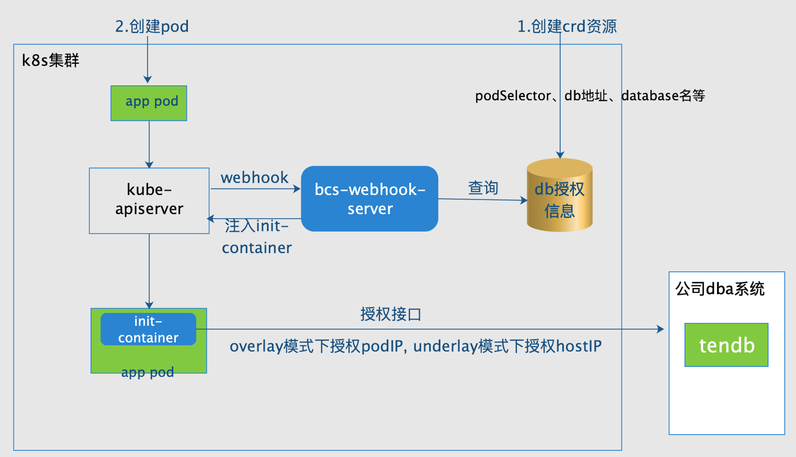

# 容器访问 db 的 ip 授权方案

## 背景
随着容器及 k8s 技术的兴起，越来越多的企业将应用迁移到容器环境当中，但在迁移过程中，也会不断遇到一些不适用的场景，比如访问 db 的 ip 授权。  
在许多公司的 dba 方案中，应用访问 db 都是需要开启 ip 白名单的，经过白名单授权后，应用才有权限访问 db 。但在容器场景下，容器的生命周期是短暂的，crash 掉后就会重新拉起，容器的 ip 将会发生改变；在 pod 自动伸缩时，新建的 pod 容器实例的 ip 是随机的，无法提前手动授权。在这些场景下，都有可能导致应用容器访问不了 db 而 crash 掉，影响业务的运行。  

## 解决方案
针对容器访问 db 的 ip 授权问题，很容易想到几种可选方案。

### db proxy 方案
因为访问 db 的 ip 要提前授权，而容器的 ip 是多变不稳定的，很难针对所有容器 ip 都提前授权，由此很容易想到采用 db proxy 的方式，对 proxy 的 ip 提前授权好，所有业务容器访问 db 的请求都通过 db proxy 转发到 db 上去，这就解决了容器 ip 难以授权的问题。  
但这种方案也有几个明显的缺陷：  
- db 访问一般都是应用中最核心的部分，对 proxy 的稳定性要求特别高。业务方一般不愿意自己维护 proxy，容器平台方如果维护这个 proxy ，又会给平台方增加许多未知的风险
- 在访问 db 之间加上一层 proxy， 可能会影响访问 db 的性能

### 容器调度层方案
如果 dba 方提供了 db 访问授权的 API 接口，则容器平台方可以考虑在调度层解决授权问题，在 pod 容器启动前，平台方先调用授权的 api 去授权，授权成功后才能继续启动容器。  
基于此，很容易想到可以在 pod 的 init-container 中去完成调用 api 进行授权的工作。如果授权成功，则 init-container 的初始化成功， pod 可以继续往下启动业务容器；如果授权失败，则 init-container 的授权失败，则 init-container 的初始化失败，pod 不能再继续往下启动业务容器，pod 启动失败。  

## BCS 容器访问 db 授权方案
基于以上分析，BCS针对以上提出的容器调度层方案，实现了基于 bcs-webhook-server 的 init-container 授权方案。  
想要了解 bcs-webhook-server 的实现原理，可参考文档： [bcs-webhook-server 文档](./bcs-webhook-server.md)

### BCS 容器访问 db 授权方案的架构
BCS 基于 bcs-webhook-server 的实现，使用 crd 写入配置的方式，实现的 db 授权方案的架构如下：  



### 授权的 ip 
容器平台中，容器的网络一般有 underlay 和 overlay 两种方案。  
在 underlay 网络场景下，pod 容器的 ip 是真实的物理 ip ，访问 db 时显示的来源 ip 就是 pod 容器的 ip ，因此授权 pod 容器的 ip 即可。  
在 overlay 网络场景下，pod 容器的 ip 是虚拟 ip ，容器对集群外访问时一般采用 SNAT，显示的来源 ip 是所在宿主机的 ip ，因此需授权 pod 容器所在物理机的 ip。  
在 bcs 容器访问 db 授权方案中，在 bcs-webhook-server 的配置中指定集群的网络是 underlay 还是 overlay，如果是 underlay ，则注入的 init-container 会使用容器的 ip 来进行授权，如果是 overlay ，则 init-container 会使用容器所在物理机的 ip 来进行授权。  

### crd 配置
在对 pod 容器进行 db 授权前，需提前创建 crd 信息。  
```
apiVersion: bkbcs.tencent.com/v1
kind: BcsDbPrivConfig
metadata:
  name: bcs-db-privilege
  namespace: default
spec:
  podSelector:
    app: db-privelege
  appName: xxxx
  targetDb: xxxx
  dbType: spider
  callUser: bryanhe
  dbName: db%
```
- podSelector: 指定的 labels 用来选择包含有相同 labels 的 pod ，选中的 pod 才会使用该 crd 配置进行授权 init-container 的注入。  
- appName: db 所属的业务名，须与 db 授权模板中的业务名相同。  
- targerDb: db 的域名。  
- dbType: db 的类型，mysql 或 spider. 
- callUser: db 授权模板中匹配的调用 api 的用户名。  
- dbName: database 名，支持模糊匹配，须与 db 授权模板中配置的数据库名称相同  

### bcs-webhook-server 配置
```
{
   "address": "0.0.0.0",
   "port": 443,
   "log_dir": "./logs",
   "log_max_size": 500,
   "log_max_num": 10,
   "logtostderr": true,
   "alsologtostderr": true,
   "v": 5,
   "stderrthreshold": "2",
   "server_cert_file": "/data/home/cert.pem",
   "server_key_file": "/data/home/key.pem",
   "engine_type": "kubernetes",
   "kubeconfig": "/data/home/kubeconfig",
   "injects": {
         "log_conf": true,   // 是否开启日志采集的注入
         "db_privilege": {
            "db_privilege_inject": true,    // 是否开启db授权的注入
            "network_type": "overlay",      // 该集群的网络方案，overlay或underlay
            "esb_url": "http://x.x.x.x:8080",   // 调用 db 授权的 ESB 接口地址
            "init_container_image": "db-privilege:test"   // 用于授权的 init-container 的镜像名
         }
      }
}
```