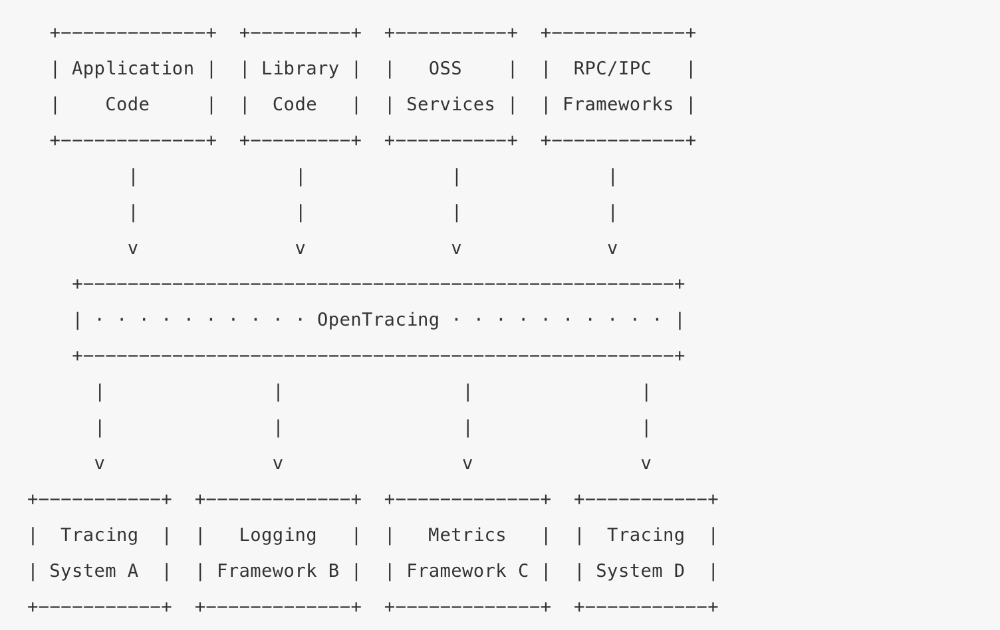

# tracing接入指南

## tracing包
### 什么是opentracing
OpenTracing是一组规范，通过提供平台无关、厂商无关的API，使得开发人员能够方便的添加（或更换）追踪系统的实现。OpenTracing提供了用于运营支撑系统的和针对特定平台的辅助程序库。OpenTracing是一个轻量级的标准化层，它位于应用程序/类库 和 追踪或日志分析程序之间。

如下图所示：


* Application Code, 应用程序代码：开发者在开发业务代码时，可以通过OpenTracing来描述追踪数据间的因果关系及控制流程，增加细粒度的日志信息。

* Library Code, 类库代码：类库程序作为请求控制的中介媒介，也可以通过OpenTracing来描述追踪数据间的因果关系及控制流程，增加细粒度的日志信息。
例如：一个web中间件类库，可以使用OpenTracing，在请求被处理时新增span；或者，一个ORM类库，可以使用OpenTracing来描述高级别的ORM语义和特定SQL查询间的关系。

* OSS Services, OSS服务（运营支持服务）：除嵌入式类库以外，整个OSS服务可以采取OpenTracing标准来，集成分布式追踪系统来处理一个大型的分布式系统中的复杂调用关系。例如，一个HTTP的负载均衡器可以使用OpenTracing标准来设置请求（如：设置请求图），或者一个基于键值对的存储系统使用OpenTracing来解读系统的读写性能。

* RPC/IPC Frameworks，RPC/IPC框架（远程调用框架）：任何一个跨进程的子任务，都可以通过使用OpenTracing，来标准化追踪数据注入到传输协议中的格式。

所有上面这些，都应该使用OpenTracing来描述和传递分布式追踪数据，而不需要了解OpenTracing的实现。

如果您希望更进一步了解OpenTracing规范，可以阅读 [opentracing文档中文版](https://wu-sheng.gitbooks.io/opentracing-io/content/) 这篇文章。

更多可以参考 [opentracing官方文档](https://opentracing.io/docs/)。

### tracing包
```
.
├── jaeger               opentracing具体jaeger实现
├── micro                go-micro接入opentracing
├── options.go           初始化options参数
├── otgrpc               grpc接入opentracing 
├── restful              go-restful接入opentracing
├── tracing.go           tracing工厂
├── tracing_test.go
└── utils                opentracing实现接入 
```
更多实现请查看包 `github.com/Tencent/bk-bcs/bcs-common/pkg/tracing`的具体实现。

## tracing接入
### tracing初始化
tracing定义了工厂`InitTracing`接口，通过不同的链路追踪系统(jaeger/zipkin)实现系统的链路追踪，可实现后端链路追踪系统的无缝切换。
#### 参数介绍
```
// Options set options for different tracing system
type Options struct {
	// factory parameter
	TracingSwitch string `json:"tracingSwitch" value:"off" usage:"tracing switch"`
	TracingType   string `json:"tracingType" value:"jaeger" usage:"tracing type(default jaeger)"`

	// jaeger
	ServiceName     string  `json:"serviceName" value:"bcs-common/pkg/tracing" usage:"tracing serviceName"`
	RPCMetrics      bool    `json:"rPCMetrics" value:"false"`
	ReportMetrics   bool    `json:"reportMetrics" value:"false"`
	ReportLog       bool    `json:"reportLog" value:"true"`
	SampleType      string  `json:"sampleType" value:"const"`
	SampleParameter float64 `json:"sampleParameter" value:"1"`
}
```
* TracingSwitch 开关类型，默认值是`off`，`off`时初始化为 `nullTracer`对象；`on`时会根据参数`TracingType`选择不同的后端链路追踪系统实现
* TracingType 后端具体的链路系统，默认值是`jaeger`。目前系统仅支持`jaeger`，若需要扩展可直接实现`InitTracing `即可
* ServiceName trace的服务名称
* SampleType、SampleParameter：采样类型和采样参数，详细参数说明请参考 [采样类型](https://github.com/jaegertracing/jaeger-client-go/blob/master/README.md)
* ReportLog   是否打印span的日志信息
* ReportMetrics  是否开启metrics指标搜集
* RPCMetrics  是否支持RPC metrics

##### 初始化
```
func initTracingInstance(op *options.TracingOptions) (io.Closer, error) {
	tracer, err := tracing.NewInitTracing(serviceName,
		tracing.TracerSwitch(op.Tracing.TracingSwitch),
		tracing.TracerType(tracing.TraceType(op.Tracing.TracingType)),
		tracing.SampleType(op.Tracing.SampleType),
		tracing.SampleParameter(op.Tracing.SampleParameter),
		tracing.ReportMetrics(op.Tracing.ReportMetrics),
		tracing.RPCMetrics(op.Tracing.RPCMetrics),
		tracing.ReportLog(op.Tracing.ReportLog),
	)
	if err != nil {
		return nil, err
	}
	closer, err := tracer.Init()
	if err != nil {
		return nil, err
	}

	return closer, nil
}

// init tracing
closer, err := initTracingInstance(op)
if closer != nil {
	defer closer.Close()
}
```
通过上面的初始化，可完成tracing模块的初始化操作，后面仅利用opentracing标准接口即可操作。

### tracing框架接入
#### go-restful框架接入
```
// You must have some sort of OpenTracing Tracer instance on hand.
var tracer opentracing.Tracer = ...

// init webService and inject filter tracer
restful.Filter(restful.NewOTFilter(tracer))
```
#### grpc框架接入
client端

```
// You must have some sort of OpenTracing Tracer instance on hand.
var tracer opentracing.Tracer = ...
...

// Set up a connection to the server peer.
conn, err := grpc.Dial(
    address,
    ... // other options
    grpc.WithUnaryInterceptor(
        otgrpc.OpenTracingClientInterceptor(tracer)),
    grpc.WithStreamInterceptor(
        otgrpc.OpenTracingStreamClientInterceptor(tracer)))

// All future RPC activity involving `conn` will be automatically traced.
```

server端

```
// You must have some sort of OpenTracing Tracer instance on hand.
var tracer opentracing.Tracer = ...
...

// Initialize the gRPC server.
s := grpc.NewServer(
    ... // other options
    grpc.UnaryInterceptor(
        otgrpc.OpenTracingServerInterceptor(tracer)),
    grpc.StreamInterceptor(
        otgrpc.OpenTracingStreamServerInterceptor(tracer)))

// All future RPC activity involving `s` will be automatically traced.
```

#### micro框架接入
```
// wrap handler and wrap client
service := grpcsvc.NewService(
		microsvc.Name("greeter"),
		microsvc.Registry(memory.NewRegistry()),
		microsvc.WrapHandler(NewHandlerWrapper(opentracing.GlobalTracer())),
		microsvc.WrapClient(NewClientWrapper(opentracing.GlobalTracer())),
	)

service.Init()
	
```
### tracing其他接入
常见的tag及log约定请查看文件 [span.go](github.com/Tencent/bk-bcs/bcs-common/pkg/tracing/utils/span.go)，主要分为以下几类

* span.kind tag设置，主要包含client、server、producer、consumer
* span component tag设置，主要包含component组件名设置
* span peer tags设置，主要包含service、address、ip、port、handler
* span http tagss设置，主要包含url、method、handler、status_code
* span DB tags设置，主要包含type、database、table、operation
* span error tag 和 comon通用tag设置
* log 设置主要是 error logs设置、common log设置

#### 进程方法设置追踪
```
1. init tracer，设置为opentrcing global tracer
2. span, _ := utils.StartSpanFromContext(ctx, operationName)
    defer span.Finished()
3. utils.SetSpanCommonTag(span, key, value)
4. utils.SetSpanLogFields(span, fields...)
```

#### 进程内跨方法设置追踪
```
1. init tracer，设置为opentrcing global tracer
主方法A
2. span, ctx := utils.StartSpanFromContext(ctx, operationName)
    defer span.Finished()
3. utils.SetSpanCommonTag(span, key, value)
4. utils.SetSpanLogFields(span, fields...)
5. 调用方法 B，通过ctx进程传递
方法B(ctx, ....)
6. span, _ := utils.StartSpanFromContext(ctx, operationName)
   defer span.Finished()
7.  utils.SetSpanCommonTag(span, key, value)
8.  utils.SetSpanLogFields(span, fields...)   
```
#### 跨进程设置追踪
使用Inject和Extract在进程之间传递上下文

````
client端
1.  init tracer，设置为opentrcing global tracer
2. 主方法
    span, ctx := utils.StartSpanFromContext(ctx, operationName)
    defer span.Finished()
3. 被调用方法一：(rpc、HTTP调用) 客户端，第一个参数是ctx
    // 从ctx获取parentSpan 并设置span child关系；开启子span并将子span通过ctx传递
    span, ctx := utils.StartSpanFromContext(ctx, operationName)
    defer span.Finished()
    // 设置tag和logs信息
    utils.SetSpanCommonTag(span, key, value)
    utils.SetSpanLogFields(span, fields...)
    //  将SpanContext进行注入到 http headers，并建立联系
    span.Tracer().Inject(span.Context(), opentracing.HTTPHeaders,
		opentracing.HTTPHeadersCarrier(wp.request.Header))
    // 等待调用结果，并设置tag和log   
 
服务端
1. init tracer，设置为opentrcing global tracer
2. 接口实现中
    // headers中提取spanContext
    spanCtx, err := opentracing.GlobalTracer().Extract(opentracing.HTTPHeaders, opentracing.HTTPHeadersCarrier(r.Header))
    // 开启服务端span
    span := tracer.StartSpan(operationName, ext.RPCServerOption(spanCtx))
    defer span.Finished()
    // 通过request的context传递根span
    req.Request = req.Request.WithContext(opentracing.ContextWithSpan(req.Request.Context(), span))
    // 设置调用过程中的tags和logs
````
#### http client接入
```
1. init tracer，设置为opentrcing global tracer
2. span, ctx := utils.StartSpanFromContext(ctx, operationName)
3. requestSpan := &utils.WrapHTTPClientSpan{ctx, span, request}
4. defer requestSpan.SpanFinish()
5. 设置请求的tag信息
    requestSpan.SetRequestSpanTag(peerService, peerHandler)
6. 将spanCtx注入至 http headers
    requestSpan.InjectTracerIntoHeader()
7. 设置调用结果
    requestSpan.SetRequestSpanResult(err error, response *http.Response, fields ...log.Field)
```

### opentracing示例教程
opentracing详细使用示例可参考

*  opentracing [使用示例](https://github.com/yurishkuro/opentracing-tutorial/tree/master/go)
*  微服务链路锥官方示例 [Take OpenTracing for a HotROD ride](https://medium.com/opentracing/take-opentracing-for-a-hotrod-ride-f6e3141f7941)
