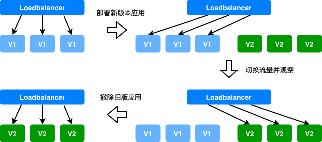

# 如果通过BCS进行蓝绿发布

## 背景

蓝绿发布一般是指在应用新版本发布过程中，保持一组旧版本的应用正常服务，同时发布一组新版本应用，待新版本应用运行正常后，通过更新前端负载均衡策略，把流量从旧版本上切换到新版本的应用上。蓝绿发布方式不会立刻删除旧版本应用，可以及时将流量切换回旧版本应用，能够有效避免新版本应用启动失败或者运行不稳定对整体服务的可用性带来的影响。

## 蓝绿发布示意图



### Mesos方案的蓝绿发布

Mesos方案中的蓝绿发布利用Service的Selector来切换关联的后端容器，在只更新Service的Selector的情况，Service对应的域名以及关联的Loadbalance的端口都不会发生变化。利用这个特性，可以完成应用在Mesos方案中的蓝绿发布。

* 创建deployment blue

采用如下命令创建deployment

```bash
bcs-client create -t deployment -f test-blue.json
```

test-blue.json
```json
{
    "apiVersion": "v4",
    "kind": "deployment",
    "metadata": {
        "labels": {
            "appname": "test-blue"
        },
        "name": "test-blue",
        "namespace": "defaultGroup"
    },
    "spec": {
        "instance": 3,
        "template": {
            "spec": {
                "containers": [
                    {
                        "command": "python",
                        "args": [
                            "-m",
                            "SimpleHTTPServer"
                        ],
                        "type": "MESOS",
                        "env": [],
                        "image": "hub.docker.com:xxxx/xxxxxx:blue",
                        "ports": [
                            {
                                "containerPort": 8000,
                                "name": "test-port",
                                "protocol": "HTTP"
                            }
                        ],
                        "resources": {
                            "limits": {
                                "cpu": "1",
                                "memory": "2048"
                            }
                        },
                    }
                ],
                "networkMode": "BRIDGE",
                "networktype": "cnm"
            }
        }
    }
}
```

* 创建service

采用如下命令创建Service，通过"selector": {"appname": "test"}来关联deployment test-blue。  
在安装好BCS-DNS的情况下，在集群内部可以通过test.defaultGroup这个域名来访问这个Service。  
如果在创建好Group为test-lb的bcs-loadbalance之后，该Service还会自动关联到bcs-loadbalance上的8080端口。访问bcs-loadbalance上8080端口的流量最后会被传输到后端deployment test-blue的8000端口上。

```bash
bcs-client create -t service -f test-svc.json
```

test-svc.json
```json
{
    "apiVersion": "v4",
    "kind": "service",
    "metadata": {
        "name": "test",
        "namespace": "defaultGroup",
        "labels":  {
            "BCSGROUP": "test-lb"
        }
    },
    "spec": {
        "selector": {
            "appname": "test-blue"
        },
        "ports": [
            {
                "name": "http-port",
                "protocol": "HTTP",
                "servicePort": 8080,
                "containerPort": 8000
            }
        ]
    }
}
```

* 创建新的deployment

假设现在我们采用蓝绿发布的方式发布一个新版本应用test-green。  
我们通过如下命令可以创建新版本应用。在确认应用test-green已经全部正常启动的情况下，再进行下一步操作

```bash
bcs-client create -t deployment -f test-green.json
```

test-green.json
```json
{
    "apiVersion": "v4",
    "kind": "deployment",
    "metadata": {
        "labels": {
            "appname": "test-green"
        },
        "name": "test-green",
        "namespace": "defaultGroup"
    },
    "spec": {
        "instance": 3,
        "template": {
            "spec": {
                "containers": [
                    {
                        "command": "python",
                        "args": [
                            "-m",
                            "SimpleHTTPServer",
                            "8000"
                        ],
                        "type": "MESOS",
                        "env": [],
                        "image": "hub.docker.com:xxxx/xxxxxx:green",
                        "ports": [
                            {
                                "containerPort": 8000,
                                "name": "test-port",
                                "protocol": "HTTP"
                            }
                        ],
                        "resources": {
                            "limits": {
                                "cpu": "1",
                                "memory": "2048"
                            }
                        },
                    }
                ],
                "networkMode": "BRIDGE",
                "networktype": "cnm"
            }
        }
    }
}
```

* 更新service关联新的deployment

当新应用test-green已经成功启动后，我们需要将流量从test-blue全部切换到新应用test-green上，这时只需要更改Service的Selector字段来关联test-green。  
然后执行以下命令更新Service

```bash
bcs-client update -t service -f test-svc.json
```

test-svc.json
```json
{
    "apiVersion": "v4",
    "kind": "service",
    "metadata": {
        "name": "test",
        "namespace": "defaultGroup",
        "labels":  {
            "BCSGROUP": "test-lb"
        }
    },
    "spec": {
        "selector": {
            "appname": "test-green"
        },
        "ports": [
            {
                "name": "http-port",
                "protocol": "HTTP",
                "servicePort": 8080,
                "containerPort": 8000
            }
        ]
    }
}
```

* 删除应用test-blue

当更新Service完成，确认test-green稳定运行后，采用以下命令将test-blue下线。

```bash
bcs-client delete -t deployment -ns defaultGroup -n test-blue
```

### K8s方案的蓝绿发布

K8s方案的蓝绿发布同样需要利用Service的特性，通过Service关联不同版本应用的Pod，来实现蓝绿发布

* 创建deployment

```bash
kubectl apply -f test-blue.yaml
```

test-blue.yaml
```yaml
apiVersion: apps/v1
kind: Deployment
metadata:
  name: test-blue
  labels:
    app: test-blue
spec:
  replicas: 3
  selector:
    matchLabels:
      app: test-blue
  template:
    metadata:
      labels:
        app: test-blue
    spec:
      imagePullSecrets:
      - name: docker-secret
      containers:
      - name: test-blue
        image: hub.docker.com:xxxx/xxxxxx:blue
        command:
        - python
        args:
        - -m
        - SimpleHTTPServer
        ports:
        - containerPort: 8000
```

* 创建service

创建service，通过seletor关联后端的deployment test-blue的pod

```bash
kubectl apply -f test-svc.yaml
```

test-svc.yaml
```yaml
apiVersion: v1
kind: Service
metadata:
  name: test
  labels:
    service: test
spec:
  type: NodePort
  ports:
  - protocol: TCP
    port: 18001
    targetPort: 8000
    name: http-test
  selector:
    app: test-blue
```

* 创建新的deployment

假设现在需要升级镜像版本，这个时候新建deployment test-green

```bash
kubectl apply -f test-green.yaml
```

test-green.yaml
```yaml
apiVersion: apps/v1
kind: Deployment
metadata:
  name: test-green
  labels:
    app: test-green
spec:
  replicas: 3
  selector:
    matchLabels:
      app: test-green
  template:
    metadata:
      labels:
        app: test-green
    spec:
      imagePullSecrets:
      - name: docker-secret
      containers:
      - name: test-green
        image: hub.docker.com:xxxx/xxxxxx:green
        command:
        - python
        args:
        - -m
        - SimpleHTTPServer
        ports:
        - containerPort: 8000
```

* 更新service关联新的deployment

当新应用test-green已经成功启动后，我们需要将流量从test-blue全部切换到新应用test-green上，这时只需要更改Service的Selector字段来关联test-green。  
然后执行以下命令更新Service

```bash
kubectl apply -f test-svc.json
```

test-svc.json
```yaml
apiVersion: v1
kind: Service
metadata:
  name: test
  labels:
    service: test
spec:
  type: NodePort
  ports:
  - protocol: TCP
    port: 18001
    targetPort: 8000
    name: http-test
  selector:
    app: test-green
```

* 删除test-blue

当更新Service完成，确认test-green稳定运行后，采用以下命令将test-blue下线。

```bash
kubectl delete -f test-blue.json
```

或者

```bash
kubectl delete deployment test-blue
```